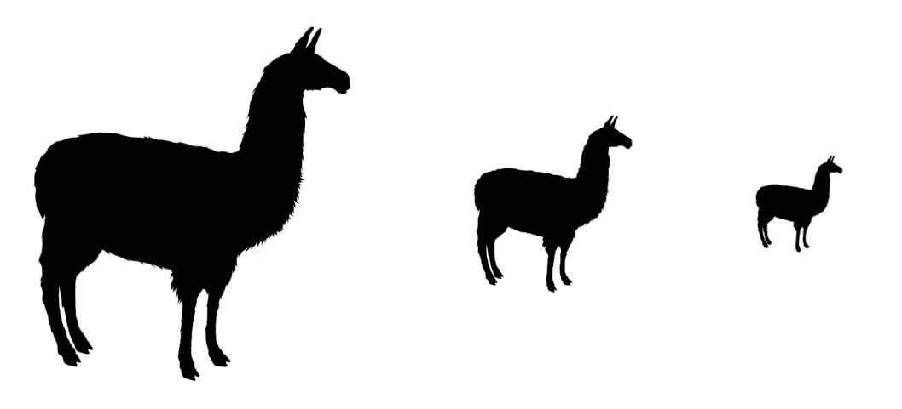

# Mistral-NeMo: 通过量化 Minitron 减少 4.1 倍大小

> 原文：[`towardsdatascience.com/mistral-nemo-4-1x-smaller-with-quantized-minitron-9d6ad7b70981?source=collection_archive---------7-----------------------#2024-08-29`](https://towardsdatascience.com/mistral-nemo-4-1x-smaller-with-quantized-minitron-9d6ad7b70981?source=collection_archive---------7-----------------------#2024-08-29)

## 剪枝、知识蒸馏和 4 位量化如何使先进的 AI 模型变得更加易于访问和具备成本效益

 [本杰明·马里](https://medium.com/@bnjmn_marie?source=post_page---byline--9d6ad7b70981--------------------------------)

·发表于[Towards Data Science](https://towardsdatascience.com/?source=post_page---byline--9d6ad7b70981--------------------------------) ·9 分钟阅读·2024 年 8 月 29 日

--

作者提供的图片 — 制作自[Pixabay](https://pixabay.com/vectors/llama-alpaca-animal-mammal-zoo-297668/)的插图

NVIDIA 的 Minitron 通过剪枝最不重要的权重来压缩大型语言模型（LLMs），然后通过知识蒸馏进行重新训练。这种方法显著减少了模型的大小，同时保持了其准确性。

[NVIDIA 发布了 Llama 3.1 和 Mistral-NeMo 的 Minitron 版本](https://developer.nvidia.com/blog/mistral-nemo-minitron-8b-foundation-model-delivers-unparalleled-accuracy/?ncid=ref-inor-263670%2F)，分别将其参数数量从 8B 减少到 4B，以及从 12B 减少到 8B。

*为什么这很重要？*

虽然 Mistral-NeMo 无法在消费级 GPU 上运行，但其 Minitron 版本可以。一个 24 GB 的 GPU 就足够了。然而，这也可以通过对 Mistral-NeMo 进行量化来实现。4 位量化方法现在已经足够准确。

*但是，如果我们也能对 Minitron 模型进行量化呢？对于一个经过 Minitron 剪枝的模型，量化是否仍然足够准确？*

例如，Mistral-NeMo-Minitron 的 4 位版本可以在 8 GB 的 GPU 上运行，显著降低推理成本。

在这篇文章中，我回顾了 Minitron 方法，探讨了如何通过剪枝和知识蒸馏来压缩大型语言模型（LLMs）。我们将…
