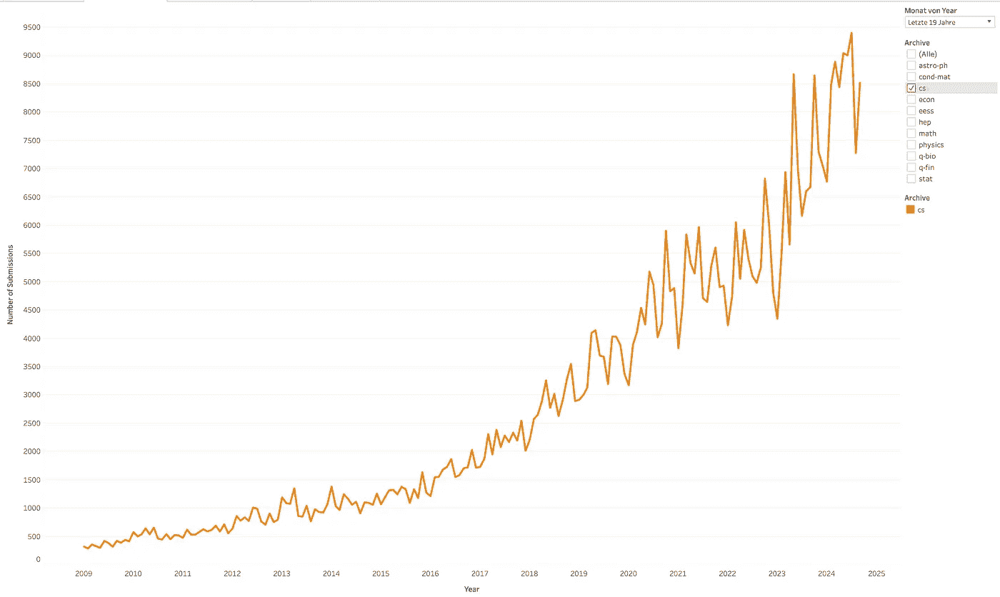

# 机器学习初学者应该阅读论文

> 原文：[`towardsdatascience.com/ml-beginners-should-read-papers-506a074ffc10?source=collection_archive---------2-----------------------#2024-12-10`](https://towardsdatascience.com/ml-beginners-should-read-papers-506a074ffc10?source=collection_archive---------2-----------------------#2024-12-10)

## 这是为什么以及如何做到的

 [Pascal Janetzky](https://pascaljanetzky.medium.com/?source=post_page---byline--506a074ffc10--------------------------------)

·发表于[Towards Data Science](https://towardsdatascience.com/?source=post_page---byline--506a074ffc10--------------------------------) ·4 分钟阅读·2024 年 12 月 10 日

--

每天，超过 100 篇新的计算机科学和机器学习论文会被列在[arXiv](https://tableau.cornell.edu/t/PublicContent/views/arXivSubmissions/LineGraphByArchive)上。尽管这些作品在列出之前不一定经过同行评审，但它仍然是一个巨大的信息宝库。为了了解更多情况，请查看下面的图表，该图表显示了自 2009 年以来每月提交的增长情况，数据来自 arXiv：

每月提交到 arXiv 的计算机科学论文数量。图片由作者提供，数据可以从[arXiv](https://info.arxiv.org/about/reports/submission_category_by_year.html)公开获取。

做个简单的计算，假设平均每篇论文需要 3 小时才能从头到尾阅读完。按照上述数字，**需要 300 小时（或 12 天！）才能读完所有这些论文**。而这只是读完一天的论文——第二天，我们又得重新开始，继续阅读类似数量的出版物。显然，这对于专家和初学者来说都是不可行的。

通常，作为机器学习的初学者，你可能会问：我需要阅读论文吗？而且，考虑到有这么多论文，我到底该怎么做呢？这就是原因和方法！

# 为什么机器学习初学者应该阅读论文

**论文就是一场讲座**：为了在顶级机器学习会议上被接受，论文的写作必须简洁明了。论文通常包括对主题的介绍、方法部分、结果和总结。总体而言，论文的内容就是对一个非常狭窄的主题进行（浓缩的）讲解。原因如下：
