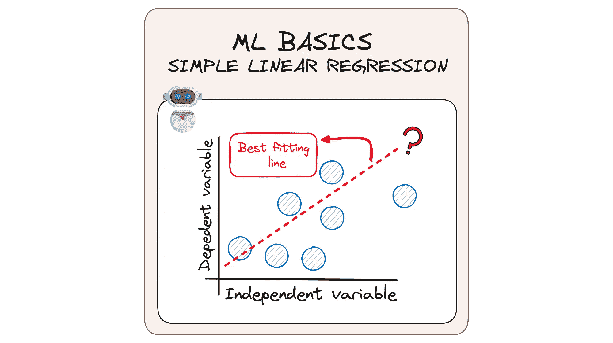

# 将简单线性回归剖析到最基础的层面

> 原文：[`towardsdatascience.com/mlbasics-simple-linear-regression-machine-learning-algorithm-predict-programming-8d83cac9873a?source=collection_archive---------2-----------------------#2024-01-14`](https://towardsdatascience.com/mlbasics-simple-linear-regression-machine-learning-algorithm-predict-programming-8d83cac9873a?source=collection_archive---------2-----------------------#2024-01-14)

## MLBasics #1：用简单线性回归揭开机器学习算法的神秘面纱

 [Josep Ferrer](https://medium.com/@rfeers?source=post_page---byline--8d83cac9873a--------------------------------)

·发布于 [Towards Data Science](https://towardsdatascience.com/?source=post_page---byline--8d83cac9873a--------------------------------) ·阅读时长 8 分钟·2024 年 1 月 14 日

--

图片由作者提供。ML Basics。简单线性回归。

在数据和计算机程序的世界里，机器学习的概念可能听起来像一个难以破解的难题，充满了复杂的数学和复杂的思想。

这就是为什么今天我想放慢脚步，看看使这一切运作的基本内容。我将开始发布一系列新的文章，名为 MLBasics。

我们将回顾那些简单却至关重要的模型，它们是机器学习的基本组成部分。可以把它看作是从一个大拼图中开始，从最简单的部分入手。我们回归到简单的内容，在这里很容易理解发生了什么。

所以，跟着我们一起走，看看我们如何将其拆解，并使一切变得清晰明了。

让我们一步一步地一起深入了解简单线性回归吧！👇🏻🤓

# #1\. 简单线性回归简介

预测分析的领域广阔，但在其核心是线性回归——最简单的方法，用来理解数据趋势。

虽然它扩展到多个变量时可能会让人觉得有些艰难，但今天我们的重点将专注于简单线性回归。
