# 使用马尔可夫链建模 DAU

> 原文：[`towardsdatascience.com/modeling-dau-with-markov-chain-640ea4fddeb4?source=collection_archive---------1-----------------------#2024-12-02`](https://towardsdatascience.com/modeling-dau-with-markov-chain-640ea4fddeb4?source=collection_archive---------1-----------------------#2024-12-02)

## 如何使用 Duolingo 的增长模型预测 DAU 并控制预测结果

[](https://medium.com/@wowone?source=post_page---byline--640ea4fddeb4--------------------------------)[](https://towardsdatascience.com/?source=post_page---byline--640ea4fddeb4--------------------------------) [Vladimir Kukushkin](https://medium.com/@wowone?source=post_page---byline--640ea4fddeb4--------------------------------)

·发表于 [Towards Data Science](https://towardsdatascience.com/?source=post_page---byline--640ea4fddeb4--------------------------------) ·阅读时间：21 分钟·2024 年 12 月 2 日

--

# 1\. 引言

毫无疑问，DAU、WAU 和 MAU——每日、每周和每月的 [活跃用户](https://en.wikipedia.org/wiki/Active_users)——是关键的业务指标。由 Duolingo 前 CPO [Jorge Mazal](https://www.linkedin.com/in/jorgemazal/) 撰写的文章 [“How Duolingo reignited user growth”](https://www.lennysnewsletter.com/p/how-duolingo-reignited-user-growth) 位列 Lenny’s Newsletter 博客增长板块的第一篇文章。在这篇文章中，Jorge 特别关注了 Duolingo 如何建模 DAU 指标的方法（参见另一篇文章 [“Meaningful metrics: how data sharpened the focus of product teams”](https://blog.duolingo.com/growth-model-duolingo/) 由 [Erin Gustafson](https://blog.duolingo.com/author/erin/) 撰写）。这种方法有多个优点，但我想重点介绍如何使用这种方法进行 DAU 预测。

新的一年即将来临，许多公司目前正在为明年的预算进行规划。成本估算通常需要 DAU 预测。在本文中，我将展示如何使用 Duolingo 的增长模型进行预测。我还将解释为什么这种方法相比于标准的时间序列预测方法更为优越，以及如何根据团队的计划（例如市场营销、激活、产品团队）调整预测结果。

本文内容与代码相结合，并附有模拟数据集，研究结果完全可复现。Jupyter notebook 版本可以在 [这里](https://github.com/wowone/wowone.github.io/blob/master/posts/2024-12-02_dau_prediction/dau_prediction.ipynb) 查看。最后，我将分享一个以 Google Spreadsheet 格式设计的 DAU “计算器”。

我将以“我们”的身份叙述，就像我们在一起讨论一样。

# 2\. 方法论

简要回顾一下[Duolingo 的增长模型](https://blog.duolingo.com/growth-model-duolingo/)是如何工作的。在用户生命周期的第 d 天（d = 1, 2, …）中，用户可以处于以下 7 种（互斥）状态之一：`new`、`current`、`reactivated`、`resurrected`、`at_risk_wau`、`at_risk_mau`、`dormant`。这些状态是根据用户今天、过去 7 天或过去 30 天是否活跃来定义的。定义摘要如下表所示：

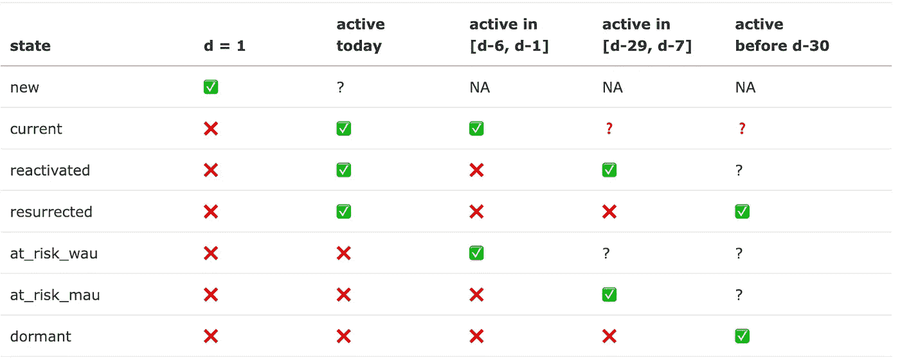

在定义了这些状态（作为集合 S）后，我们可以将用户行为视为一个[马尔科夫链](https://en.wikipedia.org/wiki/Markov_chain)。以下是用户轨迹的一个例子：`new`→ `current`→ `current`→ `at_risk_wau`→...→ `at_risk_mau`→...→ `dormant`。设 M 为与此马尔科夫过程相关的转移矩阵：m_{i, j} = P(s_j | s_i) 表示用户从状态 s_i 转移到状态 s_j 的概率，其中 s_i, s_j ∈ S。这样一个矩阵是从历史数据中推断出来的。

如果我们假设用户行为是平稳的（与时间无关），那么矩阵 M 完全描述了未来所有用户的状态。假设长度为 7 的向量 u_0 包含给定一天（记为第 0 天）在各状态下的用户计数。根据马尔科夫模型，在第二天第 1 天，我们预计会有以下数量的用户状态 u_1：


通过递归应用此公式，我们可以推导出未来任意天 t > 0 时，处于某些状态的用户数量。

除了初始分布 u_0 外，我们还需要提供未来每天将会出现的新用户数量。我们将把这个问题作为一般的时间序列预测问题来处理。

现在，计算出 u_t 后，我们可以确定第 t 天的 DAU 值：

DAU_t = #New_t + #Current_t + #Reactivated_t + #Resurrected_t

此外，我们可以轻松计算 WAU 和 MAU 指标：

WAU_t = DAU_t + #AtRiskWau_t，

MAU_t = DAU_t + #AtRiskWau_t + #AtRiskMau_t。

最后，这里是算法大纲：

1.  对于每个预测日 t = 1, …, T，计算预期的新用户数量 #New_1, …, #New_T。

1.  对于每个用户的每个生命周期天，分配其中一个 7 个状态。

1.  从历史数据中计算转移矩阵 M。

1.  计算初始状态计数 u_0 对应于 t=0 的第 t 天。

1.  递归地计算 u_{t+1} = M^T * u_t。

1.  计算每个预测日 t = 1, …, T 的 DAU、WAU 和 MAU。

# 3\. 实现

本节内容专注于实现的技术方面。如果你更感兴趣的是研究模型的属性，而非代码，可以跳过本节，直接查看第四部分。

## 3.1 数据集

我们使用基于 SaaS 应用历史数据的模拟数据集。数据存储在[dau_data.csv.gz](https://drive.google.com/file/d/16kd8rJBvcgmw95jY42MedRfIxcO4LpPd/view?usp=sharing)文件中，包含三列：`user_id`、`date`和`registration_date`。每条记录表示一个用户活跃的日期。数据集包括来自`2020-11-01`到`2023-10-31`的 51480 个用户的活动指标。此外，还包括 2020 年 10 月的数据，以正确计算用户状态，因为`at_risk_mau`和`dormant`状态需要前一个月的数据。

```py
import pandas as pd

df = pd.read_csv('dau_data.csv.gz', compression='gzip')
df['date'] = pd.to_datetime(df['date'])
df['registration_date'] = pd.to_datetime(df['registration_date'])

print(f'Shape: {df.shape}')
print(f'Total users: {df['user_id'].nunique()}')
print(f'Data range: [{df['date'].min()}, {df['date'].max()}]')
df.head()
```

```py
Shape: (667236, 3)
Total users: 51480
Data range: [2020-10-01 00:00:00, 2023-10-31 00:00:00]
```

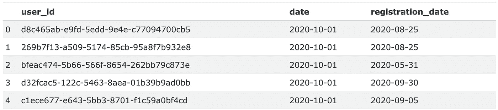

这就是 DAU 时间序列的样子。

```py
df.groupby('date').size()\
    .plot(title='DAU, historical')
```

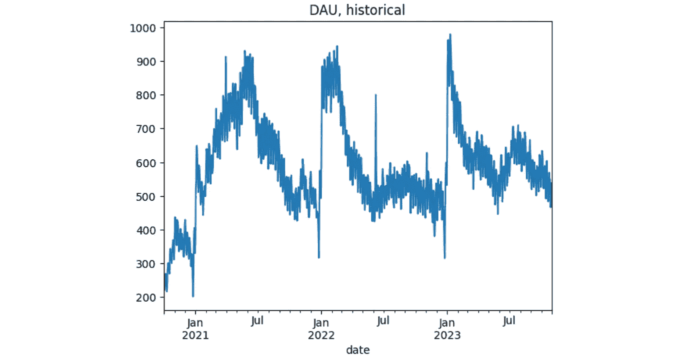

假设今天是 2023 年 10 月 31 日，我们想预测 2024 年接下来的 DAU 指标。我们定义了两个全局常量`PREDICTION_START`和`PREDICTION_END`，它们包含了预测期间。

```py
PREDICTION_START = '2023-11-01'
PREDICTION_END = '2024-12-31'
```

## 3.2 预测新用户数量

从新用户预测开始。我们使用[prophet](http://facebook.github.io/prophet/)库作为预测时间序列数据的最简单方法之一。`new_users`系列包含这样的数据。我们从原始的`df`数据集中提取它，选择`registration date`等于`date`的行。

```py
new_users = df[df['date'] == df['registration_date']]\
    .groupby('date').size()
new_users.head()
```

```py
date
2020-10-01    4
2020-10-02    4
2020-10-03    3
2020-10-04    4
2020-10-05    8
dtype: int64
```

`prophet`要求时间序列以包含`ds`和`y`两列的 DataFrame 格式提供，因此我们将`new_users`系列重新格式化为`new_users_prophet` DataFrame。我们还需要准备的是创建`future`变量，包含用于预测的某些日期：从`prediction_start`到`prediction_end`。这个逻辑在`predict_new_users`函数中实现。下面的图表展示了过去和未来时期的预测。

```py
import logging
import matplotlib.pyplot as plt
from prophet import Prophet

# suppress prophet logs
logging.getLogger('prophet').setLevel(logging.WARNING)
logging.getLogger('cmdstanpy').disabled=True

def predict_new_users(prediction_start, prediction_end, new_users_train, show_plot=True):
    """
    Forecasts a time-seires for new users

    Parameters
    ----------
    prediction_start : str
        Date in YYYY-MM-DD format.
    prediction_end : str
        Date in YYYY-MM-DD format.
    new_users_train : pandas.Series
        Historical data for the time-series preceding the prediction period.
    show_plot : boolean, default=True
        If True, a chart with the train and predicted time-series values is displayed.
    Returns
    -------
    pandas.Series
        Series containing the predicted values.
    """
    m = Prophet()

    new_users_train = new_users_train\
        .loc[new_users_train.index < prediction_start]
    new_users_prophet = pd.DataFrame({
        'ds': new_users_train.index,
        'y': new_users_train.values
    })

    m.fit(new_users_prophet)

    periods = len(pd.date_range(prediction_start, prediction_end))
    future = m.make_future_dataframe(periods=periods)
    new_users_pred = m.predict(future)
    if show_plot:
        m.plot(new_users_pred)
        plt.title('New users prediction');

    new_users_pred = new_users_pred\
        .assign(yhat=lambda _df: _df['yhat'].astype(int))\
        .rename(columns={'ds': 'date', 'yhat': 'count'})\
        .set_index('date')\
        .clip(lower=0)\
        ['count']

    return new_users_pred
```

```py
new_users_pred = predict_new_users(PREDICTION_START, PREDICTION_END, new_users)
```

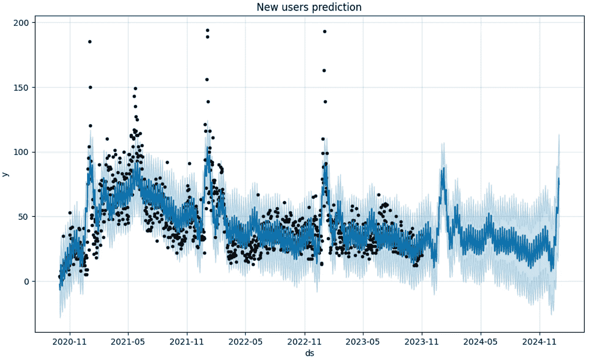

`new_users_pred`系列存储预测的新用户数量。

```py
new_users_pred.tail(5)
```

```py
date
2024-12-27    52
2024-12-28    56
2024-12-29    71
2024-12-30    79
2024-12-31    74
Name: count, dtype: int64
```

## 3.3 获取状态

在实际操作中，最合理的计算方法是通过 SQL 查询在存储数据的数据库中执行。接下来，我们将使用[duckdb](https://duckdb.org)库模拟这种查询。

我们希望为每个用户在应用中的生命周期中的每一天分配 7 种状态之一。根据定义，对于每一天，我们需要考虑至少过去 30 天的数据。这时，SQL 窗口函数发挥了作用。然而，由于`df`数据只包含*活跃的日期*记录，我们需要明确扩展它们，包含用户未活跃的日期。换句话说，而不是像这样一组记录：

```py
user_id    date          registration_date
1234567    2023-01-01    2023-01-01
1234567    2023-01-03    2023-01-01
```

我们想得到这样的一个列表：

```py
user_id    date          is_active    registration_date
1234567    2023-01-01    TRUE         2023-01-01
1234567    2023-01-02    FALSE        2023-01-01
1234567    2023-01-03    TRUE         2023-01-01
1234567    2023-01-04    FALSE        2023-01-01
1234567    2023-01-05    FALSE        2023-01-01
...        ...           ...          ...
1234567    2023-10-31    FALSE        2023-01-01
```

为了提高可读性，我们将以下 SQL 查询拆分成多个子查询。

+   `full_range`：为每个用户创建一个完整的日期序列。

+   `dau_full`：获取包含活跃和非活跃记录的完整列表。

+   `states`：为每个用户生命周期的每一天分配 7 种状态之一。

```py
import duckdb

DATASET_START = '2020-11-01'
DATASET_END = '2023-10-31'
OBSERVATION_START = '2020-10-01'

query = f"""
WITH
full_range AS (
    SELECT
        user_id, UNNEST(generate_series(greatest(registration_date, '{OBSERVATION_START}'), date '{DATASET_END}', INTERVAL 1 DAY))::date AS date
    FROM (
        SELECT DISTINCT user_id, registration_date FROM df
    )
),
dau_full AS (
    SELECT
        fr.user_id,
        fr.date,
        df.date IS NOT NULL AS is_active,
        registration_date
    FROM full_range AS fr
    LEFT JOIN df USING(user_id, date)
),
states AS (
    SELECT
        user_id,
        date,
        is_active,
        first_value(registration_date IGNORE NULLS) OVER (PARTITION BY user_id ORDER BY date) AS registration_date,
        SUM(is_active::int) OVER (PARTITION BY user_id ORDER BY date ROWS BETWEEN 6 PRECEDING and 1 PRECEDING) AS active_days_back_6d,
        SUM(is_active::int) OVER (PARTITION BY user_id ORDER BY date ROWS BETWEEN 29 PRECEDING and 1 PRECEDING) AS active_days_back_29d,
        CASE
            WHEN date = registration_date THEN 'new'
            WHEN is_active = TRUE AND active_days_back_6d BETWEEN 1 and 6 THEN 'current'
            WHEN is_active = TRUE AND active_days_back_6d = 0 AND IFNULL(active_days_back_29d, 0) > 0 THEN 'reactivated'
            WHEN is_active = TRUE AND active_days_back_6d = 0 AND IFNULL(active_days_back_29d, 0) = 0 THEN 'resurrected'
            WHEN is_active = FALSE AND active_days_back_6d > 0 THEN 'at_risk_wau'
            WHEN is_active = FALSE AND active_days_back_6d = 0 AND ifnull(active_days_back_29d, 0) > 0 THEN 'at_risk_mau'
            ELSE 'dormant'
        END AS state
    FROM dau_full
)
SELECT user_id, date, state FROM states
WHERE date BETWEEN '{DATASET_START}' AND '{DATASET_END}'
ORDER BY user_id, date
"""
states = duckdb.sql(query).df()
```

查询结果保存在`states` DataFrame 中：

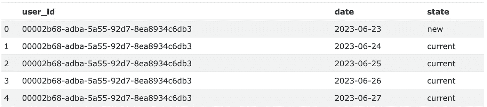

## 3.4 计算转移矩阵

获得这些状态后，我们可以计算状态转移频率。在第 4.3 节中，我们将研究预测如何依赖于考虑转移的周期，因此预先按日聚合这些数据是合理的。结果生成的`transitions`数据框包含`date`、`state_from`、`state_to`和`cnt`列。

现在，我们可以计算转移矩阵 M。我们实现了`get_transition_matrix`函数，它接受`transitions`数据框和一对日期，这些日期涵盖了要考虑的转移期。

作为基准，让我们计算从`2022-11-01`到`2023-10-31`的全年转移矩阵。

```py
M = get_transition_matrix(transitions, '2022-11-01', '2023-10-31')
M
```

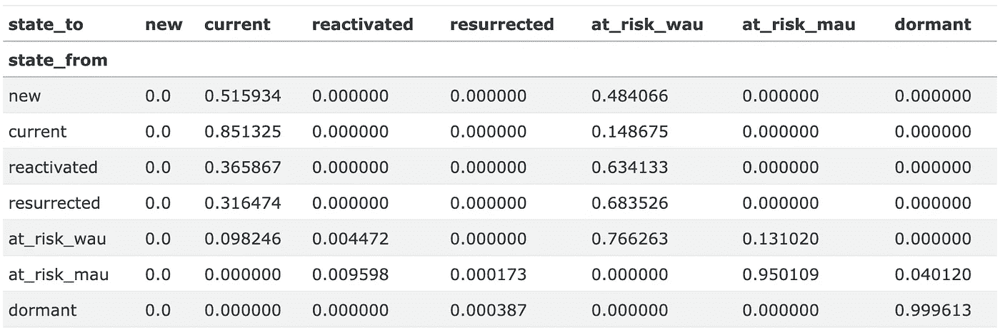

任何转移矩阵的每一行的和都等于 1，因为它表示从一个状态转移到任何其他状态的概率。

## 3.5 获取初始状态计数

初始状态是通过`get_state0`函数和相应的 SQL 查询从`states`数据框中检索的。该函数的唯一参数是我们想要获取初始状态的日期。我们将结果分配给`state0`变量。

```py
def get_state0(date):
    query = f"""
    SELECT state, count(*) AS cnt
    FROM states
    WHERE date = '{date}'
    GROUP BY state
    """

    state0 = duckdb.sql(query).df()
    state0 = state0.set_index('state').reindex(states_order)['cnt']

    return state0
```

```py
state0 = get_state0(DATASET_END)
state0
```

```py
state
new               20
current          475
reactivated       15
resurrected       19
at_risk_wau      404
at_risk_mau     1024
dormant        49523
Name: cnt, dtype: int64
```

## 3.6 预测 DAU

下面的`predict_dau`函数接受所有之前预测 DAU 所需的变量，并对由`start_date`和`end_date`参数定义的日期范围进行预测。

```py
def predict_dau(M, state0, start_date, end_date, new_users):
    """
    Predicts DAU over a given date range.

    Parameters
    ----------
    M : pandas.DataFrame
        Transition matrix representing user state changes.
    state0 : pandas.Series
        counts of initial state of users.
    start_date : str
        Start date of the prediction period in 'YYYY-MM-DD' format.
    end_date : str
        End date of the prediction period in 'YYYY-MM-DD' format.
    new_users : int or pandas.Series
        The expected amount of new users for each day between `start_date` and `end_date`.
        If a Series, it should have dates as the index.
        If an int, the same number is used for each day.

    Returns
    -------
    pandas.DataFrame
        DataFrame containing the predicted DAU, WAU, and MAU for each day in the date range,
        with columns for different user states and tot.
    """

    dates = pd.date_range(start_date, end_date)
    dates.name = 'date'
    dau_pred = []
    new_dau = state0.copy()
    for date in dates:
        new_dau = (M.transpose() @ new_dau).astype(int)
        if isinstance(new_users, int):
            new_users_today = new_users
        else:
            new_users_today = new_users.astype(int).loc[date] 
        new_dau.loc['new'] = new_users_today
        dau_pred.append(new_dau.tolist())

    dau_pred = pd.DataFrame(dau_pred, index=dates, columns=states_order)
    dau_pred['dau'] = dau_pred['new'] + dau_pred['current'] + dau_pred['reactivated'] + dau_pred['resurrected']
    dau_pred['wau'] = dau_pred['dau'] + dau_pred['at_risk_wau']
    dau_pred['mau'] = dau_pred['dau'] + dau_pred['at_risk_wau'] + dau_pred['at_risk_mau']

    return dau_pred
```

```py
dau_pred = predict_dau(M, state0, PREDICTION_START, PREDICTION_END, new_users_pred)
dau_pred
```

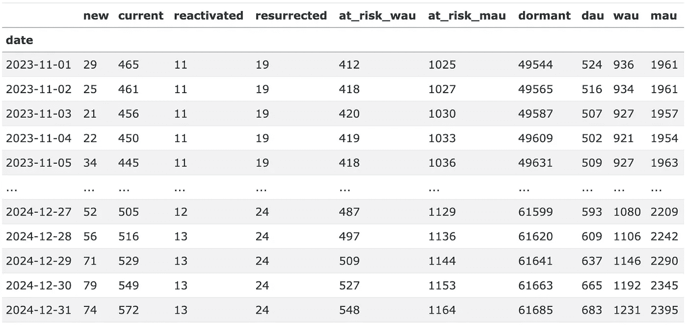

这就是`PREDICTION_START` - `PREDICTION_END`期间 DAU 预测`dau_pred`的样子。除了预期的`dau`、`wau`和`mau`列，输出还包含每个预测日期每个状态下的用户数量。

最后，我们计算 DAU、WAU 和 MAU 的真实值（以及用户状态计数），将它们保存在`dau_true`数据框中，并将预测值和真实值一起绘制。

```py
query = f"""
SELECT date, state, COUNT(*) AS cnt
FROM states
GROUP BY date, state
ORDER BY date, state;
"""

dau_true = duckdb.sql(query).df()
dau_true['date'] = pd.to_datetime(dau_true['date'])
dau_true = dau_true.pivot(index='date', columns='state', values='cnt')
dau_true['dau'] = dau_true['new'] + dau_true['current'] + dau_true['reactivated'] + dau_true['resurrected']
dau_true['wau'] = dau_true['dau'] + dau_true['at_risk_wau']
dau_true['mau'] = dau_true['dau'] + dau_true['at_risk_wau'] + dau_true['at_risk_mau']
```

```py
dau_true.head()
```

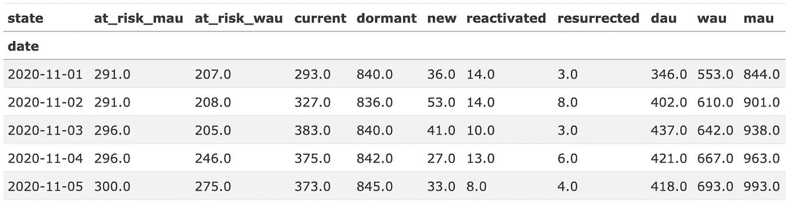

```py
pd.concat([dau_true['dau'], dau_pred['dau']])\
    .plot(title='DAU, historical & predicted');
plt.axvline(PREDICTION_START, color='k', linestyle='--');
```

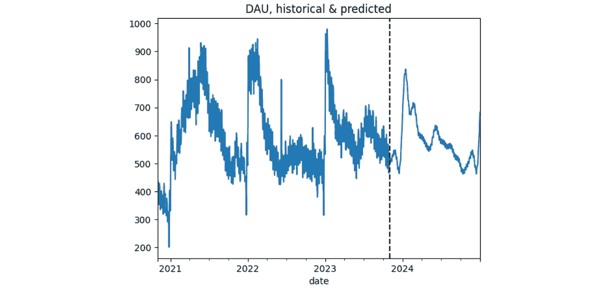

我们已经获得了预测结果，但到目前为止，尚不清楚它是否公正。在下一节中，我们将评估该模型。

# 4. 模型评估

## 4.1 基准模型

首先，让我们检查是否真的需要建立一个复杂的模型来预测 DAU。难道不应该通过提到的`prophet`库将 DAU 作为一般时间序列来进行预测吗？下面的`predict_dau_prophet`函数实现了这一点。我们尝试使用库中可用的一些调整，以使预测更准确。特别是：

+   我们使用逻辑回归模型而不是线性回归，以避免负值；

+   我们明确添加了月度和年度季节性；

+   我们去除离群值；

+   我们明确将 1 月和 2 月的高峰期定义为“假期”。

```py
def predict_dau_prophet(prediction_start, prediction_end, dau_true, show_plot=True):
    # assigning peak days for the new year
    holidays = pd.DataFrame({
        'holiday': 'january_spike',
        'ds': pd.date_range('2022-01-01', '2022-01-31', freq='D').tolist() + \
              pd.date_range('2023-01-01', '2023-01-31', freq='D').tolist(),
        'lower_window': 0,
        'upper_window': 40
    })

    m = Prophet(growth='logistic', holidays=holidays)
    m.add_seasonality(name='monthly', period=30.5, fourier_order=3)
    m.add_seasonality(name='yearly', period=365, fourier_order=3)

    train = dau_true.loc[(dau_true.index < prediction_start) & (dau_true.index >= '2021-08-01')]
    train_prophet = pd.DataFrame({'ds': train.index, 'y': train.values})
    # removining outliers
    train_prophet.loc[train_prophet['ds'].between('2022-06-07', '2022-06-09'), 'y'] = None
    train_prophet['new_year_peak'] = (train_prophet['ds'] >= '2022-01-01') &\
                                     (train_prophet['ds'] <= '2022-02-14')
    m.add_regressor('new_year_peak')
    # setting logistic upper and lower bounds
    train_prophet['cap'] = dau_true.max() * 1.1
    train_prophet['floor'] = 0

    m.fit(train_prophet)

    periods = len(pd.date_range(prediction_start, prediction_end))
    future = m.make_future_dataframe(periods=periods)
    future['new_year_peak'] = (future['ds'] >= '2022-01-01') & (future['ds'] <= '2022-02-14')
    future['cap'] = dau_true.max() * 1.1
    future['floor'] = 0
    pred = m.predict(future)

    if show_plot:
        m.plot(pred);

    # converting the predictions to an appropriate format
    pred = pred\
        .assign(yhat=lambda _df: _df['yhat'].astype(int))\
        .rename(columns={'ds': 'date', 'yhat': 'count'})\
        .set_index('date')\
        .clip(lower=0)\
        ['count']\
        .loc[lambda s: (s.index >= prediction_start) & (s.index <= prediction_end)]

    return pred
```

代码最终变得相当复杂，说明不能简单地将`prophet`应用于 DAU 时间序列。

接下来，我们测试多个预测范围的预测结果：3 个月、6 个月和 12 个月。因此，我们得到 3 个测试集：

+   3 个月预测周期：`2023-08-01` - `2023-10-31`，

+   6 个月预测周期：`2023-05-01` - `2023-10-31`，

+   1 年预测周期：`2022-11-01` - `2023-10-31`。

对于每个测试集，我们计算了[MAPE](https://en.wikipedia.org/wiki/Mean_absolute_percentage_error)损失函数。

```py
from sklearn.metrics import mean_absolute_percentage_error

mapes = []
prediction_end = '2023-10-31'
prediction_horizon = [3, 6, 12]

for offset in prediction_horizon:
    prediction_start = pd.to_datetime(prediction_end) - pd.DateOffset(months=offset - 1)
    prediction_start = prediction_start.replace(day=1)
    prediction_end = '2023-10-31'
    pred = predict_dau_prophet(prediction_start, prediction_end, dau_true['dau'], show_plot=False)
    mape = mean_absolute_percentage_error(dau_true['dau'].reindex(pred.index), pred)
    mapes.append(mape)

mapes = pd.DataFrame({'horizon': prediction_horizon, 'MAPE': mapes})
mapes
```

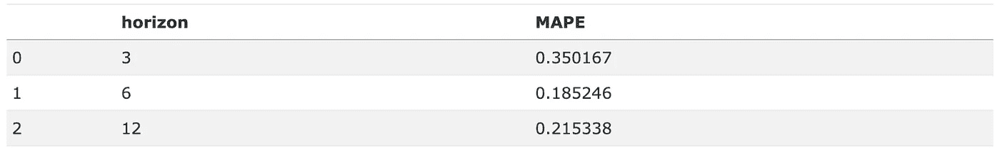

MAPE 误差较高：18% — 35%。最短的预测周期有最高的误差，意味着该模型主要是针对长期预测进行调优的。这是这种方法的另一个不便之处：我们必须针对每个预测周期来调整模型。不管怎样，这就是我们的基准。在下一部分，我们将与更先进的模型进行比较。

## 4.2 一般评估

在这一部分，我们评估了第 3.6 节中实现的模型。目前我们将过渡期设置为预测开始前的一年。我们将在第 4.3 节中研究预测如何依赖于过渡期。至于新用户，我们使用两种选项运行模型：实际值和预测值。同样地，我们固定了 3 个预测周期，并在这些周期上测试模型。

以下的`make_predicion`辅助函数实现了所描述的选项。它接受`prediction_start`和`prediction_end`参数，定义给定预测周期的开始和结束时间，`new_users_mode`可以是`true`或`predict`，以及`transition_period`。后者参数的选项将在后文进一步解释。

```py
import re

def make_prediction(prediction_start, prediction_end, new_users_mode='predict', transition_period='last_30d'):
    prediction_start_minus_1d = pd.to_datetime(prediction_start) - pd.Timedelta('1d')
    state0 = get_state0(prediction_start_minus_1d)

    if new_users_mode == 'predict':
        new_users_pred = predict_new_users(prediction_start, prediction_end, new_users, show_plot=False)
    elif new_users_mode == 'true':
        new_users_pred = new_users.copy()

    if transition_period.startswith('last_'):
        shift = int(re.search(r'last_(\d+)d', transition_period).group(1))
        transitions_start = pd.to_datetime(prediction_start) - pd.Timedelta(shift, 'd')
        M = get_transition_matrix(transitions, transitions_start, prediction_start_minus_1d)
        dau_pred = predict_dau(M, state0, prediction_start, prediction_end, new_users_pred)
    else:
        transitions_start = pd.to_datetime(prediction_start) - pd.Timedelta(240, 'd')
        M_base = get_transition_matrix(transitions, transitions_start, prediction_start_minus_1d)
        dau_pred = pd.DataFrame()

        month_starts = pd.date_range(prediction_start, prediction_end, freq='1MS')
        N = len(month_starts)

        for i, prediction_month_start in enumerate(month_starts):
            prediction_month_end = pd.offsets.MonthEnd().rollforward(prediction_month_start)
            transitions_month_start = prediction_month_start - pd.Timedelta('365D')
            transitions_month_end = prediction_month_end - pd.Timedelta('365D')

            M_seasonal = get_transition_matrix(transitions, transitions_month_start, transitions_month_end)
            if transition_period == 'smoothing':
                i = min(i, 12)
                M = M_seasonal * i / (N - 1)  + (1 - i / (N - 1)) * M_base
            elif transition_period.startswith('seasonal_'):
                seasonal_coef = float(re.search(r'seasonal_(0\.\d+)', transition_period).group(1))
                M = seasonal_coef * M_seasonal + (1 - seasonal_coef) * M_base

            dau_tmp = predict_dau(M, state0, prediction_month_start, prediction_month_end, new_users_pred)
            dau_pred = pd.concat([dau_pred, dau_tmp])

            state0 = dau_tmp.loc[prediction_month_end][states_order]

    return dau_pred

def prediction_details(dau_true, dau_pred, show_plot=True, ax=None):
    y_true = dau_true.reindex(dau_pred.index)['dau']
    y_pred = dau_pred['dau']
    mape = mean_absolute_percentage_error(y_true, y_pred) 

    if show_plot:
        prediction_start = str(y_true.index.min().date())
        prediction_end = str(y_true.index.max().date())
        if ax is None:
            y_true.plot(label='DAU true')
            y_pred.plot(label='DAU pred')
            plt.title(f'DAU prediction, {prediction_start} - {prediction_end}')
            plt.legend()
        else:
            y_true.plot(label='DAU true', ax=ax)
            y_pred.plot(label='DAU pred', ax=ax)
            ax.set_title(f'DAU prediction, {prediction_start} - {prediction_end}')
            ax.legend()
    return mape
```

总体来说，我们有 6 个预测场景：2 个新用户选项和 3 个预测周期。下图展示了结果。左侧的图表与`new_users_mode = 'predict'`选项相关，而右侧的图表与`new_users_mode = 'true'`选项相关。

```py
fig, axs = plt.subplots(3, 2, figsize=(15, 6))
mapes = []
prediction_end = '2023-10-31'
prediction_horizon = [3, 6, 12]

for i, offset in enumerate(prediction_horizon):
    prediction_start = pd.to_datetime(prediction_end) - pd.DateOffset(months=offset - 1)
    prediction_start = prediction_start.replace(day=1)
    args = {
        'prediction_start': prediction_start,
        'prediction_end': prediction_end,
        'transition_period': 'last_365d'
    }
    for j, new_users_mode in enumerate(['predict', 'true']):
        args['new_users_mode'] = new_users_mode
        dau_pred = make_prediction(**args)
        mape = prediction_details(dau_true, dau_pred, ax=axs[i, j])
        mapes.append([offset, new_users_mode, mape])

mapes = pd.DataFrame(mapes, columns=['horizon', 'new_users', 'MAPE'])
plt.tight_layout()
```

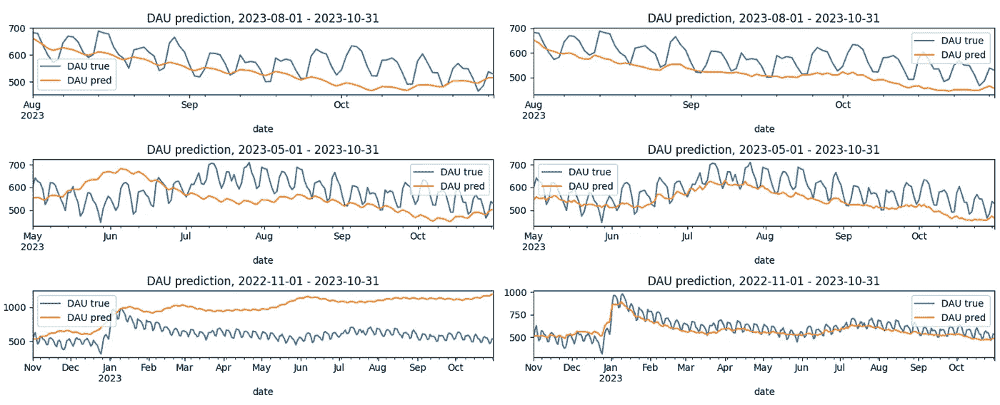

这里是总结预测质量的 MAPE 值：

```py
mapes.pivot(index='horizon', columns='new_users', values='MAPE')
```

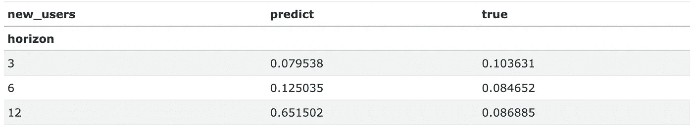

我们注意到了多个方面。

+   一般来说，模型表现出的结果比基准要好得多。实际上，基准模型仅基于历史的 DAU 数据，而模型则利用了用户状态信息。

+   然而，对于 1 年预测周期和`new_users_mode='predict'`，MAPE 误差非常大：65%。这个值是相应基准误差（21%）的 3 倍。另一方面，`new_users_mode='true'`选项提供了一个更好的结果：8%。这意味着新用户预测对模型有着巨大的影响，特别是在长期预测中。对于较短的周期，这个差异则不那么明显。造成这种差异的主要原因是 1 年周期包括了圣诞节这一极端值。因此，i) 很难预测如此高的新用户值，ii) 这个周期对用户行为、过渡矩阵以及 DAU 值有着重大影响。因此，我们强烈建议谨慎地实现新用户预测。基准模型专门为圣诞节期间进行了调整，因此它超越了马尔可夫模型也就不足为奇了。

+   当新用户预测准确时，模型能够很好地捕捉到趋势。这意味着使用过去 365 天的数据来计算转移矩阵是一个合理的选择。

+   有趣的是，真实的新用户数据对于 3 个月的预测结果更差。这纯粹是巧合。2023 年 10 月错误的新用户预测逆转了预测的 DAU 趋势，并使得 MAPE 略有下降。

现在，让我们分解预测误差，看看哪些状态贡献最大。这里的误差指的是`dau_pred` - `dau_true`的值，相对误差指的是（`dau_pred` - `dau_true`）/ `dau_true`，对应的左侧和右侧图表如下所示。为了聚焦于这一方面，我们将配置范围缩小到三个月的预测期以及`new_users_mode='true'`选项。

```py
dau_component_cols = ['new', 'current', 'reactivated', 'resurrected']

dau_pred = make_prediction('2023-08-01', '2023-10-31', new_users_mode='true', transition_period='last_365d')
figure, (ax1, ax2) = plt.subplots(1, 2, figsize=(12, 4))

dau_pred[dau_component_cols]\
    .subtract(dau_true[dau_component_cols])\
    .reindex(dau_pred.index)\
    .plot(title='Prediction error by state', ax=ax1)

dau_pred[['current']]\
    .subtract(dau_true[['current']])\
    .div(dau_true[['current']])\
    .reindex(dau_pred.index)\
    .plot(title='Relative prediction error (current state)', ax=ax2);
```

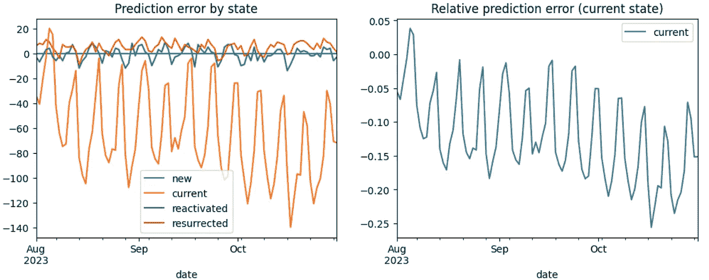

从左侧图表中我们可以看到，误差主要由`current`状态贡献。这并不令人惊讶，因为这个状态对 DAU 的贡献最大。`reactivated`和`resurrected`状态的误差较低。另一个有趣的现象是，`current`状态的误差大多为负值，而`resurrected`状态的误差大多为正值。前者可能是由于在预测期内出现的新用户比过去的用户更加活跃。后者则表明，`resurrected`用户实际上对 DAU 的贡献低于转移矩阵的预期，因此`dormant`→`resurrected`的转化率被高估了。

至于相对误差，分析`current`状态的误差是有意义的。因为`reactivated`和`resurrected`状态的日活跃用户数量较少，所以相对误差较大且噪声较多。`current`状态的相对误差介于-25%到 4%之间，这个范围相当大。由于我们已经固定了新用户的预测，这个误差只能用转移矩阵的不准确性来解释。特别是，`current`→`current`的转化率大致为 0.8，这个值较高，因此它对误差贡献很大。所以如果我们想改善预测，首先需要考虑调整这一转化率。

## 4.3 转移期的影响

在上一节中，我们固定了转移期：预测开始前 1 年。现在我们将研究为了获得更准确的预测，这一时期应该多长。我们考虑相同的预测期：3 个月、6 个月和 12 个月。为了减少新用户预测的噪声，我们使用新用户数量的实际值：`new_users_mode='true'`。

这里介绍了`transition_period`参数的变化。其值通过`last_<N>d`模式进行遮掩，其中`N`表示转移期的天数。对于每个预测期，我们计算了 12 个不同的转移期，分别为 1 个月、2 个月、...、12 个月。然后我们为每个选项计算 MAPE 误差并绘制结果。

```py
result = []

for prediction_offset in prediction_horizon:
    prediction_start = pd.to_datetime(prediction_end) - pd.DateOffset(months=prediction_offset - 1)
    prediction_start = prediction_start.replace(day=1)

    for transition_offset in range(1, 13):
        dau_pred = make_prediction(
            prediction_start, prediction_end, new_users_mode='true',
            transition_period=f'last_{transition_offset*30}d'
        )
        mape = prediction_details(dau_true, dau_pred, show_plot=False)
        result.append([prediction_offset, transition_offset, mape])
result = pd.DataFrame(result, columns=['prediction_period', 'transition_period', 'mape'])

result.pivot(index='transition_period', columns='prediction_period', values='mape')\
    .plot(title='MAPE by prediction and transition period');
```

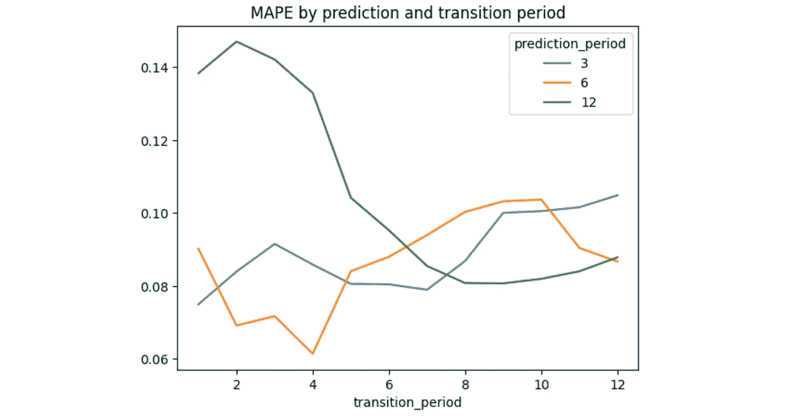

结果表明，最佳的转移期长度取决于预测范围。较短的预测期需要较短的转移期：对于 3、6 和 12 个月的预测，最小的 MAPE 误差分别出现在 1、4 和 8 个转移期。这显然是因为较长的预测期包含了一些只有通过较长转移期才能捕捉到的季节性效应。此外，似乎对于较长的预测期，MAPE 曲线呈 U 形，这意味着过长或过短的转移期都不利于预测。我们将在下一节展开讨论这个想法。

## 4.4 过时性与季节性

然而，固定一个单一的转移矩阵来预测整个未来一年的情况似乎并不是一个好主意：这样的模型过于僵化。通常，用户行为会根据季节变化。例如，在圣诞节后出现的用户可能会有行为上的变化。另一个典型的情况是用户在夏季改变他们的行为。在本节中，我们将尝试考虑这些季节性效应。

因此，我们希望预测从 2022 年 11 月开始的未来 1 年内的日活跃用户数（DAU）。我们不再仅使用一个计算自预测开始前 8 个月的单一转移矩阵`M_base`，而是根据上一小节的结果（并在下面标记为`last_240d`选项），将这个矩阵与一个季节性矩阵`M_seasonal`结合使用。后者是按月计算的，滞后 1 年。例如，为了预测 2022 年 11 月的 DAU，我们将`M_seasonal`定义为 2021 年 11 月的转移矩阵。然后，我们将预测的时间范围转移到 2022 年 12 月，并计算 2021 年 12 月的`M_seasonal`，以此类推。

为了混合`M_base`和`M_seasonal`，我们定义了以下两个选项。

+   `seasonal_0.3`：M = 0.3 * `M_seasonal` + 0.7 * `M_base`。0.3 是经过一些实验后选择的局部最小值的权重。

+   `smoothing`：M = i/(N-1) * `M_seasonal` + (1 - i/(N - 1)) * `M_base`，其中 N 是预测期内的月份数，i = 0, …, N - 1 是月份索引。这个配置的想法是随着预测月份的推进，从最新的转移矩阵`M_base`逐渐切换到季节性矩阵。

```py
result = pd.DataFrame()
for transition_period in ['last_240d', 'seasonal_0.3', 'smoothing']:
    result[transition_period] = make_prediction(
        '2022-11-01', '2023-10-31',
        'true',
        transition_period
    )['dau']
result['true'] = dau_true['dau']
result['true'] = result['true'].astype(int)
result.plot(title='DAU prediction by different transition matrices');
```

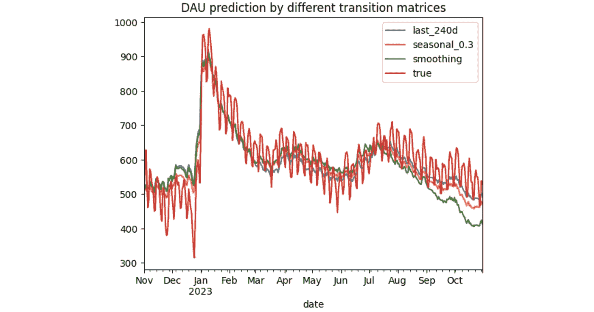

```py
mape = pd.DataFrame()
for col in result.columns:
    if col != 'true':
        mape.loc[col, 'mape'] = mean_absolute_percentage_error(result['true'], result[col])
mape
```

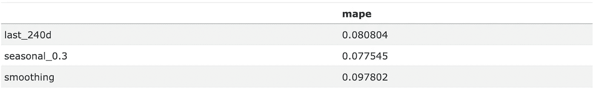

根据 MAPE 错误，`seasonal_0.3` 配置提供了最佳结果。有趣的是，`smoothing` 方法比 `last_240d` 更差。从上面的图表可以看出，所有三个模型从 2023 年 7 月开始都低估了 DAU 的值，尤其是 `smoothing` 模型。看起来从 2023 年 7 月开始出现的新用户比 2022 年的用户更活跃。可能是应用程序得到了足够的改善，或者市场团队做得很出色。结果，`smoothing` 模型过度依赖 2022 年 7 月至 10 月的过时过渡数据，表现得比其他模型更差。

## 4.5 最终解决方案

总结一下，让我们对 2024 年做一个最终的预测。我们使用 `seasonal_0.3` 配置和新用户的预测值。

```py
dau_pred = make_prediction(
    PREDICTION_START, PREDICTION_END,
    new_users_mode='predict',
    transition_period='seasonal_0.3'
)
dau_true['dau'].plot(label='true')
dau_pred['dau'].plot(label='seasonal_0.3')
plt.title('DAU, historical & predicted')
plt.axvline(PREDICTION_START, color='k', linestyle='--')
plt.legend();
```

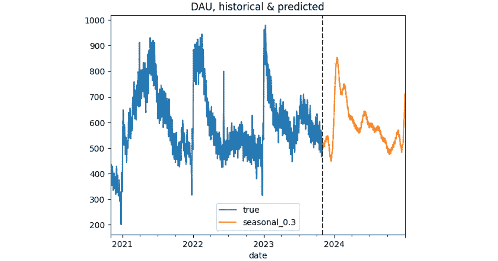

# 5. 讨论

在第四部分中，我们从预测准确性角度研究了模型的表现。现在让我们从实际角度讨论该模型。

除了准确性差之外，将 DAU 作为时间序列进行预测（参见第 4.1 节）使得这种方法非常僵化。本质上，它以一种方式做出预测，使得它最能拟合*历史*数据。实际上，在为来年做规划时，我们通常对未来有一些明确的预期。例如，

+   市场团队将推出一些更有效的新营销活动，

+   激活团队计划改进用户引导流程，

+   产品团队将发布一些新功能，以更好地吸引和留住用户。

我们的模型可以考虑到这些预期。对于上述示例，我们可以分别调整新用户的预测、`new`→ `current` 和 `current`→ `current` 的转化率。结果，我们可以得到一个与历史数据不完全匹配但更为现实的预测。该模型的特点不仅仅是灵活——它是可解释的。你可以轻松地与利益相关者讨论这些调整，他们也能理解预测是如何工作的。

该模型的另一个优点是它不需要预测某个用户在某一天是否会活跃。有时，二分类器会被用于这个目的。这种方法的缺点是我们需要对每个用户（包括所有休眠用户）以及预测时间范围内的每一天应用这样的分类器。这是一个巨大的计算开销。相比之下，马尔可夫模型只需要初始状态量（`state0`）。此外，这类分类器通常是黑箱模型：它们难以解释且难以调整。

马尔可夫模型也有一些局限性。正如我们已经看到的，它对新用户的预测非常敏感。一个错误的新用户数量可能会完全破坏预测结果。另一个问题是，马尔可夫模型是“无记忆”的，意味着它没有考虑用户的历史。例如，它不能区分一个`当前`用户是新手、老手，还是`重新激活`/`复活`的用户。这些用户类型的留存率显然应该不同。此外，正如我们之前讨论的，用户行为可能会因季节、营销来源、国家等因素而有所不同。到目前为止，我们的模型还无法捕捉到这些差异。然而，这可能是进一步研究的一个课题：我们可以通过为不同的用户群体拟合更多的转移矩阵来扩展该模型。

最后，正如我们在导言中承诺的，我们提供了一个[DAU 电子表格计算器](https://docs.google.com/spreadsheets/d/1DxbjrkSy_wvU1lzlNWhrEfWO-Kq1tJrQw0izEHu5ULU/edit?usp=sharing)。在`Prediction`工作表中，你需要填写初始状态分布行（标记为蓝色）和新用户预测列（标记为紫色）。在`Conversions`工作表中，你可以调整转移矩阵的值。请记住，矩阵的每一行的总和应等于 1。

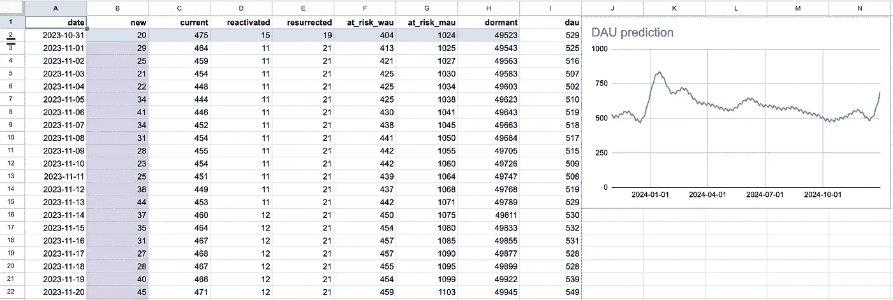

暂时就这些。我希望这篇文章对你有所帮助。如果你有任何问题或建议，欢迎在下面的评论区提问，或者通过[LinkedIn](https://www.linkedin.com/in/vladimir-kukushkin-95b6487/)直接联系我。

本文中的所有图片均由作者生成。
