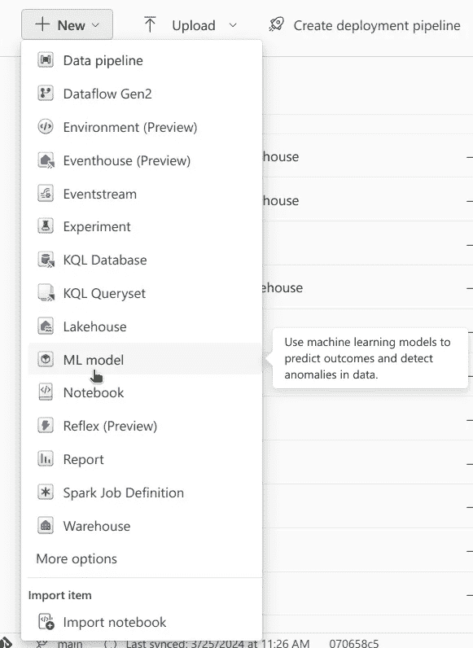
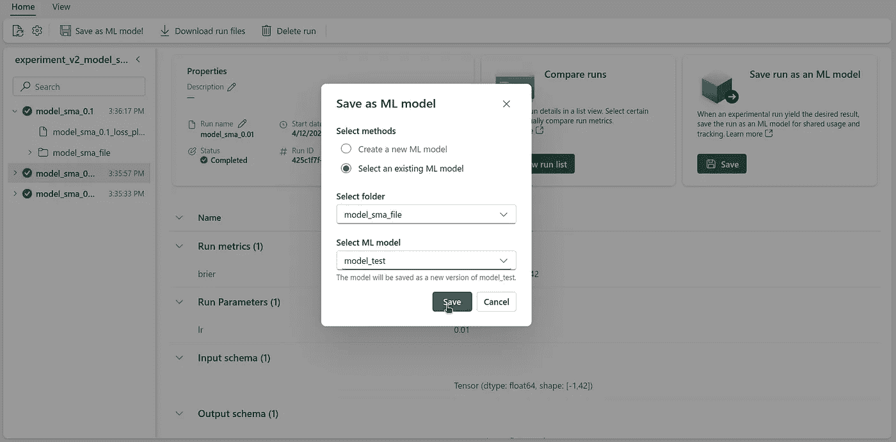
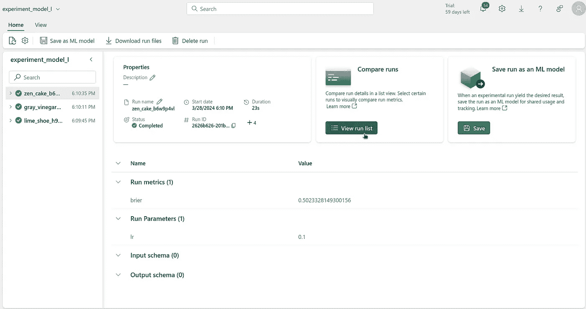

# 模型、MLFlow 和 Microsoft Fabric

> 原文：[`towardsdatascience.com/models-mlflow-and-microsoft-fabric-8faacaa90814?source=collection_archive---------7-----------------------#2024-04-29`](https://towardsdatascience.com/models-mlflow-and-microsoft-fabric-8faacaa90814?source=collection_archive---------7-----------------------#2024-04-29)

## Fabric 疯狂系列 第五部分

[](https://medium.com/@roger_noble?source=post_page---byline--8faacaa90814--------------------------------)[](https://towardsdatascience.com/?source=post_page---byline--8faacaa90814--------------------------------) [Roger Noble](https://medium.com/@roger_noble?source=post_page---byline--8faacaa90814--------------------------------)

·发表于 [Towards Data Science](https://towardsdatascience.com/?source=post_page---byline--8faacaa90814--------------------------------) ·6 分钟阅读·2024 年 4 月 29 日

--


作者与 ChatGPT 提供的插图。 “设计一幅插图，展示多个机器学习模型，聚焦于篮球数据”提示。ChatGPT，4，OpenAI，2024 年 4 月 25 日。[`chat.openai.com.`](https://chat.openai.com./)

*非常感谢* [*Martim Chaves*](https://medium.com/@mgrc99) *他与我共同编写了这篇文章并开发了示例脚本。*

到目前为止，在本系列中，我们已经探讨了如何使用 Fabric 来收集数据、进行特征工程和训练模型。

但现在我们已经有了这些崭新的模型，我们该怎么做呢？如何追踪它们，如何利用它们进行预测呢？这就是 MLFlow 的模型注册表发挥作用的地方，或者说是 Fabric 所称的**ML 模型**。

模型注册表允许我们追踪模型的不同版本及其相应的表现。在生产环境中尤其有用，我们需要部署特定版本的模型来进行推理。

模型注册表可以看作是机器学习模型的源代码管理。基本上，每个版本代表一组独特的模型文件。这些文件包含了模型的架构、训练好的权重，以及任何其他必要的文件，用于加载和使用该模型。

在这篇文章中，我们将讨论如何记录模型，并且如何使用模型注册表来追踪模型的不同版本。我们还将讨论如何从注册表中加载模型并用其进行预测。

# 注册模型

在 Fabric 中注册模型有两种方式：通过代码或通过 UI。让我们来看看这两种方式。

## 使用代码注册模型

在[上一篇文章](https://medium.com/towards-data-science/experimenting-with-mlflow-and-microsoft-fabric-68f43043ff34)中，我们讨论了如何创建实验并记录具有不同配置的运行。记录或注册模型可以通过在运行中使用代码来完成。为此，我们只需添加几行代码。

```py
# Start the training job with `start_run()`
with mlflow.start_run(run_name="logging_a_model") as run:
  # Previous code...
  # Train model
  # Log metrics

  # Calculate predictions for training set
  predictions = model.predict(X_train_scaled_df)

  # Create Signature
  # Signature required for model loading later on
  signature = infer_signature(np.array(X_train_scaled_df), predictions)

  # Model File Name
  model_file_name = model_name + "_file"

  # Log model
  mlflow.tensorflow.log_model(best_model, model_file_name, signature=signature)

  # Get model URI
  model_uri = f"runs:/{run.info.run_id}/{model_file_name}"

  # Register Model
  result = mlflow.register_model(model_uri, model_name)
```

在这个代码片段中，我们首先计算训练集的预测结果。然后创建一个签名，这本质上是模型的输入和输出形状。这是为了确保模型以后可以加载。

MLFlow 具有用于记录不同常用包（如[TensorFlow](https://www.tensorflow.org/)、[PyTorch](https://pytorch.org/) 和 [scikit-learn](https://scikit-learn.org/)）制作的模型的功能。当使用 `mlflow.tensorflow.log_model` 时，一个文件夹作为工件保存，并附加到运行中，其中包含加载和运行模型所需的文件。在这些文件中，包含了模型的架构、训练好的权重以及重建所需的任何其他配置。这使得以后可以加载模型进行推理、微调或任何其他常规模型操作，而无需重新运行最初创建它的代码。

模型的 URI 用作指向模型文件的“路径”，由运行 ID 和用于模型的文件名组成。一旦我们获得了模型的 URI，就可以使用该 URI 注册一个 ML 模型。

有趣的是，如果已经存在同名的模型，将会添加一个新版本。这样，我们可以跟踪同一模型的不同版本，并查看它们的表现，而无需编写过于复杂的代码来管理这些版本。

在我们的[上一篇文章](https://medium.com/towards-data-science/experimenting-with-mlflow-and-microsoft-fabric-68f43043ff34)中，我们进行了三个实验，每个实验测试一种模型架构，并使用三种不同的学习率。对于每种模型架构，都会创建一个 ML 模型，对于每种学习率，也会保存一个版本。总共有 9 个版本可供选择，每个版本具有不同的架构和学习率。

# 使用 UI 注册模型

**ML 模型**也可以通过 Fabric 的 UI 进行注册。可以从已创建的实验中导入模型版本。



图 1 — 使用 UI 创建 ML 模型。图片来自作者。

在创建 ML 模型后，我们可以从现有实验中导入模型。为此，在一次运行中，我们需要在 `Save run as an ML Model` 部分选择 `Save`。



图 2 — 从一次运行中创建已创建的 ML 模型的新版本。图片来自作者。

# 选择最佳模型

现在我们已经注册了所有模型，可以选择最佳的一个。可以通过 UI 界面或代码实现。具体方法是打开每个实验，选择`列表视图`，然后选择所有可用的运行记录。找到最佳运行记录后，我们需要确认是哪一个模型和版本。



图 3 — 检查实验。图像由作者提供。

或者，这也可以通过代码实现，获取所有机器学习模型的所有版本的性能，并选择表现最佳的版本。

```py
from mlflow.tracking import MlflowClient

client = MlflowClient()

mlmodel_names = list(model_dict.keys())
best_score = 2
metric_name = "brier"
best_model = {"model_name": "", "model_version": -1}

for mlmodel in mlmodel_names:

 model_versions = client.search_model_versions(filter_string=f"name = '{mlmodel}'")

 for version in model_versions:

  # Get metric history for Brier score and run ID
  metric_history = client.get_metric_history(run_id=version.run_id,
                                             key=metric_name)

  # If score better than best score, save model name and version
  if metric_history:
   last_value = metric_history[-1].value
   if last_value < best_score:
    best_model["model_name"] = mlmodel
    best_model["model_version"] = version.version
    best_score = last_value
  else:
   continue
```

在这段代码中，我们获取所有可用的机器学习模型列表。然后，我们遍历这个列表，获取每个机器学习模型的所有可用版本。

获取机器学习模型的版本列表可以使用以下代码行：

```py
model_versions = client.search_model_versions(filter_string=f"name = '{mlmodel}'")
```

然后，对于每个版本，我们只需要获取其指标历史记录。这可以通过以下代码行实现：

```py
metric_history = client.get_metric_history(run_id=version.run_id,
                                         key=metric_name)
```

然后，我们只需要追踪表现最好的版本。最终，我们找到了表现最佳的模型，不论其架构和超参数如何。

# 加载最佳模型

在找到最佳模型后，使用该模型进行最终预测可以通过以下代码片段实现：

```py
# Load the best model
loaded_best_model = mlflow.pyfunc.load_model(f"models:/{best_model['model_name']}/{best_model['model_version'].version}")

# Evaluate the best model
final_brier_score = evaluate_model(loaded_best_model, X_test_scaled_df, y_test)
print(f"Best final Brier score: {final_brier_score}")
```

加载模型可以使用`mlflow.pyfunc.load_model()`，唯一需要的参数是模型的路径。模型的路径由模型名称和版本组成，格式为`models:/[model name]/[version]`。之后，我们只需确保输入的形状与训练时相同，并且特征的顺序也一致——就这样！

使用测试集，我们计算了最终的 Brier 分数，**0.20**。

# 结论

在本文中，我们讨论了模型注册表背后的理念，以及为什么使用模型注册表是有益的。我们展示了如何通过机器学习模型工具使用 Fabric 的模型注册表，既可以通过 UI 界面，也可以通过代码实现。最后，我们介绍了如何从注册表加载模型并进行推理。

本系列教程到此为止。我们希望你喜欢这篇文章，并且学到了新知识。如果你有任何问题或评论，欢迎与我们联系。我们期待你的反馈！👋

*原文发布于* [*https://nobledynamic.com*](https://nobledynamic.com/posts/fabric-madness-5/) *2024 年 4 月 29 日。*
