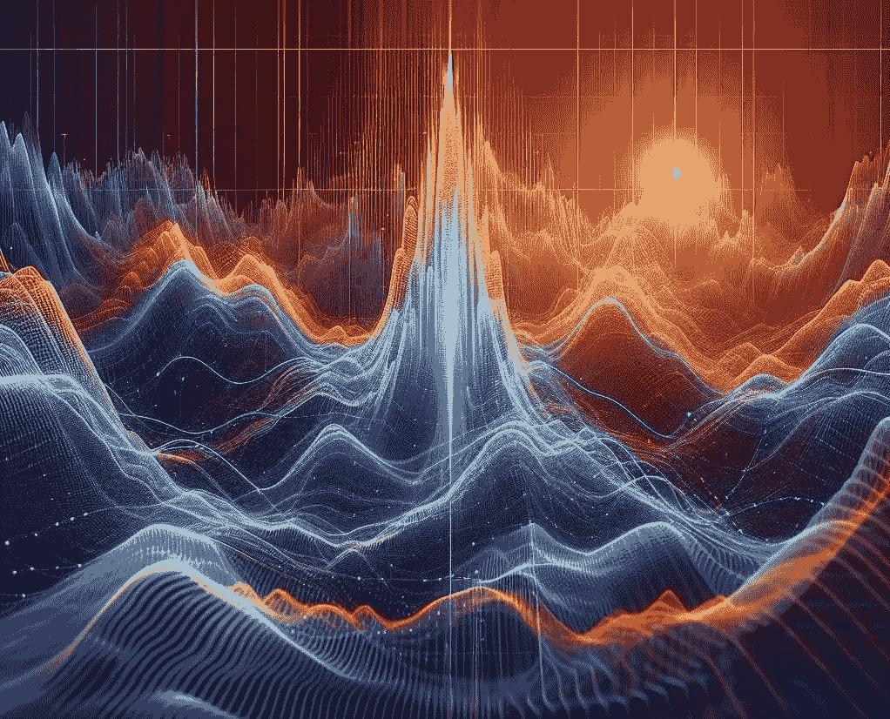

# MOMENT：一个基础时间序列预测、分类、异常检测模型

> 原文：[`towardsdatascience.com/moment-a-foundation-model-for-time-series-forecasting-classification-anomaly-detection-1e35f5b6ca76?source=collection_archive---------0-----------------------#2024-04-27`](https://towardsdatascience.com/moment-a-foundation-model-for-time-series-forecasting-classification-anomaly-detection-1e35f5b6ca76?source=collection_archive---------0-----------------------#2024-04-27)

## 一个统一的模型，涵盖多个时间序列任务

 [Nikos Kafritsas](https://medium.com/@nikoskafritsas?source=post_page---byline--1e35f5b6ca76--------------------------------)

·发表于[Towards Data Science](https://towardsdatascience.com/?source=post_page---byline--1e35f5b6ca76--------------------------------) ·阅读时间 11 分钟·2024 年 4 月 27 日

--

由作者使用 DALLE*3 创建

**基础模型已点燃 LLMs 在时间序列中的应用。**

在过去的几个月里，我们看到了新的预测模型的发布，如[TimesFM](https://medium.com/towards-data-science/timesfm-googles-foundation-model-for-time-series-forecasting-593a332dd08d)、[TimeGPT](https://aihorizonforecast.substack.com/p/timegpt-the-first-foundation-model)以及当然是 Salesforce 的[MOIRAI](https://medium.com/towards-data-science/moirai-salesforces-foundation-model-for-time-series-forecasting-4eff6c34093d)。

基础时间序列模型将对实际应用产生重大影响。时间序列无处不在，广泛应用于零售、能源需求、经济学、医疗保健等多个领域。一个基础时间序列模型可以像 GPT-4 处理文本一样，迅速应用于任何时间序列任务并取得很高的准确性。

本文探讨了***MOMENT*[1]**，最新的基础时间序列模型。

MOMENT 与前述模型的区别在于其通用性——它可以处理**预测**、**分类**、**异常检测**和**填补缺失值**任务。此外，[它是开源的！](https://anonymous.4open.science/r/BETT-773F/README.md)

本文将描述*MOMENT*的工作原理、架构，以及与其他 SOTA 时间序列模型的性能比较。

让我们开始吧。

> *我已发布* ***AI Horizon Forecast,*** *一份专注于时间序列和创新 AI 研究的通讯。订阅* [*这里*](https://aihorizonforecast.substack.com/) *以拓宽你的*…
