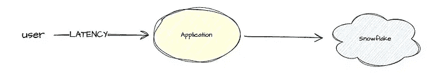
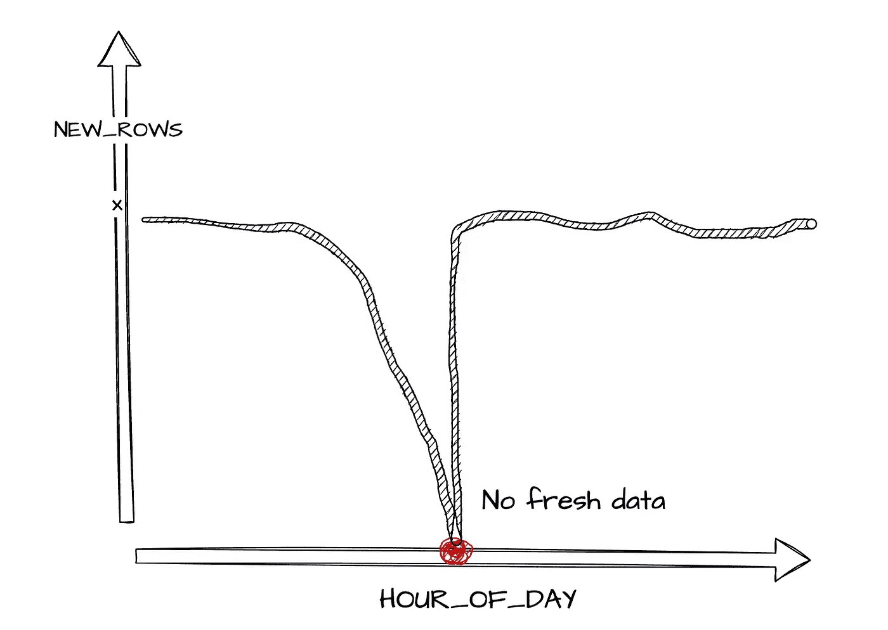
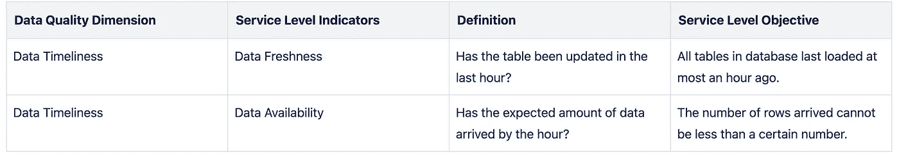
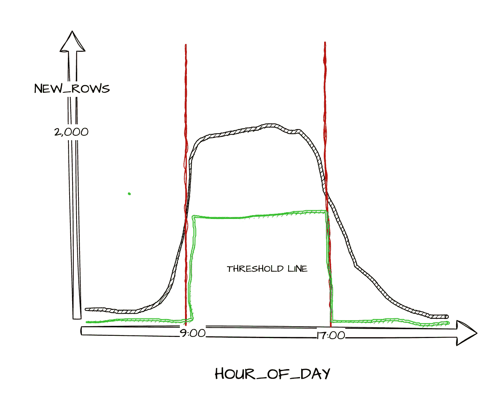
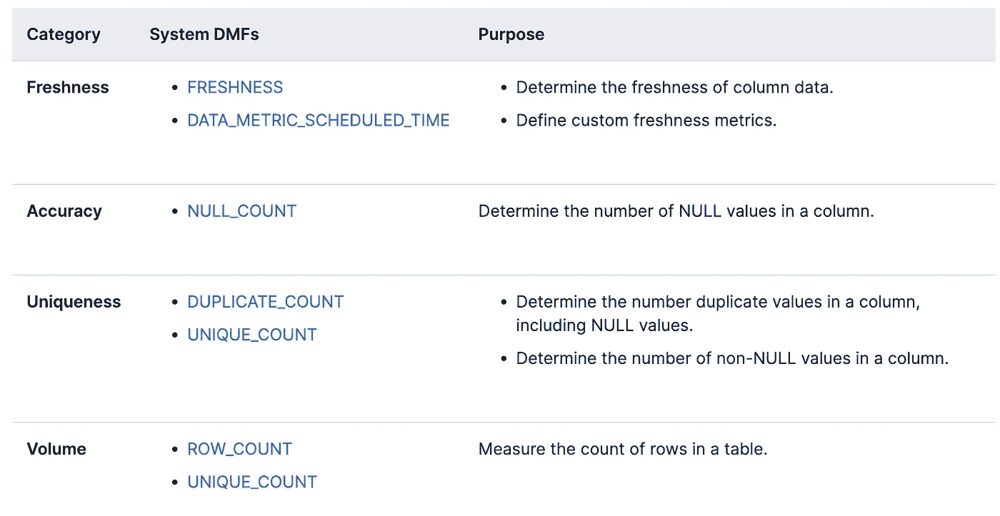
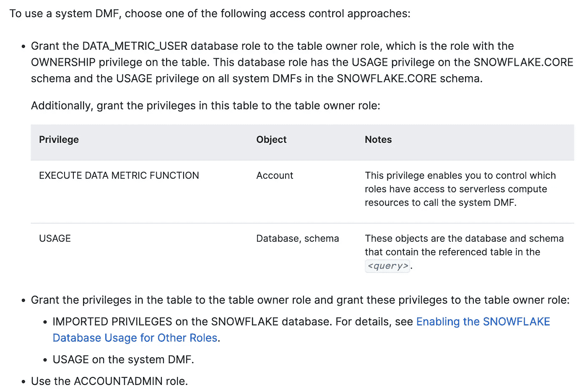

# 使用 Snowflake 的数据指标函数监控数据管道

> 原文：[`towardsdatascience.com/monitor-data-pipelines-using-snowflakes-data-metric-functions-0df71c46f04a?source=collection_archive---------8-----------------------#2024-04-15`](https://towardsdatascience.com/monitor-data-pipelines-using-snowflakes-data-metric-functions-0df71c46f04a?source=collection_archive---------8-----------------------#2024-04-15)

## 使用谷歌 SRE 原则构建可信的数据平台

[](https://medium.com/@jesszhangcyz?source=post_page---byline--0df71c46f04a--------------------------------)[](https://towardsdatascience.com/?source=post_page---byline--0df71c46f04a--------------------------------) [Jess.Z](https://medium.com/@jesszhangcyz?source=post_page---byline--0df71c46f04a--------------------------------)

·发表于 [Towards Data Science](https://towardsdatascience.com/?source=post_page---byline--0df71c46f04a--------------------------------) ·阅读时间 6 分钟·2024 年 4 月 15 日

--


由 Dall-E 生成的图像

您是否遇到过客户首先因为数据事件而找上门？您的客户是否因为数据不可信而自己构建数据解决方案？您的数据团队是否在修复未检测到的数据质量问题上花费了不必要的长时间，而不是优先处理战略性工作？

数据团队需要能够全面了解其数据系统的健康状况，以便赢得利益相关者的信任，并与整个业务进行更好的沟通。

我们可以将数据质量维度与谷歌的站点可靠性工程（SRE）原则结合起来，衡量我们数据系统的健康状况。为此，评估一些对您的数据管道有意义的数据质量维度，并制定**服务水平目标（SLOs）**。

## 什么是服务水平目标？

本文中我们将使用的服务水平术语是***服务水平指标***和***服务水平目标***。这两个概念是借鉴自 [谷歌 SRE 书籍](https://sre.google/sre-book/foreword/)的原则。

> **服务水平** **指标** — 精确定义的、定量衡量某个服务层面水平的指标。

我们在软件领域常见的指标有吞吐量、延迟和正常运行时间（可用性）。这些用于衡量应用程序或网站的可靠性。



典型事件

然后，这些指标被转化为受*阈值*限制的目标。软件应用的健康状况现在是“可度量的”，我们可以与客户沟通应用的状态。

> **服务水平目标**：由 SLI 衡量的服务水平的目标值或范围。

我们直观地理解这些定量衡量标准和指标在典型用户应用中的必要性，以减少摩擦并建立与客户的信任。在构建数据管道时，我们需要采用类似的思维方式。

## 数据质量维度转化为服务水平术语



数据系统故障

假设用户与我们的应用程序互动并每小时生成 X 量的数据进入我们的数据仓库，如果进入仓库的行数突然大幅下降，我们可以将其标记为问题。然后，我们可以追踪管道中的时间戳来诊断并解决问题。

我们希望捕获进入我们系统的数据的足够信息，以便在发生异常时能够检测到。大多数数据团队倾向于从**数据及时性**开始。预期的数据是否在正确的时间到达？

这可以分解为以下指标：

+   数据可用性——预期的数据是否已经到达/可用？

+   数据新鲜度——新的数据是否按预期时间到达？



数据质量维度转化为 SLIs 和 SLOs

一旦系统稳定，保持与客户的良好关系就变得重要，以便设定对利益相关者有价值的正确目标。

## 阈值的概念…

我们如何实际确定期望多少数据以及何时到达？对于我们所有不同的数据集，正确的数据量是多少？这时我们需要关注**阈值**概念，因为它确实比较复杂。

假设我们有一个应用程序，用户主要在工作时间登录系统。我们预计每天 9 点到下午 5 点之间大约会有 2000 次 USER_LOGIN 事件，而在其他时间则有 100 次。如果我们为一天使用一个单一的阈值，它会得出错误的结论。在晚上 8 点接收 120 个事件是完全合理的，但如果我们在下午 2 点只接收了 120 个事件，那就值得关注，并且应该进一步调查。



显示阈值线的图表，绿色

因此，我们需要为一天中的每个小时以及每个不同的数据集计算不同的期望值——这就是阈值。需要定义一个元数据表，动态地获取每小时到达的行数，以便得出对每个数据源有意义的阈值。

有些阈值可以使用时间戳作为代理提取，正如上面所解释的那样。这可以通过统计度量，如平均值、标准差或百分位数，来迭代你的元数据表。

根据你的创造性程度，你甚至可以在这个过程的某一部分引入机器学习，帮助你设定阈值。其他阈值或预期需要与利益相关者讨论，因为这将依赖于对业务的具体了解，知道该预期什么。

## 在 Snowflake 中的技术实现

开始的第一步是选择几个对业务至关重要的数据集，在实现大规模的数据运维解决方案之前在其上构建。这是获取动力并感受数据可观察性工作影响的最简单方式。

许多分析型数据仓库已经内建了相关功能。例如，Snowflake 最近为企业账户推出了[数据度量函数](https://docs.snowflake.com/user-guide/data-quality-intro)预览版，帮助数据团队快速入门。

数据度量函数是我们可能写的一些查询的包装器，用来洞察我们的数据系统。我们可以从系统 DMF 开始。



Snowflake 系统 DMF

我们首先需要整理一些权限…



DMF 访问控制文档

```py
USE ROLE ACCOUNTADMIN;

GRANT database role DATA_METRIC_USER TO role jess_zhang;

GRANT EXECUTE data metric FUNCTION ON account TO role jess_zhang;

## Useful queries once the above succeeds
SHOW DATA METRIC FUNCTIONS IN ACCOUNT;
DESC FUNCTION snowflake.core.NULL_COUNT(TABLE(VARCHAR));
```

**DATA_METRIC_USER** 是一个数据库角色，这可能会让一些人感到困惑。如果你遇到问题，重新查看文档非常重要。最可能的原因是由于权限问题。

然后，简单地选择一个 DMF …

```py
-- Uniqueness
SELECT SNOWFLAKE.CORE.NULL_COUNT(
  SELECT customer_id
  FROM jzhang_test.product.fct_subscriptions
);
```

```py
-- Freshness
SELECT SNOWFLAKE.CORE.FRESHNESS(
  SELECT
    _loaded_at_utc
  FROM jzhang_test.product.fct_subscriptions
) < 60;
-- replace 60 with your calculated threshold value
```

你可以使用[数据度量调度](https://docs.snowflake.com/en/sql-reference/parameters#label-data-metric-schedule) —— 一个对象参数或者你常用的编排工具来安排你的 DMF 运行。仍然需要做大量工作来确定自己的阈值，以便为管道设置正确的 SLO。

## 总结…

数据团队需要与利益相关者合作，通过使用服务水平指标和目标来设定关于数据的更合理预期。引入这些指标将帮助数据团队从被动的应急响应转变为更主动的方式，防止数据事件的发生。这将使精力重新集中于交付业务价值，并构建一个可信的数据平台。

*除非另有说明，所有图片均由作者提供。*
