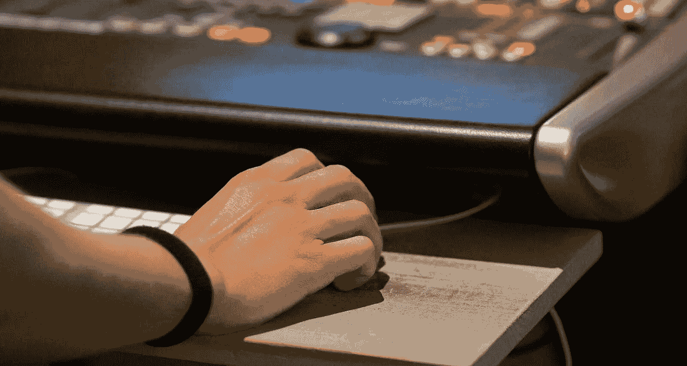

# 单声道到立体声：AI 如何为音乐注入新生命

> 原文：[`towardsdatascience.com/mono-to-stereo-how-ai-is-breathing-new-life-into-music-4180f1357db4?source=collection_archive---------4-----------------------#2024-12-24`](https://towardsdatascience.com/mono-to-stereo-how-ai-is-breathing-new-life-into-music-4180f1357db4?source=collection_archive---------4-----------------------#2024-12-24)

## AI 单声道到立体声升混的应用与技术

 [Max Hilsdorf](https://medium.com/@maxhilsdorf?source=post_page---byline--4180f1357db4--------------------------------)

·发表于[Towards Data Science](https://towardsdatascience.com/?source=post_page---byline--4180f1357db4--------------------------------) ·10 分钟阅读·2024 年 12 月 24 日

--

图片由 DALL-E 3 生成。

**单声道录音是历史的一个快照**，但它们缺乏使音乐真正充满生命力的空间感。通过人工智能，我们可以将单声道录音人工转换为立体声，甚至重新混音现有的立体声录音。本文将探讨**单声道到立体声的升混**的实际应用场景和方法。

# 物理和数字世界中的单声道与立体声

图片由[J](https://unsplash.com/@iamtheoldmanofthemountain?utm_source=medium&utm_medium=referral)提供，来源于[Unsplash](https://unsplash.com/?utm_source=medium&utm_medium=referral)

当一个乐团现场演奏时，**声波**从不同的乐器传播到房间中的各个地方，最终传到你的耳朵。这会导致时间差异（声音到达耳朵的时间）和音量差异（每只耳朵听到的声音大小）。通过这个过程，音乐表演不仅仅是和声、音色和节奏。每个乐器都传递着**空间信息**，让听众沉浸在一种“此时此刻”的体验中，吸引他们的注意力并触动他们的情感。

听听第一个片段（没有空间信息）和第二个片段（左右耳之间明显的差异）之间的区别：

*文章全程强烈推荐使用耳机，但并非绝对必要。*

**示例：单声道**

歌曲原由[Lexin Music](https://pixabay.com/music/main-title-inspiring-cinematic-asia-116200/)。适用 Pixabay 的[内容许可](https://pixabay.com/service/license-summary/)。

**示例：立体声**

这首歌最初由[Lexin Music](https://pixabay.com/music/main-title-inspiring-cinematic-asia-116200/)创作。Pixabay 的[内容许可](https://pixabay.com/service/license-summary/)适用。

正如你所听到的，通过录音传递的空间信息对我们作为听众感知的**生动性和兴奋感**有着强烈的影响。

在数字音频中，最常见的格式是**单声道**和**立体声**。单声道录音仅由一个音频信号组成，在你的耳机两侧听起来完全相同（我们称其为**通道**）。而立体声录音则由两个独立的信号组成，分别完全向左和向右通道分配。

一个由两个通道组成的立体波形示例。图片由作者提供。

现在我们已经体验到立体声如何使听觉体验更加生动和引人入胜，同时也理解了关键术语，我们可以更深入地探讨我们所关注的问题：**AI 在单声道到立体声转换中的作用**，也被称为**单声道到立体声升混**。

# 单声道到立体声升混的应用案例

AI 并不是最终目的。为了证明这种先进技术的开发和应用是合理的，我们需要**实际的应用案例**。单声道到立体声升混的两个主要应用案例是：

## 1. 将现有的单声道音乐丰富为立体声体验。

尽管立体声录音技术在 1930 年代初期就已经发明，但直到 1960 年代它才成为录音室的事实标准，并且更长时间才在普通家庭中普及。在 1950 年代末期，新的电影发行仍然同时配有立体声轨道和额外的单声道轨道，以便为那些尚未过渡到立体声系统的电影院做准备。简而言之，有**许多流行歌曲是以单声道录制的**。以下是一些示例：

+   埃尔维斯·普雷斯利：That’s All Right

+   查克·贝瑞：Johnny Be Goode

+   杜克·埃灵顿：Take the “A” Train

“Elvis Presley: That’s All Right”的官方音频，这首歌于 1954 年以单声道录音发布。

即便在今天，业余音乐人可能也会发布他们的单声道录音，要么是因为缺乏技术能力，要么仅仅是因为他们不想花时间去制作立体声混音。

单声道到立体声的转换让我们可以以全新的方式体验我们喜爱的旧录音，还能将业余录音或示范曲目带入生命。

## 2. 改进或现代化现有的立体声混音，特别是那些显得杂乱无章或已经过时的混音。

即使有立体声录音，我们仍然可能想要**改善**它。例如，许多 60 年代和 70 年代的老录音是立体声录制的，但每个乐器完全偏向一侧。听一下 The Doors 的《Soul Kitchen》，注意到低音和鼓完全偏向左边，键盘和吉他偏向右边，主唱在中央。歌曲很棒，并且有独特的美学，但这个立体声混音可能不太符合现代听众的喜好。

技术限制曾经影响了立体声的表现。此外，立体声混音不仅仅是一种工艺，它是**艺术创作的一部分**。立体声混音可以在客观上是可以接受的，但在风格上仍然可能不合时宜。一种立体声转换工具可以用来创建一个更符合特定风格偏好的替代立体声版本。

# 单声道到立体声 AI 如何工作

现在我们讨论了单声道到立体声技术的重要性，你可能会想知道**它在幕后是如何工作的**。事实证明，有多种方法可以使用 AI 来解决这个问题。接下来，我将展示四种不同的方法，**从传统信号处理到生成 AI**。这并不是一个完整的方法列表，而是过去 20 年中如何解决这个任务的一些启示。

## 传统信号处理：声音源形成

在机器学习像今天这样流行之前，**音乐信息检索（MIR）**领域曾由智能、手工制作的算法主导。难怪这种方法在单声道到立体声的上混音中也有所应用。

2007 年一篇论文（Lagrange, Martins, Tzanetakis, **[1]）**的基本思想很简单：

> 如果我们能够找到录音中的不同声音源并从信号中提取它们，我们就可以将它们重新混合在一起，以实现逼真的立体声体验。

这**听起来很简单**，但我们如何分辨信号中的声音源呢？我们如何清晰地定义它们，使得算法能够从信号中提取它们？这些问题非常难以解决，这篇论文使用了多种先进的方法来实现这一点。归根结底，这就是他们提出的算法：

1.  将录音分成短片段，并**识别每个片段中的峰值频率**（主导音符）

1.  **识别哪些峰值属于同一组**（即一个声音源），使用聚类算法

1.  决定**每个声音源应该在立体声混音中**的**位置**（手动步骤）

1.  对于每个声音源，**提取其分配的频率**从信号中

1.  **将所有提取的源混合在一起**，形成最终的立体声混音。

这是为研究构建的用户界面示例。用户浏览所有提取的源，并手动将它们放入立体声混音中，然后重新合成整个信号。图片来源于**[1]**。

尽管细节上相当复杂，但直觉是非常清晰的：**找到来源，提取它们，再将它们混合在一起。**

## 快速解决方案：源分离 / 音轨分离

自从拉格朗日 2007 年的论文以来，发生了很多变化。自 2019 年 Deezer 发布了他们的音轨分离工具[Spleeter](https://github.com/deezer/spleeter)以来，基于 AI 的源分离系统变得非常实用。领先的玩家如[Lalal.ai](https://www.lalal.ai/)或[Audioshake](https://www.audioshake.ai/instrument-stem-separation)使得快速解决方案成为可能：

1.  使用免费的或商业的音轨分离工具将单声道录音分离为各个乐器音轨

1.  将音轨加载到数字音频工作站（DAW）中，根据自己的喜好将它们混合在一起

这一技术在 2011 年的一篇研究论文中已有应用（见**[2]**），但由于**最近在音轨分离工具的改进**，它变得更加可行。

源分离方法的缺点是它们会产生**明显的声音伪影**，因为源分离本身仍然不是没有缺陷的。此外，这些方法仍然**需要人工混音**，使得它们只是半自动化的。

要实现完全自动化的单声道到立体声升混，需要使用机器学习。通过从真实的立体声混音中学习，机器学习系统可以适应真实人类制作人的混音风格。

## 基于参数化立体声的机器学习

摄影：由[Zarak Khan](https://unsplash.com/@zarakvg?utm_source=medium&utm_medium=referral)拍摄，来自[Unsplash](https://unsplash.com/?utm_source=medium&utm_medium=referral)

一种非常创新和高效的利用机器学习进行单声道到立体声升混的方法，由 Serrà及其同事在 2023 年 ISMIR 会议上提出**[3]**。这项工作基于一种名为**参数化立体声**的音乐压缩技术。立体声混音由两个音频通道组成，这使得在低带宽环境下（如音乐流媒体、广播或电话连接）集成变得困难。

参数化立体声是一种通过**关注我们大脑用来判断声音来源的空间线索**，将单声道信号转换为立体声的方法。这些线索包括：

1.  **左右耳之间的声音强度差异**（声道间强度差，IID）

1.  **它在时间或相位上左右声道的同步程度**（声道间时间或相位差）

1.  **每只耳朵中信号的相似性或差异性**（声道间相关性，IC）

利用这些参数，可以仅通过单声道信号创建类似立体声的体验。

这是研究人员开发他们的单声道到立体声升混模型时采用的方法：

1.  **收集大量的立体声音乐轨道数据集**

1.  **将立体声轨道**转换为参数化立体声（单声道 + 空间参数）

1.  **训练一个神经网络**，根据单声道录音预测空间参数

1.  为了将一个新的单声道信号转换为立体声，可以使用训练好的模型从单声道信号中**推断空间参数**，然后将这两个参数结合成一个参数化的立体声体验。

目前，似乎没有任何代码或试听演示可以用于这篇论文。作者们自己也承认，“专业立体声混音与提出的方法之间仍然存在差距”（第 6 页）。尽管如此，论文概述了一种创造性且高效的方式，使用机器学习完成完全自动化的单声道到立体声的上混合。

## 生成式 AI：基于 Transformer 的合成

Meta 的文本到音乐模型 MusicGen 中的立体声生成。图片来自作者的[另一篇文章](https://medium.com/towards-data-science/musicgen-reimagined-metas-under-the-radar-advances-in-ai-music-36c1adfd13b7)。

现在，我们将讨论看似最直接的单声道生成立体声的方法。训练一个生成模型，接受单声道输入，并直接合成两个立体声输出通道。尽管概念上简单，从技术角度来看，这是迄今为止最具挑战性的方法。1 秒钟的高分辨率音频有 44.1k 个数据点。因此，生成一首三分钟的立体声音频意味着**生成超过 1500 万个数据点**。

现在，借助卷积神经网络、变换器和神经音频编解码器等技术，任务的复杂性开始变得可控。有些论文选择通过直接的神经合成生成立体声信号（参见**[4]**、**[5]**、**[6]**）。然而，只有**[5]**训练了一个可以直接解决单声道到立体声生成的模型。我的直觉是，应该有一篇论文专门解决“简单”的单声道到立体声生成任务，并专注于 100%解决这个目标。有没有人对这个**博士课题**感兴趣？

# 接下来需要发生什么？

由[Samuel Spagl](https://unsplash.com/@saemsp?utm_source=medium&utm_medium=referral)拍摄，图片来自[Unsplash](https://unsplash.com/?utm_source=medium&utm_medium=referral)

在总结这篇文章时，我想讨论单声道到立体声上混合的研究领域可能的发展方向。最重要的是，我注意到**这一领域的研究非常稀少**，相比之下，像文本到音乐生成这样的热门话题则备受关注。我认为，研究社区应该集中精力，将单声道到立体声上混合的研究提升到一个新的水平：

## 1\. 开放可用的演示和代码

目前该研究领域发布的论文不多。这使得**许多论文没有与社区分享代码或工作成果**变得更加令人沮丧。我曾多次阅读一篇引人入胜的论文，却发现唯一能够测试该方法输出质量的方式，是完全理解论文中的每一个公式，并从头开始实现算法。

分享代码和创建公共演示从未像今天这样容易。研究人员应该将此作为优先事项，以使更广泛的音频社区能够理解、评估并欣赏他们的工作。

## 2\. 全力投入生成式 AI

传统信号处理和机器学习很有趣，但当谈到输出质量时，再也无法绕过生成式 AI 了。**文本到音乐的模型已经能生成听起来很棒的立体声混音**。为什么没有易于使用的、最先进的单声道到立体声升混库呢？

从我的研究中得知，构建一个高效且有效的模型可以通过合理的数据集大小以及对现有模型架构和训练方法进行最小至适度的修改来实现。我的印象是，这是一项**触手可及的成果**，是一个“就做吧！”的情况。

## 3\. 使升混自动化，但可控

一旦我们拥有了一个出色的开源升混模型，接下来我们需要的是可控性。我们不应该在黑盒的“要么接受，要么放弃”的神经网络生成与基于源分离的老派手动混音之间做选择。我认为我们可以兼得这两者。

一个神经网络单声道到立体声升混模型可以**在一个庞大的数据集上进行训练，然后进行微调**，以根据用户提示调整其立体声混音。这样，音乐家们可以根据个人偏好定制生成立体声的风格。

# 结论

有效且公开可访问的单声道到立体声的升混技术具有将旧录音或业余制作焕发生机的潜力，同时也让我们能够创造我们最喜爱的歌曲的替代立体声混音。

尽管已经有若干次尝试来解决这个问题，但尚未建立标准方法。通过拥抱最近的生成式 AI 发展，可以创建一代新的单声道到立体声升混模型，使得技术变得更加有效且在社区中更广泛可用。

# 关于我

我是一名音乐学家和数据科学家，分享我对 AI 和音乐当前话题的思考。以下是我与本文相关的一些前期工作：

+   **声音图像：用 AI 创造惊艳的视听艺术**

+   [**Meta 如何基于参考旋律生成音乐**](https://medium.com/towards-data-science/how-ai-can-remove-imperceptible-watermarks-6b4560ea867a)

+   [**AI 音乐源分离：它是如何工作的，为什么如此困难**](https://medium.com/towards-data-science/ai-music-source-separation-how-it-works-and-why-it-is-so-hard-187852e54752)

可以在 [Medium](https://medium.com/@maxhilsdorf) 和 [Linkedin](https://www.linkedin.com/in/max-hilsdorf/) 上找到我！

# 参考文献

**[1] M. Lagrange, L. G. Martins 和 G. Tzanetakis (2007)**：“使用声音源形成的半自动单声道到立体声升混”，见《音频工程学会会议》第 122 届。音频工程学会，2007 年。

**[2] D. Fitzgerald (2011):** “从单声道到源分离的方法”，发表于 2011 年第 17 届数字信号处理国际会议（DSP）。IEEE，2011 年，第 1-7 页。

**[3] J. Serrà, D. Scaini, S. Pascual, 等人 (2023):** “通过参数化立体声生成从单声道到立体声的转换”： [`arxiv.org/abs/2306.14647`](https://arxiv.org/abs/2306.14647)

**[4] J. Copet, F. Kreuk, I. Gat 等人 (2023):** “简单且可控的音乐生成”（2024 年 1 月 30 日修订版）。 [`arxiv.org/abs/2306.05284`](https://arxiv.org/abs/2306.05284)

**[5] Y. Zang, Y. Wang & M. Lee (2024):** “Ambisonizer: 作为球面调和函数生成的神经网络升混合”。 [`arxiv.org/pdf/2405.13428`](https://arxiv.org/pdf/2405.13428)

**[6] K.K. Parida, S. Srivastava & G. Sharma (2022):** “超越单声道到双耳声道：利用深度和跨模态注意力从单声道音频生成双耳音频”，发表于 IEEE/CVF 冬季计算机视觉应用会议（WACV），2022 年，第 3347–3356 页。 [Link](https://openaccess.thecvf.com/content/WACV2022/html/Parida_Beyond_Mono_to_Binaural_Generating_Binaural_Audio_From_Mono_Audio_WACV_2022_paper.html)
