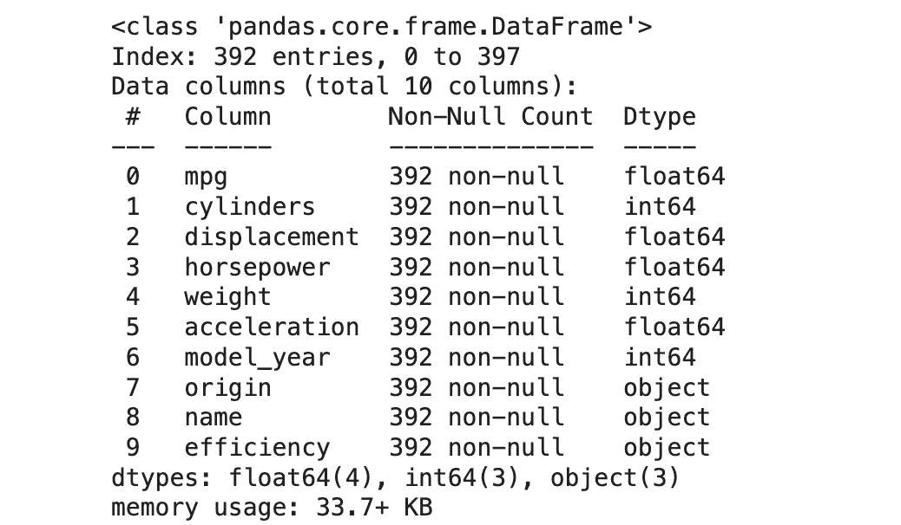
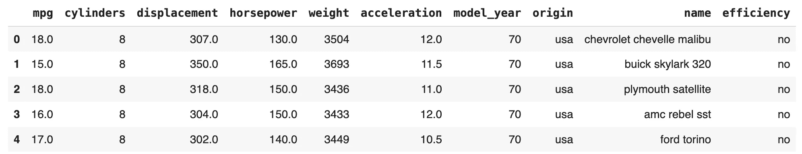
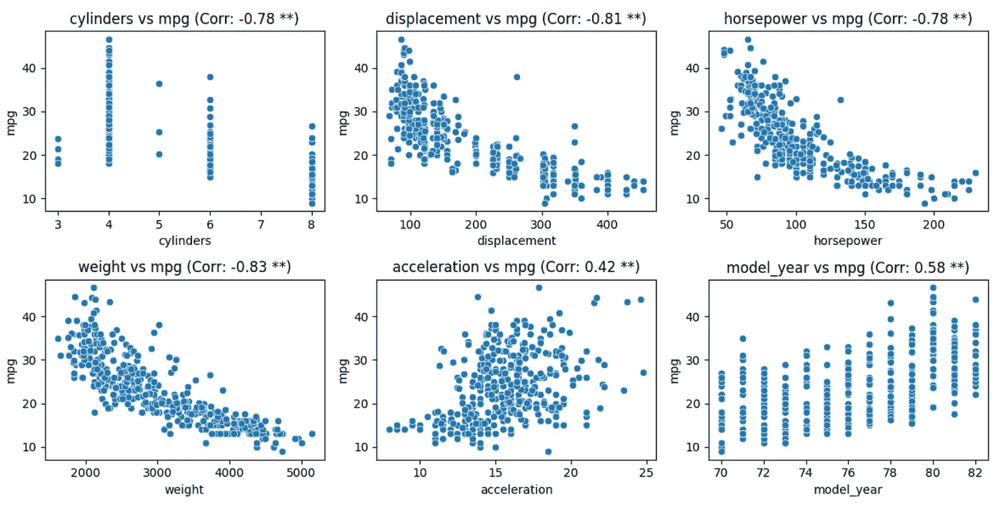
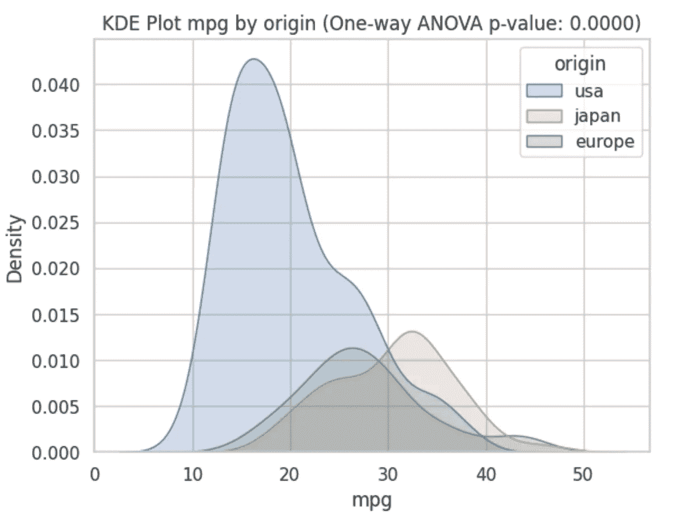
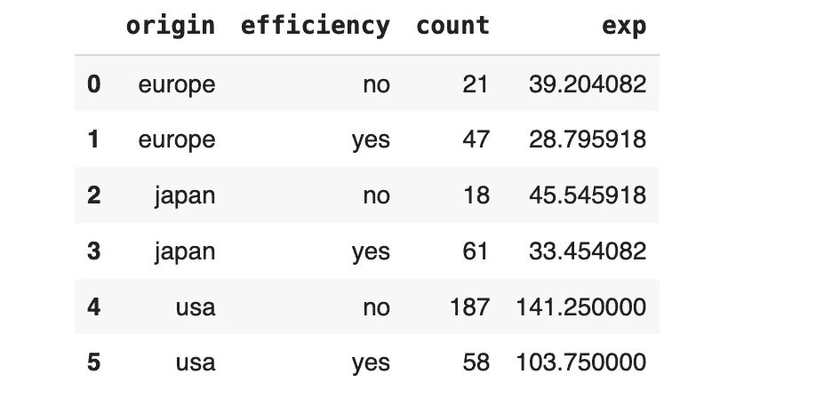
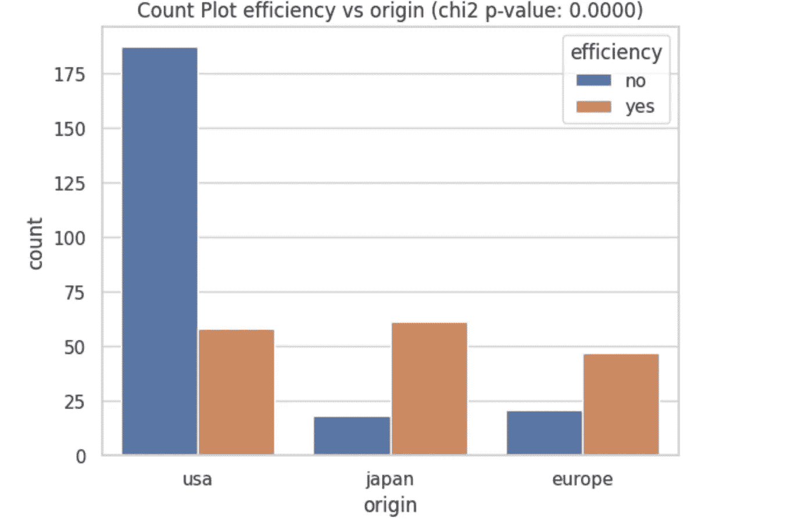

# 使用统计测试提升多变量 EDA 的稳健性

> 原文：[`towardsdatascience.com/more-robust-multivariate-eda-with-statistical-testing-d221fc145870?source=collection_archive---------5-----------------------#2024-04-16`](https://towardsdatascience.com/more-robust-multivariate-eda-with-statistical-testing-d221fc145870?source=collection_archive---------5-----------------------#2024-04-16)


图片由[Jessica Ruscello](https://unsplash.com/@jruscello?utm_source=medium&utm_medium=referral)提供，来源于[Unsplash](https://unsplash.com/?utm_source=medium&utm_medium=referral)

## 通过结合相关的假设检验方法，提升在识别变量之间关系时的稳健性

[](https://medium.com/@pararawendy19?source=post_page---byline--d221fc145870--------------------------------)[](https://towardsdatascience.com/?source=post_page---byline--d221fc145870--------------------------------) [Pararawendy Indarjo](https://medium.com/@pararawendy19?source=post_page---byline--d221fc145870--------------------------------)

·发表于[Towards Data Science](https://towardsdatascience.com/?source=post_page---byline--d221fc145870--------------------------------) ·8 分钟阅读·2024 年 4 月 16 日

--

探索性数据分析（EDA）是数据科学家的基本技能。为了强调它的重要性，我认为 EDA 比机器学习建模技能更为重要。为什么？因为 EDA 在比机器学习建模更广泛的背景下都很有用。

遇到需要熟悉的新数据？做 EDA。想从数据中获得见解？做 EDA。即使你想创建一个机器学习模型？你仍然需要进行 EDA，以准备建模数据集。

如你所知，EDA 的一个步骤是多变量分析。此练习旨在识别数据集中变量之间是否存在关系。了解这些关系（如果存在）可能让我们根据数据的高层次背景采取适当的行动。

话虽如此，我们应该意识到由噪音引起的关系。在双变量可视化中观察到的两变量之间看似有趣的关系，可能是由于噪音而非真实的有意义关系。

幸运的是，统计学为我们提供了一个工具，帮助我们确定观察到的关系是否真正有意义，还是可能仅仅由于噪音造成的。是的，我们在谈论的是统计假设检验方法。

在这篇博文中，我将讨论如何使用统计测试方法，除了标准的双变量可视化之外，来提高多变量 EDA 练习的稳健性。

本文的其余部分将按以下方式组织。

1.  数据集准备。

1.  确定数值对数值变量关系：散点图 + 相关性检验。

1.  确定数值对分类变量关系：KDE 图 + 单因素方差分析（ANOVA）。

1.  确定分类对分类变量关系：计数图 + 卡方检验。

## 数据集准备

我们将使用流行的 MPG 数据集。它是一个公开可用的数据集，具有[创作共用 4.0 许可证](https://archive.ics.uci.edu/dataset/9/auto+mpg)（允许为任何目的共享和改编数据集）。

数据集关于汽车燃油效率的细节（每加仑多少英里/MPG）及其他车辆属性。数据字典信息可以在其[UCI 机器学习库](https://archive.ics.uci.edu/dataset/9/auto+mpg)页面找到。

我们加载数据集并去除缺失值（该数据集中缺失值很少，因此去除是可以接受的）。为了演示方法，我们还从`mpg`列创建了一个新的分类列，命名为`efficiency`。当 mpg 至少为 25 时，它的值为“yes”，否则为“no”。

```py
# import libraries
import seaborn as sns
import pandas as pd

# load dataset via seaborn lib
df = sns.load_dataset("mpg")

# inspect missing values
df.isna().sum() #result: minimal, hence OK to remove

# remove missing values
df.dropna(inplace=True)

# create a new categorical column based on mpg column
df["efficiency"] = df["mpg"].apply(lambda x: "yes" if x >= 25 else "no")

# dataframe info
df.info()

# dataframe head
df.head()
```



df.info() 输出（图片来源：作者）



df.head() 输出（图片来源：作者）

关于在此数据集上进行多变量 EDA 的目标，我们自然希望了解哪些因素会影响汽车的燃油效率。为此，我们将回答以下问题：

1.  哪些数值特征会影响 mpg 表现？

1.  不同的原产地是否会导致 mpg 表现的差异？

1.  不同的原产地是否会导致汽车效率的不同表现？

## 数值对数值关系

对于多变量 EDA 的第一个案例，让我们讨论如何识别两个数值变量之间的关系。在这种情况下，众所周知，我们可以使用散点图来直观检查变量之间是否存在关系。

如前所述，并非所有观察到的模式都是有意义的。在数值对数值的情况下，我们可以通过皮尔逊相关性检验来补充散点图。首先，我们计算绘制变量的皮尔逊相关系数。其次，通过计算其 p 值来判断获得的系数是否具有显著性。

后续步骤非常重要，它们是检验某个相关系数值是否足够大以被认为是有意义的理性检查（即，绘制的变量之间存在线性关系）。在小数据量的情况下尤其如此。例如，如果我们只有 10 个数据点，相关系数必须至少为 0.64 才能被认为是显著的（[参考](https://openstax.org/books/introductory-business-statistics-2e/pages/13-2-testing-the-significance-of-the-correlation-coefficient)）！

在 Python 中，我们可以使用`scipy`库中的`pearsonr`函数来进行上述的相关性检验。

在以下代码中，我们绘制了每一对数值特征-mpg 列的散点图。作为标题，我们打印相关系数，并且如果系数显著（p 值 < 0.05），则加上条件双星号。

```py
import seaborn as sns
import matplotlib.pyplot as plt
from scipy.stats import pearsonr

# prepare variables to inspect
numeric_features = ['cylinders','displacement','horsepower',
                    'weight','acceleration','model_year']
target = 'mpg'

# Create a figure and axis
fig, axes = plt.subplots(nrows=2, ncols=3, figsize=(12, 6))

# Loop through the numerical columns and plot each scatter plot
for i, col in enumerate(numeric_features):
    # Calculate Pearson correlation coefficient
    corr_coeff, p_val = pearsonr(df[col],df[target])

    # Scatter plot using seaborn
    sns.scatterplot(data=df, x=col, y=target, ax=axes[i//3, i%3])

    # Set title with Pearson correlation coefficient
    # Print ** after the correlation if the correlation coefficient is significant
    axes[i//3, i%3].set_title(f'{col} vs {target} (Corr: {corr_coeff:.2f} {"**" if p_val < 0.05 else ""})')

plt.tight_layout()
plt.show()
```



数值特征与 mpg（图片来源：作者）

注意到所有的图表标题中都包含了双星号，表示相关性是显著的。因此，我们可以得出以下结论：

1.  气缸数、排量、马力和重量与 mpg 有强烈的负相关。这意味着这些变量的较高值对应较低的燃油效率。

1.  加速和车型年份与 mpg（每加仑英里数）有中等程度的正相关。这意味着较长的加速时间（较慢的汽车）和更新生产的汽车与更高的燃油效率相关。

## 数值与类别关系

接下来，我们将研究 mpg 配置文件是否因原产地而异。请注意，原产地是一个类别变量。因此，我们正在考虑数值与类别之间的关系。

KDE（核密度估计）图，也称为平滑版的直方图，可以用来可视化 mpg 分布，并按原产地值进行分类。

就统计检验而言，我们可以使用单因素方差分析（ANOVA）。我们要检验的假设是，不同汽车原产地之间的 mpg 平均值是否存在显著差异。

在 Python 中，我们可以使用 `scipy` 库中的 `f_oneway` 函数来执行单因素方差分析。

在以下代码中，我们创建了一个按不同原产地值分类的 mpg KDE 图。接下来，我们运行单因素方差分析（ANOVA）并在标题中显示 p 值。

```py
import seaborn as sns
import matplotlib.pyplot as plt
from scipy.stats import f_oneway

# Create a KDE plot with hue
sns.set(style="whitegrid")
ax = sns.kdeplot(data=df, x="mpg", hue="origin", fill=True)

# Calculate one-way ANOVA p-value
p_value = f_oneway(*[df[df['origin'] == cat]['mpg'] for cat in df['origin'].unique()])[1]

# Set title with one-way ANOVA p-value
ax.set_title(f'KDE Plot mpg by origin (One-way ANOVA p-value: {p_value:.4f})')

plt.show()
```



按原产地分类的 MPG 的 KDE 图（图片来源：作者）

上述图中的 p 值小于 0.05，表示具有显著性。从高层次来看，我们可以这样解释图表：**通常情况下，美国制造的汽车比其他地方制造的汽车燃油效率低**（这是因为与其他原产地相比，美国 mpg 分布的峰值位于左侧）。

## 类别与类别关系

最后，我们将评估一种情况，即我们有两个类别变量。考虑到我们的数据集，我们将看看不同的原产地是否会产生不同的汽车效率模型。

在这种情况下，带分类的计数图是适当的双变量可视化方法。我们将展示按效率标记（是/否）分类的每个原产地的汽车频率。

就统计检验方法而言，卡方检验是适合的选择。使用此检验，我们希望验证不同汽车原产地是否具有不同的高效与低效汽车分布。

在 Python 中，我们可以使用 `scipy` 库中的 `chisquare` 函数。然而，与之前的情况不同，我们必须首先准备数据。具体来说，我们需要计算每个原始-效率值组合的“预期频率”。

对于那些希望更深入了解期望频率概念和卡方检验整体机制的读者，我推荐阅读我关于这个主题的博客，博客链接如下。

[](https://medium.com/bukalapak-data/meet-the-engine-of-a-b-testing-chi-square-test-30e8a8ab44c5?source=post_page-----d221fc145870--------------------------------) [## 了解 A/B 测试引擎：卡方检验

### 理解这个概念并从零开始进行操作

medium.com](https://medium.com/bukalapak-data/meet-the-engine-of-a-b-testing-chi-square-test-30e8a8ab44c5?source=post_page-----d221fc145870--------------------------------)

执行上述数据准备的代码如下所示。

```py
# create frequency table of each origin-efficient pair
chi_df = (
    df[['origin','efficiency']]
    .value_counts()
    .reset_index()
    .sort_values(['origin','efficiency'], ignore_index=True)
)

# calculate expected frequency for each pair
n = chi_df['count'].sum()

exp = []
for i in range(len(chi_df)):
  sum_row = chi_df.loc[chi_df['origin']==chi_df['origin'][i],'count'].sum()
  sum_col = chi_df.loc[chi_df['efficiency']==chi_df['efficiency'][i],'count'].sum()
  e = sum_row * sum_col / n
  exp.append(e)

chi_df['exp'] = exp
chi_df
```



chi_df 结果（图由作者提供）

最后，我们可以执行下面的代码来绘制按效率标志划分的汽车来源计数图。此外，我们使用`chi_df`来执行卡方检验并获取 p 值。

```py
import seaborn as sns
import matplotlib.pyplot as plt
from scipy.stats import chisquare

# Create a count plot with hue
sns.set(style="whitegrid")
ax = sns.countplot(data=df, x="origin", hue="efficiency", fill=True)

# Calculate chi-square p-value
p_value = chisquare(chi_df['count'], chi_df['exp'])[1]

# Set title with chi-square p-value
ax.set_title(f'Count Plot efficiency vs origin (chi2 p-value: {p_value:.4f})')

plt.show()
```



效率与来源的计数图（图由作者提供）

该图表显示了不同来源的高效汽车在分布上存在差异（p 值 < 0.05）。我们可以看到，**美国汽车大多效率低下，而日本和欧洲汽车则呈现相反的模式**。

# 摘要

在这篇博客文章中，我们学习了如何通过适当的统计检验方法改进双变量可视化。这将通过筛选掉基于仅凭视觉检查双变量图表所能看到的噪声引起的关系，从而提高我们多变量 EDA 的稳健性。

我希望这篇文章能在你下一次 EDA 练习中有所帮助！总之，感谢阅读，欢迎在[LinkedIn](https://www.linkedin.com/in/pararawendy-indarjo/)与我联系！👋
