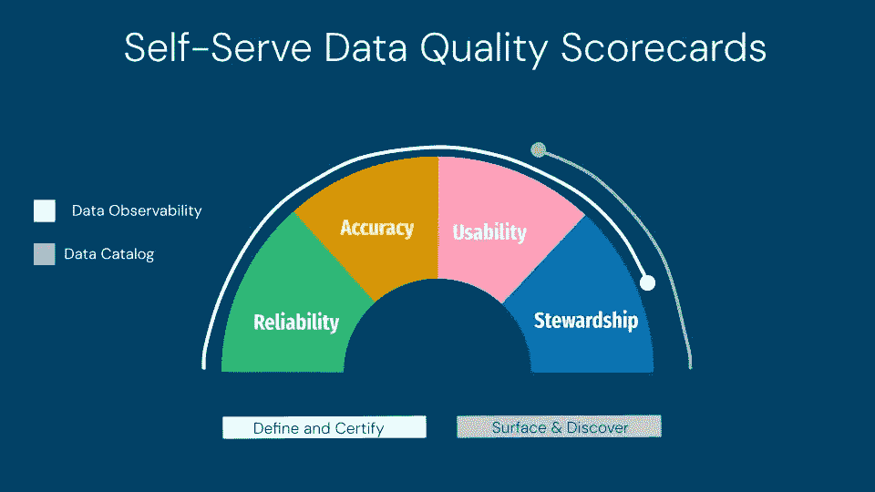
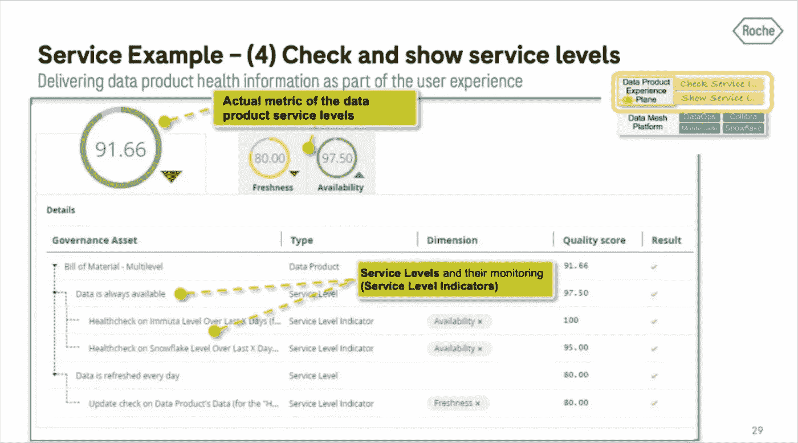

# 大多数数据质量项目在启动之前就已经失败。原因如下。

> 原文：[`towardsdatascience.com/most-data-quality-initiatives-fail-before-they-start-heres-why-e66123b7bb3b?source=collection_archive---------6-----------------------#2024-07-23`](https://towardsdatascience.com/most-data-quality-initiatives-fail-before-they-start-heres-why-e66123b7bb3b?source=collection_archive---------6-----------------------#2024-07-23)

## 展示你的数据质量评分卡，我可以告诉你一年前是否能成功。

 [Barr Moses](https://barrmoses.medium.com/?source=post_page---byline--e66123b7bb3b--------------------------------)

·发布于 [Towards Data Science](https://towardsdatascience.com/?source=post_page---byline--e66123b7bb3b--------------------------------) ·阅读时间 7 分钟·2024 年 7 月 23 日

--

图片由 [Braden Collum](https://unsplash.com/@bradencollum?utm_source=medium&utm_medium=referral) 提供，来源于 [Unsplash](https://unsplash.com/?utm_source=medium&utm_medium=referral)

每天我都在与那些准备投入大量时间和资源，但注定失败的数据质量项目的组织进行对话。

提供激励措施和关键绩效指标（KPIs）能够驱动良好的行为这一点并不新鲜。销售补偿计划的审查如此严格，以至于它们经常成为董事会会议的议题。如果我们也能对数据质量评分卡给予同样的关注，结果会怎样呢？

即使是在全盛时期，传统的数据质量评分卡——比如 Hadoop 时代的评分卡——也很少获得完全成功。我知道这一点，因为在创办 Monte Carlo 之前，我曾在运营副总裁的岗位上工作多年，致力于创建能推动信任和采纳的数据质量标准。

在过去的几年里，云计算和元数据管理的进展使得组织海量数据变得可能。

数据工程过程正开始向更加成熟、严格的工程学科标准发展。当然，人工智能有潜力简化这一切。

尽管这个问题可能永远无法完全解决，但我看到一些组织采取了最佳实践，这些实践成为了推动项目成功与另一轮启动会议之间的分水岭。

这是构建数据质量评分卡的 4 个关键教训：

+   知道哪些数据重要

+   衡量机器

+   正确地运用奖励与惩罚

+   自动化评估与发现

# 知道哪些数据是重要的

任何与数据相关的计划最容易失败的方式就是假设所有数据的价值是相等的。而确定哪些数据重要的最佳方法就是与业务方沟通。

Red Ventures 的 Brendon Beidel [阐明了一个好的起点](https://www.montecarlodata.com/blog-one-sla-at-a-time-our-data-quality-journey-at-red-digital/)：

“我会问：

+   你如何使用这个表格？

+   你什么时候查看这些数据？你什么时候报告这些数据？这些数据是否需要实时更新，按小时、每日更新？

+   这有什么意义？

+   如果这些数据延迟了，谁需要被通知？”

如果你在一个庞大的组织中工作，且员工遍布全球，可能这比说起来容易做起来难。

在这些情况下，我的建议是**从你最关键的业务数据单元开始**（如果你不知道这些，我帮不上忙！）。开始讨论需求和优先事项。

记住：**先验证概念，再扩展**。你会惊讶于有多少人反其道而行。

# 衡量机器

这种努力的一大挑战，简而言之，就是**数据质量抵制标准化**。质量是，并且应该是，依赖于使用场景的。

[数据质量的六个维度](https://www.dataversity.net/data-quality-dimensions/)是任何数据质量评分卡中的关键部分，也是一个重要的起点，但对许多团队而言，这只是开始——每个数据产品都是不同的。

例如，财务报告可能需要非常准确，并在时效性上有一定的宽容度，而机器学习模型则可能完全相反。

从实施角度来看，这意味着**衡量数据质量通常是极度分散的**。数据质量是按表格逐一衡量的，不同的分析师或数据管理员使用完全不同的数据质量规则，并赋予不同的权重。

这在某种程度上是有道理的，但很多东西在翻译过程中丢失了。

数据是多用途的，并在不同的使用场景中共享。不仅一个人的“黄色”质量评分是另一个人的“绿色”，而且数据消费者通常也很难理解“黄色”评分意味着什么，或者它是如何被评定的。他们也经常忽略由红色数据表提供数据给绿色数据表的影响（你懂的，垃圾进，垃圾出……）。

“黄色”评分卡的意义是什么？照片由 [Keiron Crasktellanos](https://unsplash.com/@crasktellanos?utm_source=medium&utm_medium=referral) 提供，来自 [Unsplash](https://unsplash.com/?utm_source=medium&utm_medium=referral)

显示违反规则的数量当然很重要，但你还需要：

+   尽可能将其放在上下文中，

+   拥有一个聚合的端到端数据产品视图，

+   投资一些强大的无代码数据分析工具，并

+   **意识到这还不够。**

那么，你还需要什么？**你需要衡量机器。**

换句话说，数据生产和交付中通常导致高质量的组成部分。这些部分更容易标准化，也更容易跨业务单元和团队理解。

[Airbnb Midas](https://medium.com/airbnb-engineering/data-quality-score-the-next-chapter-of-data-quality-at-airbnb-851dccda19c3)是一个知名的内部数据质量评分和认证项目，这也理所当然。他们在这个概念上投入了大量精力。**他们衡量数据准确性，但可靠性、管理和可用性实际上占总评分的 60%。**

许多数据团队仍在制定自己标准的过程中，但我们发现与数据健康高度相关的组成部分包括：

+   **前面提到的六个数据质量维度**（有效性、完整性、一致性、及时性、唯一性、准确性）。

## **可用性与管理**

+   **文档**：对于数据资产、其用途以及过去的事件，具有一定程度的语义含义。一家在线旅游搜索公司会根据数据资产如何及在哪里被编目，以及其元数据的完整性，在其六个类别中的两个类别上进行评分。

+   **血统**：在系统间能够追踪到数据在字段级别的来源。

+   **使用情况**：表格接收到的查询次数以及具有下游依赖关系的数据产品数量。这可以是一个“关键资产评分”，并具有飞轮效应。你将可靠性工作重点放在最常用的部分，而人们会信任那些流行的部分。

## **系统可靠性**

+   **监控**：通常，如果一个数据产品不仅在最后一公里的表格上有强大的覆盖范围，而且在上游也有覆盖，这表明它是一个经过精心策划的资产。

+   **新鲜度**：数据的新鲜度要求会根据数据产品类型有所不同，但这是一个表格级别的指标，可以识别并揭示偏离常规的情况。许多组织，如 [罗氏诊断](https://www.montecarlodata.com/blog-how-roche-uses-dataops-to-build-data-products-and-data-mesh/)，会为其数据产品设定特定的新鲜度服务水平协议（SLA）并衡量遵守的程度。

+   **数据量**：表格接收到的相对稳定的行数通常是数据管道和数据交付系统运作良好的标志。

+   **架构**：至少你希望消费者能够看到架构变更。对于最关键的管道，你理想的做法是有一定程度的[架构执行或数据契约](https://www.montecarlodata.com/blog-data-contracts-explained/)，这样你就能知道当源数据发生变化时，是否会破坏下游的资产。

## **操作响应：**

+   **所有权**：一个资产是否有所有者？如果有技术和业务所有者，则更为加分。

+   **通知渠道与沟通：** 数据交付是一个复杂的过程，涉及从数据采集到汇总再到消费的多个交接过程。在此基础上，理想情况下，你会有多个团队使用同一数据资产（否则你的数据网格更像是一个孤岛）。在这种环境中，拥有一个中心化的沟通渠道来突出和讨论变更和事件，是确保可靠数据产品的唯一方式。

+   **平均修复时间：** 可以说，衡量数据集可信度最重要的指标是支持团队回应并修复出现的事件的速度。坏数据是不可避免的，优秀的事件响应是有意为之的。

# 把你的胡萝卜和棒子调整好

激励生产者和消费者提供高质量数据。照片由[Jonathan Pielmayer](https://unsplash.com/@jonathanpielmayer?utm_source=medium&utm_medium=referral)拍摄，图片来源于[Unsplash](https://unsplash.com/?utm_source=medium&utm_medium=referral)

“耶，又一套我们必须遵守的流程！”… 这句话从来没有人说过。

记住，衡量数据健康的目的是为了衡量数据健康，而不是单纯地为了数据健康本身。如[Clark 在 Airbnb 所说](https://www.youtube.com/watch?v=Lv-bFDSzrqw)，目的是“推动对生产和使用高质量数据的偏好”。

我看到的最佳实践是在数据入驻平台时，设置一套最低要求（棒）和在每个级别认证时设置更严格的要求（胡萝卜）。

认证起到激励作用，因为生产者确实希望消费者使用他们的数据，而消费者会迅速识别并对高可靠性的数据产生偏好。

# 自动化评估与发现

数据管理中几乎没有什么能在没有一定程度的自动化和自助服务能力的情况下成功。Airbnb 丢弃了任何 1) 无法立即理解的评分标准，和 2) 无法自动衡量的评分标准。

你的组织也必须做到这一点。即使这是史上最好的评分标准，如果你没有一套能够自动收集和展示数据的解决方案，那它就必须被丢进垃圾桶。

图片由作者提供。

我看到的最常见方式是通过[data observability and quality solutions，和数据目录](https://www.thoughtworks.com/en-us/insights/blog/data-strategy/building-an-amazon-com-for-your-data-products)。例如，罗氏就是这样做的，并且在创建、发布和治理可信数据产品时，增加了访问管理。

[来源](https://www.montecarlodata.com/blog-how-roche-uses-dataops-to-build-data-products-and-data-mesh/)。

当然，也可以通过手动将多个数据系统中的元数据拼接成一个自制的发现门户来完成这项工作，但一定要注意维护开销。

# 量化的事物得以管理

数据团队已在现代数据和人工智能平台上进行了大量投资。但为了最大化这一投资，组织——无论是数据生产者还是消费者——必须完全采纳并信任所提供的数据。

归根结底，什么被衡量，什么就能被管理。这不正是最重要的吗？
