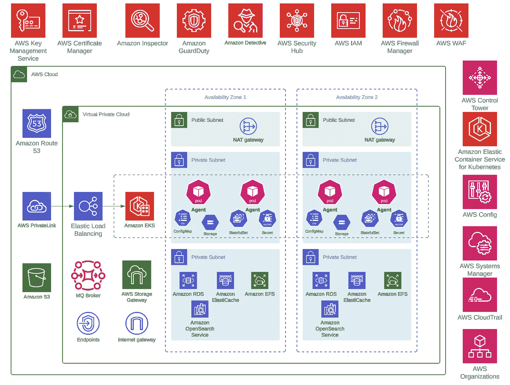
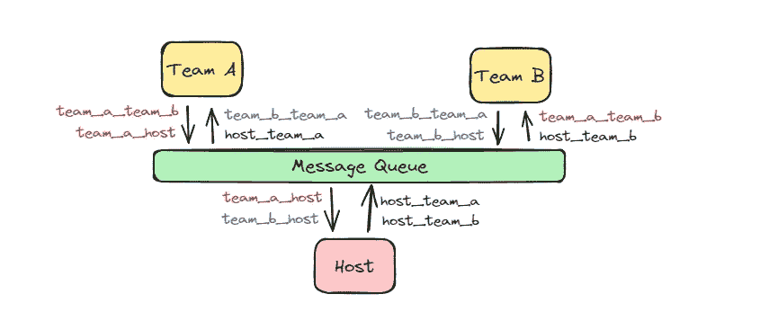

# 多代理即服务——一位资深工程师的概述

> 原文：[`towardsdatascience.com/multi-agent-as-a-service-a-senior-engineers-overview-fc759f5bbcfa?source=collection_archive---------1-----------------------#2024-08-14`](https://towardsdatascience.com/multi-agent-as-a-service-a-senior-engineers-overview-fc759f5bbcfa?source=collection_archive---------1-----------------------#2024-08-14)

[](https://medium.com/@samanrj?source=post_page---byline--fc759f5bbcfa--------------------------------)[](https://towardsdatascience.com/?source=post_page---byline--fc759f5bbcfa--------------------------------) [Saman (Sam) Rajaei](https://medium.com/@samanrj?source=post_page---byline--fc759f5bbcfa--------------------------------)

·发布于 [Towards Data Science](https://towardsdatascience.com/?source=post_page---byline--fc759f5bbcfa--------------------------------) ·8 分钟阅读·2024 年 8 月 14 日

--

有关 [AI 代理](https://www.deeplearning.ai/the-batch/issue-245/) 的讨论很多——[这些关键的自包含单元能够根据特定指令和上下文理解自主执行任务](https://medium.com/binome/designing-llm-based-agents-key-principles-part-1-7e8c6fe3ddaf)。事实上，这个话题的讨论几乎已经和 LLM 一样广泛。在本文中，我将探讨 AI 代理，尤其是从负责在生产系统中处理 AI 代理的首席工程师、架构师和站点可靠性工程师（SRE）的角度，探讨 *多代理即服务* 的概念。

## 上下文：AI 代理能解决哪些问题？

AI 代理擅长处理那些有利于人性化交互的任务：

1.  **电子商务：** 基于 LLM 的 RAG 或 Text-to-SQL 等技术驱动的代理，根据公司政策回应用户查询，提供准确的答案，从而创造出更加个性化的购物体验和客户旅程，革命性地改变电子商务。

1.  **客户服务：** 这是另一个理想的应用场景。我们中的许多人都经历过为了简单的查询（如订单状态更新）而长时间等待与客服代表沟通的情况。一些初创公司——例如 [Decagon](https://decagon.ai/)——正在通过 AI 代理在解决这些低效问题方面取得进展。

1.  **个性化产品和内容创作：** 这一点的一个典型例子是 [Wix](https://www.wix.com/)——对于低代码或无代码的网站建设，Wix 开发了一款聊天机器人，通过互动问答环节，根据客户的描述和需求为其创建初步网站**。**

> [“人类设定目标，但 AI 代理独立选择执行这些目标所需的最佳行动。”](https://aws.amazon.com/what-is/ai-agents/)

总体来说，基于 LLM 的代理在模拟自然人类对话和简单业务工作流方面表现出色，通常能够产生既有效又令人印象深刻的结果。

## 工程师的视角：AI 代理与企业生产环境

考虑到上述提到的好处，你是否曾经想过 AI 代理在企业生产环境中的运作方式？哪些架构模式和基础设施组件最能支持它们？当问题不可避免地发生，代理出现[幻觉](https://www.ibm.com/topics/ai-hallucinations)、崩溃或（或许更糟糕的是）在执行关键任务时进行错误推理/规划时，我们该怎么办？

作为高级工程师，我们需要仔细考虑上述内容。此外，我们还必须问一个更重要的问题：*我们如何定义一个多代理平台成功部署的标准是什么？*

为了回答这个问题，让我们借用另一个软件工程领域的概念：来自可靠性工程的服务级目标（SLOs）。SLOs 是衡量服务性能和可靠性的关键组成部分。简单来说，SLOs 定义了“成功”测量与“所有”测量之间的可接受比例，并评估它们对用户旅程的影响。这些目标帮助我们确定代理及其所支持的更广泛工作流所需和预期的服务水平。

那么，SLOs 与我们的 AI 代理讨论有何关系？

以简化的视角来看，让我们考虑两个重要的目标——“可用性”和“准确性”——针对代理，并识别出一些更细化的 SLOs，它们有助于实现这些目标：

1.  **可用性：** 这指的是代理或平台接收到的请求中，*部分*成功响应（例如 HTTP 200 状态码）的比例。从历史上看，底层服务器的正常运行时间和 ping 成功率（即时间性度量）是可用性的关键相关指标。但随着微服务的兴起，名义上的正常运行时间变得不那么重要。现代系统更关注用户请求的成功响应与失败响应的数量，以此作为更准确的可用性代理。其他相关指标可以被认为是[**延迟**](https://sre.google/workbook/implementing-slos/#:~:text=A%20latency%20SLO%20can%20capture,for%20different%20types%20of%20services.) 和 **吞吐量**。

1.  **准确性：** 另一方面，准确性不仅仅是代理返回客户端响应的速度和一致性，更重要的是它们在没有人工验证的情况下，能从业务角度上多么*正确*地执行任务并返回数据。传统系统也会跟踪类似的 SLOs，如数据的正确性和质量。

上述两个目标的衡量通常通过在运行时提交内部应用程序指标来进行，这些指标可以是在设定的时间间隔内提交（例如每 10 分钟），或响应事件（用户请求、上游调用等）。例如，[合成](https://www.dynatrace.com/news/blog/what-is-synthetic-testing/)探测可以用于模拟用户请求、触发相关事件并监控相关数据。这里需要探索的**关键** **思想**是：传统系统在很大程度上是确定性的，因此通常更容易对其进行仪表化、探测和评估。另一方面，在我们这个美丽而非确定性的生成 AI 代理世界中，情况未必如此。

*注意：本文的重点更多放在我们两个目标中的前者 ——* ***可用性***。这包括确定接受标准，以设置基准的云/环境稳定性，帮助代理响应用户查询。要深入了解* ***准确性***（即为代理定义合理的任务范围，优化少量样本方法的性能和评估框架），* [*这篇博客文章*](https://blog.langchain.dev/planning-for-agents/) *是一个很好的入门文章。*

[](https://blog.langchain.dev/planning-for-agents/?source=post_page-----fc759f5bbcfa--------------------------------) [## 规划代理

### 我们的“循环系列”中的第四期，讨论了规划对于一个代理意味着什么，以及如何……

blog.langchain.dev](https://blog.langchain.dev/planning-for-agents/?source=post_page-----fc759f5bbcfa--------------------------------)

现在，回到工程师在部署代理时需要做对的事情，以确保基础设施的准备情况。为了实现我们的目标服务水平目标（SLO）并提供可靠且安全的平台，资深工程师始终考虑以下几个因素：

1.  **可扩展性**：当请求数量增加（有时是突然增加时），系统能否有效处理？

1.  **成本效益**：大型语言模型（LLM）的使用成本较高，那么我们如何监控和控制成本呢？

1.  **高可用性**：我们如何保持系统始终可用并响应客户？代理是否能够自我修复并从错误/崩溃中恢复？

1.  **安全性**：我们如何确保数据在存储和传输过程中是安全的，如何进行安全审计、漏洞评估等？

1.  **合规与监管**：这是 AI 的一个重要话题，我们必须遵守哪些相关的数据隐私法规和其他行业特定标准？

1.  **可观测性**：我们如何获得 AI 代理活动、健康状况和资源利用率的实时可见性，以便在问题影响用户体验之前识别和解决它们？

听起来很熟悉吗？这些与现代 web 应用程序、微服务模式和云基础设施所要解决的挑战类似。

那么，接下来呢？我们提出一个 AI 智能体开发和维护框架，遵循多年来在多个工程和软件领域发展出的最佳实践。

## 多智能体即服务（MAaaS）

这一次，让我们借鉴一些 [基于云的应用最佳实践](https://learn.microsoft.com/en-us/azure/architecture/best-practices/index-best-practices)，重新定义智能体在生产系统中的设计方式：

+   **清晰的边界上下文：** 每个智能体应具有明确定义的小范围职责，并明确功能边界。这种模块化方法确保了智能体更加精准，便于管理，并能够独立扩展。

+   **RESTful 和异步服务间通信：** 使用 RESTful API 在用户和智能体之间进行通信，并利用消息代理进行异步通信。这种方式解耦了智能体，提升了可扩展性和容错性。

+   **每个智能体的独立数据存储：** 每个智能体应拥有自己的数据存储，以确保数据封装并减少依赖。在必要时，利用分布式数据存储解决方案来支持可扩展性。

+   **容器化与编排：** 使用容器（例如 Docker）来包装和部署智能体，使其在不同环境中保持一致，简化部署和扩展。采用容器编排平台（如 Kubernetes）来管理智能体服务的部署、扩展和运营生命周期。

+   **测试和 CI/CD：** 实施自动化测试（单元测试、集成测试、契约测试和端到端测试），确保智能体的可靠变更管理。使用 CI 工具，在代码更改提交时自动构建和测试智能体。建立 CD 流水线，实现无缝的生产环境变更部署，减少停机时间并确保快速迭代周期。

+   **可观察性：** 实施强大的可观察性工具，如度量、追踪和日志记录，监控智能体及其支持基础设施，以实时展示平台的可靠性（追踪尤其重要，如果某个用户请求经过多个智能体）。计算并跟踪智能体的服务水平目标（SLO）和错误预算，以及聚合的请求流。通过合成探测和高效的警报机制，在智能体健康问题对最终用户造成广泛影响之前，及时发现警告和故障。

通过应用这些原则，我们可以为 AI 智能体创建一个稳健的框架，将这一概念转变为“多智能体即服务”（MAaaS）。这种方法借鉴了基于云的应用最佳实践，重新定义了智能体的设计、部署和管理方式。



图片来源：作者

智能体在业务操作中扮演着至关重要的角色；然而，它并非孤立运行。强大的基础设施支持着它，确保其满足生产期望，关键组件包括：

+   **面向服务的架构：** 将代理设计为可以轻松集成到现有系统中的服务。

+   **API 网关：** 使用 API 网关管理和保护客户端与代理之间的流量。

+   **弹性基础设施：** 利用能够根据需求弹性扩展或缩减资源的云基础设施。

+   **托管服务：** 利用托管服务来管理数据库、向量存储、消息传递和机器学习，减少运营负担。

+   **集中监控：** 使用集中监控解决方案（例如 CloudWatch、Prometheus、Grafana）来跟踪代理的健康状况和性能。

为了突出这一点，我们将演示一个简单的多代理系统：一个辩论平台。

## 示例：多代理辩论系统

我们设计了一个多代理辩论系统来展示 MAaaS 的实际应用。辩论的主题是*AI 对就业市场的影响*。设置中有三个代理：

+   队伍 A，支持 AI 对工作的益处

+   队伍 B，持反对意见

+   主持人管理辩论，在八轮之后或当讨论变得冗余时结束辩论。

专注于系统架构，我们使用[PhiData](https://www.phidata.com/)创建代理，并通过 AWS 弹性 Kubernetes 服务（EKS）进行部署，以确保高可用性。代理活动通过 AWS CloudWatch 进行监控，EKS 的服务发现确保代理之间无缝通信。重要的是，对话历史存储在数据库中，这样任何备份代理在发生故障时都可以不中断地继续对话。这种弹性通过消息队列得到增强，消息队列确保在完全消费消息之前不会处理它们，从而确保数据完整性。为了保持对话流畅，每个代理目前仅限于一个副本，尽管 Kubernetes 会确保在 Pod 宕机时始终保持所需的状态。



作者提供的图片

为了让用户能够在本地尝试系统，我们创建了一个 MiniKube 部署 YAML 文件。在这个简化版本中，我们去掉了 postgres 数据库。相反，每个代理将临时将其对话历史存储在内存中。这个调整使系统更加轻量化，并且便于本地部署，同时仍展示了核心功能。你需要先在系统上安装[MiniKube](https://minikube.sigs.k8s.io/docs/start/?arch=%2Fmacos%2Farm64%2Fstable%2Fbinary+download)、[Ollama](https://ollama.com/download)和[kubectl](https://kubernetes.io/docs/tasks/tools/#kubectl)。

将上述内容保存为名为`deploy.yml`的文件，然后运行：

```py
$ minikube start
$ ollama run llama3
$ kubectl apply -f deploy.yml
```

启动辩论（MiniKube 在基于 Linux 的系统与 Windows 系统上表现略有不同）：

```py
$ kubectl get pods
$ kubectl exec <host-pod-name> -- curl -X GET 'http://localhost:8080/agent/start_debate'
```

获取辩论历史：

```py
$ kubectl exec <host-pod-name> -- curl -X GET 'http://localhost:8080/agent/chat-history'
```

拆除资源：

```py
$ kubectl delete -f .\minikube-deploy.yml
```

代理们展开了精彩的辩论（请参见下面附录中的辩论输出）。

## 结论

对多智能体系统的兴趣为创新和效率开辟了诸多可能性。通过利用云原生原则和最佳实践，我们可以创建可扩展、具有成本效益、安全且高度可用的多智能体系统。MAaaS 范式不仅与现代软件工程原则一致，而且为更复杂且适合生产的 AI 应用铺平了道路。在我们继续探索和完善这些概念的过程中，多智能体系统在各个行业中变革的潜力变得越来越有前景。

*注意：本文由* [*Sam Rajaei*](https://www.linkedin.com/in/saman-rajaei-24315087/) *和* [*Guanyi Li*](https://www.linkedin.com/in/guanyi-li-91662016/)* 合作撰写。*

## 附录：辩论输出

感谢您的关注，下次再见！
