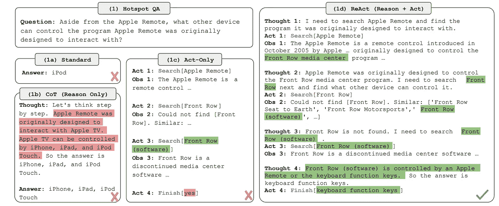
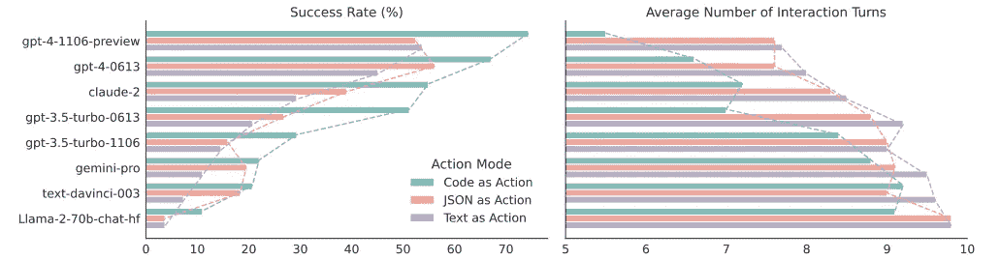
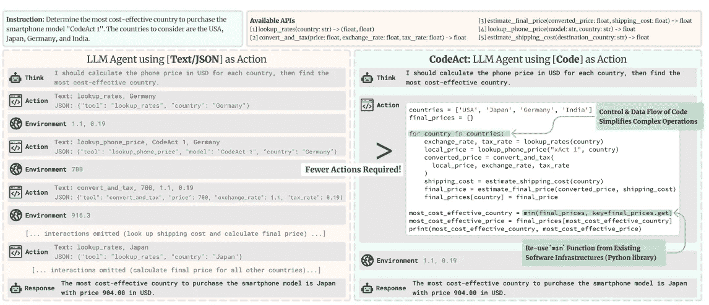
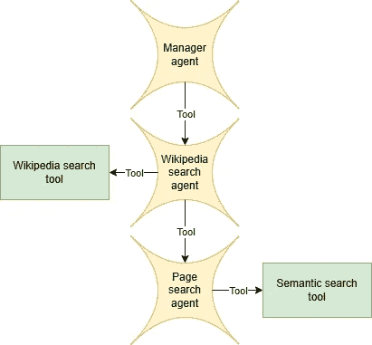

# 使用 Hugging Face 代码代理的多代理 RAG 系统

> 原文：[`towardsdatascience.com/multi-agentic-rag-with-hugging-face-code-agents-005822122930?source=collection_archive---------0-----------------------#2024-12-31`](https://towardsdatascience.com/multi-agentic-rag-with-hugging-face-code-agents-005822122930?source=collection_archive---------0-----------------------#2024-12-31)

## 使用 *Qwen2.5–7B-Instruct* 驱动的代码代理创建一个本地的、开源的多代理 RAG 系统

[](https://medium.com/@gabrielesgroi94?source=post_page---byline--005822122930--------------------------------)[](https://towardsdatascience.com/?source=post_page---byline--005822122930--------------------------------) [Gabriele Sgroi, 博士](https://medium.com/@gabrielesgroi94?source=post_page---byline--005822122930--------------------------------)

·发表于 [Towards Data Science](https://towardsdatascience.com/?source=post_page---byline--005822122930--------------------------------) ·阅读时长：61 分钟 ·4 天前

--


图片来自 [Jaredd Craig](https://unsplash.com/@jaredd?utm_source=medium&utm_medium=referral) 在 [Unsplash](https://unsplash.com/?utm_source=medium&utm_medium=referral) 上

大语言模型（LLM）展示了令人印象深刻的能力，并且随着每一代新模型的发布，它们仍在持续改进。像聊天机器人和摘要生成等应用可以直接利用 LLM 的语言能力，因为它们只需要生成文本输出，这是它们的自然环境。大语言模型还展示了理解和解决复杂任务的强大能力，但只要它们的解决方案停留在“纸面上”，即仅仅是纯文本形式，它们就需要外部用户代表它们采取行动，并反馈建议动作的结果。代理系统通过让模型在其环境中进行操作来解决这个问题，通常通过一组可以执行特定操作的工具。通过这种方式，LLM 可以通过反复试验与环境互动，逐步找到解决方案。

一种有趣的情况是，当一个大语言模型（LLM）代理可以访问的工具本身就是代理时：这就是多代理系统的核心概念。多代理系统通过将任务分配并委托给专门的模型，并像拼图一样将它们的输出组合在一起，从而解决任务。实现这种系统的常见方法是使用管理代理来协调和组织其他代理的工作流程。

代理系统，特别是多代理系统，需要一个强大的 LLM 作为支撑才能正常运作，因为底层模型需要能够理解各种工具的目的和适用性，并将原始问题分解为每个工具可以处理的子问题。因此，像 ChatGPT 或 Anthropic 的 Claude 这样的专有模型通常是代理系统的默认解决方案。幸运的是，开源的 LLM 在性能上持续取得了巨大进步，甚至在某些情况下，它们与专有模型的表现相媲美。更有趣的是，现在适度规模的开源 LLM 已经能够执行一些几年前还难以想象的复杂任务。

在这篇博客文章中，我将展示如何让一个可以运行在消费级硬件上的“小型”大语言模型（LLM）足够强大，以支持一个多代理系统并取得良好的结果。特别地，我将提供一个教程，教你如何使用*Qwen2.5–7B-Instruct*来创建一个多代理的 RAG 系统。你可以在以下的[GitHub 仓库](https://github.com/GabrieleSgroi/multiagentic_rag)找到代码实现，以及一个说明性的[Colab 笔记本](https://colab.research.google.com/drive/1ZxF-Fkv4QV31uo79FagZWFm8tvXgCtBN)。

在深入系统架构的细节之前，我将回顾一些关于 LLM 代理的基本概念，这些概念有助于更好地理解这个框架。

# ReAct

ReAct，提出于[ReAct: Synergizing Reasoning and Acting in Language Models](https://arxiv.org/abs/2210.03629)，是一个用于构建 LLM 代理的流行框架。该方法的主要思想是将“思维链”提示的有效性融入到代理框架中。ReACT 包含交替进行的推理和行动步骤：大语言模型在执行动作之前，首先被提示提供一系列思维过程。通过这种方式，模型可以创建动态的推理痕迹来引导行动，并在与环境互动的过程中更新高层次的计划。这使得解决给定任务的过程能够采取迭代和增量的方式。在实践中，ReAct 代理的工作流程由思维、行动和观察三个步骤组成：模型在思维步骤中产生关于一般计划和具体工具使用的推理，然后在行动步骤中调用相关工具，最后在观察步骤中接收来自环境的反馈。

以下是 ReACT 框架的示例。



ReACT、思维链和仅行动框架在问答任务中的比较。图片来源于[ReAct: Synergizing Reasoning and Acting in Language Models](https://arxiv.org/abs/2210.03629)。

# 代码代理

代码代理是一种特定类型的 LLM 代理，使用可执行的 Python 代码与环境进行交互。它们基于论文[可执行代码操作能激发更好的 LLM 代理](https://arxiv.org/abs/2402.01030)中提出的 CodeAct 框架。CodeAct 与 ReAct 框架非常相似，不同之处在于每个操作都由任意可执行代码组成，可以执行多个操作。手工制作的工具作为常规 Python 函数提供给代理，代理可以在代码中调用这些函数。

代码代理相较于使用 JSON 或其他文本格式执行操作的传统代理具有一系列独特的优势：

+   它们可以结合现有的软件包和手工制作的特定任务工具来使用。

+   它们可以通过使用在发生错误后返回的错误信息来进行自我调试。

+   LLMs 熟悉编写代码，因为代码通常广泛出现在它们的预训练数据中，使其成为编写操作的更自然格式。

+   代码自然允许存储中间结果并在一次操作中组合多个操作，而 JSON 或其他文本格式可能需要多次操作才能完成相同的任务。

基于这些原因，代码代理能够比使用 JSON 或其他文本格式执行操作的代理提供更好的性能和更快的执行速度。



代码代理与使用 JSON 或文本作为操作的代理对比。图片来源：[可执行代码操作能激发更好的 LLM 代理](https://arxiv.org/abs/2402.01030)。

以下是原始论文中的一个具体例子，展示了代码代理如何在解决某些任务时需要更少的操作。



代码代理与使用 JSON/文本操作格式的代理对比。代码代理可以在一次操作中执行多个操作。图片来源：[可执行代码操作能激发更好的 LLM 代理](https://arxiv.org/abs/2402.01030)。[RIVEDERE]

Hugging Face 的 transformers 库提供了构建代理，特别是代码代理的有用模块。Hugging Face 的 transformer 代理框架将清晰性和模块化作为核心设计原则。这些原则在构建代理系统时尤为重要：由于工作流的复杂性，必须对架构中的所有相互关联的部分进行控制。这些设计选择使得 Hugging Face 代理成为构建自定义和灵活代理系统的优秀工具。当使用开源模型为代理引擎提供支持时，Hugging Face 代理框架还有一个额外的优势，即可以轻松访问 Hugging Face 生态系统中现有的模型和工具。

Hugging Face 代码代理还解决了不安全代码执行的问题。事实上，让 LLM 不加限制地生成代码可能会带来严重风险，因为它可能执行不希望发生的操作。例如，一个幻觉可能导致代理删除重要文件。为了减轻这种风险，Hugging Face 代码代理实现采用了从头开始的安全代码执行方法：代码解释器只能执行明确授权的操作。这与通常的自上而下的范式不同，后者从一个完全功能的 Python 解释器开始，然后禁止可能危险的操作。Hugging Face 的实现包括一个可以执行的安全授权函数列表，并提供了一个可以导入的安全模块列表。除非已被用户预先授权，否则其他任何操作都不可执行。你可以在他们的博客文章中阅读更多关于 Hugging Face（代码）代理的内容：

+   [许可调用：介绍 Transformers Agents 2.0](https://huggingface.co/blog/agents)

+   [我们的 Transformers 代码代理打破 GAIA 基准！](https://huggingface.co/blog/beating-gaia)

# 代理 RAG

检索增强生成（RAG）已成为涉及大型语言模型（LLM）信息检索任务的事实标准。它可以帮助保持 LLM 的信息更新，提供特定信息的访问权限，并减少幻觉（hallucinations）。它还可以通过返回模型用来生成答案的来源，增强人类可解释性和监督性。传统的 RAG 工作流程包括基于与用户查询语义相似度的检索过程以及通过检索到的信息增强模型上下文，但这种方法无法解决一些特定任务。一些不适合传统 RAG 的情况包括需要与信息来源互动的任务、需要多个信息片段才能回答的查询以及需要复杂操作才能与来源中的实际信息连接的复杂查询。

对于传统 RAG 系统的一个具体挑战性示例是多跳问答（MHQA）。它涉及提取和组合多个信息片段，可能需要多次迭代推理过程，以处理提取的信息和仍然缺失的部分。例如，如果模型被问到“桦木胶合板在乙醇中会浮吗？”，即使用于 RAG 的来源包含关于这两种材料密度的信息，如果这两条信息没有直接关联，标准的 RAG 框架也可能失败。

一种常见的方式来增强 RAG 以避免上述不足，是使用代理系统。一个 LLM 代理可以将原始查询拆解成一系列子查询，然后使用语义搜索作为工具来检索这些生成的子查询的段落，随着更多信息的收集，它可以改变和调整计划。它可以自主决定是否已经收集到足够的信息来回答每个查询，或者是否应该继续搜索。代理 RAG 框架还可以通过扩展为多代理系统进一步增强，在该系统中，每个代理都有自己的任务和职责。这使得，例如，可以将高层任务规划与与文档源的交互分开。在下一节中，我将描述这种系统的实际实现。

# 带有代码代理的多代理 RAG

在这一节中，我将讨论我用来基于代码代理实现多代理 RAG 系统的一般架构选择，该系统遵循 ReAct 框架。你可以在以下[GitHub 仓库](https://github.com/GabrieleSgroi/multiagentic_rag)中找到完整代码实现的剩余细节。

多代理系统的目标是通过在维基百科上搜索必要的信息来回答一个问题。它由 3 个代理组成：

+   一个管理代理，其工作是将任务拆解成子任务，并利用它们的输出提供最终答案。

+   一个维基百科搜索代理，用于在维基百科上找到相关页面并将从中提取的信息结合起来。

+   一个页面搜索代理，用于从提供的维基百科页面中检索并总结与给定查询相关的信息。

这三个代理以分层方式组织：每个代理可以将位于层次结构下方的代理作为工具使用。特别是，管理代理可以调用维基百科搜索代理来查找查询信息，而后者又可以使用页面搜索代理从维基百科页面中提取特定信息。

以下是架构图，指定了每个代理可以调用的手工工具（包括包装其他代理的工具）。请注意，由于代码代理通过代码执行来操作，这些并不是它们唯一可以使用的工具，因为任何本地 Python 操作和函数（只要获得授权）也可以使用。



显示代理和手工工具的架构图。图片由作者提供。

让我们深入探讨架构中涉及的代理的工作细节。

## 管理代理

这是顶层代理，它接收用户的提问并负责返回答案。它可以通过向维基百科搜索代理发送查询并接收搜索的最终结果来使用该工具。它的目的是通过将用户问题拆解成一系列子查询并将搜索结果汇总，收集来自维基百科的必要信息。

以下是为此代理使用的系统提示符。它建立在默认的 Hugging Face 提示符模板之上。请注意，提示符中提供的示例遵循了支持此代理的模型的聊天模板，在这种情况下是*Qwen2.5–7B-Instruct*。

```py
You are an expert assistant who can find answer on the internet using code blobs and tools. To do so, you have been given access to a list of tools: these tools are basically Python functions which you can call with code.
You will be given the task of answering a user question and you should answer it by retrieving the necessary information from Wikipedia. Use and trust only the information you retrieved, don't make up false facts.
To help you, you have been given access to a search agent you can use as a tool. You can use the search agent to find information on Wikipedia. Break down the task into smaller sub-tasks and use the search agent to find the necessary information for each sub-task.
To solve the task, you must plan forward to proceed in a series of steps, in a cycle of 'Thought:', 'Code:', and 'Observation:' sequences.
At each step, in the 'Thought:' sequence, you should first explain your reasoning towards solving the task and the tools that you want to use.
Then in the 'Code:' sequence, you should write the code in simple Python. The code sequence must end with '<end_action>' sequence.
During each intermediate step, you can use 'print()' to save whatever important information you will then need. These print outputs will be provided back to you by the user in the 'Observation:' field, which will be available as input for the next steps. Always print the output of tools, don't process it or try to extract information before inspecting it.
If an error rise while executing the code, it will be shown in the 'Observation:' field. In that case, fix the code and try again.

In the end you have to return a final answer using the `final_answer` tool.

Here are a few notional examples:
---
<|im_start|>user
Task: When was the capital of Italy founded?<|im_end|>
<|im_start|>assistant
Thought: Let's break up the task: I first need to find the capital of Italy and then look at its foundation date. I will use the tool `wikipedia_search_agent` to get the capital of Italy. Code:
```py

result = wikipedia_search_agent("意大利首都")

print("意大利的首都:", result)

```py<end_action><|im_end|>
<|im_start|>user
[OUTPUT OF STEP 0] -> Observation:
Capital of Italy:According to the information extracted from the Wikipedia page 'Rome', the capital of Italy is Rome.<|im_end|>
<|im_start|>assistant
Thought: Now that I know that the capital of Italy is Rome, I can use the `wikipedia_search_agent` tool to look for its foundation date.
Code:
```py

result = wikipedia_search_agent("罗马创立日期")

print("罗马创立时间:", result)

```py<end_action><|im_end|>
<|im_start|>user
[OUTPUT OF STEP 1] -> Observation:
Rome foundation: According to the information from the Wikipedia page 'Natale di Roma', the traditional foundation date of Rome is April 21, 753 BC.<|im_end|>
<|im_start|>assistant
Thought: Now that I have retrieved the relevant information, I can use the `final_answer` tool to return the answer.
Code:
```py

final_answer("根据传说，罗马是在公元前 753 年 4 月 21 日建立的，但考古证据表明其发展可以追溯到青铜时代。")

```py<end_action><|im_end|>
---
<|im_start|>user
Task: "What's the difference in population between Shanghai and New York?"<|im_end|>
<|im_start|>assistant
Thought: I need to get the populations for both cities and compare them: I will use the tool `search_agent` to get the population of both cities.
Code:
```py

population_guangzhou_info = wikipedia_search_agent("纽约市人口")

population_shanghai_info = wikipedia_search_agent("上海人口")

print("广州人口:", population_guangzhou)

print("上海人口:", population_shanghai)

```py<end_action><|im_end|>
<|im_start|>user
[OUTPUT OF STEP 0] -> Observation:
Population Guangzhou: The population of New York City is approximately 8,258,035 as of 2023.
Population Shanghai: According to the information extracted from the Wikipedia page 'Shanghai', the population of the city proper is around 24.87 million inhabitants in 2023.<|im_end|>
<|im_start|>assistant
Thought: Now I know both the population of Shanghai (24.87 million) and of New York City (8.25 million), I will calculate the difference and return the result.
Code:
```py

population_difference = 24.87*1e6 - 8.25*1e6

answer=f"上海和纽约之间的人口差异是{population_difference}人。"

final_answer(answer)

```py<end_action><|im_end|>
---

On top of performing computations in the Python code snippets that you create, you have access to those tools (and no other tool):

<<tool_descriptions>>

<<managed_agents_descriptions>>

You can use imports in your code, but exclusively from the following list of modules: <<authorized_imports>>.  Do not try to import other modules or else you will get an error.
Now start and solve the task!
```

## 维基百科搜索代理

这个代理向经理代理报告，它从经理代理接收查询任务，并负责返回从维基百科检索到的信息。它可以访问两个工具：

+   一个维基百科搜索工具，使用[wikipedia package](https://pypi.org/project/wikipedia/)中的内置搜索功能。它接收一个查询并返回维基百科页面及其摘要的列表。

+   一个页面搜索代理，从特定的维基百科页面检索查询信息。

这个代理收集信息以回答查询，将其分解为更小的子查询，并在需要时结合多个页面的信息。这是通过使用维基百科包的搜索工具来识别可能包含必要信息的页面来实现的：代理可以使用报告的页面摘要或调用页面搜索代理，从特定页面提取更多信息。收集到足够的数据后，它会返回答案给经理代理。

系统提示符再次是对 Hugging Face 默认提示符的轻微修改，后面跟随了一些具体示例，遵循模型的聊天模板。

```py
You are an expert assistant that retrieves information from Wikipedia using code blobs and tools. To do so, you have been given access to a list of tools: these tools are basically Python functions which you can call with code.
You will be given a general query, your task will be of retrieving and summarising information that is relevant to the query from multiple passages retrieved from the given Wikipedia page. Use and trust only the information you retrieved, don't make up false facts. Try to summarize the information in a few sentences.
To solve the task, you must plan forward to proceed in a series of steps, in a cycle of 'Thought:', 'Code:', and 'Observation:' sequences.
At each step, in the 'Thought:' sequence, you should first explain your reasoning towards solving the task and the tools that you want to use.
Then in the 'Code:' sequence, you should write the code in simple Python. The code sequence must end with '<end_action>' sequence.
During each intermediate step, you can use 'print()' to save whatever important information you will then need. These print outputs will be provided back to you by the user in the 'Observation:' field, which will be available as input for the next steps. Always print the output of tools, don't process it or try to extract information before inspecting it.
If an error rise while executing the code, it will be shown in the 'Observation:' field. In that case, fix the code and try again.

In the end you have to return a final answer using the `final_answer` tool.

Here are a few notional examples:
---
<|im_start|>user
Task: Retrieve information about the query:"What's the capital of France?" from the Wikipedia page "France".<|im_end|>
<|im_start|>assistant
Thought: I need to find the capital of France. I will use the tool `retrieve_passages` to get the capital of France from the Wikipedia page.
Code:
```py

result = retrieve_passages("法国首都")

print("法国的首都:", result)

```py<end_action><|im_end|>
<|im_start|>user
[OUTPUT OF STEP 0] -> Observation:
Retrieved passages for query "France capital":
Passage 0: ... population of nearly 68.4 million as of January 2024\. France is a semi-presidential republic with its capital in Paris, the ...
Passage 1: ... France, officially the French Republic, is a country located primarily in Western Europe. Its overseas regions and territories ...
Passage 2: ... The vast majority of France's territory and population is situated in Western Europe and is called Metropolitan France. It is ...
Passage 3: ... France is a highly urbanised country, with its largest cities (in terms of metropolitan area population in 2021) being Paris ...
Passage 4: ... === Government ===\nFrance.fr – official French tourism site (in English)...<|im_end|>
<|im_start|>assistant
Thought: Now that I know that the capital of France is Paris, I can use the `final_answer` tool to return the answer.
Code:
```py

final_answer("法国的首都是巴黎。")

```py<end_action><|im_end|>
---
<|im_start|>user
Task: Retrieve information about the query:"Tallest mountain in the World" from the Wikipedia page "List of highest mountains on Earth"<|im_end|>
<|im_start|>assistant
Thought: I need to find the tallest mountain in the world. I will use the tool `retrieve_passages` to look for data on the Wikipedia page.
Code:
```py

result = retrieve_passages("最高山脉")

print(result)

```py<end_action><|im_end|>
<|im_start|>user
[OUTPUT OF STEP 1] -> Observation:
Retrieved passages for query "highest mountain":
Passage 0: ... above sea level) is the world's tallest mountain and volcano, rising about 10,203 m (33,474 ft) from the Pacific Ocean floor. ...
Passage 1: ... As of December 2018, the highest peaks on four of the mountains—Gangkhar Puensum, Labuche Kang III, Karjiang, and Tongshanjiabu, all located in Bhutan or China—have not been ascended. ...
Passage 2: ... The highest mountains above sea level are generally not the highest above the surrounding terrain. ...
Passage 3: ... The highest mountain outside of Asia is Aconcagua (6,961 m or 22,838 ft), the 189th highest in the world. ...
Passage 4: ... the southern summit of Peru's tallest mountain, Huascarán, is another contender. Both have elevations above sea level more than 2 km (1.2 mi) less than that of Everest....
<|im_end|>
<|im_start|>assistant
Thought: The results don't clearly specify a clear result for the world's tallest mountain, I will use the tool `web_results` with a different query.
Code:
```py

result = retrieve_passages("世界上最高的山")

print(result)

```py<end_action><|im_end|>
<|im_start|>user
Passages retrieved from page List of highest mountains on Earth:
Passage 0: ... The highest mountain outside of Asia is Aconcagua (6,961 m or 22,838 ft), the 189th highest in the world....
Passage 1: ... above sea level) is the world's tallest mountain and volcano, rising about 10,203 m (33,474 ft) from the Pacific Ocean floor. ...
Passage 2: ... The bases of mountain islands are below sea level, and given this consideration Mauna Kea (4,207 m (13,802 ft) above sea level) is the world's tallest mountain and volcano, rising about 10,203 m (33,474 ft) from the Pacific Ocean floor. ...
Passage 3: ... the southern summit of Peru's tallest mountain, Huascarán, is another contender. Both have elevations above sea level more than 2 km (1.2 mi) less than that of Everest. ...
Passage 4: ... The highest mountains are also not generally the most voluminous. Mauna Loa (4,169 m or 13,678 ft) is the largest mountain on Earth in terms of base area (about 5,200 km2 or 2,000 sq mi) and volume (about 42,000 km3 or 10,000 cu mi)...<|im_end|>
<|im_start|>assistant
Thought: I have found that Mauna Kea is the world's tallest mountain rising about 10,203 m (33,474 ft) from the Pacific Ocean floor. I can use the `final_answer` tool to return the relevant information.
Code:
```py

final_answer("茂纳基阿是世界上最高的山脉，从太平洋海底升起约 10,203 米（33,474 英尺）。")

```py<end_action><|im_end|>
___
On top of performing computations in the Python code snippets that you create, you have access to those tools (and no other tool):

<<tool_descriptions>>

<<managed_agents_descriptions>>

You can use imports in your code, but only from the following list of modules: <<authorized_imports>>. Do not try to import other modules or else you will get an error.
Now start and solve the task!
```

## 页面搜索代理

这个代理报告给维基百科搜索代理，后者为其提供查询和维基百科页面的标题，任务是从该页面中检索相关信息以回答查询。 本质上，这是一个单代理的 RAG 系统。 为了执行该任务，这个代理生成自定义查询，并使用语义搜索工具来检索与查询更为相似的段落。 语义搜索工具的实现非常简单，将页面内容拆分成块，并使用 LangChain 提供的 FAISS 向量数据库进行嵌入。

以下是系统提示，仍然基于 Hugging Face 默认提供的提示构建

```py
You are an expert assistant that finds answers to questions by consulting Wikipedia, using code blobs and tools. To do so, you have been given access to a list of tools: these tools are basically Python functions which you can call with code.
You will be given a general query, your task will be of finding an answer to the query using the information you retrieve from Wikipedia. Use and trust only the information you retrieved, don't make up false facts. Cite the page where you found the information.
You can search for pages and their summaries from Wikipedia using the `search_wikipedia` tool and look for specific passages from a page using the `search_info` tool. You should decide how to use these tools to find an appropriate answer:some queries can be answered by looking at one page summary, others can require looking at specific passages from multiple pages.
To solve the task, you must plan forward to proceed in a series of steps, in a cycle of 'Thought:', 'Code:', and 'Observation:' sequences.
At each step, in the 'Thought:' sequence, you should first explain your reasoning towards solving the task and the tools that you want to use.
Then in the 'Code:' sequence, you should write the code in simple Python. The code sequence must end with '<end_action>' sequence.
During each intermediate step, you can use 'print()' to save whatever important information you will then need. These print outputs will be provided back to you by the user in the 'Observation:' field, which will be available as input for the next steps. Always print the output of tools, don't process it or try to extract information before inspecting it.
If an error rise while executing the code, it will be shown in the 'Observation:' field. In that case, fix the code and try again.

In the end you have to return a final answer using the `final_answer` tool.

Here are a few notional examples:
---
<|im_start|>user
Task: When was the ancient philosopher Seneca born?<|im_end|>
<|im_start|>assistant
Thought: I will use the tool `search_wikipedia` to search for Seneca's birth on Wikipedia. I will specify I am looking for the philosopher for disambiguation.
Code:
```py

result = search_wikipedia("塞内卡 哲学家 出生")

print("result")

```py<end_action><|im_end|>
<|im_start|>user
[OUTPUT OF STEP 0] -> Observation:
Pages found for query 'Seneca philosopher birth':
Page: Seneca the Younger
Summary: Lucius Annaeus Seneca the Younger ( SEN-ik-ə; c.4 BC – AD 65), usually known mononymously as Seneca, was a Stoic philosopher of Ancient Rome, a statesman, dramatist, and in one work, satirist, from the post-Augustan age of Latin literature.
Seneca was born in Colonia Patricia Corduba in Hispania, a
Page: Phaedra (Seneca)
Summary: Phaedra is a Roman tragedy written by philosopher and dramatist Lucius Annaeus Seneca before 54 A.D. Its 1,280 lines of verse tell the story of Phaedra, wife of King Theseus of Athens and her consuming lust for her stepson Hippolytus. Based on Greek mythology and the tragedy Hippolytus by Euripides,
Page: Seneca the Elder
Summary: Lucius Annaeus Seneca the Elder ( SEN-ik-ə; c.54 BC – c. AD 39), also known as Seneca the Rhetorician, was a Roman writer, born of a wealthy equestrian family of Corduba, Hispania. He wrote a collection of reminiscences about the Roman schools of rhetoric, six books of which are extant in a more or
Page: AD 1
Summary: AD 1 (I) or 1 CE was a common year starting on Saturday or Sunday, a common year starting on Saturday by the proleptic Julian calendar, and a common year starting on Monday by the proleptic Gregorian calendar. It is the epoch year for the Anno Domini (AD) Christian calendar era, and the 1st year of
Page: Seneca Falls Convention
Summary: The Seneca Falls Convention was the first women's rights convention. It advertised itself as "a convention to discuss the social, civil, and religious condition and rights of woman". Held in the Wesleyan Chapel of the town of Seneca Falls, New York, it spanned two days over July 19–20, 1848\.  Attrac
<|im_start|>assistant
Thought: From the summary of the page "", I can see that Seneca was born in . I can use the `final_answer` tool to return the answer.
Code:
```py

final_answer("根据维基百科页面《年轻塞内卡》中的内容，塞内卡生于公元前 4 年。")

```py<end_action><|im_end|>
---
<|im_start|>user
Task: Who was Charlemagne predecessor?<|im_end|>
<|im_start|>assistant
Thought: I will use the tool `search_wikipedia` to search for Charlemagne reign duration.
Code:
```py

result = search_wikipedia("查理曼的前任")

print(result)

```py<end_action><|im_end|>
<|im_start|>user
[OUTPUT OF STEP 0] -> Observation:
Pages found for query 'Charlemagne predecessor':
Page: Charlemagne
Summary: Charlemagne ( SHAR-lə-mayn; 2 April 748 – 28 January 814) was King of the Franks from 768, King of the Lombards from 774, and Emperor of what is now known as the Carolingian Empire from 800, holding these titles until his death in 814\. He united most of Western and Central Europe, and was the first
Page: Pope Leo III
Summary: Pope Leo III (Latin: Leo III; died 12 June 816) was bishop of Rome and ruler of the Papal States from 26 December 795 to his death. Protected by Charlemagne from the supporters of his predecessor, Adrian I, Leo subsequently strengthened Charlemagne's position by crowning him emperor. The coronation
Page: Throne of Charlemagne
Summary: The Throne of Charlemagne (German: Karlsthron or Aachener Königsthron, "Royal Throne of Aachen") is a throne erected in the 790s by Charlemagne, as one of the fittings of his palatine chapel in Aachen (today's Aachen Cathedral) and placed in the Octagon of the church. Until 1531, it served as the co
Page: Louis the Pious
Summary: Louis the Pious (Latin: Hludowicus Pius; French: Louis le Pieux; German: Ludwig der Fromme; 16 April 778 – 20 June 840), also called the Fair and the Debonaire, was King of the Franks and co-emperor with his father, Charlemagne, from 813\. He was also King of Aquitaine from 781\. As the only surviving
Page: Holy Roman Emperor
Summary: The Holy Roman Emperor, originally and officially the Emperor of the Romans (Latin: Imperator Romanorum; German: Kaiser der Römer) during the Middle Ages, and also known as the Romano-German Emperor since the early modern period (Latin: Imperator Germanorum; German: Römisch-deutscher Kaiser, lit. 'R
<|im_end|>
<|im_start|>assistant
Thought: The results don't contain explicit information about Charlemagne predecessor, I will search for more information on the page 'Charlemagne' using the 'search_info' tool.
Code:
```py

result = search_info("查理曼的前任", "查理曼")

print(result)

```py<end_action><|im_end|>
<|im_start|>user
[OUTPUT OF STEP 1] -> Observation:
Information retrieved from the page 'Charlemagne' for the query 'Charlemagne predecessor':
Charlemagne's predecessor was Pepin the Short.
<|im_end|>
<|im_start|>assistant
Thought: I have found that, according to the Wikipedia page 'Charlemagne', Pepin the Short was Charlemagne predecessor. I will return the results using the `final_answer` tool.
Code:
```py

final_answer("根据从维基百科页面《查理曼》提取的信息，他的前任是短小的佩平。")

```py<end_action><|im_end|>
___
On top of performing computations in the Python code snippets that you create, you have access to those tools (and no other tool):

<<tool_descriptions>>

<<managed_agents_descriptions>>

You can use imports in your code, but only from the following list of modules: <<authorized_imports>>. Do not try to import other modules or else you will get an error.
Now start and solve the task!
```

## 实现选择

在本小节中，我将概述与使用 Hugging Face 代理的架构进行直观实现时的主要区别。这些是有限试错后得到的结果，解决方案效果尚可，但我尚未进行大量测试和消融，因此这些选择可能不是最优的。

+   **提示：** 如前所述，每个代理都有自己的专用系统提示，与 Hugging Face 代码代理提供的默认提示不同。我观察到，可能由于所使用的模型大小有限，一般的标准系统提示并没有给出好的结果。该模型似乎在系统提示 closely 反映任务时效果最佳，包括量身定制的重大用例示例。由于我使用了一个聊天模型，旨在改善指令跟随行为，提供的示例遵循模型的聊天模板，尽可能接近运行时遇到的格式。

+   **历史总结：** 长时间的执行历史对执行速度和任务表现都有不利影响。后者可能是由于模型从长上下文中提取必要信息的能力有限。此外，极长的执行历史可能超出引擎模型的最大上下文长度。为了缓解这些问题并加速执行，我选择不显示之前思考-行动-观察步骤的所有细节，而是仅收集之前的观察记录。更具体地说，在每一步中，模型只接收以下聊天历史：系统消息、包含任务的第一条消息、其最后一项行动和所有之前观察的历史。此外，执行错误仅在最后一步发生时出现在观察历史中，之前已经解决的错误会被丢弃。

+   **工具与托管代理：** Hugging Face 代理实现本身支持托管代理，但将它们包装为工具可以更好地控制提示并实现更加简洁的实现。特别是，Hugging Face 实现向托管代理及其管理者添加了特定的提示。虽然我没有看到在解决给定任务的能力上有实质性的区别，但我更倾向于第二种方法，因为它对展示的架构更加灵活和简洁，并且便于更好地控制代理的行为。这也有助于减少提示的长度，从而加速计算。

+   **限制页面搜索代理的最大试验次数：** 有时页面搜索代理会不断在一个没有信息的页面上寻找信息。减少最大试验次数缓解了这个问题：达到该次数后，代理执行停止，工具返回代码执行的最后一次观察。

+   **改变工具对用户消息的响应：** 这是一个更具技术性、与实现相关的点。由于*Qwen2.5–7B-Instruct*的聊天模板仅支持系统、用户和助手角色，因此观察结果作为用户消息返回。

# 示例

在这一部分，我将收集一些使用所述架构生成的示例。我还将提供所有参与任务的代理的详细执行过程，以展示它们在一些实际案例中的互动。你可以使用插图[Colab 笔记本](https://colab.research.google.com/drive/1ZxF-Fkv4QV31uo79FagZWFm8tvXgCtBN)探索更多示例。所有提取的段落都来自执行中指定的维基百科页面。

让我们开始探索一个简单的示例，它需要结合来自多个来源的信息并进行一些基本的算术理解。

*任务：埃菲尔铁塔的建造和帝国大厦的建造之间相隔多少年？*

以下是管理员代理执行的日志。它能够正确地将任务分解为找到两个建筑物的建设周期，并计算出年份差异。

```py
Agent:  Thought: First, I need to find out when the Eiffel Tower and the Empire State Building were constructed. I will use the `wikipedia_search_agent` tool to find this information.
Code:
```py

wikipedia_search_agent(query="埃菲尔铁塔建造年份")

```py<end_action>
Observation:  Print outputs:
Last output from code snippet:
According to the information extracted from the Wikipedia page 'Eiffel Tower', the construction of the Eiffel Tower took place from 1887 to 1889.
Agent:  Thought: Now I have the construction period of the Eiffel Tower. Next, I need to find the construction period of the Empire State Building. I will use the `wikipedia_search_agent` tool again.
Code:
```py

wikipedia_search_agent(query="帝国大厦建造年份")

```py<end_action>
Observation:  Print outputs:
Last output from code snippet:
According to the information extracted from the Wikipedia page 'Empire State Building', the construction of the Empire State Building started in 1930 and ended in 1931.
Agent:  Thought: Now I have the construction periods for both the Eiffel Tower and the Empire State Building. I can now calculate the number of years between their constructions. 
Code:
```py

construction_eiffel_tower_start = 1887

construction_eiffel_tower_end = 1889

construction_empire_state_building_start = 1930

construction_empire_state_building_end = 1931

years_passed = construction_empire_state_building_start - construction_eiffel_tower_end

answer = f"从埃菲尔铁塔的建设到帝国大厦建设之间经过了 {years_passed} 年。"

final_answer(answer)

```py<end_action>
Observation:  Print outputs:
Last output from code snippet:
The number of years passed between the construction of the Eiffel Tower and the Empire State Building is 41 years.
```

现在让我们可视化维基百科搜索代理的执行过程。它能够正确搜索并报告在页面摘要中找到的建设期间，而无需检查单独的页面。有趣的是，尽管被泛泛地询问“建造年份”，它报告了整个建设期间，因为不清楚问题中的年份指的是建设的开始还是结束。

```py
TASK:  Eiffel Tower construction year
AGENT:  Thought: I will use the `search_wikipedia` tool to find information about the Eiffel Tower construction year.
Code:
```py

search_wikipedia('埃菲尔铁塔建造年份')

```py<end_action>
OBSERVATIONS:  Print outputs:
Last output from code snippet:
Pages found for query 'Eiffel Tower construction year':
Page: Eiffel Tower
Summary: The Eiffel Tower (  EYE-fəl; French: Tour Eiffel [tuʁ ɛfɛl] ) is a wrought-iron lattice tower on the Champ de Mars in Paris, France. It is named after the engineer Gustave Eiffel, whose company designed and built the tower from 1887 to 1889.
Locally nicknamed "La dame de fer" (French for "Iron Lady"), it was constructed as the centerpiece of the 1889 World's Fair, and to crown the centennial anniversary of the French Revolution. Although initially criticised by some of France's leading artists and intellectuals for its design, it has since become a global cultural icon of France and one of the most recognisable structures in the world. The tower received 5,889,000 visitors in 2022\. The Eiffel Tower is the most visited monument with an entrance fee in the world: 6.91 million people ascended it in 2015\. It was designated a monument historique in 1964, and was named part of a UNESCO World Heritage Site ("Paris, Banks of the Seine") in 1991.
The tower is 330 metres (1,083 ft) tall, about t
Page: Eiffel Tower (Paris, Texas)
Summary: Texas's Eiffel Tower is a landmark in the city of Paris, Texas. The tower was constructed in 1993\. It is a scale model of the Eiffel Tower in Paris, France; at 65 feet in height, it is roughly one-sixteenth of the height of the original. 

Page: Gustave Eiffel
Summary: Alexandre Gustave Eiffel (  EYE-fəl, French: [alɛksɑ̃dʁ ɡystav ɛfɛl]; né Bonickhausen dit Eiffel; 15 December 1832 – 27 December 1923) was a French civil engineer. A graduate of École Centrale des Arts et Manufactures, he made his name with various bridges for the French railway network, most famously the Garabit Viaduct. He is best known for the world-famous Eiffel Tower, designed by his company and built for the 1889 Universal Exposition in Paris, and his contribution to building the Statue of Liberty in New York. After his retirement from engineering, Eiffel focused on research into meteorology and aerodynamics, making significant contributions in both fields.
Page: Watkin's Tower
Summary: Watkin's Tower was a partially completed iron lattice tower in Wembley Park, London, England. Its construction was an ambitious project to create a 358-metre (1,175 ft)-high visitor attraction in Wembley Park to the north of the city, led by the railway entrepreneur Sir Edward Watkin. Marketed as the "Great Tower of London", it was designed to surpass the height of the Eiffel Tower in Paris, and it was part of Wembley Park's emergence as a recreational place. The tower was never completed and it was demolished in 1907\. The site of the tower is now occupied by the English national football ground, Wembley Stadium.
Page: Eiffel Tower (Paris, Tennessee)
Summary: The Eiffel Tower is a landmark in the city of Paris, Tennessee. It is a 1:20 scale replica of the original located in Paris, France.

AGENT:  Thought: From the summary of the page 'Eiffel Tower', I can see that the construction of the Eiffel Tower took place from 1887 to 1889\. I will use the `final_answer` tool to return the answer.
Code:
```py

final_answer("根据从维基百科页面 '埃菲尔铁塔' 提取的信息，埃菲尔铁塔的建设发生在 1887 年至 1889 年之间。")

```py<end_action>
OBSERVATIONS:  Print outputs:
Last output from code snippet:
According to the information extracted from the Wikipedia page 'Eiffel Tower', the construction of the Eiffel Tower took place from 1887 to 1889.
------------------------------
TASK:  Empire State Building construction year
AGENT:  Thought: I will use the `search_wikipedia` tool to find information about the construction year of the Empire State Building.
Code:
```py

search_wikipedia('帝国大厦建造年份')

```py<end_action>
OBSERVATIONS:  Print outputs:
Last output from code snippet:
Pages found for query 'Empire State Building construction year':
Page: Empire State Building
Summary: The Empire State Building is a 102-story Art Deco skyscraper in the Midtown South neighborhood of Manhattan in New York City. The building was designed by Shreve, Lamb & Harmon and built from 1930 to 1931\. Its name is derived from "Empire State", the nickname of the state of New York. The building has a roof height of 1,250 feet (380 m) and stands a total of 1,454 feet (443.2 m) tall, including its antenna. The Empire State Building was the world's tallest building until the first tower of the World Trade Center was topped out in 1970; following the September 11 attacks in 2001, the Empire State Building was New York City's tallest building until it was surpassed in 2012 by One World Trade Center. As of 2024, the building is the seventh-tallest building in New York City, the ninth-tallest completed skyscraper in the United States, and the 57th-tallest completed skyscraper in the world.
The site of the Empire State Building, on the west side of Fifth Avenue between West 33rd and 34th St
Page: British Empire Building
Summary: The British Empire Building, also known by its address 620 Fifth Avenue, is a commercial building at Rockefeller Center in the Midtown Manhattan neighborhood of New York City. Completed in 1933, the six-story structure was designed in the Art Deco style by Raymond Hood, Rockefeller Center's lead architect. The British Empire Building, along with the nearly identical La Maison Francaise to the south and the high-rise International Building to the north, comprise a group of retail-and-office structures known as the International Complex. La Maison Francaise and the British Empire Building are separated by Channel Gardens, a planted pedestrian esplanade running west to the complex's Lower Plaza.
The facade is made of limestone, with a main entrance along Fifth Avenue and secondary entrances on 50th Street and Channel Gardens. The top of the British Empire Building contains setbacks, a rooftop garden, and a partial seventh-story penthouse. The building's entrances contain ornate decoration
Page: 2012 Empire State Building shooting
Summary: On August 24, 2012, a gunman shot and killed a former co-worker outside the Empire State Building in New York City. Following the initial shooting, the gunman, 58-year-old Jeffrey T. Johnson, was fatally shot by police officers after raising his weapon at them. Nine bystanders were wounded by stray bullets fired by the officers and ricocheting debris, but none suffered life-threatening injuries.
Page: Empire State Building in popular culture
Summary: The Empire State Building is a 102-story skyscraper on Fifth Avenue between West 33rd and 34th Streets in Midtown, Manhattan, New York City. It has a roof height of 1,250 feet (381 m), and with its antenna included, it stands a total of 1,454 feet (443.2 m) tall. The Empire State Building stood as the world's tallest building for nearly 40 years, from its completion in early 1931 until the topping out of the original World Trade Center's North Tower in late 1970\. It has been featured in numerous films, TV shows, songs, video games, books, photographs, and artwork.
Page: Empire State Plaza
Summary: The Governor Nelson A. Rockefeller Empire State Plaza (known commonly as the Empire State Plaza, and also as the South Mall) is a complex of several state government buildings in downtown Albany, New York.
The complex was built between 1965 and 1976 at an estimated total cost of $2 billion. It houses several departments of the New York State administration and is integrated with the New York State Capitol, completed in 1899, which houses the state legislature. Among the offices at the plaza are the Department of Health and the Biggs Laboratory of the Wadsworth Center. The Empire State Art Collection, a major public collection of 1960s and 1970s monumental abstract artworks, is on permanent display throughout the site. The New York State Office of General Services maintains the plaza. The Nelson A. Rockefeller Empire State Plaza Performing Arts Center Corporation is a New York state public-benefit corporation that was created in 1979 to manage the performing arts facility in the plaza.

AGENT:  Thought: From the summary of the page "Empire State Building", I can see that the building was designed and built from 1930 to 1931\. I will use the `final_answer` tool to return the answer.
Code:
```py

final_answer("根据从维基百科页面 '帝国大厦' 提取的信息，帝国大厦的建设始于 1930 年，结束于 1931 年。")

```py<end_action>
OBSERVATIONS:  Print outputs:
Last output from code snippet:
According to the information extracted from the Wikipedia page 'Empire State Building', the construction of the Empire State Building started in 1930 and ended in 1931.
```

由于所有信息都已经在页面摘要中找到，因此没有使用段落检索代理。

现在让我们尝试一个更复杂的例子，询问桦木胶合板是否会在酒精中浮起来。这个问题需要基本的物理知识和算术能力，并结合非平凡的检索任务。

*任务：桦木胶合板在乙醇中会浮起来吗？*

首先，让我们可视化各个代理的日志。

管理员代理日志

```py
AGENT:  Thought: To determine if birch plywood floats in ethanol, we need to know the density of both birch plywood and ethanol. If the density of birch plywood is less than the density of ethanol, it will float. I will use the `wikipedia_search_agent` tool to find the densities of birch plywood and ethanol.
Code:
```py

birch_plywood_density_info = wikipedia_search_agent("桦木胶合板的密度")

ethanol_density_info = wikipedia_search_agent("乙醇的密度")

print(birch_plywood_density_info)

print(ethanol_density_info)

```py<end_action>
OBSERVATION:  Print outputs:
The density of birch plywood is approximately 680 kg/m³.
The density of ethanol at 20°C is approximately 0.7894 g/cm³.

AGENT:  Thought: Now that I have the densities, I can compare them. Birch plywood has a density of 680 kg/m³ and ethanol has a density of 0.7894 g/cm³. Since 1 g/cm³ is equal to 1000 kg/m³, the density of ethanol is 789.4 kg/m³. Since the density of birch plywood (680 kg/m³) is less than the density of ethanol (789.4 kg/m³), birch plywood will float in ethanol. I will now provide this conclusion using the `final_answer` function.
Code:
```py

final_answer("桦木胶合板在乙醇中会浮起来，因为它的密度（680 kg/m³）小于乙醇的密度（789.4 kg/m³）。")

```py<end_action>
OBSERVATION:  Print outputs:
Last output from code snippet:
Birch plywood will float in ethanol because its density (680 kg/m³) is less than the density of ethanol (789.4 kg/m³).
```

Wikipedia 搜索代理日志

```py
TASK:  density of birch plywood
AGENT:  Thought: I will use the `search_wikipedia` tool to find information about the density of birch plywood. 
Code:
```py

search_wikipedia('桦木胶合板')

```py<end_action>
OBSERVATION:  Print outputs:
Last output from code snippet:
Pages found for query 'birch plywood':
Page: Plywood
Summary: Plywood is a composite material manufactured from thin layers, or "plies", of wood veneer that have been stacked and glued together. It is an engineered wood from the family of manufactured boards, which include plywood, medium-density fibreboard (MDF), oriented strand board (OSB), and particle board (or chipboard).
All plywoods bind resin and wood fibre sheets (cellulose cells are long, strong and thin) to form a composite material. The sheets of wood are stacked such that each layer has its grain set typically (see below) perpendicular to its adjacent layers. This alternation of the grain is called cross-graining and has several important benefits: it reduces the tendency of wood to split when nailed at the edges; it reduces thickness swelling and shrinkage, providing improved dimensional stability; and it makes the strength of the panel consistent across all directions.  There is usually an odd number of plies, so that the sheet is balanced, that is, the surface layers have their gr
Page: Birch
Summary: A birch is a thin-leaved deciduous hardwood tree of the genus Betula (), in the family Betulaceae, which also includes alders, hazels, and hornbeams. It is closely related to the beech-oak family Fagaceae. The genus Betula contains 30 to 60 known taxa of which 11 are on the IUCN 2011 Red List of Threatened Species. They are typically short-lived pioneer species and are widespread in the Northern Hemisphere, particularly in northern areas of temperate climates and in boreal climates. Birch wood is used for a wide range of purposes.
Page: Birch wood
Summary: Birch wood is a type of wood of the birch. Birch wood is pale yellow-brown wood having a close, straight grain and uniform texture that finishes to a smooth surface. Sometimes it is dyed to imitate mahogany. This type of wood is used for among others firewood, turnery, furniture, cabinetry, tools handles, hoops, plywood, flooring and shoe heels.
Page: Falco F8L
Summary: The Falco F8L is an Italian-designed lightweight 2-seater aerobatic aircraft.
Page: Crusader (speedboat)
Summary: Crusader was a jet-powered speed boat piloted by John Cobb.
The combination of an aerodynamically stable hull form and turbojet propulsion was proposed by Reid Railton, Cobb's adviser. A rocket-powered scale model was tested at Haslar. The full size design was by Peter du Cane and built by Vospers of Portsmouth. Technical assistance came from Saunders-Roe and Vickers-Supermarine. It cost £15,000 in 1949.
It was silver and scarlet in colour and 10 m long.  
The engine was a de Havilland Ghost Mk 48 centrifugal turbojet provided as a loan by the Ministry of Supply at the request of Major Frank Halford, the engine designer. The engine was rated at 5,000 lb thrust fed by two scoop inlets forward of the cockpit.
The hull was of trimaran form, a main hull with a planing step, and two smaller rear-mounted outriggers. Construction was of birch plywood frames and stringers. The hull was skinned in birch ply covered in doped fabric with metal skin reinforcement for planing surfaces. Aircraft-sty

AGENT:  Thought: The pages returned from the search did not directly mention the density of birch plywood. However, the page on Birch Wood mentions that birch wood is used for plywood. I will use the `search_info` tool to find more specific information about the density of birch plywood from the page 'Plywood'.
Code:
```py

search_info('桦木胶合板的密度', '胶合板')

```py<end_action>
OBSERVATION:  Print outputs:
Last output from code snippet:
Information retrieved from the page 'Plywood' for the query 'density of birch plywood':
The density of birch plywood is approximately 680 kg/m³.
AGENT:  Thought: I have found the density of birch plywood from the Wikipedia page 'Plywood'. The density is approximately 680 kg/m³.
Code:
```py

final_answer("桦木胶合板的密度大约是 680 kg/m³。")

```py<end_action>
OBSERVATION:  Print outputs:
Last output from code snippet:
The density of birch plywood is approximately 680 kg/m³.
------------------------------
TASK:  density of ethanol
AGENT:  Thought: I will use the `search_wikipedia` tool to find the density of ethanol from Wikipedia. 
Code:
```py

search_wikipedia('乙醇的密度')

```py<end_action>
OBSERVATION:  Print outputs:
Last output from code snippet:
Pages found for query 'density of ethanol':
Page: Ethanol (data page)
Summary: This page provides supplementary chemical data on ethanol.

Page: Ethanol
Summary: Ethanol (also called ethyl alcohol, grain alcohol, drinking alcohol, or simply alcohol) is an organic compound with the chemical formula CH3CH2OH. It is an alcohol, with its formula also written as C2H5OH, C2H6O or EtOH, where Et stands for ethyl. Ethanol is a volatile, flammable, colorless liquid with a characteristic wine-like odor and pungent taste. In nature, grape-sugar breaks up by the action of fermentation into alcohol or carbonic acid, without anything being added. As a psychoactive depressant, it is the active ingredient in alcoholic beverages, and the second most consumed drug globally behind caffeine.
Ethanol is naturally produced by the fermentation process of sugars by yeasts or via petrochemical processes such as ethylene hydration. Historically it was used as a general anesthetic, and has modern medical applications as an antiseptic, disinfectant, solvent for some medications, and antidote for methanol poisoning and ethylene glycol poisoning. It is used as a chemical so
Page: Alcohol by volume
Summary: Alcohol by volume (abbreviated as alc/vol or ABV) is a standard measure of the volume of alcohol contained in a given volume of an alcoholic beverage, expressed as a volume percent. It is defined as the number of millilitres (mL) of pure ethanol present in 100 mL (3.5 imp fl oz; 3.4 US fl oz) of solution at 20 °C (68 °F). The number of millilitres of pure ethanol is the mass of the ethanol divided by its density at 20 °C (68 °F), which is 0.78945 g/mL (0.82353 oz/US fl oz; 0.79122 oz/imp fl oz; 0.45633 oz/cu in). The alc/vol standard is used worldwide. The International Organization of Legal Metrology has tables of density of water–ethanol mixtures at different concentrations and temperatures.
In some countries, e.g. France, alcohol by volume is often referred to as degrees Gay-Lussac (after the French chemist Joseph Louis Gay-Lussac), although there is a slight difference since the Gay-Lussac convention uses the International Standard Atmosphere value for temperature, 15 °C (59 °F).

Page: Alcohol fuel
Summary: Various alcohols are used as fuel for internal combustion engines.  The first four aliphatic alcohols (methanol, ethanol, propanol, and butanol)
are of interest as fuels because they can be synthesized chemically or biologically, and they have characteristics which allow them to be used in internal combustion engines. The general chemical formula for alcohol fuel is CnH2n+1OH.
Most methanol is produced from natural gas, although it can be produced from biomass using very similar chemical processes. Ethanol is commonly produced from biological material through fermentation processes. Biobutanol has the advantage in combustion engines in that its energy density is closer to gasoline than the simpler alcohols (while still retaining over 25% higher octane rating); however, biobutanol is currently more difficult to produce than ethanol or methanol. When obtained from biological materials and/or biological processes, they are known as bioalcohols (e.g. "bioethanol"). There is no chemical dif
Page: Cellulosic ethanol
Summary: Cellulosic ethanol is ethanol (ethyl alcohol) produced from cellulose (the stringy fiber of a plant) rather than from the plant's seeds or fruit. It can be produced from grasses, wood, algae, or other plants. It is generally discussed for use as a biofuel. The carbon dioxide that plants absorb as they grow offsets some of the carbon dioxide emitted when ethanol made from them is burned, so cellulosic ethanol fuel has the potential to have a lower carbon footprint than fossil fuels.
Interest in cellulosic ethanol is driven by its potential to replace ethanol made from corn or sugarcane. Since these plants are also used for food products, diverting them for ethanol production can cause food prices to rise; cellulose-based sources, on the other hand, generally do not compete with food, since the fibrous parts of plants are mostly inedible to humans. Another potential advantage is the high diversity and abundance of cellulose sources; grasses, trees and algae are found in almost every envi

AGENT:  Thought: The summary of the page 'Ethanol' mentions that ethanol is an alcohol with a characteristic wine-like odor and pungent taste. However, it does not provide the density of ethanol. I will use the `search_info` tool to find the density of ethanol from the 'Ethanol (data page)'.
Code:
```py

search_info('乙醇的密度', '乙醇（数据页面）')

```py<end_action>
OBSERVATION:  Print outputs:
Last output from code snippet:
Information retrieved from the page 'Ethanol (data page)' for the query 'density of ethanol':
The density of ethanol at 20°C is approximately 0.7894 g/cm³.
AGENT:  Thought: I have found the density of ethanol from the Wikipedia page 'Ethanol (data page)'. I will return the result using the `final_answer` tool.
Code:
```py

final_answer("乙醇在 20°C 时的密度大约是 0.7894 g/cm³。")

```py<end_action>
OBSERVATION:  Print outputs:
Last output from code snippet:
The density of ethanol at 20°C is approximately 0.7894 g/cm³.
```

页面搜索代理日志

```py
TASK:  Retrieve information about the query:"density of birch plywood" from the Wikipedia page "Plywood".
AGENT:  Thought: I need to find the density of birch plywood. I will use the tool `retrieve_passages` to look for data on the Wikipedia page.
Code:
```py

result = retrieve_passages("桦木胶合板的密度")

print(result)

```py<end_action>
OBSERVATION:  Print outputs:
Retrieved passages for query "density of birch plywood":
Passage 0: ... . Shear stress, by contrast, is higher in the center of the panel, and at the outer fibres. Within Europe basic plywood can be divided into three main categories: birch plywood (density approx. 680 kg/m3), mixed plywood (density approx. 620 kg/m3) and conifer plywoods (density 460–520 kg/m3). ...
Passage 1: ... . Aircraft grade plywood is made from three or more plies of birch, as thin as 0.40 millimetres (1⁄64 in) thick in total, and is extremely strong and light. ...
Passage 2: ... Baltic Birch plywood is a product of an area around the Baltic Sea. Originally manufactured for European cabinet makers but now popular in the United States as well. It is very stable composed of an inner void-free core of cross-banded birch plys with an exterior grade adhesive. The face veneers are thicker than traditional cabinet grade ...
Passage 3: ... . As a result, thicker panels can span greater distances under the same loads. In bending, the maximum stress occurs in the outermost layers, one in tension, the other in compression. Bending stress decreases from the maximum at the face layers to nearly zero at the central layer. Shear stress, by contrast, is higher in the center of the panel, and at the outer fibres. Within Europe basic plywood can be divided into three main categories: birch plywood (density approx ...
Passage 4: ... Wind turbine blades
Insulation boxes for liquefied natural gas (LNG) carriers
Smooth surface and accurate thickness combined with the durability of the material makes birch plywood a favorable material for many special end uses e.g.:

High-end loud speakers
Die-cutting boards
Supporting structure for parquet
Playground equipment
Furniture
Signs and fences for demanding outdoor advertising
Musical instruments
Sports equipment...

AGENT:  Thought: From the passages, I can see that the density of birch plywood is approximately 680 kg/m³. I can use the `final_answer` tool to provide the answer.
Code:
```py

final_answer("桦木胶合板的密度约为 680 kg/m³。")

```py<end_action>
OBSERVATION:  Print outputs:
Last output from code snippet:
The density of birch plywood is approximately 680 kg/m³.
------------------------------
TASK:  Retrieve information about the query:"density of ethanol" from the Wikipedia page "Ethanol (data page)".
AGENT:  Thought: I need to find the density of ethanol. I will use the tool `retrieve_passages` to get the information from the Wikipedia page.
Code:
```py

result = retrieve_passages("乙醇的密度")

print(result)

```py<end_action>
OBSERVATION:  Print outputs:
Retrieved passages for query "density of ethanol":
Passage 0: ... == Density of ethanol at various temperatures ==
Data obtained from Lange 1967

These data correlate as ρ [g/cm3] = −8.461834×10−4 T [°C] + 0.8063372 with an R2 = 0.99999.

== Properties of aqueous ethanol solutions ==
Data obtained from Lange 1967

== Boiling points of aqueous solutions ==
Data obtained from CRC Handbook of Chemistry (Page 2117): 2391 

‡Azeotropic mixture

== Charts ==

== References == ...
Passage 1: ... This page provides supplementary chemical data on ethanol.

== Material Safety Data Sheet ==
External MSDS

== Structure and properties ==

== Thermodynamic properties ==

== Spectral data ==

== Vapor pressure of liquid ==

== Density of ethanol at various temperatures ==
Data obtained from Lange 1967

These data correlate as ρ [g/cm3] = −8.461834×10−4 T [°C] + 0.8063372 with an R2 = 0.99999.

== Properties of aqueous ethanol solutions ==
Data obtained from Lange 1967...

AGENT:  Thought: From the passages, I can see that the density of ethanol varies with temperature. I can use the provided linear equation to calculate the density at a specific temperature. I will use the `math` module to perform the calculation.
Code:
```py

# 从方程中提取系数

a = -8.461834e-4

b = 0.8063372

# 计算特定温度下的密度，我们以 20°C 为例

temperature = 20

density = a * temperature + b

print(density)

```py<end_action>
OBSERVATION:  Print outputs:
0.789413532

AGENT:  Thought: The passage provides a linear equation to calculate the density of ethanol at different temperatures. I can now use this equation to provide the density of ethanol at a specific temperature. I will use the `final_answer` tool to return the relevant information.
Code:
```py

final_answer(f"20°C 下乙醇的密度约为{round(0.789413532, 4)} g/cm³。")

```py<end_action>
OBSERVATION:  Print outputs:
Last output from code snippet:
The density of ethanol at 20°C is approximately 0.7894 g/cm³.
```

该模型正确地识别出密度差异是浮沉的原因，将任务分解为查找两种物质的密度，并能够从检索到的数据中得出正确的结论，尽管这些数据的单位不同。

# 限制

讨论的系统具有令人印象深刻的能力，特别是考虑到使用的引擎模型的有限规模，但当然，它也有自己的局限性。最大的局限似乎与引擎模型本身的能力有关：虽然它似乎能够理解并执行复杂且冗长的指令，以及正确使用提供的工具，但有时它未能遵循简单的指南，并且往往会重复无效的操作而没有变化。当代理寻找的信息不存在（或无法通过语义搜索工具轻松提取）时，这种情况尤为突出。

另一个缺点是，代理系统本身固有的，尤其是在多代理系统中更为突出的是，各个代理执行所需的计算时间。在一些简单的案例中，标准的 RAG 工作流足以回答问题，但这可能会产生不必要的计算开销。

最后，多个代理之间的相互作用可能会放大幻觉的风险，因为一个代理产生的幻觉可能会在执行链中传播，使得追踪变得非常困难。

让我们通过一个示例来可视化，系统虽然仍然提供了正确答案，但在没有必要的情况下过度使用了工具调用（并重复某些操作），不必要地延长了执行时间。

*任务：君士坦丁堡陷落时，中国正由哪个朝代统治？*

该任务要求较高的抽象能力，因为这两件事没有直接关系，且君士坦丁堡陷落的确切年份可能没有出现在相应朝代的页面上。

管理员代理的执行仍然简洁且精准，通过首先检索君士坦丁堡陷落的日期，再查找该年份的中国朝代，正确解决了任务。然而，我们已经可以看到，尽管搜索结果仍包含所需的信息，但看起来有些奇怪。

```py
Agent:  Thought: To answer this question, I need to find out when Constantinople fell and which Chinese dynasty was ruling at that time. I'll start by finding the fall date of Constantinople.
Code:
```py

wikipedia_search_agent(query="君士坦丁堡陷落")

```py<end_action>
Observation:  Print outputs:
Last output from code snippet:
The leader of the Ottoman Empire in 1453, during the fall of Constantinople, was Mehmed II, also known as Mehmed the Conqueror.
Agent:  Thought: From the previous search, we know that Constantinople fell in 1453, and it was conquered by Mehmed II. Now I need to find out which Chinese dynasty was ruling in 1453\. I will search for the Chinese dynasties around that time.
Code:
```py

wikipedia_search_agent(query="1453 年中国朝代")

```py<end_action>
Observation:  Print outputs:
Last output from code snippet:
In 1453, the Ming dynasty was in full control of China. No specific events related to 1453 are mentioned in the information provided.
Agent:  Thought: Based on the information provided, the Ming dynasty was in full control of China in 1453\. Therefore, the dynasty ruling China when Constantinople fell would be the Ming dynasty.
Code:
```py

final_answer("1453 年君士坦丁堡陷落时，中国的统治朝代是明朝。")

```py<end_action>
Observation:  Print outputs:
Last output from code snippet:
The dynasty ruling China when Constantinople fell in 1453 was the Ming dynasty.
```

因此，让我们检查相应的维基百科搜索代理任务及其执行情况。我们可以看到，可能由于“君士坦丁堡的陷落”这一广泛的任务，代理在找到正确日期后，查看了其他具体信息。检索关于中国朝代的信息时也发生了类似情况，此外还出现了某些工具调用被重复执行的问题。

```py
TASK:  Fall of Constantinople
AGENT:  Thought: I will use the `search_wikipedia` tool to find information about the fall of Constantinople. This will likely provide me with a summary of the event and possibly links to related pages.
Code:
```py

search_wikipedia("君士坦丁堡的陷落")

```py<end_action>
OBSERVATIONS:  Print outputs:
Last output from code snippet:
Pages found for query 'Fall of Constantinople':
Page: Fall of Constantinople
Summary: The fall of Constantinople, also known as the conquest of Constantinople, was the capture of the capital of the Byzantine Empire by the Ottoman Empire. The city was captured on 29 May 1453 as part of the culmination of a 55-day siege which had begun on 6 April.
The attacking Ottoman Army, which significantly outnumbered Constantinople's defenders, was commanded by the 21-year-old Sultan Mehmed II (later nicknamed "the Conqueror"), while the Byzantine army was led by Emperor Constantine XI Palaiologos. After conquering the city, Mehmed II made Constantinople the new Ottoman capital, replacing Adrianople.
The fall of Constantinople and of the Byzantine Empire was a watershed of the Late Middle Ages, marking the effective end of the Roman Empire, a state which began in roughly 27 BC and had lasted nearly 1500 years. For many modern historians, the fall of Constantinople marks the end of the medieval period and the beginning of the early modern period. The city's fall also stood as a turni
Page: Sack of Constantinople
Summary: The sack of Constantinople occurred in April 1204 and marked the culmination of the Fourth Crusade. Crusaders sacked and destroyed most of Constantinople, the capital of the Byzantine Empire. After the capture of the city, the Latin Empire (known to the Byzantines as the Frankokratia, or the Latin occupation) was established and Baldwin of Flanders crowned as Emperor Baldwin I of Constantinople in Hagia Sophia.
After the city's sacking, most of the Byzantine Empire's territories were divided up among the Crusaders. Byzantine aristocrats also established a number of small independent splinter states—one of them being the Empire of Nicaea, which would eventually recapture Constantinople in 1261 and proclaim the reinstatement of the Empire. However, the restored Empire never managed to reclaim all its former territory or attain its earlier economic strength, and it gradually succumbed to the rising Ottoman Empire over the following two centuries.
The Byzantine Empire was left poorer, smal
Page: Constantinople
Summary: Constantinople (see other names) became the capital of the Roman Empire during the reign of Constantine the Great in 330\. Following the collapse of the Western Roman Empire in the late 5th century, Constantinople remained the capital of the Eastern Roman Empire (also known as the Byzantine Empire; 330–1204 and 1261–1453), the Latin Empire (1204–1261), and the Ottoman Empire (1453–1922). Following the Turkish War of Independence, the Turkish capital then moved to Ankara. Officially renamed Istanbul in 1930, the city is today the largest city in Europe, straddling the Bosporus strait and lying in both Europe and Asia, and the financial center of Turkey.
In 324, following the reunification of the Eastern and Western Roman Empires, the ancient city of Byzantium was selected to serve as the new capital of the Roman Empire, and the city was renamed Nova Roma, or 'New Rome', by Emperor Constantine the Great. On 11 May 330, it was renamed Constantinople and dedicated to Constantine. Constantin
Page: Moscow, third Rome
Summary: Moscow, third Rome (Russian: Москва — третий Рим; Moskva, tretiĭ Rim) is a theological and political concept asserting Moscow as the successor to ancient Rome, with the Russian world carrying forward the legacy of the Roman Empire. The term "third Rome" refers to a historical topic of debate in European culture: the question of the successor city to the "first Rome" (Rome, within the Western Roman Empire) and the "second Rome" (Constantinople, within the Eastern Roman Empire).
Page: Byzantine Empire
Summary: The Byzantine Empire, also referred to as the Eastern Roman Empire, was the continuation of the Roman Empire centred in Constantinople during late antiquity and the Middle Ages. The eastern half of the Empire survived the conditions that caused the fall of the West in the 5th century AD, and continued to exist until the fall of Constantinople to the Ottoman Empire in 1453\. During most of its existence, the empire remained the most powerful economic, cultural, and military force in the Mediterranean world. The term "Byzantine Empire" was only coined following the empire's demise; its citizens referred to the polity as the "Roman Empire" and to themselves as "Romans". Due to the imperial seat's move from Rome to Byzantium, the adoption of state Christianity, and the predominance of Greek instead of Latin, modern historians continue to make a distinction between the earlier Roman Empire and the later Byzantine Empire.
During the earlier Pax Romana period, the western parts of the empire b

AGENT:  Thought: From the summary of the page "Fall of Constantinople", I can see that the event took place in 1453\. I will use the `search_info` tool to find more details about the event, specifically who was the leader of the Ottoman Empire at that time.
Code:
```py

search_info("奥斯曼帝国领导人 1453", "君士坦丁堡的陷落")

```py<end_action>
OBSERVATIONS:  Print outputs:
Last output from code snippet:
Information retrieved from the page 'Fall of Constantinople' for the query 'leader of the Ottoman Empire in 1453':
The leader of the Ottoman Empire in 1453 was Mehmed II, also known as Mehmed the Conqueror.
AGENT:  Thought: I have found that the leader of the Ottoman Empire in 1453 was Mehmed II, also known as Mehmed the Conqueror. I will use the `final_answer` tool to provide the answer.
Code:
```py

final_answer("1453 年，君士坦丁堡陷落时，奥斯曼帝国的领导人是穆罕默德二世，也称为征服者穆罕默德。")

```py<end_action>
OBSERVATIONS:  Print outputs:
Last output from code snippet:
The leader of the Ottoman Empire in 1453, during the fall of Constantinople, was Mehmed II, also known as Mehmed the Conqueror.
------------------------------
TASK:  Chinese dynasties 1453
AGENT:  Thought: I will use the `search_wikipedia` tool to find information about Chinese dynasties around the year 1453\. I will provide a general query related to Chinese dynasties in that time period.
Code:
```py

search_wikipedia('中国朝代 1453')

```py<end_action>
OBSERVATIONS:  Print outputs:
Last output from code snippet:
Pages found for query 'Chinese dynasties 1453':
Page: Chinese Empire
Summary: Chinese Empire (or Empire of China) is a term referring to the realm ruled by the Emperor of China during the era known as Imperial China. It was coined by western scholars and used to describe the Ming and Qing dynasties (or imperial Chinese dynasties in general). Another term was "Celestial Empire", in reference to the status of the emperor as the Son of Heaven. In 221 BC, China was unified under an emperor for the first time, and various dynasties or empires founded by hereditary monarchs ruled China for a total of two millennia since then, including the Qin, Han, Jin, Sui, Tang, Song, Yuan, Ming, and Qing.

Page: Ming dynasty
Summary: The Ming dynasty, officially the Great Ming, was an imperial dynasty of China, ruling from 1368 to 1644 following the collapse of the Mongol-led Yuan dynasty. The Ming dynasty was the last imperial dynasty of China ruled by the Han people, the majority ethnic group in China. Although the primary capital of Beijing fell in 1644 to a rebellion led by Li Zicheng (who established the short-lived Shun dynasty), numerous rump regimes ruled by remnants of the Ming imperial family—collectively called the Southern Ming—survived until 1662.
The Ming dynasty's founder, the Hongwu Emperor (r. 1368–1398), attempted to create a society of self-sufficient rural communities ordered in a rigid, immobile system that would guarantee and support a permanent class of soldiers for his dynasty: the empire's standing army exceeded one million troops and the navy's dockyards in Nanjing were the largest in the world. He also took great care breaking the power of the court eunuchs and unrelated magnates, enfeoff
Page: List of time periods
Summary: The categorisation of the past into discrete, quantified named blocks of time is called periodization. This is a list of such named time periods as defined in various fields of study.
These can be divided broadly into prehistorical periods and historical periods
(when written records began to be kept). 
In archaeology and anthropology, prehistory is subdivided into the three-age system, this list includes the use of the three-age system as well as a number of various designation used in reference to sub-ages within the traditional three.
The dates for each age can vary by region. On the geologic time scale, the Holocene epoch starts at the end of the last glacial period of the current ice age (c. 10,000 BC) and continues to the present. The beginning of the Mesolithic is usually considered to correspond to the beginning of the Holocene epoch.

Page: Celestial Empire
Summary: Celestial Empire (Chinese: 天朝; pinyin: Tiāncháo; lit. 'heavenly dynasty') is an old name used to refer to China or the Chinese Empire, from a literary and poetic translation of the Chinese term, one of many names for China. The name was used in reference to the status of the Emperor of China as the Son of Heaven in the Sinosphere.
Accordingly, in the 19th century, the name "Celestial" was used to refer to Chinese people. Both terms were widely used in the English-language popular mass media of the day, but fell into disuse later on. Its usage has become popular again in the present day (2015), particularly among Chinese Internet users. It is used to refer to the current Communist regime, to imply either disapproval for its political suppression and arrogance or national pride in the country's emergence as a superpower in the 21st century, depending on the context.
In modern times it has mostly fallen into disuse, but the name "Celestial Empire" still appears in various media such as ar
Page: List of dynasties
Summary: This is a list of monarchical dynasties and dynastic regimes organized by geographic region. Extant dynasties are rendered in bold and highlighted.

AGENT:  Thought: From the summaries, I can see that the Ming dynasty ruled from 1368 to 1644, which covers the year 1453\. I will use the `search_info` tool to find more detailed information about the Ming dynasty during the year 1453.
Code:
```py

search_info('1453', '明朝')

```py<end_action>
OBSERVATIONS:  Print outputs:
Last output from code snippet:
Information retrieved from the page 'Ming dynasty' for the query '1453':
The year 1453 falls within the period of the Ming dynasty, which ruled from 1368 to 1644\. During this time, the Ming dynasty was in full control of China and experienced significant developments such as the construction of the Forbidden City and the expansion of the Great Wall of China.
AGENT:  Thought: Now that I know the Ming dynasty ruled during 1453, I can provide a more specific answer about the events that happened in China during that year. However, the information provided does not give us specific details about the events in 1453\. I will use the `search_info` tool to find more detailed information about the Ming dynasty during the year 1453.
Code:
```py

search_info('1453', '明朝')

```py<end_action>
OBSERVATIONS:  Print outputs:
Last output from code snippet:
Information retrieved from the page 'Ming dynasty' for the query '1453':
The year 1453 falls within the period of the Ming dynasty, which ruled from 1368 to 1644\. During this time, the Ming dynasty was in full control of China and experienced significant developments such as the construction of the Forbidden City and the expansion of the Great Wall of China.
AGENT:  Thought: The information provided does not specifically mention the events of 1453\. However, we can infer that during the Ming dynasty, significant developments occurred. I will use the `search_info` tool to find more specific information about the events of 1453 in the Ming dynasty.
Code:
```py

search_info('1453', '明朝')

```py<end_action>
OBSERVATIONS:  Print outputs:
Last output from code snippet:
Information retrieved from the page 'Ming dynasty' for the query '1453':
The year 1453 falls within the period of the Ming dynasty, which ruled from 1368 to 1644\. During this time, the Ming dynasty was in full control of China and experienced significant developments such as the construction of the Forbidden City and the expansion of the Great Wall of China.
AGENT:  Thought: The information provided indicates that the Ming dynasty was in full control of China during the year 1453\. However, there is no specific mention of events that happened in 1453\. I will use the `search_info` tool to find more specific information about the events of 1453 in the Ming dynasty.
Code:
```py

search_info('1453', '明朝')

```py<end_action>
OBSERVATIONS:  Print outputs:
Last output from code snippet:
Information retrieved from the page 'Ming dynasty' for the query '1453':
The year 1453 falls within the period of the Ming dynasty, which ruled from 1368 to 1644\. During this time, the Ming dynasty was in full control of China and experienced significant developments such as the construction of the Forbidden City and the expansion of the Great Wall of China.
AGENT:  Thought: The information provided does not specifically mention any events that occurred in 1453\. However, we know that the Ming dynasty was in full control of China during this time. I will use the `final_answer` tool to provide the answer based on the information we have.
Code:
```py

final_answer("1453 年，明朝完全控制了中国。提供的信息中没有提及与 1453 年相关的具体事件。")

```py<end_action>
OBSERVATIONS:  Print outputs:
Last output from code snippet:
In 1453, the Ming dynasty was in full control of China. No specific events related to 1453 are mentioned in the information provided.
```

深入分析页面搜索代理执行情况，我们看到这也重复了多次使用相同参数的工具调用。

```py
TASK:  Retrieve information about the query:"leader of the Ottoman Empire in 1453" from the Wikipedia page "Fall of Constantinople".
AGENT:  Thought: I need to find out who was the leader of the Ottoman Empire in 1453\. I will use the `retrieve_passages` tool to search for this information on the Wikipedia page "Fall of Constantinople".
Code:
```py

result = retrieve_passages("奥斯曼帝国领导人 1453")

print(result)

```py<end_action>
OBSERVATIONS:  Print outputs:
Retrieved passages for query "leader of the Ottoman Empire in 1453":
Passage 0: ... When Mehmed II succeeded his father in 1451, he was 19 years old. Many European courts assumed that the young Ottoman ruler would not seriously challenge Christian hegemony in the Balkans and the Aegean. In fact, Europe celebrated Mehmed coming to the throne and hoped his inexperience would lead the Ottomans astray. This calculation was boosted by Mehmed's friendly overtures to the European envoys at his new court. But Mehmed's mild words were not matched by his actions ...
Passage 1: ... The attacking Ottoman Army, which significantly outnumbered Constantinople's defenders, was commanded by the 21-year-old Sultan Mehmed II (later nicknamed "the Conqueror"), while the Byzantine army was led by Emperor Constantine XI Palaiologos. After conquering the city, Mehmed II made Constantinople the new Ottoman capital, replacing Adrianople. ...
Passage 2: ... . The oldest boy, renamed Murad, became a personal favourite of Mehmed and served as Beylerbey (Governor-General) of Rumeli (the Balkans). The younger son, renamed Mesih Pasha, became Admiral of the Ottoman fleet and Sancak Beg (Governor) of the province of Gallipoli. He eventually served twice as Grand Vizier under Mehmed's son, Bayezid II. ...
Passage 3: ... == External links ==

 Media related to Fall of Constantinople (1453) at Wikimedia Commons
The Siege of Constantinople As The Islamic World Sees it Archived 22 April 2021 at the Wayback Machine
World History Encyclopedia – 1453: The Fall of Constantinople
Constantinople Siege & Fall, BBC Radio 4 discussion with Roger Crowley, Judith Herrin & Colin Imber (In Our Time, 28 December 2006). ...
Passage 4: ... In the summer of 1452, when Rumeli Hisarı was completed and the threat of the Ottomans had become imminent, Constantine wrote to the Pope, promising to implement the union, which was declared valid by a half-hearted imperial court on 12 December 1452\. Although he was eager for an advantage, Pope Nicholas V did not have the influence the Byzantines thought he had over the Western kings and princes, some of whom were wary of increasing papal control...

AGENT:  Thought: From the passages, it seems that the leader of the Ottoman Empire in 1453 was Mehmed II, also known as Mehmed the Conqueror. I will use the `final_answer` tool to provide the answer.
Code:
```py

final_answer("1453 年，奥斯曼帝国的领导人是穆罕默德二世，也称为征服者穆罕默德。")

```py<end_action>
OBSERVATIONS:  Print outputs:
Last output from code snippet:
The leader of the Ottoman Empire in 1453 was Mehmed II, also known as Mehmed the Conqueror.
------------------------------
TASK:  Retrieve information about the query:"1453" from the Wikipedia page "Ming dynasty".
AGENT:  Thought: I need to find information related to the year 1453 from the Wikipedia page "Ming dynasty". I will use the `retrieve_passages` tool to get relevant passages.
Code:
```py

result = retrieve_passages("1453 明朝")

print(result)

```py<end_action>
OBSERVATIONS:  Print outputs:
Retrieved passages for query "1453 Ming dynasty":
Passage 0: ... The Ming dynasty, officially the Great Ming, was an imperial dynasty of China, ruling from 1368 to 1644 following the collapse of the Mongol-led Yuan dynasty. The Ming dynasty was the last imperial dynasty of China ruled by the Han people, the majority ethnic group in China ...
Passage 1: ... === Reference works and primary sources ===
Farmer, Edward L. ed. Ming History: An Introductory Guide to Research (1994).
Goodrich, Luther Carrington (1976). Dictionary of Ming Biography, 1368–1644\. New York: Columbia University Press. ISBN 978-0-231-03833-1.
The Ming History English Translation Project, A collaborative project that makes available translations (from Chinese to English) of portions of the 明史 Mingshi (Official History of the Ming Dynasty). ...
Passage 2: ... ==== Reign of the Hongwu Emperor ==== ...
Passage 3: ... . The Ming dynasty was the last imperial dynasty of China ruled by the Han people, the majority ethnic group in China. Although the primary capital of Beijing fell in 1644 to a rebellion led by Li Zicheng (who established the short-lived Shun dynasty), numerous rump regimes ruled by remnants of the Ming imperial family—collectively called the Southern Ming—survived until 1662\. ...
Passage 4: ... . Zhu Di assumed the throne as the Yongle Emperor (r. 1402–24); his reign is universally viewed by scholars as a "second founding" of the Ming dynasty since he reversed many of his father's policies....

AGENT:  Thought: The passages do not directly mention the year 1453\. However, I can infer that the Ming dynasty lasted from 1368 to 1644, and 1453 falls within this period. I will use the `final_answer` tool to provide a summary based on the information available.
Code:
```py

final_answer("1453 年属于明朝时期，明朝统治时间为 1368 年到 1644 年。在这段时间里，明朝完全控制了中国，并经历了如紫禁城的建造和长城扩建等重要发展。")

```py<end_action>
OBSERVATIONS:  Print outputs:
Last output from code snippet:
The year 1453 falls within the period of the Ming dynasty, which ruled from 1368 to 1644\. During this time, the Ming dynasty was in full control of China and experienced significant developments such as the construction of the Forbidden City and the expansion of the Great Wall of China.
------------------------------
TASK:  Retrieve information about the query:"1453" from the Wikipedia page "Ming dynasty".
AGENT:  Thought: I need to find information related to the year 1453 from the Wikipedia page "Ming dynasty". I will use the `retrieve_passages` tool to get relevant passages.
Code:
```py

result = retrieve_passages("1453 明朝")

print(result)

```py<end_action>
OBSERVATIONS:  Print outputs:
Retrieved passages for query "1453 Ming dynasty":
Passage 0: ... The Ming dynasty, officially the Great Ming, was an imperial dynasty of China, ruling from 1368 to 1644 following the collapse of the Mongol-led Yuan dynasty. The Ming dynasty was the last imperial dynasty of China ruled by the Han people, the majority ethnic group in China ...
Passage 1: ... === Reference works and primary sources ===
Farmer, Edward L. ed. Ming History: An Introductory Guide to Research (1994).
Goodrich, Luther Carrington (1976). Dictionary of Ming Biography, 1368–1644\. New York: Columbia University Press. ISBN 978-0-231-03833-1.
The Ming History English Translation Project, A collaborative project that makes available translations (from Chinese to English) of portions of the 明史 Mingshi (Official History of the Ming Dynasty). ...
Passage 2: ... ==== Reign of the Hongwu Emperor ==== ...
Passage 3: ... . The Ming dynasty was the last imperial dynasty of China ruled by the Han people, the majority ethnic group in China. Although the primary capital of Beijing fell in 1644 to a rebellion led by Li Zicheng (who established the short-lived Shun dynasty), numerous rump regimes ruled by remnants of the Ming imperial family—collectively called the Southern Ming—survived until 1662\. ...
Passage 4: ... . Zhu Di assumed the throne as the Yongle Emperor (r. 1402–24); his reign is universally viewed by scholars as a "second founding" of the Ming dynasty since he reversed many of his father's policies....

AGENT:  Thought: The passages do not directly mention the year 1453\. However, I can infer that the Ming dynasty lasted from 1368 to 1644, and 1453 falls within this period. I will use the `final_answer` tool to provide a summary based on the information available.
Code:
```py

final_answer("1453 年属于明朝时期，明朝统治时间为 1368 年到 1644 年。在这段时间里，明朝完全控制了中国，并经历了如紫禁城的建造和长城扩建等重要发展。")

```py<end_action>
OBSERVATIONS:  Print outputs:
Last output from code snippet:
The year 1453 falls within the period of the Ming dynasty, which ruled from 1368 to 1644\. During this time, the Ming dynasty was in full control of China and experienced significant developments such as the construction of the Forbidden City and the expansion of the Great Wall of China.
------------------------------
TASK:  Retrieve information about the query:"1453" from the Wikipedia page "Ming dynasty".
AGENT:  Thought: I need to find information related to the year 1453 from the Wikipedia page "Ming dynasty". I will use the `retrieve_passages` tool to get relevant passages.
Code:
```py

result = retrieve_passages("1453 明朝")

print(result)

```py<end_action>
OBSERVATIONS:  Print outputs:
Retrieved passages for query "1453 Ming dynasty":
Passage 0: ... The Ming dynasty, officially the Great Ming, was an imperial dynasty of China, ruling from 1368 to 1644 following the collapse of the Mongol-led Yuan dynasty. The Ming dynasty was the last imperial dynasty of China ruled by the Han people, the majority ethnic group in China ...
Passage 1: ... === Reference works and primary sources ===
Farmer, Edward L. ed. Ming History: An Introductory Guide to Research (1994).
Goodrich, Luther Carrington (1976). Dictionary of Ming Biography, 1368–1644\. New York: Columbia University Press. ISBN 978-0-231-03833-1.
The Ming History English Translation Project, A collaborative project that makes available translations (from Chinese to English) of portions of the 明史 Mingshi (Official History of the Ming Dynasty). ...
Passage 2: ... ==== Reign of the Hongwu Emperor ==== ...
Passage 3: ... . The Ming dynasty was the last imperial dynasty of China ruled by the Han people, the majority ethnic group in China. Although the primary capital of Beijing fell in 1644 to a rebellion led by Li Zicheng (who established the short-lived Shun dynasty), numerous rump regimes ruled by remnants of the Ming imperial family—collectively called the Southern Ming—survived until 1662\. ...
Passage 4: ... . Zhu Di assumed the throne as the Yongle Emperor (r. 1402–24); his reign is universally viewed by scholars as a "second founding" of the Ming dynasty since he reversed many of his father's policies....

AGENT:  Thought: The passages do not directly mention the year 1453\. However, I can infer that the Ming dynasty lasted from 1368 to 1644, and 1453 falls within this period. I will use the `final_answer` tool to provide a summary based on the information available.
Code:
```py

final_answer("1453 年属于明朝时期，明朝统治时间为 1368 年到 1644 年。在这段时间里，明朝完全控制了中国，并经历了如紫禁城的建造和长城扩建等重要发展。")

```py<end_action>
OBSERVATIONS:  Print outputs:
Last output from code snippet:
The year 1453 falls within the period of the Ming dynasty, which ruled from 1368 to 1644\. During this time, the Ming dynasty was in full control of China and experienced significant developments such as the construction of the Forbidden City and the expansion of the Great Wall of China.
------------------------------
TASK:  Retrieve information about the query:"1453" from the Wikipedia page "Ming dynasty".
AGENT:  Thought: I need to find information related to the year 1453 from the Wikipedia page "Ming dynasty". I will use the `retrieve_passages` tool to get relevant passages.
Code:
```py

result = retrieve_passages("1453 明朝")

print(result)

```py<end_action>
OBSERVATIONS:  Print outputs:
Retrieved passages for query "1453 Ming dynasty":
Passage 0: ... The Ming dynasty, officially the Great Ming, was an imperial dynasty of China, ruling from 1368 to 1644 following the collapse of the Mongol-led Yuan dynasty. The Ming dynasty was the last imperial dynasty of China ruled by the Han people, the majority ethnic group in China ...
Passage 1: ... === Reference works and primary sources ===
Farmer, Edward L. ed. Ming History: An Introductory Guide to Research (1994).
Goodrich, Luther Carrington (1976). Dictionary of Ming Biography, 1368–1644\. New York: Columbia University Press. ISBN 978-0-231-03833-1.
The Ming History English Translation Project, A collaborative project that makes available translations (from Chinese to English) of portions of the 明史 Mingshi (Official History of the Ming Dynasty). ...
Passage 2: ... ==== Reign of the Hongwu Emperor ==== ...
Passage 3: ... . The Ming dynasty was the last imperial dynasty of China ruled by the Han people, the majority ethnic group in China. Although the primary capital of Beijing fell in 1644 to a rebellion led by Li Zicheng (who established the short-lived Shun dynasty), numerous rump regimes ruled by remnants of the Ming imperial family—collectively called the Southern Ming—survived until 1662\. ...
Passage 4: ... . Zhu Di assumed the throne as the Yongle Emperor (r. 1402–24); his reign is universally viewed by scholars as a "second founding" of the Ming dynasty since he reversed many of his father's policies....

AGENT:  Thought: The passages do not directly mention the year 1453\. However, I can infer that the Ming dynasty lasted from 1368 to 1644, and 1453 falls within this period. I will use the `final_answer` tool to provide a summary based on the information available.
Code:
```py

final_answer("1453 年属于明朝时期，明朝自 1368 年到 1644 年统治中国。在此期间，明朝完全控制了中国，并经历了重要的历史发展，例如紫禁城的建设和长城的扩展。")

```py<end_action>
OBSERVATIONS:  Print outputs:
Last output from code snippet:
The year 1453 falls within the period of the Ming dynasty, which ruled from 1368 to 1644\. During this time, the Ming dynasty was in full control of China and experienced significant developments such as the construction of the Forbidden City and the expansion of the Great Wall of China.
```

# 结论

在这篇博客中，我解释了如何使用代码智能体和一个“小型”开源 LLM（如*Qwen2.5–7B-Instruct*）创建一个多智能体 RAG 系统。我讨论了主要的架构特征以及我在实现 Hugging Face 代码智能体时做出的一些具体选择，以提高结果。完整的代码细节可在以下[GitHub 仓库](https://github.com/GabrieleSgroi/multiagentic_rag)中找到。

尽管该多智能体系统由一个运行在消费级硬件上的小型模型驱动，但它能够解决与复杂查询相关的多跳问答任务。特别是：

+   它可以将查询分解为可管理的子任务；

+   它可以识别包含必要信息的维基百科页面；

+   它可以将来自多个页面的信息进行整合；

+   它可以在维基百科页面上搜索详细信息；

+   它可以判断是否需要更多的信息并尝试去寻找；

+   它可以成功修复它生成的代码中的小错误，并处理工具错误（如维基百科的歧义错误）。

我还概述了该系统的一些局限性，例如增加的计算时间、重复的操作以及潜在的幻觉传播。后者可以通过在系统中加入一个“校对员”智能体来缓解，确保报告的信息与检索到的来源一致。

还值得注意的是，由于该智能体系统的核心采用了标准的 RAG 方法，因此可以在框架中实现所有通常用于提高 RAG 效率和准确性的技术。

另一个可能的改进是使用技术来增加测试时间计算，给予模型更多的“思考时间”，类似于 OpenAI 的 o1/o3 模型。然而，值得注意的是，这一修改将进一步增加执行时间。

最后，由于多智能体系统由专注于单一任务的智能体组成，因此为每个智能体使用不同的模型引擎可能会提升性能。特别是，可以针对系统中的每个任务对不同的模型进行微调，从而进一步提高性能。这对于小型模型尤其有利。值得一提的是，微调数据可以通过在一组预定任务上运行系统并保存智能体在系统给出正确答案时的输出，从而收集，这样可以避免昂贵的人工数据标注。

我希望你觉得这个教程有用，你可以在[GitHub 仓库](https://github.com/GabrieleSgroi/multiagentic_rag)中找到完整的代码实现，并在[Colab 笔记本](https://colab.research.google.com/drive/1ZxF-Fkv4QV31uo79FagZWFm8tvXgCtBN)中亲自尝试。
