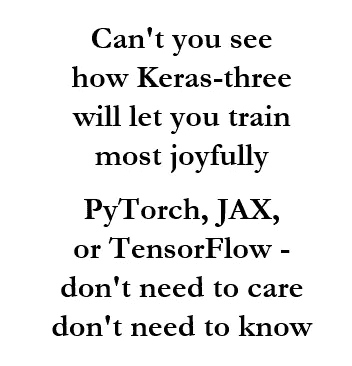
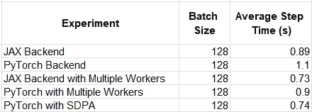
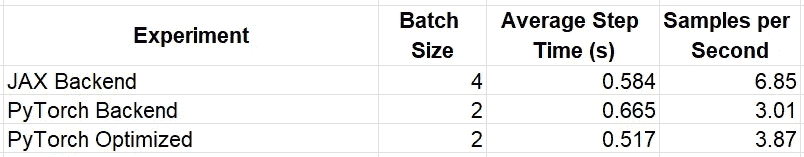

# 使用 Keras 3 进行多框架 AI/ML 开发

> 原文：[`towardsdatascience.com/multi-framework-ai-ml-development-with-keras-3-cf7be29eb23d?source=collection_archive---------3-----------------------#2024-06-16`](https://towardsdatascience.com/multi-framework-ai-ml-development-with-keras-3-cf7be29eb23d?source=collection_archive---------3-----------------------#2024-06-16)

## 欢迎 Keras 的回归

[](https://chaimrand.medium.com/?source=post_page---byline--cf7be29eb23d--------------------------------)[](https://towardsdatascience.com/?source=post_page---byline--cf7be29eb23d--------------------------------) [Chaim Rand](https://chaimrand.medium.com/?source=post_page---byline--cf7be29eb23d--------------------------------)

·发布于 [Towards Data Science](https://towardsdatascience.com/?source=post_page---byline--cf7be29eb23d--------------------------------) ·14 分钟阅读·2024 年 6 月 16 日

--


照片由 [Jose Rueda](https://unsplash.com/@notartistic?utm_source=medium&utm_medium=referral) 提供，来自 [Unsplash](https://unsplash.com/?utm_source=medium&utm_medium=referral)



作者：  

Keras 回来了！！Keras 最初于 2015 年发布，作为一个高阶 Python 库，用于训练机器学习模型。由于其简洁清晰的 API，Keras 迅速获得了人气。与当时那些笨重且不灵活的机器学习框架相比，Keras 降低了许多现有机器学习开发者（包括作者本人）的入门门槛。然而，在某个时刻，Keras 的使用几乎与 TensorFlow 开发同义。因此，当开发者开始转向其他框架时，Keras 的相对受欢迎程度开始下降。但现在，经过“完全重写”后，Keras 已经回归。凭借其崭新的引擎和对多后端支持的重新承诺，它有望恢复昔日的辉煌。

在这篇文章中，我们将重新审视 Keras，并评估其在当前 AI/ML 开发时代的价值。我们将通过示例展示其易用性，并指出其不足之处。重要的是，这篇文章并非旨在支持或反对采用 Keras（或任何其他框架、库、服务等）。像往常一样，最适合你项目开发的决策将取决于许多细节，其中很多超出了这篇文章的范围。

Google 最近发布的开源 NLP 模型家族 Gemma，以及 Keras 3 作为其 API 核心组件的加入，为我们提供了评估 Keras 优点的机会，也可能成为其复兴的一个绝佳机会。

# 为什么使用 Keras 3？

在我们看来，Keras 3 最有价值的特点是其多框架支持。这可能会让一些读者感到惊讶，他们可能会记得 Keras 的独特性在于其用户体验。Keras 3 自我宣传为“简单”、“灵活”，并且是“为人类设计，而不是为机器设计”。的确，Keras 的早期成功和急剧的流行上升，正是得益于其优秀的用户体验。但现在是 2024 年，许多高级深度学习 API 都提供了“降低认知负担”的功能。在我们看来，虽然用户体验非常好，但它已经不足以成为考虑选择 Keras 而不是其他替代框架的充足动因。而它的多框架支持则是。

## 多框架支持的优点

Keras 3 支持多个后端来训练和运行其模型。在本文撰写时，这些后端包括[JAX](https://jax.readthedocs.io/)、[TensorFlow](https://github.com/tensorflow/tensorflow)和[PyTorch](https://pytorch.org/)。[Keras 3 公告](https://keras.io/keras_3/)很好地解释了这一特性的优势。我们将在此基础上扩展并加入一些自己的观点。

**避免选择 AI/ML 框架的难题：** 选择一个 AI/ML 框架可能是作为 ML 开发者你需要做出的最重要的决定之一，同时也是最困难的决定之一。这个决策需要考虑的因素有很多，包括用户体验、API 覆盖范围、可编程性、可调试性、支持的输入数据的格式和类型、与开发流程中其他组件的兼容性（例如，模型部署阶段可能施加的限制），以及最重要的——运行时性能。正如我们在之前的多篇文章中讨论的那样（例如，[这里](https://medium.com/p/6e407a7d2dc8#de85-799b58b79241)），AI/ML 模型开发可能非常昂贵，选择框架所带来的哪怕是最小的性能提升，也会对整体成本产生重大影响。事实上，在很多情况下，这可能值得你为将模型和代码迁移到不同的框架，甚至支持多个框架而付出额外的开销。

问题在于，在你开始开发之前，几乎不可能知道哪个框架对你的模型最为优化。而且，即使你已经选择了一个框架，你也会希望紧跟所有框架的演变和发展，并持续评估改进模型和/或降低开发成本的潜在机会。AI/ML 开发的环境非常动态，优化和增强功能正在持续不断地设计和开发中。你不希望落后于人。

Keras 3 通过允许你在不承诺底层后端的情况下开发模型，解决了框架选择问题。通过在多个框架后端之间切换的选项，你可以专注于模型定义，完成后再选择最适合你需求的后端。即使随着机器学习项目的特性变化或支持的框架发展，Keras 3 也能让你轻松评估更换后端的影响。

通俗地说，你可以说 Keras 3 帮助人类避免做他们最讨厌做的事情之一——做出决定并坚持下去。但言归正传，使用 Keras 3 进行 AI/ML 模型开发，确实能够帮助你避免选择并被迫困在一个次优的框架中。

**享受各个世界的最佳优势：** PyTorch、TensorFlow 和 JAX 各自具有独特的优势和差异化特性。例如，JAX 支持即时编译（JIT），在这种模式下，模型操作符会被转换成中间计算图，然后编译成专门针对底层硬件的机器码。对于许多模型来说，这通常会显著提升运行时性能。另一方面，PyTorch 通常以立即执行操作符（即“急切执行”）的方式使用，通常被认为：具有最符合 Python 风格的接口、最容易调试，并提供最佳的整体用户体验。通过使用 Keras 3，你可以享受两者的最佳优点。在初始模型开发和调试过程中，你可以将后端设置为 PyTorch，而在生产模式下进行训练时，可以切换到 JAX 以获得最佳性能。

**与最大数量的 AI 加速器和运行时环境的兼容性：** 正如我们之前所讨论的（例如，在这里），我们的目标是与尽可能多的 AI 加速器和运行时环境兼容。在 AI 机器容量受限的时代，能够在不同机器类型之间切换是一个巨大的优势。当你使用 Keras 3 及其多后端支持进行开发时，你将自动增加可以训练和运行你模型的平台数量。例如，虽然你可能最习惯在 GPU 上运行 PyTorch，但只需将后端更改为 JAX，你也可以将模型配置为在 [Google Cloud TPUs](https://cloud.google.com/tpu?hl=en) 上运行（——不过这可能取决于模型的具体细节）。

**增加模型的采用率：** 如果你的目标是让其他 AI/ML 团队使用你的模型，那么通过支持多个框架，你将增加潜在的受众群体。由于各种原因，一些团队可能会局限于特定的 ML 框架。通过在 Keras 中交付你的模型，你消除了采用的障碍。一个很好的例子是最近发布的 Google 的 Gemma 模型，我们将在下面更详细地讨论。

**将数据输入管道与模型执行解耦：** 一些框架鼓励使用某些数据存储格式和/或数据加载实践。一个经典的例子是 TensorFlow 的 [TFRecord](https://www.tensorflow.org/tutorials/load_data/tfrecord) 数据格式，用于存储通常以 `.tfrecord` 文件形式存储的二进制记录序列。尽管 TensorFlow 原生支持解析和处理存储在 TFRecord 文件中的数据，但你可能会发现将它们输入到 PyTorch 的训练循环中会有些困难。PyTorch 训练的一个更合适的格式可能是 [WebDataset](https://pytorch.org/data/main/generated/torchdata.datapipes.iter.WebDataset.html)。但是，训练数据的创建可能是一个漫长的过程，而将其维护为多种格式可能会变得极其昂贵。因此，训练数据的存储和维护方式可能会使团队不愿考虑使用其他框架。

Keras 3 帮助团队克服这一障碍，通过完全解耦数据输入管道和训练循环。你可以在 PyTorch、TensorFlow、Numpy、Keras 和其他库中定义输入数据管道，而无需考虑将用于训练循环的后端。使用 Keras 3 后，将训练数据存储在 TFRecord 文件中不再是采用 PyTorch 作为后端的障碍。

## 多框架支持的缺点

与市场上其他任何新软件解决方案一样，了解 Keras 3 的潜在缺点非常重要。软件开发中的一个通用准则是，越是在软件堆栈的上层，你对应用程序行为和性能的控制就越少。在 AI/ML 领域，成功的程度通常取决于模型超参数、初始化设置、环境配置等的精确调节，这样的控制可能至关重要。以下是一些需要考虑的潜在缺点：

**运行时性能的潜在下降：** 使用高级 Keras API 而不是直接使用框架 API，可能会对优化运行时性能造成一定的限制。在我们关于分析和优化 PyTorch 模型性能的系列文章中，我们展示了各种提高训练速度的工具和技巧。有时这些技巧需要直接、不加中介地使用 PyTorch 的 API。例如，Keras 的 API 目前对[PyTorch 的 JIT 编译](https://pytorch.org/tutorials/intermediate/torch_compile_tutorial.html)选项的支持非常有限（通过[*jit_compile*](https://keras.io/api/models/model_training_apis/)设置）。另一个例子是 PyTorch 对[缩放点积注意力](https://pytorch.org/docs/2.2/generated/torch.nn.functional.scaled_dot_product_attention.html)的内置支持，而 Keras 层面（截至本文撰写时）并不支持这一功能。

**跨框架支持的局限性：** 虽然 Keras 的跨框架支持非常广泛，但你可能会发现它并不是包罗万象的。例如，一个覆盖的空白（截至本文撰写时）是分布式训练。虽然 Keras 引入了[Keras 分布式 API](https://keras.io/guides/distribution/)来支持所有后端的数据和模型并行性，但目前仅对 JAX 后端实现了该功能。要在使用其他后端时运行分布式训练，你需要回退到相关框架的标准分布式 API（例如，PyTorch 的[分布式数据并行 API](https://pytorch.org/tutorials/intermediate/ddp_tutorial.html)）。

**维护跨框架兼容性的开销：** Keras 3 支持多种预构建模型，您可以复用它们（例如，[这里](https://keras.io/api/keras_nlp/models/)）。然而，您可能不可避免地想要引入自己的自定义功能。虽然 Keras 3 支持自定义模型层、指标、训练循环等，但您需要小心避免破坏跨框架兼容性。例如，如果您使用 Keras 的后端无关 API（`keras.ops`）创建了一个自定义层，您可以放心，它会保留多后端支持。但是，有时您可能会选择依赖于框架特定的操作。在这种情况下，保持跨框架兼容性将需要为每个框架提供专门的实现，并根据所使用的后端进行适当的条件编程。目前自定义[训练步骤](https://keras.io/guides/custom_train_step_in_jax/)和[训练循环](https://keras.io/guides/writing_a_custom_training_loop_in_jax/)的方法是框架特定的，这意味着它们同样需要为每个后端提供专门的实现，以保持跨框架兼容性。因此，随着模型复杂性的增加，维持这一独特能力所需的开销也可能增加。

我们仅列出了 Keras 3 及其多后端支持的一些潜在缺点，您可能还会遇到其他问题。尽管多框架的提供确实具有吸引力，但其采用并不一定是无代价的。借用统计推断领域著名[定理](https://en.wikipedia.org/wiki/No_free_lunch_theorem)的名字，可以说，当涉及到选择 AI/ML 开发方法时，“没有免费的午餐”。

# Keras 3 的实践 — 一个玩具示例

正如我们在许多最近的文章中提到的，我们将定义的玩具模型是一个[视觉变换器](https://huggingface.co/docs/transformers/en/model_doc/vit)（ViT）支持的分类模型。我们将依赖于此 Keras[教程](https://keras.io/examples/vision/image_classification_with_vision_transformer/)中的参考实现。我们已根据[ViT-Base](https://deci.ai/model-zoo/vit/)架构（约 8600 万个参数）配置了我们的模型，将[mixed_precision](https://keras.io/api/mixed_precision/)策略设置为使用*bfloat16*，并定义了一个带有随机输入数据的[PyTorch 数据加载器](https://pytorch.org/tutorials/beginner/basics/data_tutorial.html)。

以下区块包含了配置设置，并紧接着是核心 ViT 模型组件的定义：

```py
import os

# choose backend
backend = 'jax' # 'torch'
os.environ["KERAS_BACKEND"] = backend

import keras
from keras import layers
from keras import ops

# set mixed precision policy
keras.mixed_precision.set_global_policy('mixed_bfloat16')

# use ViT Base settings
num_classes = 1000
image_size = 224
input_shape = (image_size, image_size, 3)
patch_size = 16  # Size of the patches to be extract from the input images
num_patches = (image_size // patch_size) ** 2
projection_dim = 768
num_heads = 12
transformer_units = [
    projection_dim * 4,
    projection_dim,
]  # Size of the transformer layers
transformer_layers = 12

# set training hyperparams
batch_size = 128
multi_worker = False # toggle to use multiple data loader workers
preproc_workers = 0 if 'jax' else 16

# ViT model components:
# ---------------------

def mlp(x, hidden_units, dropout_rate):
    for units in hidden_units:
        x = layers.Dense(units, activation=keras.activations.gelu)(x)
        x = layers.Dropout(dropout_rate)(x)
    return x

class Patches(layers.Layer):
    def __init__(self, patch_size):
        super().__init__()
        self.patch_size = patch_size

    def call(self, images):
        input_shape = ops.shape(images)
        batch_size = input_shape[0]
        height = input_shape[1]
        width = input_shape[2]
        channels = input_shape[3]
        num_patches_h = height // self.patch_size
        num_patches_w = width // self.patch_size
        patches = keras.ops.image.extract_patches(images, size=self.patch_size)
        patches = ops.reshape(
            patches,
            (
                batch_size,
                num_patches_h * num_patches_w,
                self.patch_size * self.patch_size * channels,
            ),
        )
        return patches

class PatchEncoder(layers.Layer):
    def __init__(self, num_patches, projection_dim):
        super().__init__()
        self.num_patches = num_patches
        self.projection = layers.Dense(units=projection_dim)
        self.position_embedding = layers.Embedding(
            input_dim=num_patches, output_dim=projection_dim
        )

    def call(self, patch):
        positions = ops.expand_dims(
            ops.arange(start=0, stop=self.num_patches, step=1), axis=0
        )
        projected_patches = self.projection(patch)
        encoded = projected_patches + self.position_embedding(positions)
        return encoded
```

使用核心组件，我们定义了一个 ViT 支持的 Keras 模型：

```py
# the attention layer we will use in our ViT classifier
attention_layer = layers.MultiHeadAttention

def create_vit_classifier():
    inputs = keras.Input(shape=input_shape)
    # Create patches.
    patches = Patches(patch_size)(inputs)
    # Encode patches.
    encoded_patches = PatchEncoder(num_patches, projection_dim)(patches)

    # Create multiple layers of the Transformer block.
    for _ in range(transformer_layers):
        # Layer normalization 1.
        x1 = layers.LayerNormalization(epsilon=1e-6)(encoded_patches)
        # Create a multi-head attention layer.
        attention_output = attention_layer(
            num_heads=num_heads, key_dim=projection_dim//num_heads, dropout=0.1
        )(x1, x1)
        # Skip connection 1.
        x2 = layers.Add()([attention_output, encoded_patches])
        # Layer normalization 2.
        x3 = layers.LayerNormalization(epsilon=1e-6)(x2)
        # MLP.
        x3 = mlp(x3, hidden_units=transformer_units, dropout_rate=0.1)
        # Skip connection 2.
        encoded_patches = layers.Add()([x3, x2])

    # Create a [batch_size, projection_dim] tensor.
    representation = layers.LayerNormalization(epsilon=1e-6)(encoded_patches)
    representation = layers.GlobalAveragePooling1D()(representation)
    representation = layers.Dropout(0.5)(representation)

    # Classify outputs.
    logits = layers.Dense(num_classes)(representation)

    # Create the Keras model.
    model = keras.Model(inputs=inputs, outputs=logits)
    return model

# create the ViT model
model = create_vit_classifier()
model.summary()
```

在下一个区块中，我们定义了优化器、损失函数和数据集。

```py
model.compile(
    optimizer=keras.optimizers.SGD(),
    loss=keras.losses.SparseCategoricalCrossentropy(from_logits=True),
    )

def get_data_loader(batch_size):
    import torch
    from torch.utils.data import Dataset, DataLoader

    # create dataset of random image and label data
    class FakeDataset(Dataset):
        def __len__(self):
            return 1000000

        def __getitem__(self, index):
            rand_image = torch.randn([224, 224, 3], dtype=torch.float32)
            label = torch.tensor(data=[index % 1000], dtype=torch.int64)
            return rand_image, label

    ds = FakeDataset()
    dl = DataLoader(
        ds,
        batch_size=batch_size,
        num_workers=preproc_workers if multi_worker else 0,
        pin_memory=True
    )
    return dl

dl = get_data_loader(batch_size)
```

最后，我们使用 Keras 的[Model.fit()](https://keras.io/api/models/model_training_apis/)函数开始训练：

```py
model.fit(
    dl,
    batch_size=batch_size,
    epochs=1
)
```

我们在 Google Cloud Platform (GCP) [g2-standard-16](https://cloud.google.com/compute/docs/gpus#l4-gpus) 虚拟机（配备单个 NVIDIA L4 GPU）上运行了上述脚本，并使用了专门的 [深度学习虚拟机镜像](https://cloud.google.com/deep-learning-vm/docs/release-notes)（common-cu121-v20240514-ubuntu-2204-py310），并安装了 PyTorch（2.3.0）、JAX（0.4.28）、Keras（3.3.3）和 [KerasCV](https://keras.io/keras_cv/)（0.9.0）。请参阅 [Keras 官方文档](https://github.com/keras-team/keras/blob/master/README.md#installation)获取完整的安装说明。请注意，我们手动修改了由 [Keras 进度条](https://github.com/keras-team/keras/blob/v3.3.3/keras/src/utils/progbar.py#L228)报告的步骤时间格式：

```py
 formatted += f" {time_per_unit:.3f}s/{unit_name}"
```

使用 *backend* 标志，我们能够轻松地在 Keras 支持的后端之间切换，并比较每个后端的运行时性能。例如，当配置 [PyTorch 数据加载器](https://pytorch.org/tutorials/beginner/basics/data_tutorial.html) 并设置为 0 个工作线程时，我们发现 JAX 后端比 PyTorch 快约 24%。当将工作线程数设置为 16 时，这一差距缩小至约 12%。

## 自定义注意力层

我们现在定义了一个自定义注意力层，用 PyTorch 的 [闪电注意力](https://pytorch.org/docs/stable/generated/torch.nn.functional.scaled_dot_product_attention.html) 实现替换了 [Keras 的默认注意力](https://keras.io/api/layers/attention_layers/multi_head_attention/) 计算。请注意，这仅在后端设置为 *torch* 时有效。

```py
class MyAttention(layers.MultiHeadAttention):
    def _compute_attention(
            self, query, key, value, attention_mask=None, training=None
    ):
        from torch.nn.functional import scaled_dot_product_attention
        query = ops.multiply(
            query, ops.cast(self._inverse_sqrt_key_dim, query.dtype))
        return scaled_dot_product_attention(
            query.transpose(1,2),
            key.transpose(1,2),
            value.transpose(1,2),
            dropout_p=self._dropout if training else 0.
            ).transpose(1,2), None

attention_layer = MyAttention
```

我们实验的结果总结在下面的表格中。请记住，相对性能结果可能会根据模型的细节和运行时环境有很大差异。



ViT 运行时（作者）

使用我们的自定义注意力层时，JAX 和 PyTorch 后端之间的差距几乎消失。这凸显了多后端解决方案的使用可能会以牺牲某些框架特有的优化为代价（在我们的示例中，是 PyTorch 的 SDPA）。

# Keras 3 in Gemma

[Gemma](https://ai.google.dev/gemma/?utm_source=keyword&utm_medium=referral&utm_campaign=gemma_cta&utm_content=) 是 Google 最近发布的一系列轻量级 [开源模型](https://opensource.googleblog.com/2024/02/building-open-models-responsibly-gemini-era.html)。Keras 3 在 Gemma 发布中扮演了重要角色（例如，参见 [此处](https://ai.google.dev/gemma/docs/get_started)），其多框架支持使得 Gemma 能够自动服务于各类 AI/ML 开发者——无论是 PyTorch、TensorFlow 还是 Jax。有关 Gemma API 的详细信息，请参阅官方 [文档](https://keras.io/api/keras_nlp/models/gemma/) 和 [KerasNLP](https://keras.io/api/keras_nlp/)。

以下代码大致基于官方的[Gemma 微调教程](https://ai.google.dev/gemma/docs/lora_tuning)。为了运行此脚本，请遵循[必要的设置说明](https://ai.google.dev/gemma/docs/lora_tuning#setup)。

```py
import os
backend = 'jax' #'torch'
os.environ["KERAS_BACKEND"] = backend

num_batches = 1000
batch_size = 4 if backend == 'jax' else 2

# Avoid memory fragmentation on JAX backend.
os.environ["XLA_PYTHON_CLIENT_MEM_FRACTION"]="1.00"
os.environ["KAGGLE_USERNAME"]="chaimrand"
os.environ["KAGGLE_KEY"]="29abebb28f899a81ca48bec1fb97faf1"
import keras
import keras_nlp
keras.mixed_precision.set_global_policy('mixed_bfloat16')

import json
data = []
with open("databricks-dolly-15k.jsonl") as file:
    for line in file:
        features = json.loads(line)
        # Filter out examples with context, to keep it simple.
        if features["context"]:
            continue
        # Format the entire example as a single string.
        template = "Instruction:\n{instruction}\n\nResponse:\n{response}"
        data.append(template.format(**features))

# Only use 1000 training batches, to keep it fast.
data = data[:num_batches*batch_size]
gemma_lm = keras_nlp.models.GemmaCausalLM.from_preset("gemma_2b_en")
# Enable LoRA for the model and set the LoRA rank to 4.
gemma_lm.backbone.enable_lora(rank=4)

gemma_lm.summary()
# Limit the input sequence length to 512 (to control memory usage).
gemma_lm.preprocessor.sequence_length = 512

gemma_lm.compile(
   loss=keras.losses.SparseCategoricalCrossentropy(from_logits=True),
   optimizer=keras.optimizers.SGD(learning_rate=5e-5),
   weighted_metrics=[keras.metrics.SparseCategoricalAccuracy()],
)
gemma_lm.fit(data, epochs=1, batch_size=batch_size)
```

当在上述相同的 GCP 环境中运行脚本时，我们发现使用 JAX 后端（每秒 6.87 个样本）与使用 PyTorch 后端（每秒 3.01 个样本）之间的运行时性能存在显著（且令人惊讶的）差异。这部分原因在于，JAX 后端允许将训练批次大小加倍。对这种差异原因的深入探讨超出了本文的范围。

正如我们之前的示例所示，我们通过在脚本顶部添加以下[矩阵乘法操作](https://pytorch.org/docs/stable/generated/torch.set_float32_matmul_precision.html)的配置来展示了一种优化 PyTorch 运行时的方法：

```py
import torch
torch.set_float32_matmul_precision('high')
```

这个简单的变化在使用 PyTorch 后端时带来了 29% 的性能提升。再次，我们可以看到应用框架特定优化的影响。实验结果总结在下面的表格中。



Gemma 微调运行时（作者提供）

# 结论

我们的演示表明，坚持使用与后端无关的 Keras 代码可能会带来显著的运行时性能损失。在每个示例中，我们都看到了一个简单的框架特定优化如何对我们选择的后端的相对性能产生显著影响。同时，我们讨论的多框架 AI/ML 开发的论点也相当有说服力。

如果你选择采用 Keras 作为开发框架，你可能需要考虑以一种设计代码的方式来实现和评估框架特定优化的机制。你还可以考虑在项目的早期阶段使用 Keras，并随着项目的成熟，针对揭示出的最合适的后端进行优化。

# 摘要

在本文中，我们探讨了新发布的 Keras 3 版本。Keras 3 不再是 TensorFlow 的附属品，而是提供了框架无关的 AI/ML 模型开发能力。正如我们讨论的，这种能力有几个显著的优势。然而，正如 AI 开发领域中常见的情况一样，“天下没有免费的午餐”——这种增加的抽象层次可能意味着我们对代码内部工作原理的控制力减弱，这可能导致训练速度变慢和成本增加。最佳的解决方案可能是结合使用 Keras 及其多框架支持，并采用专门的机制来纳入框架特定的修改。

重要的是，Keras 3 在您的项目中的适用性以及所需投资的性价比分析，将在很大程度上取决于多种因素，包括：目标受众、模型部署过程、项目时间表等。请将此帖子视为您深入探索的简要介绍。
