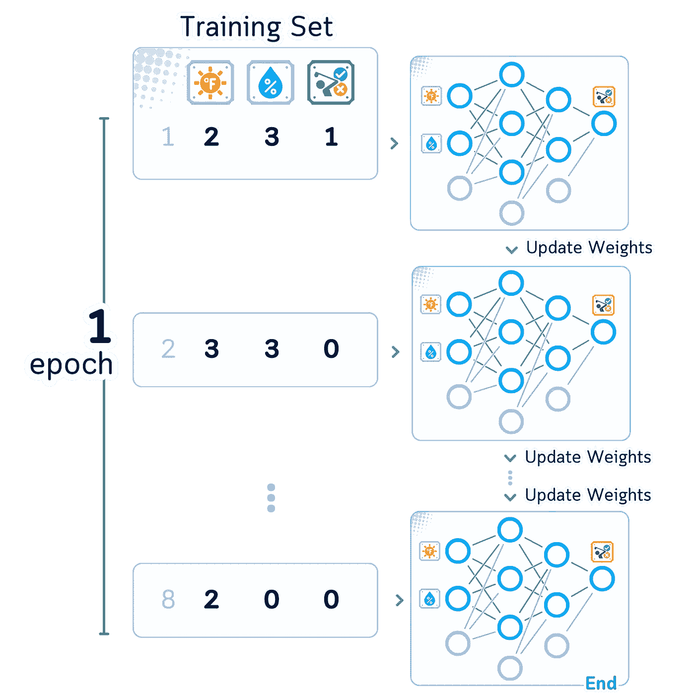

# 多层感知器，解释：带有迷你二维数据集的视觉指南

> 原文：[`towardsdatascience.com/multilayer-perceptron-explained-a-visual-guide-with-mini-2d-dataset-0ae8100c5d1c?source=collection_archive---------1-----------------------#2024-10-25`](https://towardsdatascience.com/multilayer-perceptron-explained-a-visual-guide-with-mini-2d-dataset-0ae8100c5d1c?source=collection_archive---------1-----------------------#2024-10-25)

## 分类算法

## 解剖一个小型神经网络的数学（带视觉展示）

[](https://medium.com/@samybaladram?source=post_page---byline--0ae8100c5d1c--------------------------------)[](https://towardsdatascience.com/?source=post_page---byline--0ae8100c5d1c--------------------------------) [Samy Baladram](https://medium.com/@samybaladram?source=post_page---byline--0ae8100c5d1c--------------------------------)

·发布于 [Towards Data Science](https://towardsdatascience.com/?source=post_page---byline--0ae8100c5d1c--------------------------------) ·13 分钟阅读·2024 年 10 月 25 日

--


`⛳️ 更多 [分类算法](https://medium.com/@samybaladram/list/classification-algorithms-b3586f0a772c)，解释：· 虚拟分类器 · K 近邻分类器 · 伯努利朴素贝叶斯 · 高斯朴素贝叶斯 · 决策树分类器 · 逻辑回归 · 支持向量分类器 ▶ 多层感知器`

是否觉得神经网络无处不在？它们出现在新闻中、手机里，甚至出现在你的社交媒体动态中。但说实话——我们大多数人根本不清楚它们是如何运作的。那些复杂的数学和像“反向传播”这样的术语呢？

这是一个思考：如果我们将事情简化呢？让我们探索一个多层感知机（MLP）——**最基本类型的神经网络**——来使用一个小型网络分类一个简单的二维数据集，只使用少量的数据点。

通过清晰的视觉效果和逐步的解释，你将看到数学变得生动，观察数字和方程式如何在网络中流动，以及学习是如何真正发生的！


所有视觉效果：作者使用 Canva Pro 创建。优化为手机端显示；在桌面端可能显示过大。

# 定义

多层感知机（MLP）是一种神经网络类型，它使用连接的节点层来学习模式。它之所以得名，是因为它有多个层——通常包括一个输入层、一个或多个中间（隐藏）层和一个输出层。

每个节点都与下一层的所有节点相连。当网络学习时，它会根据训练示例调整这些连接的强度。例如，如果某些连接导致正确的预测，它们会变得更强。如果它们导致错误预测，它们会变得更弱。

通过这种例子学习的方式，帮助网络识别模式，并对它从未见过的新情况做出预测。


多层感知机（MLPs）被认为是神经网络和深度学习领域的基础，因为它们可以处理一些简单方法无法解决的复杂问题。

# 📊 使用的数据集

为了理解多层感知机（MLPs）的工作原理，我们从一个简单的例子开始：一个只有几个样本的迷你二维数据集。我们将使用[相同的数据集](https://medium.com/towards-data-science/support-vector-classifier-explained-a-visual-guide-with-mini-2d-dataset-62e831e7b9e9)来保持简洁，这个数据集来自我们之前的文章。


列：温度（0-3）、湿度（0-3）、打高尔夫（是/否）。训练数据集有 2 个维度和 8 个样本。

在直接进入训练之前，让我们先试着理解构成神经网络的关键部分及其如何协同工作。

# 步骤 0：网络结构

首先，我们来看看网络的各个部分：

## 节点（神经元）

我们从神经网络的基本结构开始。这个结构由许多个单独的单位组成，称为节点或神经元。


这个神经网络有 8 个节点。

这些节点被组织成一个个层次结构来协同工作：

## 输入层

输入层是我们开始的地方。它接收我们的原始数据，节点的数量与特征的数量相匹配。


输入层有 2 个节点，每个特征对应一个节点。

## 隐藏层

接下来是隐藏层。我们可以有一个或多个这样的层，且可以选择每层的节点数量。通常，我们在层数越深时，每层的节点数量会越来越少。


这个神经网络有 2 个隐藏层，分别包含 3 个节点和 2 个节点。

## 输出层

最后一层给出了我们的最终答案。输出层中节点的数量取决于我们的任务：对于二分类或回归问题，我们可能只有一个输出节点，而对于多类问题，我们则为每个类别设置一个节点。


这个神经网络的输出层只有 1 个节点（因为是二分类）。

## 权重

节点之间通过权重相互连接——权重是控制每个信息片段重要性的数字。每个节点之间的连接都有自己的权重。这意味着我们需要大量的权重：一层中的每个节点都连接到下一层的每个节点。


这个神经网络总共有 14 个权重。

## 偏置

除了权重，每个节点还拥有一个偏置——一个额外的数字，帮助它做出更好的决策。权重控制节点之间的连接，而偏置则帮助每个节点调整其输出。


这个神经网络有 6 个偏置值。

## 神经网络

总结来说，我们将使用并训练这个神经网络：


我们的网络由 4 层组成：1 个输入层（2 个节点）、2 个隐藏层（3 个节点和 2 个节点），以及 1 个输出层（1 个节点）。这形成了一个 2–3–2–1 的架构。

让我们看看这个新图示，它展示了我们的网络从上到下的结构。我已经更新了它，以便更容易理解数学过程：信息从顶部的节点开始，沿着各层向下流动，直到到达底部的最终答案。


现在我们理解了网络的构建方式，接下来让我们看看信息是如何在其中流动的。这叫做前向传播（forward pass）。

# 第一步：前向传播

让我们逐步了解网络是如何将输入转换为输出的：

## 权重初始化

在我们的网络开始学习之前，我们需要为每个权重设置一个初始值。我们选择在-1 到 1 之间的小随机数。使用随机数开始有助于我们的网络在没有任何早期偏好或模式的情况下学习。


所有权重都是从[-0.5, 0.5]范围内随机选择的。

## 加权和

每个节点以两步处理传入的数据。首先，它将每个输入乘以其权重，并将所有这些数字相加。然后，它再加上一个数字——偏置——以完成计算。偏置本质上是**一个恒定输入为 1 的权重**。


## 激活函数

每个节点将其加权和通过**激活函数**进行处理，以生成输出。激活函数通过引入非线性行为，帮助我们的网络学习复杂的模式。

在我们的隐藏层中，我们使用 ReLU 函数（整流线性单元）。ReLU 很简单：如果一个数是正数，它保持不变；如果是负数，它变为零。


## 层级计算

这个两步过程（加权求和和激活）在每一层中依次进行。每一层的计算帮助我们一步一步地将输入数据转化为最终的预测值。


## 输出生成

最后一层给出了网络的最终答案。对于我们的是/否分类任务，我们在这一层使用一种特殊的激活函数，叫做 **sigmoid**。

Sigmoid 函数将任何数值转化为 0 到 1 之间的值。这使得它非常适合用于是/否的决策，因为我们可以将输出视为一种概率：越接近 1 意味着越可能是“是”，越接近 0 意味着越可能是“否”。


这个前向传播过程将我们的输入转化为一个 0 到 1 之间的预测值。但是这些预测有多准确呢？接下来，我们将衡量我们的预测与正确答案之间的接近程度。

# 步骤 2：损失计算

## 损失函数

为了检查我们的网络表现如何，我们衡量它的预测与正确答案之间的差异。对于二分类问题，我们使用一种叫做 **二元交叉熵** 的方法，它能告诉我们预测值与真实值之间的偏差。


## 神经网络中的数学符号

为了提高我们网络的性能，我们需要使用一些数学符号。在继续之前，让我们先定义一下每个符号的含义：

**权重和偏置**

权重表示为矩阵，偏置表示为向量（或一维矩阵）。括号表示法`[1]`表示层的编号。


**输入、输出、加权和以及激活后的值**

节点中的值可以表示为向量，从而形成一致的数学框架。


**总结** 这些数学符号帮助我们精确地描述网络的运作过程：


让我们看一个图示，展示我们网络中所有数学运算的过程。每一层都有：

+   连接层的权重（*W*）和偏置（*b*）

+   激活前的值（*z*）

+   激活后的值（*a*）

+   最终预测值（*ŷ*）和损失值（*L*）在末尾


让我们看看每一层到底发生了什么：

*第一个隐藏层*：

*·* 取输入 *x*，与权重 *W*[1] 相乘，加入偏置 *b*[1] 得到 *z*[1]

*·* 对 *z*[1] 应用 ReLU 函数得到输出 *a*[1]

*第二个隐藏层*：

*·* 取 *a*[1]，与权重 *W*[2] 相乘，加入偏置 *b*[2] 得到 *z*[2]

*·* 对 *z*[2] 应用 ReLU 函数得到输出 *a*[2]

*输出层*：

*·* 取 *a*[2]，与权重 *W*[3] 相乘，加入偏置 *b*[3] 得到 *z*[3]

*·* 对 *z*[3] 应用 sigmoid 来获得我们的最终预测 *ŷ*


现在我们看到网络中的所有数学公式，如何改进这些数字以获得更好的预测？这时**反向传播**就派上用场了——它向我们展示了如何调整我们的权重和偏差，以减少错误。

# 第 3 步：反向传播

在我们了解如何改进网络之前，让我们快速回顾一下我们需要的一些数学工具：

## 导数

为了优化我们的神经网络，我们使用**梯度**——这是一个与导数密切相关的概念。让我们回顾一下基本的导数规则：


## 偏导数

让我们澄清常规导数和偏导数之间的区别：

***常规导数*：* *·* 用于函数只有一个变量的情况

*·* 显示当唯一变量变化时函数的变化量

*·* 写作 d*f*/d*x*

***偏导数***：

*·* 用于函数有多个变量的情况

*·* 显示当一个变量变化时函数的变化量，同时**保持其他变量不变（视为常数）**。

*·* 写作 ∂*f*/*∂*x


一些偏导数的例子

## 梯度计算与反向传播

回到我们的神经网络，我们需要确定**如何调整每个权重和偏差**以最小化误差。我们可以通过一种叫做反向传播的方法来实现，它向我们展示了改变每个值如何影响网络的误差。

由于反向传播是通过网络反向进行的，我们可以将图示翻转过来，看看它是如何工作的。


## 网络的矩阵规则

由于我们的网络使用矩阵（权重和偏差的组合），我们需要特殊的规则来计算变化如何影响我们的结果。这里有两个关键的矩阵规则。对于向量**v, u**（大小为 1 × *n*）和矩阵**W, X**（大小为*n* × *n*）：

1.  *求和规则*：

    ∂(**W** + **X**)/∂**W** = **I**（单位矩阵，大小为*n* × *n*）

    ∂(**u** + **v**)/∂**v** = **I**（单位矩阵，大小为*n* × *n*）

1.  *矩阵-向量乘积规则*：

    ∂(**vW**)/∂**W** = **v**ᵀ

    ∂(**vW**)/∂**v** = **W**ᵀ

使用这些规则，我们得到：


**激活函数的导数** *ReLU 的导数*对于向量**a**和**z**（大小为 1 × *n*），其中**a** = ReLU(**z**)：

∂**a**/∂**z** = diag(**z** > 0)

创建一个对角矩阵，表示：如果输入为正，则为 1；如果输入为零或负，则为 0。

*Sigmoid 的导数*

对于**a** = σ(**z**)，其中 σ 是 sigmoid 函数：

∂**a**/∂**z** = **a** ⊙ (1 **- a**)

这直接乘以元素（⊙表示逐位置相乘）。


**二进制交叉熵损失函数的导数**

对于一个单独的例子，损失函数为 *L* = -[*y* log(ŷ) + (1-*y*) log(1-*ŷ*)]：

∂*L*/∂*ŷ* = -(*y*-*ŷ*) / [*ŷ*(1-*ŷ*)]


到目前为止，我们可以将所有的偏导数总结如下：


下图展示了我们迄今为止得到的所有偏导数：


## 链式法则

在我们的网络中，变化通过多个步骤进行传播：一个权重影响它所在层的输出，这又影响下一层，依此类推，直到最终误差。链式法则告诉我们**将这些逐步变化相乘**，以找出每个权重和偏置如何影响最终的误差。


## 误差计算

我们并不是直接计算权重和偏置的导数，而是首先计算层误差∂*L*/∂*zˡ*（相对于预激活输出的梯度）。这使得后续计算我们应该如何调整早期层的权重和偏置变得更容易。


## 权重梯度和偏置梯度

使用这些层误差和链式法则，我们可以将权重和偏置的梯度表示为：


梯度向我们展示了网络中每个值如何影响网络的误差。我们随后对这些值进行小幅调整，以帮助网络做出更好的预测。

# 步骤 4：权重更新

## 更新权重

一旦我们知道每个权重和偏置如何影响误差（即梯度），我们就通过将这些值调整到与梯度相反的方向来改进我们的网络。这一步步地减少了网络的误差。


## 学习率与优化

我们并不是一次性做出大的变化，而是进行小而谨慎的调整。我们使用一个叫做学习率（*η*）的数值来控制每次调整的幅度：

+   如果*η*太大：变化过大，可能会导致情况变得更糟

+   如果*η*太小：变化很小，改进需要很长时间

这种通过小幅、可控的调整来优化的方式被称为**随机梯度下降（SGD）**。我们可以将其写作：


η（学习率）的值通常选择较小，通常在 0.1 到 0.0001 之间，以确保学习的稳定性。

我们刚才看到了网络如何通过**一个示例**进行学习。网络对数据集中每个示例重复这些步骤，在每轮实践中逐步改进。

# 步骤总结

以下是我们为训练网络在单个示例上所涉及的所有步骤：


# 扩展到完整的数据集

## 迭代

我们的网络会对数据集中的每个示例重复这四个步骤——前向传播、损失计算、反向传播和权重更新。遍历所有示例一次称为**一次迭代**。



网络通常需要多次看到所有例子，才能熟练掌握任务，甚至多达 1000 次。每一次训练帮助它更好地学习模式。


## 批次

我们的网络不是一次从一个例子中学习，而是一次从一小组例子（称为**批次**）中学习。这有几个好处：

+   运行更快

+   学习更好的模式

+   稳定地改善

在处理批次时，网络会先查看组内的所有例子，然后再做出改变。这比每看一个例子就改变一次值能得到更好的结果。


# 测试步骤

## 准备完全训练好的神经网络

训练完成后，我们的网络准备对它从未见过的新例子进行预测。它使用与训练相同的步骤，但**只需向前传播**通过网络进行预测。

## 进行预测

处理新数据时：

1\. 输入层接收新值

2\. 在每一层：

*·* 通过权重进行乘法运算并加上偏差

*·* 应用激活函数

3\. 输出层生成预测（例如，二分类的概率值在 0 到 1 之间）


ID 9 的预测结果是 1（是）。

## 神经网络的确定性特征

当我们的网络两次看到相同的输入时，它会两次给出相同的答案（前提是我们没有改变它的权重和偏差）。网络处理新例子的能力来自于它的训练，而不是在预测时的任何随机性。

# 最后的备注

随着网络一次又一次地练习这些例子，它会在任务上变得更好。随着时间的推移，它犯的错误越来越少，预测也变得更加准确。这就是神经网络如何学习的过程：查看例子，找到错误，做出小的改进，并不断重复！

# 🌟 **多层感知机分类器代码总结**

现在让我们看看我们的神经网络是如何运作的。以下是一些 Python 代码，构建了我们一直在讨论的网络，使用的是我们刚刚学习的相同结构和规则。

```py
import pandas as pd
import numpy as np
from sklearn.neural_network import MLPClassifier
from sklearn.metrics import accuracy_score

# Create our simple 2D dataset
df = pd.DataFrame({
    '🌞': [0, 1, 1, 2, 3, 3, 2, 3, 0, 0, 1, 2, 3],
    '💧': [0, 0, 1, 0, 1, 2, 3, 3, 1, 2, 3, 2, 1],
    'y': [1, -1, -1, -1, 1, 1, 1, -1, -1, -1, 1, 1, 1]
}, index=range(1, 14))

# Split into training and test sets
train_df, test_df = df.iloc[:8].copy(), df.iloc[8:].copy()
X_train, y_train = train_df[['🌞', '💧']], train_df['y']
X_test, y_test = test_df[['🌞', '💧']], test_df['y']

# Create and configure our neural network
mlp = MLPClassifier(
    hidden_layer_sizes=(3, 2), # Creates a 2-3-2-1 architecture as discussed
    activation='relu',         # ReLU activation for hidden layers
    solver='sgd',              # Stochastic Gradient Descent optimizer
    learning_rate_init=0.1,    # Step size for weight updates
    max_iter=1000,             # Maximum number of epochs
    momentum=0,                # Disable momentum for pure SGD as discussed
    random_state=42            # For reproducible results
)

# Train the model
mlp.fit(X_train, y_train)

# Make predictions and evaluate
y_pred = mlp.predict(X_test)
accuracy = accuracy_score(y_test, y_pred)
print(f"Accuracy: {accuracy:.2f}")
```

## 想了解更多？

+   查看 scikit-learn 的[MLPClassifier](https://scikit-learn.org/stable/modules/generated/sklearn.neural_network.MLPClassifier.html)官方文档，了解更多详情及如何使用

+   本文使用的是 Python 3.7 和 scikit-learn 1.5，但核心理念也适用于其他版本。

## 图片归属

本文中的所有图表和技术插图都是作者使用 Canva Pro 的商业许可证条款下授权设计元素制作的。

𝙎𝙚𝙚 𝙢𝙤𝙧𝙚 𝘾𝙡𝙖𝙨𝙨𝙞𝙛𝙞𝙘𝙖𝙩𝙞𝙤𝙣 𝘼𝙡𝙜𝙤𝙧𝙞𝙩𝙝𝙢𝙨 𝙝𝙚𝙧𝙚:


[Samy Baladram](https://medium.com/@samybaladram?source=post_page-----0ae8100c5d1c--------------------------------)

## 分类算法

[查看列表](https://medium.com/@samybaladram/list/classification-algorithms-b3586f0a772c?source=post_page-----0ae8100c5d1c--------------------------------)8 个故事

𝙔𝙤𝙪 𝙢𝙞𝙜𝙝𝙩 𝙖𝙡𝙨𝙤 𝙡𝙞𝙠𝙚:


[Samy Baladram](https://medium.com/@samybaladram?source=post_page-----0ae8100c5d1c--------------------------------)

## 回归算法

[查看列表](https://medium.com/@samybaladram/list/regression-algorithms-b0b6959f1b39?source=post_page-----0ae8100c5d1c--------------------------------)5 个故事

[Samy Baladram](https://medium.com/@samybaladram?source=post_page-----0ae8100c5d1c--------------------------------)

## 集成学习

[查看列表](https://medium.com/@samybaladram/list/ensemble-learning-673fc83cd7db?source=post_page-----0ae8100c5d1c--------------------------------)4 个故事
