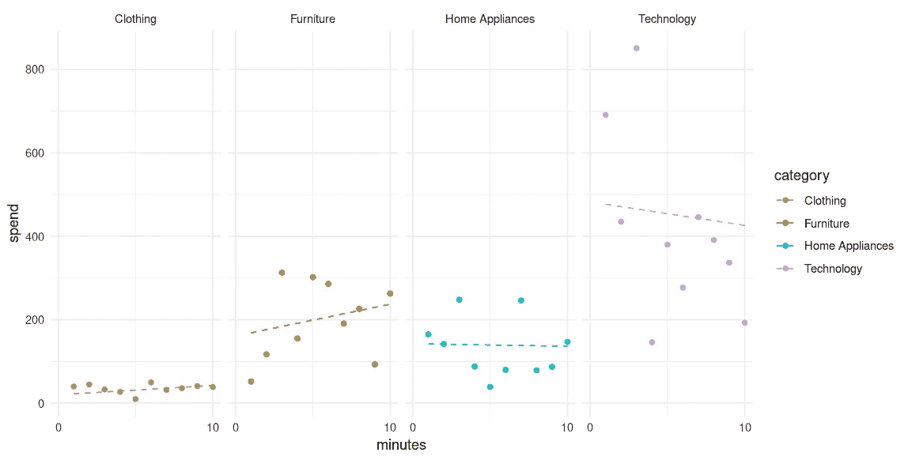

# 使用 lme4 的多层次建模：分析电子商务销售

> 原文：[`towardsdatascience.com/multilevel-modelling-with-lme4-analysing-e-commerce-sales-4a36436c1e66?source=collection_archive---------12-----------------------#2024-07-23`](https://towardsdatascience.com/multilevel-modelling-with-lme4-analysing-e-commerce-sales-4a36436c1e66?source=collection_archive---------12-----------------------#2024-07-23)

## 多层次建模可以分析具有层级或聚类结构的数据。

 [Michael Grogan](https://mgcodesandstats.medium.com/?source=post_page---byline--4a36436c1e66--------------------------------)

·发表于 [Towards Data Science](https://towardsdatascience.com/?source=post_page---byline--4a36436c1e66--------------------------------) ·阅读时间 7 分钟·2024 年 7 月 23 日

--

来源：作者使用 R 生成的输出。

*注意：原文可在此处查看* [*这里*](https://michael-grogan.com/articles/multilevel-modelling-lme4-ecommerce-sales.html)*.*

多层次建模在市场研究中尤为有用，通过对顾客按类别（如人口统计、购买习惯）进行细分，有助于理解企业如何吸引新顾客并提高现有顾客的忠诚度。

R 中的[lme4](https://cran.r-project.org/web/packages/lme4/lme4.pdf)库用于创建多层次模型。在该库中，一个重要的多层次建模实例是[sleepstudy](https://cdsbasel.github.io/dataanalytics_rsessions/_sessions/CausalInference/intro_lme4.html)示例，其中使用多层次模型分析了在睡眠剥夺条件下，不同睡眠剥夺天数对参与者反应时间的影响。

我们如何将这样的模型应用于分析顾客数据呢？让我们来看一下！

# 背景

一个电子商务网站希望分析他们收集的关于网站活动的最新销售数据。具体来说，他们希望确定影响**每位顾客消费**的因素。

他们提供了一个包含以下信息的数据集：
