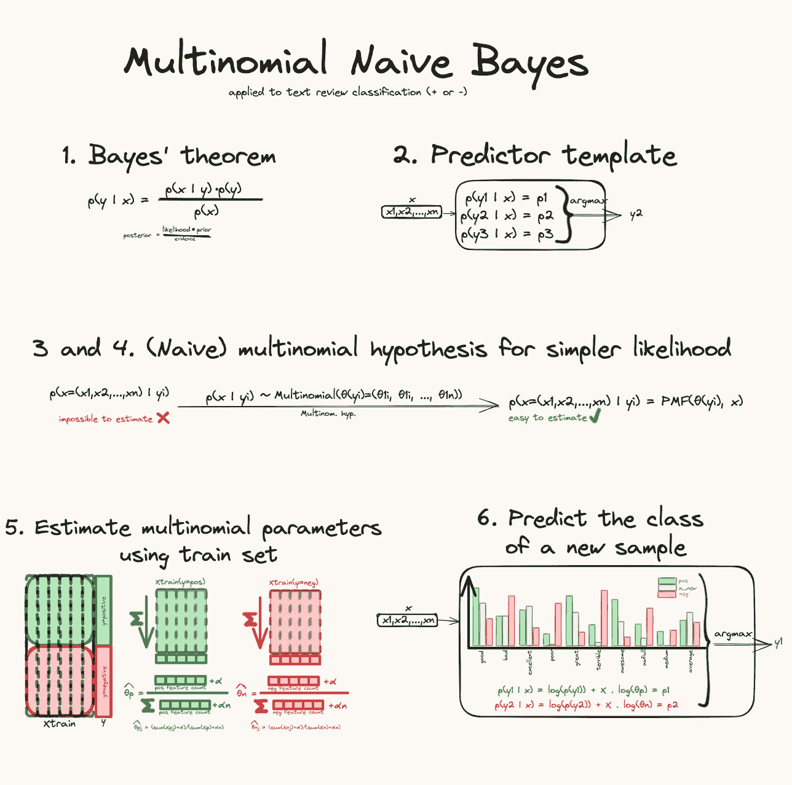

# 多项式朴素贝叶斯分类器

> 原文：[`towardsdatascience.com/multinomial-naive-bayes-classifier-c861311caff9?source=collection_archive---------10-----------------------#2024-03-14`](https://towardsdatascience.com/multinomial-naive-bayes-classifier-c861311caff9?source=collection_archive---------10-----------------------#2024-03-14)

## 一个完整的文本评论分类工作示例

 [Yoann Mocquin](https://mocquin.medium.com/?source=post_page---byline--c861311caff9--------------------------------)

·发表于[Towards Data Science](https://towardsdatascience.com/?source=post_page---byline--c861311caff9--------------------------------) ·阅读时间 16 分钟·2024 年 3 月 14 日

--

在这篇新文章中，我们将尝试理解多项式朴素贝叶斯分类器是如何工作的，并提供使用 Python 和 scikit-learn 的实际示例。

我们将看到：

+   什么是多项式分布：与依赖于假定高斯分布的高斯朴素贝叶斯分类器不同，多项式朴素贝叶斯分类器依赖于多项式分布。

+   创建依赖于贝叶斯定理的分类器的一般方法，以及基于朴素假设——即在给定目标类的条件下，输入特征相互独立。

+   多项式分类器是如何通过学习/估计每个类别的多项式概率来“拟合”的——使用平滑技巧来处理空特征。

+   如何计算新样本的概率，使用对数空间技巧以避免下溢。

*所有图片由作者提供。*

# **理解多项式分布**

如果你已经熟悉多项式分布，可以继续阅读下一部分。
