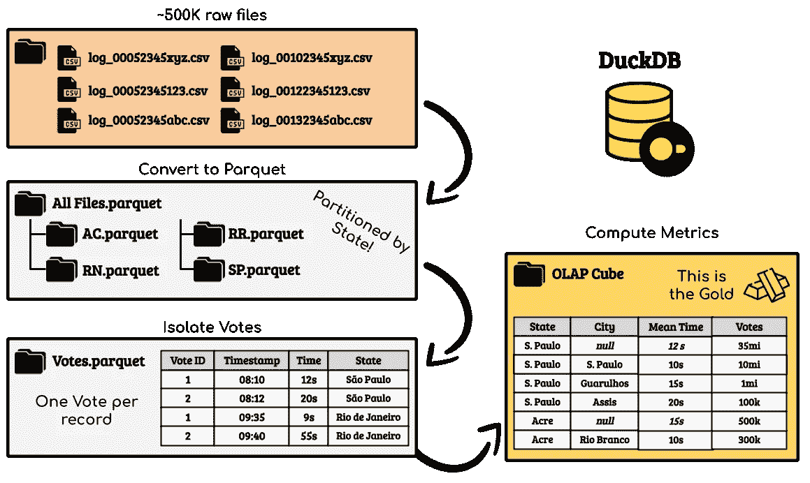
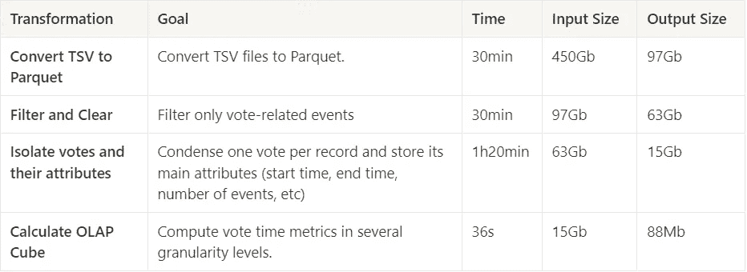
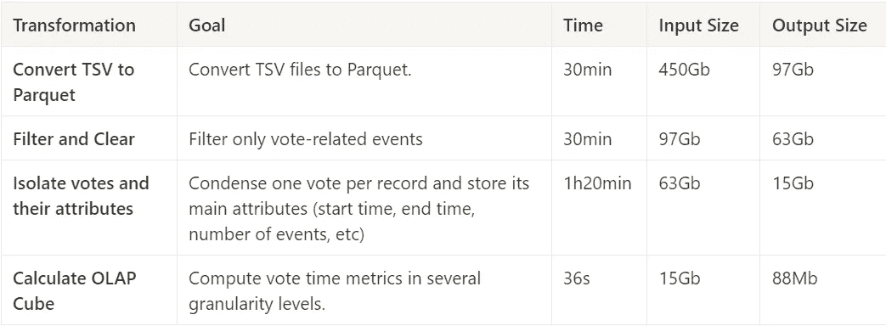

# 我在 DuckDB 中的第一亿条数据（行）

> 原文：[`towardsdatascience.com/my-first-billion-of-rows-in-duckdb-11873e5edbb5?source=collection_archive---------0-----------------------#2024-05-01`](https://towardsdatascience.com/my-first-billion-of-rows-in-duckdb-11873e5edbb5?source=collection_archive---------0-----------------------#2024-05-01)

## DuckDB 处理 450Gb 数据的初步印象，在实际项目中的应用

[](https://joaopedro214.medium.com/?source=post_page---byline--11873e5edbb5--------------------------------)[](https://towardsdatascience.com/?source=post_page---byline--11873e5edbb5--------------------------------) [João Pedro](https://joaopedro214.medium.com/?source=post_page---byline--11873e5edbb5--------------------------------)

·发表于 [Towards Data Science](https://towardsdatascience.com/?source=post_page---byline--11873e5edbb5--------------------------------) ·阅读时间 12 分钟·2024 年 5 月 1 日

--


Duck 蓝图。由 Copilot Designer 生成。

# 介绍

人工智能、数据科学和数据工程领域正在全速发展。每天都有新的工具、新的范式和新的架构被创造出来，始终试图解决前一个问题。在这片充满新机遇的海洋中，了解一些现有工具来高效解决问题是很有趣的。而我说的不仅仅是技术细节，还有使用范围、优缺点、挑战和机会，这些都是通过实践获得的。

在这篇文章中，我将描述我在 DuckDB（一个用于在本地计算机上处理大量数据的新兴数据库）中的第一次体验，并重新审视我以前遇到的一个老问题——巴西电子投票箱日志的处理，以计算投票时间度量。正如你将通过这篇文章看到的，这是一个具有挑战性的问题，是对性能和用户体验评估的一个良好基准。

这个文章的目的是为你提供一些参考，特别是你想了解更多关于 DuckDB 的内容，我将涵盖技术方面的内容，比如运行问题和计算数据库性能，也会谈及一些“软”方面的内容，比如编程体验和可用性。

*DuckDB 是一个开源项目 [*[*OSD*](https://opensource.org/osd)*]，作者与 DuckDB/DuckDB Labs 没有任何关系。所使用的数据符合* [*ODbL*](https://opendatacommons.org/licenses/odbl/) *许可证。这是一个完全免费的项目，不需要支付任何服务费、数据访问费或其他费用。*

# 问题

这个问题包括处理电子投票箱日志中的记录，以获取关于巴西选民投票时间的统计指标。例如，计算公民投票所需的平均时间、收集指纹用于身份识别等等。这些指标应在不同的粒度层次进行聚合：从国家级、州级、选举区级到选举分区级。

如果你不知道，巴西拥有 100%电子投票系统，所有超过一亿的公民都在同一天投票，选举结果几乎实时计算并公布。投票由成千上万的电子投票箱收集，这些投票箱分布在全国各地。


电子投票箱。[来自巴西最高选举法院的图片](https://www.tre-rn.jus.br/comunicacao/noticias/2021/Maio/urna-eletronica-25-anos-100-brasileira-e-admirada-pelo-mundo)。

> 电子投票箱是一种专用的微型计算机，用于选举**工作**，具有以下特点：坚固、小巧、轻便、具有能源自给能力，并具备安全功能 [[4](https://international.tse.jus.br/en/electronic-ballot-box/presentation)]。每台投票箱最多可以容纳 500 名选民，这是为了避免投票地点出现长时间排队的情况。

该系统由 TSE（最高选举法院）管理，TSE 通过其[开放数据门户](https://dadosabertos.tse.jus.br/)分享有关选举过程的数据 [[ODbL](https://opendatacommons.org/licenses/odbl/)]许可证。日志是文本文件，包含投票箱中所有事件的详细列表。

这就是挑战的开始。由于日志记录了每一个事件，因此可以从中计算出大量的指标；它是一个充满活力的信息源泉。但正是这种丰富性，使得它们变得极为难以处理，因为整个国家的记录总量已经达到了 450GB，TSV 文件中有超过 40 亿行。

除了数据量，另一方面使这项工作成为一个良好基准的原因是，达成我们最终目标所需的转换涉及了各种复杂度的操作，从简单的（如 `where`、`group by`、`order by`）到复杂的 SQL 操作（如窗口函数）。

# DuckDB

在如此高的数据量下，人们可能会愿意调用传统的大数据工具，如 Apache Spark，并在集群中使用多个工作节点、几 GB 的 RAM 和十多个 CPU 来处理这些数据。

DuckDB 的创建就是为了挑战这一*现状*。

正如其创始人在[这个视频](https://youtu.be/GaHWuQ_cBhA)中所辩护的那样，这是一种数据库设计，旨在赋予单一机器处理大量数据的能力。

也就是说，放弃寻求复杂的行业解决方案——如 PySpark——或基于云的解决方案——如 Google BigQuery——而是使用本地进程数据库，利用标准 SQL 实现所需的转换。

总而言之，DuckDB 是一个内嵌式（运行在程序内部，没有独立进程，类似于 SQLite）、OLAP（针对分析负载进行优化）、能够处理传统格式数据（CSV、Parquet）的数据库，优化了在单台机器上处理大量数据的能力（不需要特别强大的机器）。

# 数据

一个投票箱的日志是一个标准化名称的单一 TSV 文件 — XXXXXYYYYZZZZ.csv，包含投票箱位置的元数据，其中前 5 位数字是城市代码，接下来的 4 位是选举区（一个地理州的子区域），最后 4 位是选举区段（即投票箱本身）。

巴西几乎有 50 万个投票箱，因此几乎有 50 万个文件。文件的大小取决于该选区选民的数量，范围从 1 到 500。这就是日志的样子：

```py
2022-10-02 09:35:17 INFO 67305985 VOTA Voter was enabled
2022-10-02 09:43:55 INFO 67305985 VOTA Vote confirmed for [Federal Deputy]
2022-10-02 09:48:39 INFO 67305985 VOTA Vote confirmed for [State Deputy]
2022-10-02 09:49:10 INFO 67305985 VOTA Vote confirmed for [Senator]
2022-10-02 09:49:47 INFO 67305985 VOTA Vote confirmed for [Governor]
2022-10-02 09:50:08 INFO 67305985 VOTA Vote confirmed for [President]
2022-10-02 09:50:09 INFO 67305985 VOTA The voter's vote was computed
# Literal Translations to English
# Events that represent a vote
```

我们的目标是将这些原始信息转化为有关投票时间的统计指标（每个选民投票所需的时间是多少？每分钟计算多少票？），并在不同的粒度层级（国家、州、城市）上实现这一目标，为此我们将创建一个[OLAP 立方体](https://en.wikipedia.org/wiki/OLAP_cube)，如图所示：

```py
| State         | City              | Mean Voting Time (seconds) | Max Votes Computed in 5 Min |
|---------------|-------------------|----------------------------|-----------------------------|
| Null          | Null              | 50                         | 260                         |
| São Paulo     | São Paulo         | 30                         | 300                         |
| São Paulo     | Campinas          | 35                         | 260                         |
| São Paulo     | Null              | 20                         | 260                         |
| Rio de Janeiro| Rio de Janeiro    | 25                         | 360                         |
| Minas Gerais  | Belo Horizonte    | 40                         | 180                         |
| Bahia         | Salvador          | 28                         | 320                         |
| Rio Grande ...| Porto Alegre      | 30                         | 300                         |
| ...           | ...               | ...                        | ...                         |
```

# 实现

## 设置环境

运行此项目所需的仅仅是一个安装了[DuckDB 包的 Python 环境](https://duckdb.org/docs/guides/python/install.html)。

```py
pip install duckdb
```

## 转换数据

在接下来的部分中，我将描述每个转换的目标、DuckDB 如何执行每个转换、优点、挑战、结果和结论。

处理过程分为 4 个步骤：将 TSV 文件转换为 Parquet；过滤和清理；隔离选票及其属性；并计算 OLAP 立方体的指标。



处理步骤。图片由作者提供。

不幸的是，为了避免使这篇文章过于庞大，我不会详细解释每个转换。但所有代码都可以在[GitHub 仓库](https://github.com/jaumpedro214/urna-logs-data-tseng)中找到。

**将 TSV 文件转换为 Parquet**

对于任何想要处理大量数据的人来说，这是一个简单而不可或缺的步骤。在 DuckDB 中进行此操作非常直接。

首先，创建一个 DuckDB 会话：

```py
cursor = duckdb.connect("")
```

在这个例子中，我们用一个空字符串实例化数据库连接器。这样做是为了表明 DuckDB 不应该创建自己的数据库文件，而是仅与系统文件交互。正如之前所提到的，DuckDB 是一个数据库，因此它具有创建表、视图等功能，但我们在这里不会探讨这些功能。我们将专注于将其用作转换引擎。

并定义以下查询：

```py
query = f"""
    COPY (
        SELECT 
            * 
        FROM read_csv('/data/logs/2_{state}/*.csv', filename=True)
    ) TO '{state}.parquet' (FORMAT 'parquet');
"""
```

```py
cursor.execute(query)
```

就这样！

让我们详细看看这个查询：

内部表达式只是一个标准的*SELECT * FROM table* 查询，唯一的区别是，DuckDB 可以直接引用文件，而不是引用表。

这个查询的结果可以导入到 pandas 数据框中进行进一步的表达，就像这样：

```py
my_df = cursor.execute(query).df()
```

这使得 DuckDB 与 pandas 之间的无缝集成成为可能。

外部表达式是一个简单的 *COPY … TO …*，它将内部查询的结果写入文件。

在这个第一次转换中，我们开始看到 DuckDB 的一个优势——能够使用纯 SQL 与文件进行交互，而无需配置任何其他内容。上述查询与我们在标准 SGBD（如 PostgreSQL 和 MySQL）中执行的日常操作完全相同，唯一的区别是，我们不再操作表格，而是与文件进行交互。

原本我们有 **450GB** 的 TSV 文件，约 **30 分钟** 后，我们剩下了 **97GB** 的 Parquet 文件。

## 过滤并清除

如前所述，日志存储了选票箱上发生的每个事件。第一步旨在过滤出仅与投票相关的事件，如“*选民投票选举了总统*”、“*选民采集了指纹*”以及“*投票已计算*”，这些事件发生在选举日（这很重要，因为日志还记录了培训部分和其他行政程序）。

一个简单的查询，但包含大量文本和日期处理：

```py
 VOTES_DESCRIPTIONS = [
    # VOTES
    "event_description = 'Aguardando digitação do título'",  
    # Awaiting voter's title (Voter Registration ID) input
    "event_description = 'Título digitado pelo mesário'",  
    # Voter's title entered by the poll worker
    "event_description = 'Eleitor foi habilitado'",  
    # Voter has been enabled
    "event_description ILIKE 'Voto confirmado par%'", 
    # Vote confirmed for ... could be [PRESIDENT, SENATOR, DEPUTY, ...]
    "event_description = 'O voto do eleitor foi computado'",  
    # Voter's vote has been computed
]

ACCEPTED_DATES = [
    '2022-10-02', '2022-10-30', # Constitutional date of the election filter
    '2022-10-03', '2022-10-31', 
]

query = F"""
    SELECT 
        *
    FROM (
        SELECT
            event_timestamp,
            event_timestamp::date AS event_date,
            event_type,
            some_id,
            event_system,
            event_description,
            event_id,

            REPLACE(SPLIT_PART(filename, '/', 5), '_new.csv', '') AS filename,

            -- Metadata from filename
            SUBSTRING( SPLIT_PART(SPLIT_PART(filename, '/', 5), '-', 2),  1, 5 ) AS city_code,
            SUBSTRING( SPLIT_PART(SPLIT_PART(filename, '/', 5), '-', 2),  6, 4 ) AS zone_code,
            SUBSTRING( SPLIT_PART(SPLIT_PART(filename, '/', 5), '-', 2), 10, 4 ) AS section_code,
            REPLACE(SPLIT_PART(filename, '/', 4), '2_', '') AS uf
        FROM
            {DATASET}
        WHERE 1=1
            AND ( {' OR '.join(VOTES_DESCRIPTIONS)} )
    ) _
    WHERE 1=1
    AND event_date IN ({', '.join([F"'{date}'" for date in ACCEPTED_DATES])})
"""
```

在这个查询中，突出了 DuckDB 的另一个优势：能够读取和写入分区数据。表分区在大数据的背景下非常重要，但在单机架构中尤为关键，因为我们在进行输入和输出操作时使用的是同一磁盘，即它要承受两次负担，每一个优化都非常欢迎。

原本我们有 97GB，但约 30 分钟后，我们剩下了 63GB 的 Parquet 文件。

## 隔离投票及其属性

由于每个投票由多行组成，我们需要将所有信息浓缩成一个唯一的记录，以便简化计算。这里情况变得复杂，因为查询变得复杂，而且不幸的是，DuckDB 无法一次性处理所有数据。

为了克服这个问题，我做了一个循环，以增量的方式处理数据切片：

```py
for state in states:
    for date in ACCEPTED_DATES:
        for zone_group in ZONE_GROUPS:
            query = F"""
                COPY 
                {
                    complex_query_goes_here
                    .replace('<uf>', state)
                    .replace('<event_date>', date)
                    .replace('<zone_id_min>', str(zone_group[0]))
                    .replace('<zone_id_max>', str(zone_group[1]))
                } 
                TO 'VOTES.parquet' 
                (FORMAT 'parquet', PARTITION_BY (event_date, uf, zone_group), OVERWRITE_OR_IGNORE 1);
            """
```

实现细节并不重要，关键是我们不需要对代码做太多改动，就能逐步构建这个最终表格。由于每个处理的“切片”代表一个分区，通过将参数 OVERWRITE_OR_IGNORE 设置为 1，DuckDB 会自动覆盖该分区的任何现有数据，或者如果数据已存在，则忽略它。

原本我们有 63GB，约 1 小时 20 分钟后，最终得到了 15GB 的 Parquet 文件。



## 计算指标并构建 OLAP Cube

这是一个简单的步骤。现在，每个投票都由一个记录表示，所需的只是计算指标。

```py
query_metrics = F"""
    SELECT
        turno, state,
        zone_code,
       section_code,

        COUNT(*) AS total_votes,
        COUNT( DISTINCT state || zone_code || section_code ) AS total_sections,

        SUM( vote_time ) AS voting_time_sum,
        AVG( vote_time  ) AS average_voting_time,

        MAX( nr_of_votes )   AS total_ballot_items_voted,
        SUM( nr_of_keys_pressed ) AS total_keys_pressed

    FROM
        source
    GROUP BY ROLLUP(turno, state, zone_code, section_code)
"""
```

由于我们需要计算多个粒度级别的指标，理想的做法是使用 GROUP BY + ROLLUP。

在这个案例中，DuckDB 表现得尤为突出：我们从 15GB 开始，36 秒后，文件大小缩减到了 88MB！

这是一个惊人的性能，它在不到一分钟的时间里，将超过 2 亿行数据按 4 个不同的粒度级别进行了分组，其中最高级别的基数为 2，最低级别的基数约为 200,000！

# 结果

下表总结了结果：



整个管道的执行时间约为 2 小时 30 分钟，运行在 WSL 上，配置如下：约 16GB 的 DDR4 内存，一颗 Intel 第 12 代 Core i7 处理器，和 1TB NVMe SSD。

在这个过程中，我注意到内存使用成为了瓶颈，因为 DuckDB 不断在磁盘的 .temp/ 目录中创建临时文件。另外，我在运行带有 Windows 函数的查询时遇到了很多问题：这些查询不仅执行时间超出了预期，还出现了程序随机崩溃的情况。

尽管如此，我认为最终的性能是令人满意的，毕竟我们讨论的是仅通过一台计算机（相对于计算机集群而言，性能不算特别强大）处理 1/2TB 的数据，并执行复杂的查询。

# 结论

事实上，处理数据有时就像提炼铀矿。我们从一大堆原材料开始，通过一个艰难、耗时且昂贵的过程（有时还可能会危及生命），提取出一小部分有用的精炼信息。

说正经的，在我的帖子中，我探索了很多数据处理的方式，讨论了工具、技术、数据架构……始终在寻找最好的做事方法。这类知识非常重要，因为它帮助我们选择合适的工具来做合适的事。本文的目标正是要了解 DuckDB 能解决什么样的工作，以及它适合什么样的使用体验。

总体来说，这是一次不错的体验。

与这个数据库的合作非常顺利，我几乎不需要配置任何东西，只需导入数据并使用普通的 SQL 语句进行操作。换句话说，对于那些已经懂 SQL 和一点 Python 的人来说，这个工具几乎没有什么初始使用门槛。在我看来，这正是 DuckDB 的巨大胜利。它不仅赋予我的机器处理 450GB 数据的能力，而且在环境（以及程序员）适应成本低的情况下达成了这一目标。

就处理速度而言，考虑到项目的复杂性、450GB 的数据量以及我没有优化数据库参数，2 小时 30 分钟是一个不错的结果。尤其是考虑到，如果没有这个工具，想要在我的电脑上完成这个任务几乎是不可能的，或者说是极其复杂的。

DuckDB 在 Pandas 和 Spark 之间某种程度上是一个折衷方案。对于小规模数据，Pandas 在可用性方面可能更具吸引力，尤其是对于那些有一定编程背景的人，因为这个包有许多内置的转换，这些在 SQL 中实现起来可能会很棘手。它还与许多其他 Python 包，包括 DuckDB，具有无缝集成。对于极大规模的数据，Spark 可能是更好的选择，具备并行处理、集群等特性。因此，DuckDB 填补了中型到不算太大的项目的空白，在这些项目中使用 Pandas 是不可行的，而使用 Spark 则过于复杂。

DuckDB 扩展了单台机器能够达到的极限，并扩大了可以在本地开发的项目范围，为大规模数据分析/操作带来了速度。毫无疑问，它是一个强大的工具，我会自豪地将它加入到我的工具箱中。

此外，我希望这篇文章能帮助你更好地了解 DuckDB。和往常一样，我并不是本文所涉及主题的专家，我强烈建议进一步阅读，以下是我的参考文献，代码也可以在 GitHub 上找到。

感谢阅读！ ;)

# 参考文献

> *所有代码可在* [*此 GitHub 仓库*](https://github.com/jaumpedro214/urna-logs-data-eng)*中找到。
> 
> 想了解更多类似的作品吗？访问我的* [*文章仓库*](https://github.com/jaumpedro214/posts)*。

[1] *2022 年结果 — 传输文件用于汇总 — TSE 开放数据门户*。[链接](https://dadosabertos.tse.jus.br/dataset/resultados-2022-arquivos-transmitidos-para-totalizacao)。[[ODbL](https://opendatacommons.org/licenses/odbl/)]

[2] Databricks。（2023 年 6 月 29 日）。[*数据 + AI 峰会主旨演讲，星期四第五部分 — DuckDB*](https://www.youtube.com/watch?v=GaHWuQ_cBhA)。YouTube。

[3][*DuckDB 官方* *文档*](https://duckdb.org/docs/)。DuckDB。

[4][电子投票箱](https://international.tse.jus.br/en/electronic-ballot-box/presentation)。*最高选举法院*。

[5] 维基百科贡献者。（2023 年 7 月 25 日）。[*OLAP 立方体*](https://en.wikipedia.org/wiki/OLAP_cube)。维基百科。

[6] Duckdb — GitHub。[*窗口性能 · 问题 #7809 · duckdb/duckdb*](https://github.com/duckdb/duckdb/issues/7809)。

[7] Gunnarmorling。*GitHub — gunnarmorling/1brc:* [*1️⃣🐝🏎️ 十亿行挑战*](https://github.com/gunnarmorling/1brc) *— 一次有趣的探索，了解如何快速汇总来自文本文件的 10 亿行数据，使用 Java*。
