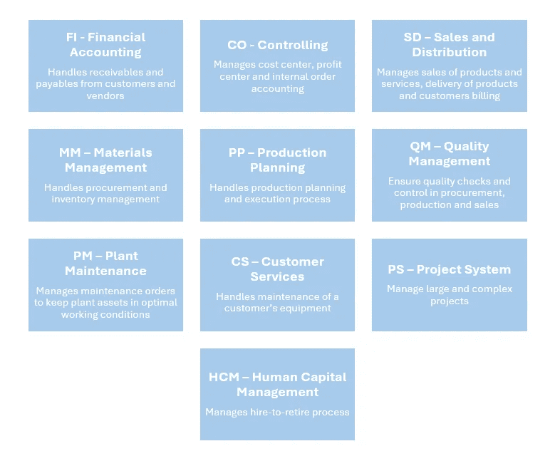
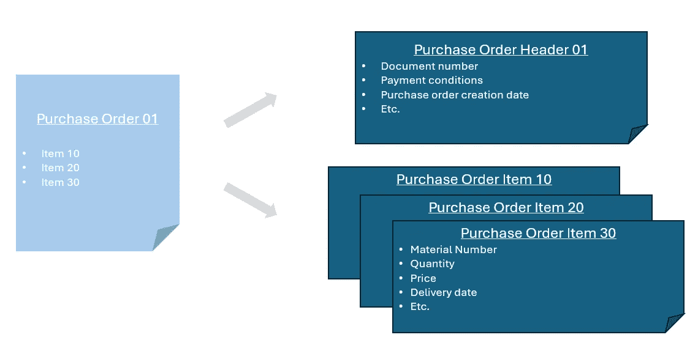
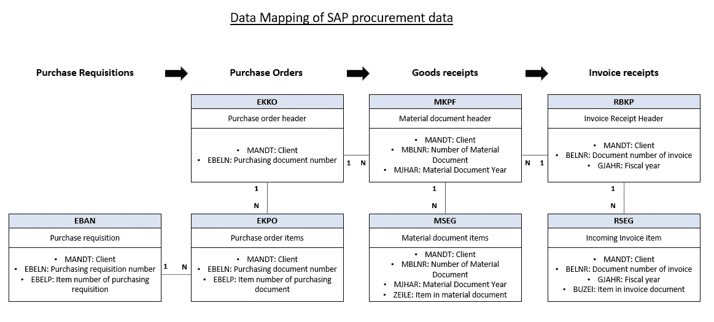

# 我掌握 SAP 数据模型的第一步

> 原文：[`towardsdatascience.com/my-first-steps-into-mastering-saps-data-models-4d20ad2485f2?source=collection_archive---------2-----------------------#2024-04-24`](https://towardsdatascience.com/my-first-steps-into-mastering-saps-data-models-4d20ad2485f2?source=collection_archive---------2-----------------------#2024-04-24)

## 如果你是一个好奇的读者，想了解更多关于 SAP 数据模型的信息，那么你来对地方了！

 [Ayoub El Outati](https://medium.com/@ayoubeloutati?source=post_page---byline--4d20ad2485f2--------------------------------)

·发布于 [Towards Data Science](https://towardsdatascience.com/?source=post_page---byline--4d20ad2485f2--------------------------------) ·8 分钟阅读·2024 年 4 月 24 日

--

你好，Medium 的读者们！我很高兴与大家分享我最近在一个项目中的一些收获，在这个项目中，我深入探讨了 SAP 数据模型的复杂性。

出于保密原因，我无法分享所有的项目细节 🤫。不过，我会讨论一个我在面对 SAP 数据模型复杂性时遇到的挑战：**SAP 数据架构是什么样的，所有内容如何整合成一个对业务用户有意义的连贯数据模型？**

在这个项目中，我的主要工作是将数据集成到一个分析/挖掘平台中，使用 SAP 采购流程相关的业务数据。随着项目的进展，我遇到了一些关于数据建模的问题，并且需要在 SAP 数据库的各个表格之间找到我的方向。

图片来自[Tingey Injury Law Firm](https://unsplash.com/@tingeyinjurylawfirm?utm_source=medium&utm_medium=referral) 在[Unsplash](https://unsplash.com/?utm_source=medium&utm_medium=referral)

我的目标是创建一个连贯的数据模型，能够高效地支撑未来的仪表盘、报告以及其他分析输出，所有这些都将在下一步计划中实现。为了达到这个目标，我必须完全理解 SAP 数据架构的基本知识、表映射等内容。这不是一项简单的任务，但我成功地掌握了这些新知识 🚀

## 1) SAP，企业资源规划软件的领导者

如你所知，SAP 是企业资源规划（ERP）软件的领先提供商之一，与 Oracle 和 Infor 等公司并列。目前，SAP ERP 软件有两代版本：SAP ECC 及其继任者 SAP S/4 HANA。

两个软件的组件涵盖了公司的所有职能，这些职能不仅是内向型的，还包括外向型的，例如客户侧（CRM）和供应商侧（SCM）。它由不同的模块组成，涵盖了公司所有的需求：销售、生产、物流、财务、人力资源、售后服务。

SAP ECC 模块 — 作者提供的图片

这是一个将所有业务流程整合到单一数据库中的软件包。它还自动考虑不同流程之间的相互依赖关系。换句话说，SAP 或一般的 ERP 软件，作为业务流程的核心，依靠大量的数据和事务驱动。

对于数据分析和过程优化项目，我们只能说，将 SAP 中的数据整合并为前端使用建模，以提供业务流程的端到端视图并识别低效之处，确实是有益的。然而，在没有首先了解数据在 SAP 中如何组织的情况下，这可能会非常具有挑战性。

## **2) SAP 的数据和表格类型**

SAP 的数据是如何组织的？简而言之，SAP 数据库中的多个表格存储了所有由 SAP 事务生成的数据，例如在采购功能中创建供应商或采购订单。此外，需要注意的是，虽然一些表格随时间推移保持稳定，但其他表格则存储了捕捉到特定商业事件的数据，这些事件对日常运营至关重要。在 SAP 中创建供应商或采购订单的例子很好地说明了这一点。

让我们以汽车行业的一家公司为例。该公司会有一个供应商表，列出他们常合作的供应商，以采购制造汽车和其他物品所需的材料。在此表中创建一个新供应商是一个罕见的事件，可能一年只会发生几次。**这个表格被称为主表，仅存储主数据。**

与此同时，创建采购订单是一个操作任务。公司内部的采购团队通常使用 MM（物料管理）事务来创建采购订单（例如，数百万个采购订单）。**因此，存储所有这些采购订单的表格被称为事务表，这种类型的数据被称为事务数据。**

在 SAP ECC 和 S/4 HANA 中，两个表有特定的名称。**供应商主表被称为 LFA1 表，而采购订单存储在 EKKO 表中。** 对于第一次接触 SAP 表的人来说，可能无法仅凭表名就清楚每个表所代表的内容。例如，如果我提到 MCHA、MSEG、BSEG 等名称，你会知道这些是 SAP 表，但不一定知道它们存储的信息。它们是存储生产订单、财务账户还是发票？

别担心😉，在文章的末尾你会找到一个有用的网站，可以进一步了解 SAP 表格命名，照片来源：[Siora Photography](https://unsplash.com/@siora18?utm_source=medium&utm_medium=referral) 于 [Unsplash](https://unsplash.com/?utm_source=medium&utm_medium=referral)

这正是为什么对我来说，进行研究、做笔记并记住在项目范围内的表格是如此重要。更重要的是，我需要理解每个表格中使用的关系和字段。在这个阶段，映射这些数据以便快速理解也同样重要。

## 3) SAP 采购表格的数据映射

在这类项目中，你可能会面临的另一个挑战是理解 SAP 的数据架构以及如何定义采购业务流程。幸运的是，我之前在与采购团队合作的流程改进项目中的经验，对于理解采购流程非常有帮助。在进入 SAP 数据模型或采购表格映射之前，让我们简要回顾一下采购流程中的主要对象。

简而言之，采购是从供应商那里购买某些物品的过程，可能是原材料、服务、工具等。**该过程包括接收购买的物品、验证其状态，然后启动支付流程，通常称为应付账款流程**。然而，这一过程超出了我们此次讨论的范围。

照片来源：[Alexander Grey](https://unsplash.com/@sharonmccutcheon?utm_source=medium&utm_medium=referral) 于 [Unsplash](https://unsplash.com/?utm_source=medium&utm_medium=referral)

在整个过程中，采购团队承担着各种任务：他们验证采购需求单，创建采购订单，并将这些订单发送给供应商。大多数这些任务是通过企业资源计划（ERP）软件完成的，特别是 SAP 中的物料管理（MM）模块。在这一系列活动流程中，关键对象或组件从一个步骤过渡到下一个步骤：

+   **采购需求单：** 这些通常由生产团队在内部创建，旨在通知采购团队某个特定物品需要为生产目的进行采购。

+   **采购订单：** 这些订单由采购团队创建，包含有关待购买物品的详细信息，如数量、应接收采购订单的供应商及其他相关数据。

+   **收货单：** 在收到采购订单中提到的商品后，供应商会提供收货单。该收货单对于核实仓库收到的商品是否与采购订单中的要求相符至关重要。

+   **发票收据：** 该文档确认收到的商品和服务是正确的，并且与采购订单一致。它常用于启动支付流程以支付供应商。

SAP 中的每个对象都有其关联的交易表，存储所有已创建的对象。例如，如前所述，采购订单存储在 EKKO 表中。**然而，在 SAP 表格中还有另一层复杂性需要考虑：头部和项目文档的概念。**

在 SAP 中，像采购订单这样的对象或文档有两个层次的表示：头部层次和项目层次。这是因为，从概念上讲，文档始终由两个层次的信息组成。头部包含一般和汇总数据，而项目则对应文档中的具体行。

举个例子，假设你正在购买 PS5、《最后生还者 2》和一副耳机。

图片由 [Samuel Regan-Asante](https://unsplash.com/@reganography?utm_source=medium&utm_medium=referral) 提供，来源于 [Unsplash](https://unsplash.com/?utm_source=medium&utm_medium=referral)

您最终的订单将包括包含您的地址和订单号的头部。您购买的商品以及它们的数量（在这种情况下，每个项目一个）和价格，将在项目行中单独列出。

采购订单格式 — 作者提供的图像

然后，一个常见的问题是：EKKO 表代表的是头部数据还是项目数据？**正确答案是头部数据**。**项目数据存储在一个名为 EKPO 的单独表中。**

这个核心概念非常重要，因为它适用于大多数 SAP 对象/文档。发票将有一个用于头部数据的表格和另一个用于项目的表格，货物收据也是如此。然而，采购申请是一个例外，它只有一个项目表。

为了整合和分析 SAP 采购的数据，我需要确定合适的表格来提取数据，并了解它们之间的关系，从而构建相应的数据模型。我所做的映射，旨在可视化这些数据元素是如何相互连接的，详细信息如下：

SAP 采购数据映射示例 — 作者提供的图像

显然，我所做的映射主要集中在采购流程的基本交易表上。可以将额外的表格，包括主数据表和其他交易表——例如，存储采购订单变更的表格——包含在映射中。

这个映射还突出了表格之间的关系，无论是“一对一”、“一对多”还是“多对多”。此外，它还包括构成每个对象主键的字段。

理解每个表的作用以及潜在的关系可能会很耗时。然而，有许多资源可以提供帮助，例如那些帮助我创建这个高级采购数据映射的资源。如果你对了解 SAP 表感兴趣，可以考虑访问这个网站。它提供了每个 SAP 表的详细概述，包括主键、字段、可能的值等。你只需要输入你正在寻找的表名，例如 MSEG，你就可以获得关于该表结构和存储信息类型的更多详细信息：

[*搜索 SAP 表 | LeanX*](https://leanx.eu/en/sap/table/search)

最后，如果这篇文章让你对其他业务功能的 SAP 数据模型产生了更多兴趣，别犹豫，快去查看 SAP 社区网站。你将会找到一些有趣的内容，例如同样的财务功能高级数据映射：

[*MM 和 FI 表的关系（基础）— SAP 社区*](https://community.sap.com/t5/technology-blogs-by-members/a-relationship-basic-of-mm-and-fi-tables/ba-p/13319086)

*希望你喜欢这篇关于 SAP 数据模型的入门指南！欢迎留下掌声 👏、评论 🗨️ 或与同事分享 📨 这篇文章。*

*感谢阅读，别忘了关注我获取更多文章 🚀*
