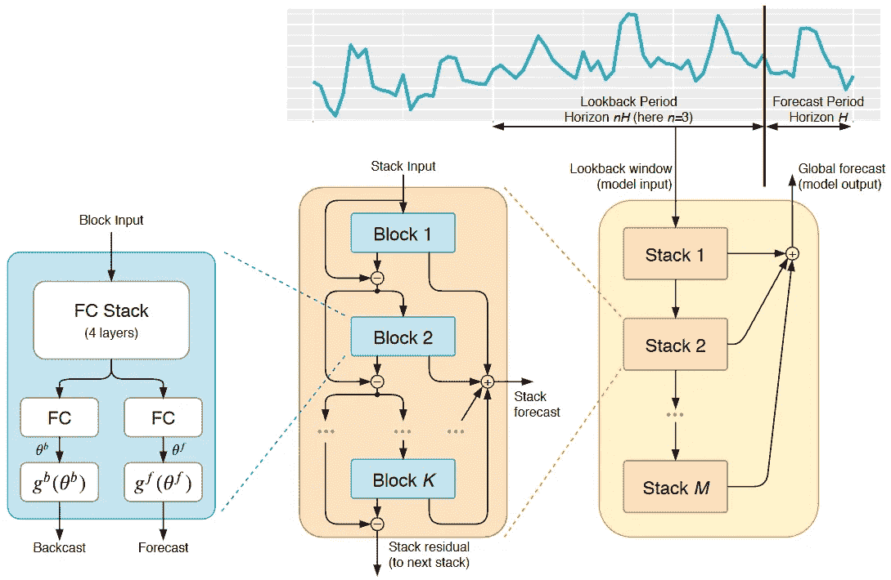

# N-BEATS — 第一个在时间序列预测中有效的可解释深度学习模型

> 原文：[`towardsdatascience.com/n-beats-the-first-interpretable-deep-learning-model-that-worked-for-time-series-forecasting-06920daadac2?source=collection_archive---------2-----------------------#2024-05-11`](https://towardsdatascience.com/n-beats-the-first-interpretable-deep-learning-model-that-worked-for-time-series-forecasting-06920daadac2?source=collection_archive---------2-----------------------#2024-05-11)

## 易于理解的 N-BEATS 工作原理深度解析，以及你如何使用它。

 [Jonte Dancker](https://medium.com/@jodancker?source=post_page---byline--06920daadac2--------------------------------)

·发表于[Towards Data Science](https://towardsdatascience.com/?source=post_page---byline--06920daadac2--------------------------------) ·11 分钟阅读·2024 年 5 月 11 日

--

N-BEATS 架构（图片来自[Oreshkin 等人](https://arxiv.org/pdf/1905.10437)）。

时间序列预测一直是深度学习和 Transformers 未能超越其他模型的唯一领域。

从 Makridakis M 比赛来看，获胜的解决方案总是依赖于统计模型。直到 M4 比赛，获胜的解决方案才是纯统计模型或机器学习与统计模型的混合。纯机器学习方法几乎无法超越竞争基准。

这一切在 2020 年由[Oreshkin 等人](https://arxiv.org/pdf/1905.10437)发表的一篇论文中发生了变化。作者们发布了 N-BEATS，这是一种有前景的纯深度学习方法。该模型超越了 M4 竞赛的获胜方案。它是第一个超越成熟统计方法的纯深度学习方法。

N-BEATS 代表**N**eural **B**asis **E**xpansion **A**nalysis for Interpretable **T**ime **S**eries（可解释的时间序列神经基础扩展分析）。

在本文中，我将介绍 N-BEATS 背后的架构。但请不要担心，深入讲解将会易于理解。我还将展示如何使深度学习方法具有可解释性。然而，仅仅理解 N-BEATS 如何工作是不够的。因此，我将向你展示如何…
