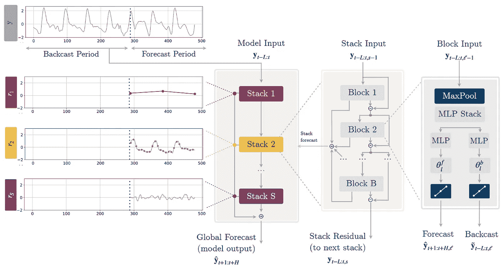

# N-HiTS — 使深度学习在时间序列预测中更加高效

> 原文：[`towardsdatascience.com/n-hits-making-deep-learning-for-time-series-forecasting-more-efficient-d00956fc3e93?source=collection_archive---------3-----------------------#2024-05-30`](https://towardsdatascience.com/n-hits-making-deep-learning-for-time-series-forecasting-more-efficient-d00956fc3e93?source=collection_archive---------3-----------------------#2024-05-30)

## 深入探讨 N-HiTS 如何工作以及如何使用它

 [Jonte Dancker](https://medium.com/@jodancker?source=post_page---byline--d00956fc3e93--------------------------------)

·发布于 [Towards Data Science](https://towardsdatascience.com/?source=post_page---byline--d00956fc3e93--------------------------------) ·10 分钟阅读·2024 年 5 月 30 日

--

N-HiTS 架构（图片来自 [Challu 和 Olivares 等人](https://arxiv.org/abs/2201.12886)）。

2020 年，N-BEATS 是第一个在时间序列预测中超越统计模型和混合模型的深度学习模型。

两年后的 2022 年，一款新模型将 N-BEATS 从其宝座上推翻了。[Challu 和 Olivares 等人](https://arxiv.org/abs/2201.12886)发布了深度学习模型 N-HiTS。他们解决了 N-BEATS 在较长预测时间跨度上的两个短板：

+   降低准确度并

+   增加计算量。

N-HiTS 代表 **N**eural **Hi**erarchical Interpolation for **T**ime **S**eries Forecasting。

该模型基于 N-BEATS 及其神经基扩展的思想。神经基扩展发生在多个跨层堆叠的块中。

在本文中，我将介绍 N-HiTS 背后的架构，特别是与 N-BEATS 的区别。但是不要担心，深入探讨将易于理解。不过，单单理解 N-HiTS 如何工作还不够。因此，我将向你展示如何在 Python 中轻松实现一个 N-HiTS 模型，并调整其超参数。

# **如果核心思想相同，N-BEATS 和 N-HiTS 有什么区别呢**…
