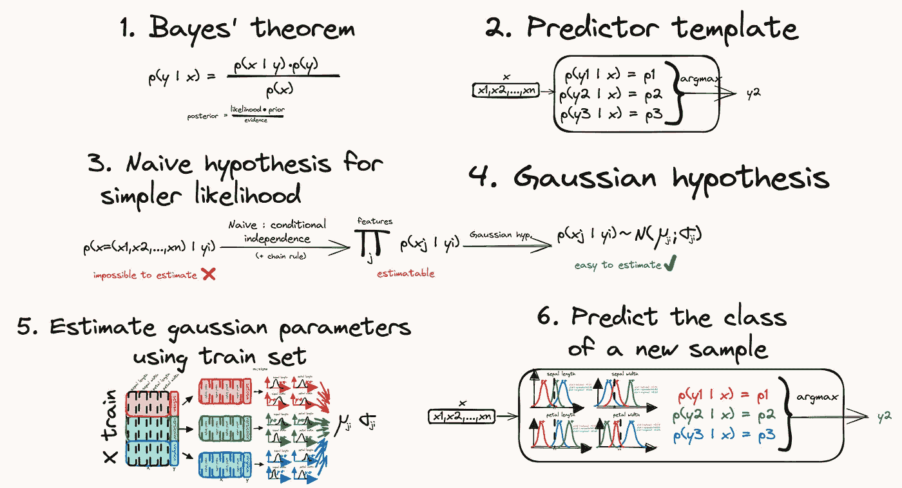

# 朴素贝叶斯，清晰解释

> 原文：[`towardsdatascience.com/naive-bayes-clearly-explained-880e00560050?source=collection_archive---------3-----------------------#2024-03-02`](https://towardsdatascience.com/naive-bayes-clearly-explained-880e00560050?source=collection_archive---------3-----------------------#2024-03-02)

## 使用高斯方法在 scikit-learn 中解决鸢尾花数据集问题。

 [Yoann Mocquin](https://mocquin.medium.com/?source=post_page---byline--880e00560050--------------------------------)

·发布于 [Towards Data Science](https://towardsdatascience.com/?source=post_page---byline--880e00560050--------------------------------) ·10 分钟阅读·2024 年 3 月 2 日

--

在这篇文章中，我们将深入探讨一种特定的分类器，称为朴素贝叶斯分类器。这些方法依赖于贝叶斯定理和朴素假设，即每一对特征在给定类别标签的条件下是条件独立的。如果这对你来说没有意义，继续阅读！

作为一个示例，我们将使用著名的鸢尾花数据集（[CC BY 4.0 许可证](https://archive.ics.uci.edu/dataset/53/iris)）和一种特定的朴素贝叶斯分类器，称为高斯朴素贝叶斯分类器。请记住，鸢尾花数据集由 4 个数值特征组成，目标是三种鸢尾花类型中的任意一种（setosa、versicolor、virginica）。

我们将把该方法分解为以下步骤：

所有图像由作者提供。

1.  复习贝叶斯定理：这个定理提供了一个数学公式，允许我们估计一个给定样本属于某个类别的概率。

1.  我们可以创建一个分类器，一个对于输入样本返回预测类别的工具，通过比较该样本属于每个类别的概率。

1.  使用链式法则和条件独立性假设，我们可以简化概率公式。

1.  然后，为了能够计算概率，我们……
