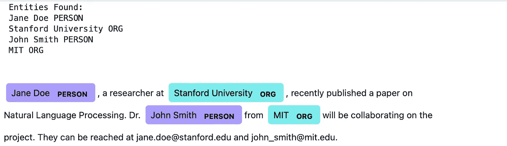
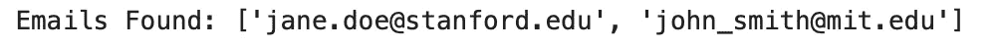

# 命名实体识别揭秘——必备指南

> 原文：[`towardsdatascience.com/named-entity-recognition-unmasked-the-essential-guide-404ad0568964?source=collection_archive---------3-----------------------#2024-03-29`](https://towardsdatascience.com/named-entity-recognition-unmasked-the-essential-guide-404ad0568964?source=collection_archive---------3-----------------------#2024-03-29)

## 如何像专家一样使用 NER 从文本语料库中提取个人信息

[](https://rechitasingh.medium.com/?source=post_page---byline--404ad0568964--------------------------------)[](https://towardsdatascience.com/?source=post_page---byline--404ad0568964--------------------------------) [Rechitasingh](https://rechitasingh.medium.com/?source=post_page---byline--404ad0568964--------------------------------)

·发表于 [Towards Data Science](https://towardsdatascience.com/?source=post_page---byline--404ad0568964--------------------------------) ·9 分钟阅读·2024 年 3 月 29 日

--


图片来源：[Christopher Gower](https://unsplash.com/@cgower?utm_source=medium&utm_medium=referral) 在 [Unsplash](https://unsplash.com/?utm_source=medium&utm_medium=referral)

## **介绍**

好吧，假设这样一种情况——你有大量的文章、期刊和博客，里面充满了你想处理的信息。现在假设你认为，如果社区能够有机会处理这些数据，可能对他们也会有所帮助，但是，你不想立即分享这些数据，因为它可能包含某些个人信息，未经这些人的同意不应共享。

由于向所有这些人请求许可不可行，你决定运用自己的技能，在 FERPA 指南下掩盖任何个人信息。公司在将数据分享出去进行分析或演示时，通常会对数据进行掩盖，数字数据更容易做到这一点。我们在这里也想做同样的事情，但针对的是文本数据。

现在，在这里，由于我们讨论的是文本数据，我们将使用自然语言处理（NLP）中的一种技术。引入命名实体识别（NER），一个可靠的 NLP 侦探，揭示那些隐藏的数据宝藏。这里的目的是识别个人信息。

让我们深入了解 NER 是如何工作的，NER 机制背后的概念，如何实现 NER，选择哪种解决方案方法以及为什么选择它，以及如何在 Python 中实现这一问题的解决方案。

## **命名实体识别（NER）：技术解析**

简单来说，NER 就是教计算机在文本中识别特定的“实体”，在这种情况下是个人身份信息（PII）。你可以把它想象成给程序一套荧光笔——一种标记名字，一种标记地点，一种标记公司，一种标记大学、学生 ID、电子邮件地址或任何能识别个人身份并危及其隐私的内容。下面是 NER 如何工作的一个简要介绍：

+   **基于规则的系统：** 传统的方法。我们创建手写规则，例如“一个名字通常以大写字母开头”。对于基础案例有效，但可能变得非常复杂。此外，如果有很多规则，系统会变得越来越混乱。

+   **机器学习方法：** 统计模型通过大量数据集进行学习。可以把它理解为向你的命名实体识别（NER）系统展示大量示例，让它自己找出模式。这就是机器学习在所有领域中的工作方式。然而，涉及文本数据时，它仍然可能存在性能问题。

+   **深度学习明星：** 神经网络是解决文本、图像和视频数据相关问题的最著名模型方法。处理复杂语言，类似我们人类的方式。这些模型能够理解上下文，使其非常精确。唯一的条件是，你需要使用大量的数据，否则模型将大部分训练数据记住（过拟合）。虽然有控制过拟合的技术，但它仍然在大量数据的语料库中效果最好。

## **详细的技术分析：NER 背后的“大脑”**

我们已经看到，NER 可以利用多种技术，每种技术都有其优势。下面是更深入的分析：

1.  **条件随机场（CRFs）：**

想象一下，你在教 NER 系统识别位置。你展示像“10 Made UP Street, London, UK”这样的地址示例。CRFs 在这方面表现出色，因为它们会查看整个词序列及其关系。它们考虑到“London”跟在数字后面，且“UK”跟在城市后面，这强烈暗示这是一个位置实体。这使得 CRFs 在像 NER 这样的任务中非常强大，因为上下文非常重要。

阅读这篇关于 CRF 及其背后数学原理的精彩文章：条件随机场解释，作者：[Nikos Kafritsas](https://medium.com/u/bec849d9e1d2?source=post_page---user_mention--404ad0568964--------------------------------)

**2. LSTM 网络（长短期记忆网络）：**

假设你想识别文本中的人名。LSTM 是继 RNN 之后的一项伟大发明，因为它们具有一种特殊的能力——记忆！是的，它们可以保持记忆或上下文，并根据上下文进行预测。与仅考虑当前单词的 CRFs 不同，LSTM 可以记住序列中的前一个单词，并不会偏离上下文。这对 NER 非常重要。为什么？因为这将帮助你理解它是指“Apple”公司，还是指“Apple”水果。

再举一个例子：“史密斯博士是著名的心脏病专家”这句话中，LSTM 能够记住头衔“博士”，并利用这个上下文正确地将“史密斯”分类为一个人名。

这里有一个现实世界的例子：假设你正在构建一个新闻分类模型，依据提到的人物来分类文章。基于 LSTM 的 NER 系统肯定可以识别诸如“巴拉克·奥巴马”或“Elon Musk”这样的实体，即使他们的名字出现在复杂的句子中并被正确分类。不错的实现，对吧？

阅读这篇文章了解[Rian Dolphin](https://medium.com/u/2f79d1e1bf6d?source=post_page---user_mention--404ad0568964--------------------------------)的《LSTM 全面介绍》。

**3. Transformers：**

Transformers 是当前 NLP 领域的热门话题，NER 也不例外。这些模型使用一种注意力机制，就像你将所有注意力集中在画中的某个细节上一样。它们的做法是，关注整个句子中的相关词汇，而不仅仅是附近的词。可以想象成一个人看着他/她从未读过的文本。我们在各处扫视，聚焦（像聚光灯一样）不同的部分并捕捉意义。这种技术使得它们能够理解复杂的关系，甚至识别出那些不太显眼的实体。

例如，考虑这句话：“位于加利福尼亚的 Acme 公司首席执行官宣布了一款新产品的发布。” 基于 Transformer 的命名实体识别（NER）系统可以关注“CEO”和“Acme 公司”，即使它们之间被几个词分开。然后，它可以利用这种关注来正确地将“Acme 公司”分类为一个组织。

这种能力使得 Transformer 非常适合用于诸如在研究论文中识别医学术语或在社交媒体数据中识别特定产品名称等任务。

阅读这篇文章了解微调能做什么：使用 Transformers 和 Spacy 进行 NER by [James Briggs](https://jamescalam.medium.com/)。如果你仍在疑惑 Attention 是什么，先阅读这篇文章，它详细讲解了 Attention：你需要了解的所有关于‘Attention’和‘Transformers’的信息 — 深入理解 — 第一部分 by [Arjun Sarkar](https://arjun-sarkar786.medium.com/)

**超越基础：新兴技术**

NER 领域正在不断发展。以下是一些值得关注的令人兴奋的发展：

+   **双向 LSTM（BiLSTM）：** 这些是升级版的 LSTM，能够正向和反向处理文本。这使得它们能够更深入地理解上下文。它也有一些缺点，因为你无法使用它来进行预测，因为你要同时将句子正向和反向输入。所以系统能知道上下文。

+   **命名实体消歧（NED）：** 再次以苹果为例。假设你在文本中看到了“Apple”这个名字。是指科技巨头还是指水果？NER 可以与 NED 结合，以识别在上下文中最可能的含义。

通过理解这些技术并保持对最新进展的更新，你可以利用 NER 的力量从文本数据中提取有价值的个人信息，并推动你的研究工作。

## **命名实体识别（NER）实践：你的项目代码一瞥**

是时候动手实践了！假设你正在使用 Python 和强大的 spaCy 库：

Python

```py
python -m spacy download en_core_web_trf
```

```py
pip install spacy
pip install nltk
```

```py
import spacy
from spacy import displacy
import nltk  # Assuming you might use NLTK for additional tasks 
from nltk.corpus import stopwords  # Example of utilizing NLTK

# Load a powerful pre-trained NER model (adjust based on your needs)
nlp = spacy.load("en_core_web_trf")

# Define your text for analysis
text = """
Jane Doe, a researcher at Stanford University, recently published a paper on 
Natural Language Processing.  Dr. John Smith from MIT will be collaborating on the 
project.  They can be reached at jane.doe@stanford.edu and john_smith@mit.edu.
"""

# Process the text with NER
doc = nlp(text)

# Print identified entities 
print("Entities Found:")
for entity in doc.ents:
    print(entity.text, entity.label_)

# Visualize the NER results
displacy.render(doc, style="ent", jupyter=True) 
```

输出



作者的图片 — 上述代码的输出

如上所示，虽然 NER 能够完美识别人名和组织名，但却漏掉了它们的电子邮件地址。让我们探索一下为什么会这样以及如何解决。

**漏掉电子邮件地址的原因**

1.  **NER 模型的局限性：** 标准的 NER 模型通常训练于诸如人名、组织、地点等类别。虽然它们*可能*会识别一些电子邮件模式，但这并不是它们的主要强项。因此，在本例中它漏掉了电子邮件地址。

1.  **电子邮件地址的复杂性：** 电子邮件格式可能出奇地多样。像“Gmail”和“Yahoo”这样的简单格式可能会被识别，但更复杂的模式可能会被漏掉。例如，它可能识别 gmail ID，但可能遗漏一些组织特定的 ID。再次强调，这就是在本例中发生的情况。

虽然我们知道原因，但我们可能更关注如何解决问题！

让我们使用以下三种技术中的一种来个性化并解决当前任务：

+   **正则表达式（Regex）：** 正则表达式允许构建特定的模式来匹配电子邮件地址。这一方法很早就被开发出来并且被广泛使用。你可以将它视为一种在编程中识别模式的硬编码方式。以下是一个基本示例：

```py
import re

email_regex = r'\b[A-Za-z0-9._%+-]+@[A-Za-z0-9.-]+\.[A-Z|a-z]{2,}\b'
emails = re.findall(email_regex, text)
print(emails)
```

+   **专门化库：** 你可以使用像 email_validator 这样的库。这些库专门用于电子邮件识别和验证，如果验证电子邮件是你的用例。

+   **增强你的 NER 模型：** 你可以通过提供电子邮件地址作为额外的实体类型来微调你现有的模型。然而，这将需要更多的数据，并且可能需要更复杂的模型训练。这包括使用像 BERT 这样的预训练模型等。再次，阅读这篇文章 NER 与 Transformers 和 Spacy 由[James Briggs](https://jamescalam.medium.com/)撰写。它讨论了如何微调 roBERTA 并使用 spaCy。这样，你会更加清楚这一选项。

为了演示目的，我们选择第一种方法并将其实现到代码中。我们可以增加一个专门提取电子邮件的部分，如下所示：

Python

```py
import re

email_regex = r'\b[A-Za-z0-9._%+-]+@[A-Za-z0-9.-]+\.[A-Z|a-z]{2,}\b'
emails = re.findall(email_regex, text)
print("Emails Found:", emails) 
```

输出



作者的图片 — 上述代码的输出

**选择最佳方法**

理想的解决方案取决于你的具体项目：

+   **简单的电子邮件 + 准确性：** 正则表达式可能足够了。

+   **复杂的电子邮件 + 可靠性：** 专门的电子邮件验证库是最安全的选择。

+   **广泛的 NER 再训练：** 如果其他实体的 NER 准确性很重要，并且你有大量以电子邮件为重点的数据，重新训练你的模型可能是长期解决方案。你没猜错，你可以使用一些先进的技术，如通过微调 BERT 预训练模型，并将其应用于你的问题。使用这些技术之前需要考虑一些重要事项：

    - **数据：** 微调通常需要相当数量的标注数据。如果你的数据有限，其他技术（如正则表达式）可能一开始更实用。

    - **复杂性：** 微调涉及更多的设置，并且可能需要比使用正则表达式或基础库更多的计算资源。

## **提升你的 NER 技能的资源**

+   **spaCy：** 出色的 NLP 库，提供卓越的 NER 支持 ([`spacy.io/`](https://spacy.io/))。

+   **NLTK：** 经典的 NLP 工具包 ([`www.nltk.org/`](https://www.nltk.org/))。

+   **斯坦福 CoreNLP：** 强大的 NLP 工具套件 ([`stanfordnlp.github.io/CoreNLP/`](https://stanfordnlp.github.io/CoreNLP/))

**前路如何**

NER 仍然是一个热门的研究领域——准备迎接那些能理解复杂关系、识别自定义实体并跨语言工作的模型吧！这项技术正在革新我们从浩瀚的文本海洋中提取和利用信息的方式。

**随时提出更技术性的问题或真实世界的例子，帮助我们完善这篇关于命名实体识别（NER）的指南！**

# 关于作者

*亲爱的读者们，我对这个话题充满热情，喜欢写关于数据科学的文章和发人深省的文章。最重要的是，我愿意接受反馈！*

*我很想知道你的评论。如果这篇文章对你有帮助，或者你有任何反馈，请不要犹豫，留言告诉我！如果你希望进一步解释某个话题，也可以留言，我会尽力在这里解答，或者写另一篇相关文章！*

*如果想了解更多关于我的信息，我这里有一篇小文章供你阅读：*

[](https://medium.com/about-me-stories/about-me-rechita-singh-745f9f0511ad?source=post_page-----404ad0568964--------------------------------) [## 关于我 — Rechita Singh

### 数据奇才，思维探索者，在这过程中精通制作烂笑话的艺术

[medium.com](https://medium.com/about-me-stories/about-me-rechita-singh-745f9f0511ad?source=post_page-----404ad0568964--------------------------------)

*让我们开始聊天吧……*
