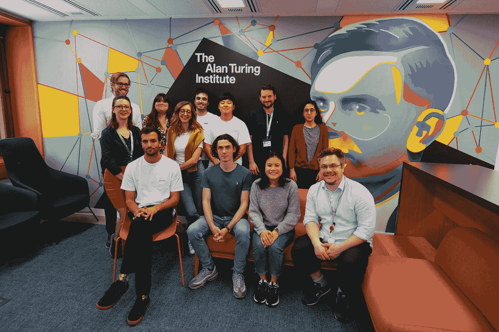
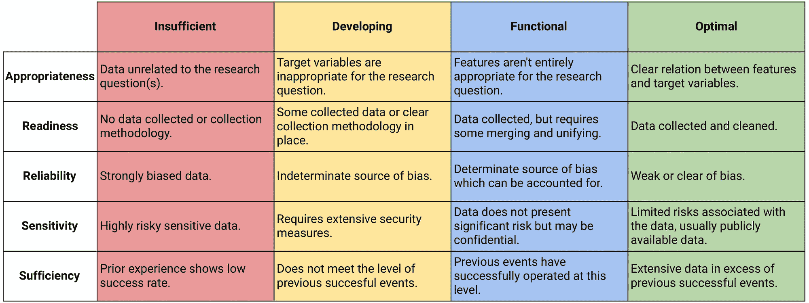
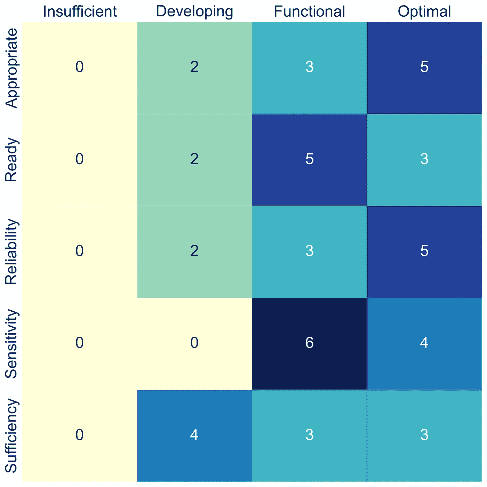

# 在数据马拉松中导航数据：见解与指导 [NeurIPS’23]

> 原文：[`towardsdatascience.com/navigating-data-in-datathons-insights-and-guidelines-at-neural-information-processing-systems-26ef8a1078d4?source=collection_archive---------11-----------------------#2024-02-09`](https://towardsdatascience.com/navigating-data-in-datathons-insights-and-guidelines-at-neural-information-processing-systems-26ef8a1078d4?source=collection_archive---------11-----------------------#2024-02-09)

## 如何在数据马拉松中处理数据

[](https://medium.com/@carmougan?source=post_page---byline--26ef8a1078d4--------------------------------)[](https://towardsdatascience.com/?source=post_page---byline--26ef8a1078d4--------------------------------) [Carlos Mougan](https://medium.com/@carmougan?source=post_page---byline--26ef8a1078d4--------------------------------)

·发布于 [Towards Data Science](https://towardsdatascience.com/?source=post_page---byline--26ef8a1078d4--------------------------------) ·阅读时间 8 分钟·2024 年 2 月 9 日

--

## 什么是数据马拉松？

数据马拉松或数据黑客马拉松，广义上定义为以数据或数据科学为中心的黑客马拉松，近年来变得越来越受欢迎，为参与者和组织提供了一个平台，能够在短时间内进行协作、创新和学习，专注于数据科学领域。

这些活动挑战参与者在限定的时间内解决与数据相关的问题，要求他们理解数据科学并对所使用的数据保持敏锐的意识。

## 问题是什么？

数据马拉松是高能量的活动，数据科学和机器学习从业者聚集一堂，共同解决紧迫问题，这不仅关乎创新，也关乎数据的有效处理。

尽管数据马拉松有显著的潜在好处，组织往往因缺乏明确的指南和最佳实践而在处理数据时面临困难，无法有效应对可能出现的问题。

## 这篇博客的目标是什么？

本文基于 2023 年[神经信息处理系统会议](https://medium.com/u/f5c0769c2aa2?source=post_page---user_mention--26ef8a1078d4--------------------------------)上的一篇论文《*如何在数据马拉松中处理数据*》（[*How to Data in Datathons*](https://arxiv.org/abs/2309.09770)），深入探讨了准备和选择数据参加数据马拉松的关键方面，涉及：

*— 数据对数据马拉松来说* ***合适*** *是什么意思？*

*— 多少数据是* ***足够*** *的数据？*

*— 我们如何识别、分类并使用* ***敏感*** *数据？*

*— 数据分析* ***准备好*** *了吗？*

*— 数据是否* ***可靠*** *？*

该框架来源于艾伦·图灵研究所自 2016 年以来，与 60 多个合作组织共同举办 80 多场数据马拉松挑战赛的经验和洞察！！

它旨在提供一套指南和建议，帮助准备不同类型的数据，以应对数据马拉松，这些建议来源于广泛的数据马拉松组织经验。如果有兴趣，考虑作为参与者或挑战拥有者参加其中的一个数据学习小组活动；更多信息请见[[此处]](https://www.turing.ac.uk/collaborate-turing/data-study-groups)



这是艾伦·图灵研究所应用技能团队的合影，摄于 2023 年 5 月。

# 在数据马拉松中的数据评估



数据评估矩阵。摘自《如何在数据马拉松中使用数据》#NeurIPS23

对于数据马拉松来说，任何数据都不行。数据需要是“适用的”、“充分的”，并且要考虑到隐私问题。组织者和参与者常常会遇到这样的问题：什么样的数据适合数据马拉松？多少数据才算足够？我们如何处理敏感数据？每个维度都对于确保数据马拉松使用的数据适合、合乎伦理并有助于实现活动目标至关重要。让我们逐一探讨这些方面。

# **1. 数据适用性**

数据的适用性关乎其在解决数据马拉松特定挑战问题时的相关性和实用性。本维度评估提供的数据是否与数据马拉松的目标一致，确保参与者能够获得合适的数据来进行工作。

+   *不足：* 数据与数据马拉松的目标显然没有关联，使得参与者无法有效使用。例如，为一个关注金融预测的挑战提供天气数据完全不合适。

+   *发展中：* 虽然数据与挑战有一定相关性，但缺乏进行全面分析或解决方案开发所需的关键元素或目标变量。

+   *功能性：* 数据是相关的，可以直接应用于挑战。然而，通过加入更多变量或更详细的元数据，仍然有提升其价值的机会，这可能提供更深入的见解。

+   *最优：* 提供的数据完美契合挑战需求，包含丰富的特征、相关的目标变量以及全面的元数据。这个层级代表了理想的情况，参与者可以获取所有进行分析和开发解决方案所需的信息。

# **2. 数据准备度**

准备度评估数据的状态，涉及其是否为即时分析做好了准备。这包括数据的清洁度、完整性、结构和可访问性等因素，这些因素对数据马拉松的效率有着显著影响。

+   *不足:* 数据要么没有收集，要么组织得非常糟糕，必须付出巨大努力才能使其可用。这种情况严重限制了在数据马拉松期间能取得的成果。

+   *正在开发中:* 数据已被收集，但可能不完整、格式不一致或缺乏文档，需进行初步工作后才能开始有意义的分析。

+   *功能性:* 虽然数据需要一些清理或预处理，但它大体上处于可以进行分析的状态。可能需要一些小的努力来整合数据源或正确格式化数据。

+   *最佳:* 数据已准备好进行分析，文档齐全、清晰、结构化。参与者可以专注于应用数据科学技术，而无需担心数据准备工作。

# **3. 数据可靠性**

数据可靠性涉及数据的准确性和偏差问题。它考量数据在多大程度上能够真实反映其所代表的现象或群体。

+   *不足:* 数据存在严重偏差或包含显著错误，可能导致误导性结论。这类数据可能错误地代表某些群体或现象，导致分析结果偏差。

+   *正在开发中:* 由于数据收集和记录过程中可能存在未知的偏差或潜在错误，数据的可靠性尚不确定。这种情况需要在解释时保持谨慎，并可能限制对结果的信心。

+   *功能性:* 存在已知的偏差或问题，但可以通过仔细分析来解决，或承认这些问题是研究的局限性。这个层级的可靠性需要对数据的局限性保持透明。

+   *最佳:* 数据被认为高度可靠，没有已知的显著偏差或错误。它准确地代表了目标现象，可以进行自信且稳健的分析。

# **4. 数据敏感性**

数据敏感性涉及数据的隐私、机密性和伦理问题。它评估了使用和共享数据时所涉及的风险，特别是与个人或专有信息相关的风险。

+   *不足 (第四层级):* 数据高度敏感，存在显著的法律、伦理或个人风险。这类数据通常不适合用于数据马拉松，因为其滥用或造成伤害的潜在风险较高。

+   *正在开发中 (第三层级):* 虽然数据敏感性不如其他级别严重，但仍然需要严格的措施来保护隐私和机密性，这可能会限制其在数据马拉松等开放合作环境中的可用性。

+   *功能性 (第二层级):* 数据敏感性通过去标识化或其他保护措施得到管理，但数据保护仍然是一个重要的考虑因素。参与者在分析过程中必须关注隐私问题。

+   *最佳 (第零层级/第一层级):* 数据的敏感性风险最小，允许更为直接的共享和分析。这一层级适合促进开放合作，而不妥协隐私或伦理标准。

# 5. 充足性

充足性评估提供的数据量和类型是否足以有效解决挑战性问题。它考虑数据的数量、种类和粒度与数据挑战赛目标之间的关系。

+   *不足:* 数据的数量或多样性过于有限，无法进行有意义的分析或得出可靠的结论。这样的不足可能严重妨碍数据挑战赛的成功。

+   *发展中:* 虽然有一些数据可用，但其数量或质量可能不足以完全探索挑战性问题或构建稳健的模型。参与者可能会发现很难获得重要的见解。

+   *功能性:* 提供的数据足够使参与者能够有意义地应对挑战性问题。尽管数据不全面，但它使参与者能够提取有用的见解并提出可行的解决方案。

+   *最佳:* 数据丰富且多样，超出了数据挑战赛的基本要求。这个水平为参与者提供了丰富的探索空间，以便他们提出创新解决方案并进行深入分析。

# 见解与建议

数据学习小组（DSGs）是由英国国家数据科学与人工智能研究院——阿兰·图灵研究所组织的[获奖](https://www.praxisauril.org.uk/news-policy/blogs/turing-data-study-groups-ke-award-winners)协作型数据挑战赛活动。ADSGs 是由一个单一团队共同合作进行的（而不是多个团队彼此竞争）。数据学习小组的目标是为学术界和工业界的组织与参与者提供合作机会，利用数据科学和机器学习方法共同解决现实世界的挑战。DSGs 由一支专门的内部团队负责管理和准备，包括活动组织者和跨学科的学术支持人员。更多信息[[这里]](https://www.turing.ac.uk/collaborate-turing/data-study-groups)

成功的数据挑战赛是准备工作、灵活性以及组织者、挑战主办方和参与者共同努力的结果。我们概述了以下建议。

## 活动前：协作与对齐

成功的数据挑战赛的基础工作在活动之前就已奠定。与挑战主办方（商业合作伙伴）的早期合作至关重要。他们的领域专长和对数据的理解可以显著影响活动的方向和结果。他们对问题的理解和领域专长可以大大改善数据，早期的合作有助于对齐双方的目标和期望，从而增加活动取得成功的可能性。

随着数据挑战赛的临近，对数据准备情况进行合理性检查并根据经验调查员的反馈调整挑战问题是非常有益的，调查员能够平衡行业需求和研究需求，同时考虑参与者的视角。

## 数据挑战赛期间：适应与参与

现场活动是计划与现实的交汇点。PI（主要研究员）在引导参与者解决数据挑战并确保目标达成方面发挥着关键作用。此外，参与者的反馈是宝贵的资源。他们对数据的全新视角可以揭示新的洞察或识别改进的领域，使得数据马拉松成为一个动态环境，调整不仅是可能的，而且是受到鼓励的。

*对实际应用案例感兴趣吗？在会议论文中，我们将 10 个应用案例映射到我们的框架中。*

1.  Cefas: 环境、渔业与水产科学中心

1.  谢菲联大学先进制造研究中心：基于多传感器的智能加工过程监控

1.  CityMaaS: 通过预测和个性化使城市中的人们更容易出行

1.  WWF: 保护区智能监测

1.  英国南极考察：太空中的海豹

1.  DWP: 工作和养老金部

1.  痴呆症研究所与 DEMON 网络：预测 DNA 序列与表观遗传状态之间的功能关系

1.  自动化评估重症病人舌下微循环的灌注情况

1.  Entale: 播客发现的推荐系统

1.  Odin Vision: 探索 AI 支持的早期结直肠癌诊断决策

*完整报告以及其他数据研究小组的成果可以在[*报告部分*](https://www.turing.ac.uk/collaborate-turing/data-study-groups)找到。*



最后 10 个 DSG 报告的报告计数数据评估分类

# 结论

在本文中，我们从五个关键维度（适当性、准备性、可靠性、敏感性和充足性）分析了数据马拉松中的数据，这些维度来自于自 2016 年以来组织的 80 多场数据马拉松。通过这样做，我们希望在数据马拉松事件之前改善组织对数据的处理。

我们提出的定性分析提供了多个视角下的数据状态程度；这些程度可以根据需要调整或扩展，类似于美国国家航空航天局提供的技术准备度等级，后者随着时间的推移和进一步的工作不断扩展。

Bibtex 引用：

```py
@inproceedings{
mougan2023how,
title={How to Data in Datathons},
author={Carlos Mougan and Richard Plant and Clare Teng and Marya Bazzi and Alvaro Cabrejas-Egea and Ryan Sze-Yin Chan and David Salvador Jasin and martin stoffel and Kirstie Jane Whitaker and JULES MANSER},
booktitle={Thirty-seventh Conference on Neural Information Processing Systems Datasets and Benchmarks Track},
year={2023},
url={https://openreview.net/forum?id=bjvRVA2ihO}
}
```

> Mougan, C., Plant, R., Teng, C., Bazzi, M., Cabrejas-Egea, A., Chan, R. S.-Y., Jasin, D. S., Stoffel, M., Whitaker, K. J., & Manser, J. (2023). 如何在数据马拉松中使用数据。载于*第三十七届神经信息处理系统大会数据集和基准跟踪*。


一张我（Carlos Mougan）在艾伦·图灵研究所的照片。（所有图片由作者提供并经授权使用）
