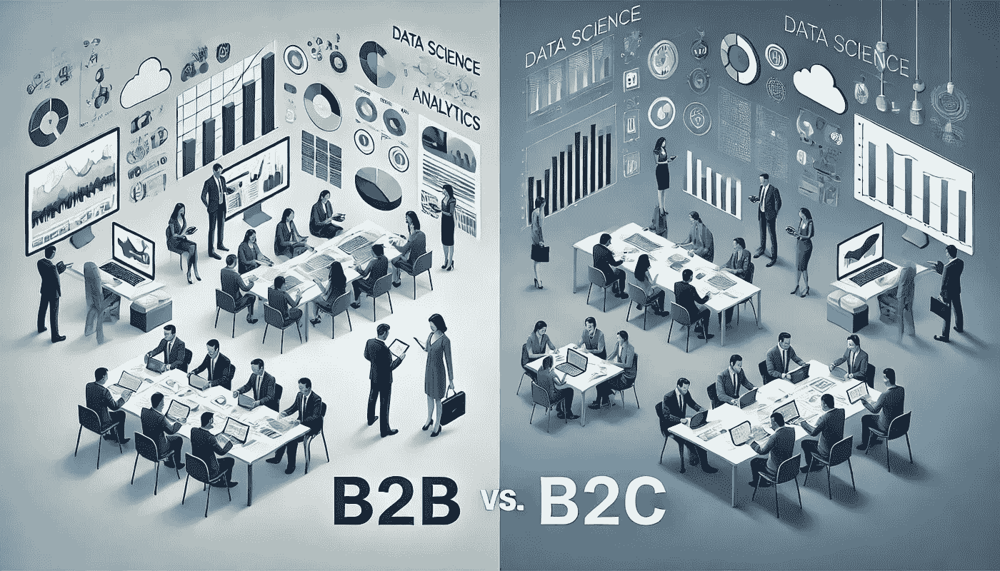

# 数据科学导航：B2C 与 B2B 分析

> 原文：[`towardsdatascience.com/navigating-data-science-b2c-vs-b2b-analytics-a9ce007381b7?source=collection_archive---------5-----------------------#2024-07-29`](https://towardsdatascience.com/navigating-data-science-b2c-vs-b2b-analytics-a9ce007381b7?source=collection_archive---------5-----------------------#2024-07-29)

## 客户类型如何塑造数据科学角色和方法论

 [Yu Dong](https://ydong029.medium.com/?source=post_page---byline--a9ce007381b7--------------------------------)

·发布于[Towards Data Science](https://towardsdatascience.com/?source=post_page---byline--a9ce007381b7--------------------------------) ·阅读时间：10 分钟·2024 年 7 月 29 日

--

# 背景

在考虑加入一家公司或接受工作邀请时，我们通常会考虑行业、公司愿景、增长机会、文化等方面。今天，我想介绍另一个角度：公司是 B2B（企业对企业）还是 B2C（企业对消费者）。这一区分对数据科学角色的影响出乎意料地大。

作为一名数据科学家，已经有超过六年的经验，我在 B2C 公司（Ancestry.com，一家消费型家谱公司）工作了大约一半的时间，另外一半时间则在 B2B 公司（Brex，一家支出管理金融科技公司）工作。尽管这两个行业不同，但我注意到数据科学的方法论和由不同客户类型带来的挑战存在显著差异。在这篇文章中，我将讨论 B2B 和 B2C 公司之间在数据科学分析上的区别。

来源：DALL·E

# I. 数据量与分析单元

B2C 和 B2B 公司之间最显著的区别之一是数据量和分析单元。

## B2C：高数据量，聚焦个体用户
