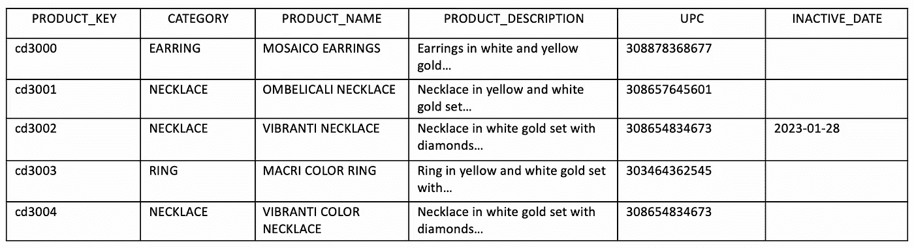
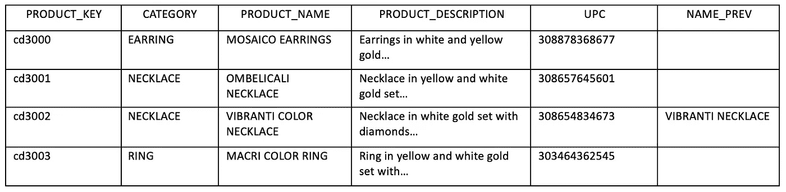
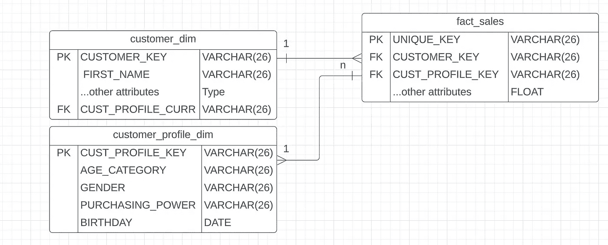
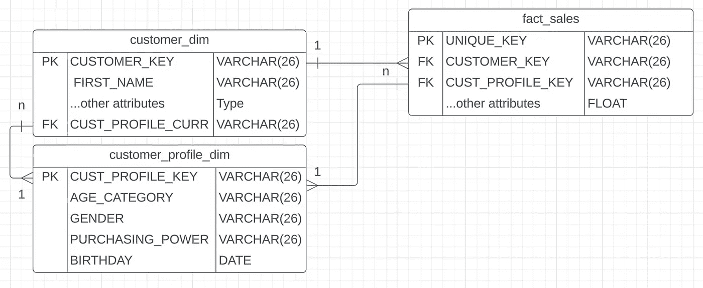
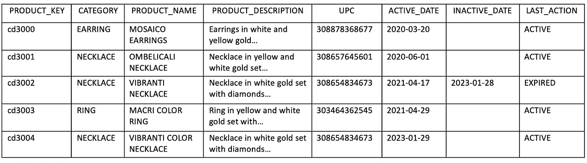
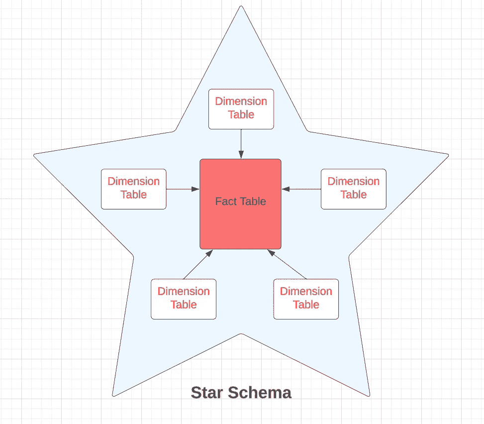

# 导航慢变维度（SCD）与数据重述：全面指南

> 原文：[`towardsdatascience.com/navigating-slowly-changing-dimensions-scd-and-data-reinstatement-a-comprehensive-guide-f8b72ff90d98?source=collection_archive---------10-----------------------#2024-02-05`](https://towardsdatascience.com/navigating-slowly-changing-dimensions-scd-and-data-reinstatement-a-comprehensive-guide-f8b72ff90d98?source=collection_archive---------10-----------------------#2024-02-05)

## 在企业数据仓库中高效管理维度变化和数据重述的策略

 [Kirsten Jiayi Pan](https://medium.com/@jiayipan999?source=post_page---byline--f8b72ff90d98--------------------------------)

·发表于 [Towards Data Science](https://towardsdatascience.com/?source=post_page---byline--f8b72ff90d98--------------------------------) ·6 分钟阅读·2024 年 2 月 5 日

--

想象一下，你是一名数据工程师，为一家大型零售公司工作，该公司在数据仓库中使用增量加载技术。该技术涉及选择性地仅更新或加载自上次更新以来新增或修改的数据。当产品研发部门决定更改当前产品的名称或描述时，可能会发生什么情况？这些更新将如何影响你现有的数据管道和数据仓库？你打算如何解决这些挑战？本文提供了一份全面指南，结合使用慢变维度（SCD），来解决数据重述过程中可能遇到的问题。

图片来源：[`unsplash.com/photos/macbook-pro-with-images-of-computer-language-codes-fPkvU7RDmCo`](https://unsplash.com/photos/macbook-pro-with-images-of-computer-language-codes-fPkvU7RDmCo)

**什么是慢变维度（SCD）？**

慢变维度指的是维度值的偶发性变化，这些变化并不依赖于每日或定期的时间表，因为维度变化的频率通常低于系统中事务条目的变化频率。例如，一家珠宝公司，其顾客在其网站上提交新的订单，将在订单事实表中生成一条新的记录。另一方面，珠宝公司很少更改其产品名称和描述，但这并不意味着未来不会发生这种情况。

管理这些维度的变化需要采用慢变维度（SCD）管理技术，这些技术被分为定义的 SCD 类型，从类型 0 到类型 6，包括一些组合型或混合型类型。我们可以使用以下方法之一：

**SCD 类型 0：忽略**

维度值的变化被完全忽视，维度的值从初次在数据仓库中创建时起保持不变。

**SCD 类型 1：覆盖/替换**

当维度属性的前一个值不再相关或不重要时，适用这种方法。然而，不需要进行变化的历史跟踪。

**SCD 类型 2：创建新的维度行**

这种方法被推荐作为解决维度值变化的主要技术，涉及为维度创建第二行，包含开始日期、结束日期，并可能有一个“当前/过期”标志。它适用于我们像产品描述或地址变更等场景，确保历史数据的清晰划分。新的维度行会与新插入的事实行相关联，每个维度记录会根据插入时间与一部分事实行相关联——变更之前的行与旧的维度行相关联，变更之后的行与新的维度行相关联。

图 1（作者提供的图片）：`PRODUCT_KEY` = “cd3004” 是对 `PRODUCT_KEY` = “cd3002” 的重新表述。

**SCD 类型 3：创建“PREV”列**

当旧值和新值都相关时，此方法适用，用户可能希望使用任一值进行历史分析。然而，将这种技术应用于所有维度属性并不实际，因为这将涉及为每个维度属性提供两列，或者如果需要保留多个“PREV”值，则需要更多列。应在合适的地方选择性使用。

图 2（作者提供的图片）：`PRODUCT_KEY` = “cd3002” 被重新表述为新的 `PRODUCT_NAME`，旧的 `PRODUCT_NAME` 存储在 `NAME_PREV` 列中。

**SCD 类型 4：快速变化的大型维度**

如果在某个场景中，你需要捕获零售大型维度中每个维度属性的每次变化，比如一个拥有百万以上客户的巨大珠宝公司，怎么办？如上所述使用类型 2 会非常迅速地将客户维度表的行数膨胀到几十亿甚至上百亿行，而使用类型 3 是不可行的。

对于快速变化且数据量较大的维度表，一个更有效的解决方案是对属性进行分类（*例如*，*客户年龄类别、性别、购买力、生日等*），并将它们分离到二级维度中，如客户档案维度。这个表作为“全覆盖”维度表，将每个类别的维度属性的所有潜在值预加载到表中，这样可以更好地管理变更的粒度，同时避免主客户维度中行的过度扩展。

例如，如果我们有 8 个年龄类别、3 种性别、6 个购买力类别和 366 种可能的生日。我们的“全覆盖”客户档案维度表包含上述所有组合，将是 **8 x 3 x 6 x 366 组合，或 52704 行**。

我们需要为这个维度表生成 `surrogate_key`，并在事实表中建立与新外键的连接。当其中一个维度类别发生修改时，无需向客户维度中添加新行。相反，我们生成一行新的事实数据，并将其与客户维度和新的客户档案维度关联起来。

图 3（作者提供的图片）：“全覆盖维度”表的实体关系图

**SCD 类型 5：类型 4 的扩展**

为了增强前面提到的类型 4 方法，我们可以在客户维度和客户档案维度之间建立连接。这种连接能够追踪特定客户的“当前”客户档案。该关键连接将客户与最新的客户档案相连接，允许从客户维度无缝地跳转到最新的客户档案维度，而无需通过事实表进行链接。

图 4（作者提供的图片）：实体关系图显示了客户维度到客户档案维度的链接

**SCD 类型 6：混合技术**

通过这种方法，您可以将类型 2（新行）和类型 3（“PREV”列）结合在一起。这种混合方法融合了两种方法的优点。您可以通过“PREV”列来检索事实，它提供了历史值，并展示与特定时间点的产品类别相关的事实。同时，通过“new”列进行查询，可以获得当前和所有之前的产品类别的所有事实。

图 5（作者提供的图片）：PRODUCT_ID = “cd3004” 是 PRODUCT_ID = “cd3002” 的重述，PRODUCT_ID = “cd3001” 在 LAST_ACTION 列中标记为“EXPIRED”

**奖励与总结**

通常，数据提取采用星型模式（STAR schema），其中包括一个事实表和多个维度表。在企业中，维度表存储所有描述性数据和主键，而事实表包含引用每个维度的主键的数字和加法数据。

图 6（作者提供的图片）：星型模式的示意图

然而，如果您的营销销售数据提取是作为一个单一的去规范化表提供的，且没有独立的维度表，并且缺乏描述性数据的主键，那么将来更新产品名称可能会带来挑战。在现有的管道中处理这种情况会更为复杂。

描述性数据中缺少主键可能会在数据重述时引发问题，尤其是在处理大规模数据集时。例如，如果在重述提取中更新了产品名称，但没有唯一的`product_key`，增量加载管道可能会将其视为新产品，从而影响消费层的历史数据。为了解决这个问题，需要为产品维度创建`surrogate_key`，并建立一个映射表，将原始产品名称和重述后的产品名称进行关联，从而维护数据完整性。

总之，数据仓库设计的每个方面都应仔细考虑，尤其是要考虑潜在的边缘情况。
