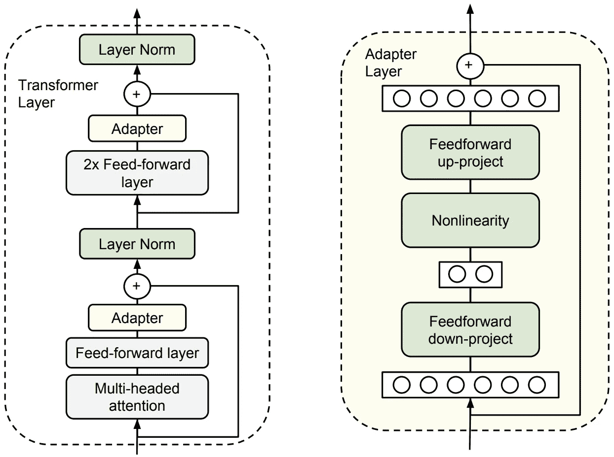
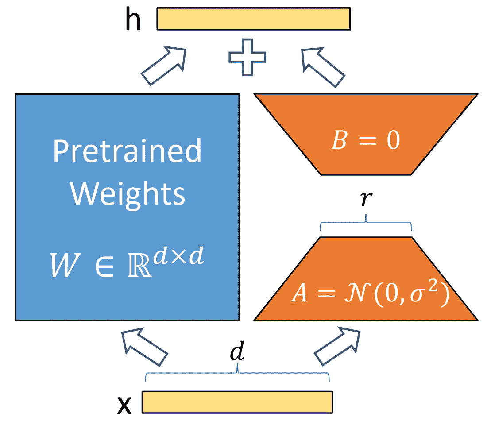

# 探索未来

> 原文：[`towardsdatascience.com/navigating-the-future-62ea60f27046?source=collection_archive---------5-----------------------#2024-01-10`](https://towardsdatascience.com/navigating-the-future-62ea60f27046?source=collection_archive---------5-----------------------#2024-01-10)

## 大型多模态模型时代的自主机器人技术

 [Nate Cibik](https://natecibik.medium.com/?source=post_page---byline--62ea60f27046--------------------------------)

·发表于 [Towards Data Science](https://towardsdatascience.com/?source=post_page---byline--62ea60f27046--------------------------------) ·阅读时间 34 分钟·2024 年 1 月 10 日

--

图片由作者使用 DALL-E 3 创建。

在我最近的工作中，我探索了轻量级的 [层次化视觉变压器](https://natecibik.medium.com/the-rise-of-vision-transformers-f623c980419f) 在有效执行多个计算机视觉任务学习和推理的能力，这些任务对于机器人感知至关重要。在我的 [Multiformer](https://natecibik.medium.com/multiformer-51b81df826b7) 项目中，我运用了这种“共享主干”概念，通过一个共同的主干向多个任务头提供特征，这已成为多任务学习中的一种流行方法，特别是在自主机器人领域，因为研究表明，学习一个对多个任务有用的特征空间不仅能产生一个可以在给定单一输入下执行多任务的单一模型，还能通过利用从其他任务中学到的互补知识，提高每个任务的表现。

传统上，自主车辆（AV）的感知系统通过在多个计算机视觉任务上进行同步推理，来形成对周围环境的理解。因此，具有共同主干的多任务学习是一个自然的选择，提供了参数效率和单个任务性能的双赢解决方案。然而，大型多模态模型（LMMs）的崛起挑战了这一高效的多任务范式。利用 LMMs 创建的世界模型具备深刻的能力，可以在描述性和预测性层面理解传感器数据，超越了任务特定处理，能够全面理解环境及其未来状态（尽管需要更高的参数量）。

在这一新范式中，已被称为[AV2.0](https://wayve.ai/thinking/a-new-approach-to-self-driving-av2-0/)的模式下，像语义分割和深度估计这样的任务，成为了拥有更深理解数据能力的模型的涌现能力，对于这些模型来说，执行这些任务变得没有意义，除非是为了将这些知识传递给人类。事实上，执行这些中间任务的整个目的，是将这些预测发送到感知、规划和控制算法的更深层次，最终描述自我与周围环境的关系，以及应采取的正确行动。相比之下，如果一个更大的模型能够描述完整的驾驶场景，并能够在相同输入条件下描述正确的驾驶行为，那么就不再需要知识的有损中间表示，网络可以直接学习对数据做出响应。在这一框架中，感知、规划和控制之间的界限被消除，创造出一种可以端到端优化的统一架构。

虽然这仍然是一个新兴的思想流派，但使用大规模语言模型（LMMs）构建的生成世界模型来实现端到端自主驾驶解决方案，已成为一个合理的长期赢家。它延续了通过序列建模公式简化以往复杂解决方案的趋势，这一趋势始于自然语言处理（NLP），迅速扩展到计算机视觉，现在似乎已经在强化学习（RL）中扎根。更进一步的是，这些曾经独立的研究领域正在一个共同的框架下统一，并因此相互加速发展。对于自动驾驶（AV）研究，接受这一范式转变意味着要迎接基础设施和方法论在大规模变换器模型的训练、微调和部署方面的快速加速，而来自多个学科的研究人员正继续加入并为这一“智能是序列建模问题”的现象注入动力。

但这对传统模块化自动驾驶堆栈意味着什么呢？像 Multiformer 这样的多任务计算机视觉模型是否注定会过时？似乎很明显，对于一些简单问题，比如需要在已知类别集合上进行基本图像分类的应用，大型模型显然是过度的。然而，对于像自主机器人这样的复杂应用，答案目前远不那么明确。大型模型存在严重的缺点，特别是在内存需求和资源消耗方面。它们不仅训练所需的财务（和环境）成本巨大，而且部署可能性也受到限制：模型越大，嵌入系统（机器人）就必须越大。因此，大型模型的开发有一个实际的进入壁垒，这势必会阻止小型公司采纳。不过，大型模型的能力所带来的吸引力已经在全球范围内推动了训练和部署方法的可访问性发展，而这一趋势注定会继续下去。

2019 年，Rich Sutton 在 AI 研究中提到“[苦涩的教训](https://www.cs.utexas.edu/~eunsol/courses/data/bitter_lesson.pdf)”，指出无论是自然语言处理还是计算机视觉等领域，基于人类知识的复杂方法，融入手工设计元素，最终都会成为浪费时间的死胡同，这些方法会被更多依赖原始计算的大多数通用方法所取代。目前，大型变换器的出现以及各种问题巧妙地转化为自监督序列建模任务，是消除割裂和定制问题框架的主要推动力。现在，长期以来在强化学习（RL）和时间序列分析中的方法，包括像循环神经网络（RNN）这样的经典模型，都必须证明它们的有效性，否则就将像 SIFT 和基于规则的语言模型一样，进入退役的行列。在自动驾驶堆栈（AV stack）开发方面，我们是否应该尽早打破传统的束缚，转向大型世界建模，还是传统模块化驾驶堆栈的可访问性和可解释性能够经受住大型模型浪潮的冲击？

本文讲述了一个引人入胜的研究趋势交汇故事，这些趋势将指导我们朝着这个问题的有教育意义的答案迈进。首先，我们回顾传统的模块化自动驾驶（AV）堆栈开发，以及多任务学习如何通过在共享参数空间中利用泛化知识来提升性能。接下来，我们探索大语言模型（LLMs）的飞速崛起及其向多模态的扩展，展示它们在机器人学中的影响潜力。然后，我们了解强化学习（RL）中世界建模的历史，以及大语言模型的出现如何点燃一场强大的革命，将这些世界模型赋予类似当今大模型所具备的推理和语义理解能力。接着，我们对比了这种大型世界建模方法与传统自动驾驶堆栈开发的优缺点，显示出大型模型在简化架构、高维空间中的端到端优化以及卓越的预测能力方面具有巨大优势，但也以远高的参数数量为代价，带来了多个工程挑战。鉴于此，我们回顾了几种有前景的技术，用以克服这些工程挑战，使得这些大模型的开发和部署成为可能。最后，我们总结发现，尽管大型世界模型有望成为长期赢家，但从传统方法中汲取的经验教训仍将对其成功的最大化具有重要意义。我们以讨论结束，重点介绍了该激动人心领域未来工作的一些有前景的方向。

## 计算机视觉与自动驾驶中的多任务学习

多任务学习（MTL）是一个受到广泛关注的研究领域，通常被描述为人工智能（AI）向人类推理迈进的重要一步。正如[Michael Crawshaw 对该主题的全面调查](https://arxiv.org/abs/2009.09796)中所指出的，MTL 涉及同时在多个任务上训练一个模型，使其能够利用这些任务之间共享的信息。这种方法不仅在计算效率上具有优势，还由于学习到的特征具有互补性，导致任务性能得到提升。Crawshaw 的调查强调，MTL 模型通常通过学习更加稳健和泛化的表示，超越单任务模型的表现。

> 我们认为，多任务学习（MTL）比单任务学习更能准确反映人类的学习过程，因为跨领域整合知识是人类智能的核心特征。当一个新生儿学习走路或使用双手时，它积累了一般的运动技能，这些技能依赖于平衡和直觉物理的抽象概念。一旦这些运动技能和抽象概念被掌握，它们可以被重复使用并在生活后期用于更复杂的任务，例如骑自行车或走钢丝。
> 
> — [Crawshaw, 2020](https://arxiv.org/abs/2009.09796)

MTL 的优势在自动驾驶汽车（AVs）中尤为重要，因为自动驾驶汽车需要实时推理多个相关的视觉任务，以做出安全的导航决策。[MultiNet](https://arxiv.org/abs/1612.07695)是为自动驾驶汽车设计的典型 MTL 模型，结合了道路分割、目标检测和分类等任务，统一在一个架构中。将 MTL 集成到自动驾驶汽车中带来了显著的优势，如更高的帧率和减少的内存占用，这对于不同规模的自动化机器人至关重要。

使用[Multiformer](https://natecibik.medium.com/multiformer-51b81df826b7)对来自 RGB 输入的三个自动驾驶感知任务进行多任务推理。

基于 Transformer 的网络，如视觉 Transformer（[ViT](https://arxiv.org/abs/2010.11929)）及其衍生物，在计算机视觉中展示了令人难以置信的描述能力，且将 Transformer 与卷积架构结合，形成如[分层 Transformer](https://natecibik.medium.com/the-rise-of-vision-transformers-f623c980419f)的形式（如金字塔视觉 Transformer v2（[PVTv2](https://arxiv.org/abs/2106.13797)）），已证明特别强大且易于训练，在近期模型中，如[Segformer](https://arxiv.org/abs/2105.15203)、[GLPN](https://arxiv.org/abs/2201.07436)和[Panoptic Segformer](https://arxiv.org/abs/2109.03814)，其性能持续超越[ResNet](https://arxiv.org/abs/1512.03385)主干，并且参数更少。受到对强大且轻量感知模块的需求激励，[Multiformer](https://natecibik.medium.com/multiformer-51b81df826b7)结合了 MTL（多任务学习）和分层 Transformer 的描述能力，利用超过 8M（百万）参数，在语义分割、深度估计和 2D 目标检测上同时表现出色，并且可以轻松扩展到[全景分割](https://arxiv.org/abs/1801.00868)任务。

这张 Multiformer 的示意图显示，即使是统一的多任务视觉架构也很复杂，包含多个任务特定的模块。尽管它为轻量级感知模块提供了强大的基础，但它并不涉及规划或控制的推理，而且在没有重大修改的情况下，无法泛化到新任务。（图片来源：作者）

然而，构建一个完整的自主堆栈不仅仅需要一个感知模块。我们还需要规划和执行动作，因此我们需要添加一个规划与控制模块，该模块可以利用感知堆栈的输出，准确地跟踪并预测自我和环境的状态，从而发送代表安全驾驶动作的指令。一个有前景的选择是英伟达的[DiffStack](https://arxiv.org/abs/2212.06437)，它提供了一种可训练且可解释的轨迹预测、路径规划和控制建模的结合。然而，该模块需要 3D 代理位姿作为输入，这意味着我们的感知堆栈必须生成这些信息。幸运的是，已经有可用的 3D 物体检测算法，尤其是在获得准确深度信息的情况下，但我们的物体追踪将在这个困难任务中对准确性和时间一致性极为敏感，任何错误都会传播并降低下游运动规划和控制的质量。

[DiffStack](https://arxiv.org/abs/2212.06437)模块的示意图，该模块需要过去的轨迹（3D 代理位姿）作为输入。所有问题都被战略性地设计为可微分的，以便通过子模块进行反向传播，同时允许解释中间表示。然而，这些周期性的晶化信息是有损的，系统也从这些中间问题的表述中继承了一系列弱点。

的确，传统的自主堆栈模块化范式，从传感器输入到感知、规划和控制的各个阶段，本质上容易受到累积错误的影响。序列中的每个阶段都依赖于前一个阶段的准确性，这使得系统容易受到错误级联的影响，并妨碍通过中间信息的晶化进行端到端的错误修正。另一方面，模块化方法比端到端系统更具可解释性，因为中间表示可以被理解和诊断。正因为如此，端到端系统通常被回避，因为它们被视为“黑箱”解决方案，缺乏对于像自主导航这样的安全关键应用所能接受的可解释性。但如果可解释性问题可以克服呢？如果这些黑箱能够用简单的英语或其他自然语言解释它们做出的决定呢？进入自主机器人学的大语言模型时代，这一愿景不再是遥不可及的梦想，而是一个切实的现实。

## 自回归变换器与大语言模型的崛起

ChatGPT 被要求在一张截图中展示其才华。

在被证明是我们时代最具影响力的研究论文之一中，Vaswani 等人于 2017 年通过论文“[Attention is All You Need](https://arxiv.org/abs/1706.03762)”提出了变换器架构，革新了序列到序列（[seq2seq](https://arxiv.org/abs/1409.3215)）建模，提出了他们的注意力机制。这些创新模块克服了之前偏爱使用的 RNN 的弱点，通过有效地捕捉序列中的长距离依赖关系，并在计算过程中允许更多的并行化，带来了各种 seq2seq 任务的显著改善。一年后，谷歌的双向编码器表示变换器（[BERT](https://arxiv.org/abs/1810.04805)）通过引入基于掩码语言建模（MLM）的双向预训练目标，进一步增强了变换器在自然语言处理中的能力，融合了左右两侧的上下文，编码了更为细致的上下文理解，支持了情感分析、问答、机器翻译、文本摘要等多种语言任务。

在 2018 年中期，OpenAI 的研究人员展示了如何训练一个因果解码器单向转换器，使其能够处理[字节对编码（BPE）文本标记](https://arxiv.org/abs/1508.07909)，并使用生成预训练变换器（[GPT](https://openai.com/research/language-unsupervised)）。他们发现，通过在自监督自回归语言建模任务上进行预训练，使用大量未标记文本数据，随后通过任务感知的输入变换（在必要时进行架构修改）进行任务特定的微调，可以产生在多种语言任务上显著提升的模型，进而改善了当时的技术水平。

虽然 GPT-1 中在标记空间中使用的任务感知输入变换可以被视为“提示工程”的早期形式，但这个术语通常指的是通过有策略的文本结构化，激发语言模型的多任务行为。2018 年，Salesforce 的研究人员通过他们具有影响力的多任务问答网络（[MQAN](https://arxiv.org/abs/1806.08730)）展示了这一点。通过将任务框架化为具有独特格式的文本字符串，作者训练了一个没有任务特定模块或参数的单一模型，使其在一组十项自然语言处理任务（他们称之为“自然语言十项全能”（decaNLP））上表现良好。

在 2019 年，OpenAI 发现，通过在推理时采用这种形式的提示工程，[GPT-2](https://openai.com/research/better-language-models)展现了令人期待的零样本多任务表现，并且模型和数据集的规模与性能呈对数线性增长。尽管这些任务提示结构并不像 MQAN 那样明确地包含在训练数据中，但模型能够从之前见过的结构化语言中泛化知识，以完成当前的任务。该模型展示了具有 15 亿参数的令人印象深刻的无监督多任务学习（相比 GPT 的 1.17 亿参数），这表明这种语言建模方式为通用 AI 提供了一个有前景的路径，同时也引发了对未来的伦理担忧。

谷歌研究在 2019 年底开源了文本到文本的转换器（[T5](https://arxiv.org/abs/1910.10683)），其模型规模最大可达 110 亿参数。虽然 T5 同样基于自回归变换器构建，但它将自然语言问题表示为统一的文本到文本框架，使用完整的变换器架构（包括编码器），与 GPT 风格模型的下一个词预测任务有所不同。虽然这种文本到文本框架在需要更多控制任务训练和预期输出的应用中是一个强有力的选择，但 GPT 风格模型的下一个词预测方案因其任务无关的训练方式和自由形式的生成长篇连贯回应而被更为青睐。

然后在 2020 年，OpenAI 将模型和数据规模提升到了前所未有的高度，发布了[GPT-3](https://arxiv.org/abs/2005.14165)，其余的事情便成为了历史。在他们的论文《语言模型是少样本学习者》中，作者定义了一个“少样本”迁移范式，在这种范式中，他们提供了任何数量的示例，用于未见过的任务（以自然语言形式呈现），这些示例会被纳入模型的上下文，直到任务的最终开放式提示供模型完成。他们将其与“一次示例”对比，即在上下文中提供一个示例，以及“零示例”，即完全不提供示例。研究团队发现，在所有三种评估方法下，模型的表现随着参数数量的增加持续提升，直到达到了 1750 亿参数，这标志着发布的模型规模出现了历史性跃升。这一庞然大物实现了接近人类水平的通用少样本学习和文本生成能力，引起了主流关注，并激发了对这一趋势在 AI 研究中未来影响的担忧。那些担忧的人或许能暂时获得一丝安慰，因为在这些规模下，训练和微调这些模型远远超出了除了最大型组织之外的所有机构的能力范围，但这一现状显然会发生变化。

来自[GPT-3](https://arxiv.org/abs/2005.14165)论文的图表，展示了随着模型规模的增大，整体性能的提升。

GPT-3 在多个方面具有突破性意义，同时也标志着 OpenAI 开放性结束，它是第一个封闭源代码的模型。幸运的是，开源 LLM（大语言模型）研究的浪潮已经开始。EleutherAI 从 2020 年起发布了广受欢迎的一系列大规模开源 GPT-3 风格的模型，从[GPT-Neo 2.7B](https://github.com/EleutherAI/gpt-neo?tab=readme-ov-file)开始，接着是 2021 年的[GPT-J 6B](https://huggingface.co/EleutherAI/gpt-j-6b)，再到 2022 年的[GPT-NeoX 20B](https://huggingface.co/EleutherAI/gpt-neox-20b)，后者在基准测试中与 GPT-3.5 DaVinci 不相上下（所有模型均可在[huggingface/transformers](https://github.com/huggingface/transformers)找到）。

随后的几年标志着基于 Transformer 的 LLM 的“寒武纪大爆炸”。研究兴趣的超新星产生了令人叹为观止的出版物清单，这些文献的全面回顾超出了本文的范围，但我建议读者参考[Zhao 等人 2023](https://arxiv.org/abs/2303.18223)的全面调查。几个值得一提的关键进展包括，当然，OpenAI 发布的 GPT-4，以及 Meta AI 发布的开源[LLaMA](https://ai.meta.com/blog/large-language-model-llama-meta-ai/)模型，强大的[Mistral 7B](https://mistral.ai/news/announcing-mistral-7b/)模型，及其专家混合（MoE）版本：[Mixtral 8X7B](https://mistral.ai/news/mixtral-of-experts/)，这些都发生在 2023 年。普遍认为，GPT-4 是一个 MoE 系统，而 Mixtral 8X7B 所展示的强大性能（在大多数基准测试中超过[LLaMA 2](https://ai.meta.com/llama/) 70B，并且推理速度快 6 倍）为此提供了有力证据。

来自[Zhao 等人 2023](https://arxiv.org/abs/2303.18223)调查的 LLaMA 后代家谱展示了 LLM 研究的规模。

为了简洁地总结过去几年 LLM 大爆炸的视觉概况，再次借用强大的 Zhao 等人 2023 年的调查是很有帮助的。请注意，这张图表仅包括参数超过 10B 的模型，因此遗漏了一些重要的小型模型，如 Mistral 7B。不过，它为最近的进展提供了有用的视觉锚点，同时也证明了 T5 和 GPT-3 发布后研究动能的巨大增长。

来自[Zhao 等人 2023](https://arxiv.org/abs/2303.18223)调查的 LLM 时间轴。

值得注意的是，尽管开源 LLM 在性能上明显落后于私人模型，但这一差距正在随着时间的推移逐渐缩小，开源模型似乎准备在不久的将来迎头赶上。现在正是熟悉将 LLM 集成到工作中的最佳时机。

图片由作者提供。请注意，为了公平对比，微调模型已从趋势线数据中移除。

## 大型多模态模型时代

在 LLM 的巨大成功基础上，人工智能的最新时代见证了 LMM 的诞生，代表了机器理解和与世界互动方式的范式转变。这些大型模型可以接收多种模态的数据作为输入，返回多种模态的数据作为输出，或者两者兼有，通过学习这些数据模态的共享嵌入空间并利用 LLM 对该空间进行序列建模。这使得 LMM 能够执行突破性的任务，如使用自然语言进行视觉问答，正如在这一大型语言与视觉助手（[LLaVA](https://arxiv.org/abs/2304.08485)）的演示中所展示的那样：

[LLaVA](https://arxiv.org/abs/2304.08485)演示了视觉问答，利用自然语言推理图像内容。

视觉-语言预训练的一个重要进展（[VLP](https://arxiv.org/abs/2210.09263)），OpenAI 的对比语言-图像预训练（[CLIP](https://arxiv.org/abs/2103.00020)）在 2021 年解锁了一个新的可能性，当时它建立了一种对比方法来学习共享的视觉和语言嵌入空间，使得图像和文本能够在一个共同的数字空间中表示，并基于余弦相似度得分进行匹配。CLIP 在计算机视觉领域引发了一场革命，当它能够以零-shot 的方式超越多项图像分类基准，超过了那些通过监督训练的专家模型，并激发了对零-shot 分类的研究兴趣。尽管它没有实现诸如视觉问答等能力，但训练 CLIP 会生成一个图像编码器，该编码器可以被移除并与 LLM 配对，从而创建一个 LMM。例如，LLaVA 模型（如上所示）使用预训练且冻结的 CLIP 图像编码器将图像编码为多模态嵌入空间，DeepMind 的[Flamingo](https://openreview.net/forum?id=EbMuimAbPbs)也是如此。

> *注意* — LMM 的术语并不完全一致。虽然“LMM”似乎已成为最流行的术语，但在其他地方这些模型被称为[MLLMs](https://arxiv.org/abs/2306.13549)，甚至是[MM-LLMs](https://arxiv.org/pdf/2309.05519.pdf)。

这些预训练 CLIP 编码器生成的图像嵌入可以与文本嵌入交替输入到自回归的变换器语言模型中。[AudioCLIP](https://arxiv.org/abs/2106.13043)将音频作为第三种模态加入到 CLIP 框架中，突破了环境声音分类（ESC）任务的现有技术水平。Meta AI 的有影响力的[ImageBind](https://arxiv.org/abs/2305.05665)提出了一个学习跨六种数据模态（图像、文本、音频、深度、热成像和惯性质量单元（IMU）数据）编码联合嵌入的框架，但表明所有模态的涌现对齐是通过仅将每种模态与图像对齐来实现的，证明了图像的丰富语义内容（“一张图胜过千言万语”）。[PandaGPT](https://arxiv.org/abs/2305.16355)将 ImageBind 的多模态编码方案与[Vicuna](https://arxiv.org/abs/2306.05685) LLM 结合，创建了一个能够理解这六种模态数据输入的 LMM，但与前面提到的其他模型一样，仍然仅限于文本输出。

> 图像可能是最具多功能性的模型输入格式，因为它可以用来表示文本、表格数据、音频，甚至在一定程度上，视频。而且，视觉数据远多于文本数据。如今，我们有手机/网络摄像头不断拍摄照片和视频。
> 
> 文本是模型输出的更强大的模态。能够生成图像的模型只能用于图像生成，而能够生成文本的模型可以用于许多任务：总结、翻译、推理、问答等。
> 
> — Huyen 在其文章“[多模态与大型多模态模型（LMMs）](https://huyenchip.com/2023/10/10/multimodal.html)”中对数据模态优势的敏锐总结（2023 年）。

事实上，大多数 LMMs 的研究只提供了单模态语言输出，与之相比，返回多模态数据的模型发展相对滞后。那些寻求提供多模态输出的工作通常通过使用 LLM 解码文本来引导其他模态的生成（例如，当请求生成图像时，[GPT-4](https://openai.com/research/gpt-4)将生成一个自然语言的专门提示并将其传递给[DALL-E 3](https://openai.com/dall-e-3)，后者则为用户创建图像），这种方式本质上引入了级联错误的风险，并且无法进行端到端的调优。[NExT-GPT](https://arxiv.org/abs/2309.05519)旨在解决这一问题，设计了一个可以端到端训练的全对全 LMM。在编码器方面，NExT-GPT 使用了上面提到的 ImageBind 框架。为了引导跨 6 种模态的解码，LMM 在一个定制的模态切换指令调优数据集 Mosit 上进行了微调，学习生成作为解码过程指令的特殊模态信号标记。这使得数据输出模态切换的处理可以通过端到端的学习来完成。

[GATO](https://arxiv.org/abs/2205.06175)是 DeepMind 在 2022 年开发的一款通用智能体，代表了 LMM（大规模语言模型）的卓越多功能性。该系统展示了前所未有的能力，能够在统一的学习框架内执行广泛的 604 项任务，从 Atari 游戏到使用真实机器人手臂堆叠积木等复杂控制任务。GATO 的成功证明了 LMM 在多样化环境和任务中模拟类人适应性的潜力，向实现人工通用智能（AGI）的难以捉摸的目标迈出了重要一步。

## LMM 时代的世界模型

深度强化学习（RL）是一种流行且经过充分研究的解决复杂机器人问题的方法，最初在[Atari 游戏中展示了超人类能力](https://www.nature.com/articles/nature14236)，随后又[击败了世界顶级围棋玩家](https://deepmind.google/technologies/alphago/)（围棋是一项著名的挑战性游戏，要求长远的战略眼光）。传统的深度强化学习算法通常分为无模型方法或基于模型的方法，尽管近期的研究通过将强化学习框架化为一个使用大型变换器模型的大规模序列建模问题，模糊了这两者的界限，借鉴了自然语言处理和计算机视觉领域中的成功趋势。

虽然无模型强化学习方法在设计和实现上明显更加高效，并且比基于模型的方法更容易设计，但它们通常样本效率较低，需要比人类更多的环境交互才能学会一项任务。基于模型的强化学习方法通过学习如何根据先前的状态和行动来建模环境的变化，来减少与环境的交互次数。这些模型可以用于预测环境的未来状态，但这也为强化学习系统增加了一种失败模式，因为它们必须依赖于这种建模的准确性和可行性。使用神经网络来学习动力学模型以训练强化学习策略已有很长的历史，可以追溯到[1980 年代使用前馈网络](https://books.google.com/books?hl=en&lr=&id=KnVBTk-hS10C&oi=fnd&pg=PA165&ots=XRAdO_HLbd&sig=xTJYDmDPM0TQHNzmwK_xD6aZia8#v=onepage&q&f=false)，以及[1990 年代使用递归神经网络（RNNs）](https://people.idsia.ch/~juergen/FKI-126-90_(revised)bw_ocr.pdf)，后者由于能够在多步时间范围内进行建模和预测，成为了主要的研究方向。

2018 年，Ha & Schmidhuber 发布了一项具有突破性的研究成果，名为“[递归世界模型促进策略演化](https://papers.nips.cc/paper_files/paper/2018/file/2de5d16682c3c35007e4e92982f1a2ba-Paper.pdf)”，在其中他们展示了通过超越简单的动态建模，扩展环境建模的力量，而是使用卷积变分自编码器（[CVAE](https://papers.nips.cc/paper_files/paper/2015/hash/8d55a249e6baa5c06772297520da2051-Abstract.html)）和一个大型 RNN 的组合来建模环境本身的压缩时空潜在表示，从而形成了所谓的“世界模型”。策略完全在这个世界模型的表示中进行训练，并且因为它从未暴露于真实环境中，因此可以从可靠的世界模型中进行采样，从其学到的世界理解中模拟想象中的执行轨迹，为进一步训练策略提供有效的合成示例。这使得策略训练更加数据高效，这对于实际应用中的 RL 在真实世界领域的应用具有巨大优势，因为数据收集和标注通常非常资源密集。

[Ha & Schmidhuber, 2018](https://papers.nips.cc/paper_files/paper/2018/file/2de5d16682c3c35007e4e92982f1a2ba-Paper.pdf)展示了 CarRacing-v0 和 DoomTakeCover-v0 的世界模型模拟。

[Ha & Schmidhuber, 2018](https://papers.nips.cc/paper_files/paper/2018/file/2de5d16682c3c35007e4e92982f1a2ba-Paper.pdf)提供的基于 RNN 的世界模型的清晰示意图。

这种在世界模型想象中的学习诱人概念自此获得广泛关注。模拟策略学习（[SimPLe](https://arxiv.org/abs/1903.00374)）利用这一范式，在视频预测模型中训练 PPO 策略，仅用两小时的实时游戏经验就能在 Atari 游戏中实现最先进的表现。[DreamerV2](https://arxiv.org/abs/2010.02193)（[Dreamer](https://arxiv.org/abs/2206.14176)的改进版）成为第一个通过想象学习的智能体，在 Atari 50M 基准测试上达到超人类表现的例子（尽管需要数月的游戏经验）。Dreamer 算法还被证明在[DayDreamer](https://arxiv.org/abs/2206.14176)中对真实机器人控制的在线学习中同样有效。

这张来自[DREAMER V2](https://arxiv.org/abs/2010.02193)的图表展示了通过之前的 SoTA 模型，Atari 性能的提升过程。

尽管它们在强化学习（RL）环境中[最初证明难以训练](https://arxiv.org/abs/1910.06764)，但[变换器](https://arxiv.org/abs/1706.03762)的诱人特性使其在另一个研究领域中产生了颠覆性影响。将强化学习框架化为序列建模问题有许多好处，即简化了架构和问题表述，并且[变换器](https://arxiv.org/abs/1706.03762)提供的数据和模型规模的可扩展性。[轨迹变换器](https://arxiv.org/abs/2106.02039)被训练用来预测未来的状态、奖励和动作，但仅限于低维状态，而[决策变换器](https://arxiv.org/abs/2106.01345)可以处理图像输入，但仅预测动作。

> 将强化学习，及更广泛的数据驱动控制，作为一个序列建模问题，可以处理通常需要不同解决方案的许多考虑因素：演员-评论家算法……行为策略估计……动力学模型……价值函数。这些问题都可以通过单一的序列模型统一处理，将状态、动作和奖励视为简单的数据流。该观点的优势在于，可以采用高容量的序列模型架构来解决问题，从而形成一种更简化的方法，这种方法可能会受益于大型无监督学习结果背后的可扩展性。
> 
> — 在[轨迹变换器](https://arxiv.org/abs/2106.02039)介绍中提供的动机

[IRIS](https://arxiv.org/abs/2209.00588)（通过内在语言进行自回归的想象）是一个最近的开源项目，构建了一个生成世界模型，其结构类似于[VQGAN](https://arxiv.org/abs/2012.09841)和[DALL-E](https://openai.com/research/dall-e)，结合了离散自编码器和 GPT 风格的自回归变换器。IRIS 通过模拟数百万条轨迹来学习行为，使用编码的图像令牌和策略动作作为输入，传递给变换器预测下一组图像令牌、奖励和回合终止状态。预测的图像令牌被解码为图像并传递给策略生成下一步动作，尽管作者承认，在潜在空间上训练策略可能会带来更好的性能。

[IRIS](https://arxiv.org/abs/2209.00588) 的结构，一个有前景的开源大规模世界模型。

[IRIS](https://arxiv.org/abs/2209.00588) 展示了通过完美预测这一轮 Pong 来表现其深刻的环境理解。

[GAIA-1](https://arxiv.org/abs/2309.17080)由[Wayve](https://wayve.ai/)开发，采用自回归变换器世界建模方法，结合了使用扩散解码器的图像和视频生成，并且增加了文本调节作为输入模态。这使得视频生成可以在推理时通过自然语言进行指导，允许提示特定场景，如天气状况或智能体行为（例如汽车偏离车道）。然而，GAIA-1 仅限于图像和视频输出，未来的工作应探索输出的多模态性，使得模型能够解释它所看到的内容及其采取的行动，这有可能推翻关于端到端驾驶堆栈不可解释性的批评。此外，GAIA-1 在潜在空间中生成动作标记，但这些标记尚未解码。解码这些潜在空间中的动作将使得该模型可用于机器人控制，并提高其可解释性。进一步地，可以应用 ImageBind 的原理来扩展输入数据模态（例如，包括深度信息），从而有可能开发出更通用的内部世界表示，并改进下游生成。

来自[GAIA-1](https://arxiv.org/abs/2309.17080)论文的图表展示了视频生成能力和提示模态。

在这些世界模型发展的背景下，必须承认像 GAIA-1 这样的生成模型对合成数据生成领域可能带来的颠覆性影响。随着这些先进模型在创建逼真且多样化的数据集方面越来越得心应手，它们将彻底改变合成数据的生成方式。目前，主流的汽车合成数据生成方法是使用仿真和基于物理的渲染，通常在游戏引擎中生成场景，完全控制天气、地图和智能体。[Synscapes](https://arxiv.org/abs/1810.08705)是此类合成数据集生成的开创性工作，作者探讨了工程化数据生成过程的优势，以尽可能接近目标领域，从而应对合成数据与真实数据领域差距对知识迁移的负面影响。

尽管已经在多方面取得了进展来解决这个问题，这种从合成到真实的领域差距仍然是合成数据生成过程中的一种副产物，并且在领域之间知识的迁移性上提出了持续的挑战，阻碍了从仿真中学习的全部潜力。然而，从世界模型中采样合成数据是一种根本不同的做法，也是一个具有说服力的替代方案。模型在描述能力和环境知识上的任何提升都将相互促进，改善模型生成的合成数据质量。这些合成数据直接从模型学习到的分布中进行采样，减少了任何关于分布对齐的担忧——这种对齐是模型与被建模领域之间的对齐，而非涉及受完全不同力量影响的第三方领域。随着生成模型的不断进步，可以预见，这种类型的合成数据生成将取代今天复杂且本质上割裂的生成过程。

## 迈向未来：自动化系统中的多任务与大型世界模型

自动导航领域正在见证一种在场景理解方法上的有趣演变，这种演变受到了多任务视觉模型和大型世界模型发展推动的影响。我个人的工作以及其他领域专家的研究，成功地利用了多任务模型在感知模块中的应用，展示了其效能和效率。同时，像 Wayve 这样的公司正在开创将大型世界模型应用于自动化领域的先河，预示着可能的范式转变。

多任务视觉模型的紧凑性和数据效率使其成为感知模块中的自然选择。通过同时处理多个视觉任务，它们为传统模块化自动化堆栈提供了务实的解决方案。然而，在这种设计范式下，这些感知模块必须与下游的规划和控制模块结合，以实现自动化操作。这就创造了一系列复杂的组件，执行高度专业化的问题求解，这种结构本身就容易受到累积性错误的影响。每个模块能否表现良好取决于它从前一个环节接收到的信息质量，而在这一管道早期出现的错误可能会被放大。

尽管像英伟达的 DiffStack 这样的作品通过不同任务模块间的可微损失公式构建，旨在提供一个既可学习又可人类解释的最佳解决方案，但模块之间定期结晶化的中介数据表示本质上是一种有损压缩形式，会产生信息瓶颈。此外，将多个模型串联起来会积累它们各自的局限性，影响对世界的表征。

另一方面，LMM 作为世界模型的应用，如 Wayve 的 AV2.0 计划所示，暗示着一种不同的发展轨迹。这些模型以其庞大的参数空间为特点，提出了一种端到端的自治框架，涵盖了感知、规划和控制。尽管它们巨大的规模给训练和部署带来了挑战，但近期的进展正在缓解这些问题，并使得大型模型的使用变得更加可及。

展望未来，我们可以清楚地看到，训练和部署大型模型的障碍正在稳步减少。AI 领域的这一持续进展正在 subtly（微妙地）但显著地改变传统任务特定模型与更大模型之间的动态关系。虽然多任务视觉模型目前在某些方面，如规模和可部署性上占有优势，但在大型模型训练技术和计算效率上的持续进步正在逐步拉平竞争态势。随着这些障碍的不断降低，我们可能会看到人们对更全面和集成化模型的偏好发生转变。

## 将火种带给人类：让大型模型民主化

图像由作者使用 DALL-E 3 生成。

尽管大型模型具有令人印象深刻的能力，但它们也带来了重大挑战。训练所需的计算资源庞大，激起了关于环境影响和可访问性的担忧，并且为研究和开发设置了进入门槛。幸运的是，有几种工具可以帮助我们将大型基础模型（LFM）的强大功能带入现实：剪枝、量化、知识蒸馏、适配器模块、低秩适配、稀疏注意力、梯度检查点、混合精度训练和开源组件。这些工具箱为我们提供了一个有希望的方案，将从大型模型训练中获得的力量集中到可管理的规模。

一种直观的方法是训练一个大型模型直到收敛，移除对性能贡献最小的参数，然后对剩余网络进行微调。通过移除不重要的权重来减少神经网络的大小和推理成本的网络最小化方法被称为“剪枝”，其起源可以追溯到 1980 年代（参见 LeCun 等人 1989 年发布的[《最优大脑损伤》](https://www.researchgate.net/publication/221618539_Optimal_Brain_Damage)）。2017 年，Nvidia 的研究人员提出了一种[有影响力的网络剪枝方法](https://arxiv.org/abs/1611.06440)，该方法使用泰勒展开估算去除给定神经元后损失函数的变化，提供了衡量其重要性的指标，从而帮助识别可以在对网络性能影响最小的情况下剪枝的神经元。剪枝过程是迭代的，每减少一次参数后都会进行一轮微调，直到达到所需的准确性和效率平衡。

与此同时，2017 年，谷歌的研究人员发布了一项关于网络量化的[开创性工作](https://arxiv.org/abs/1712.05877)，提供了一种正交方法来缩小大型预训练模型的大小。作者提出了一种影响深远的 8 位量化方案，适用于权重和激活（包括训练和推理框架），旨在通过使用仅限整数运算的推理提高移动 CPU 上的推理速度。这种量化形式已被应用于大语言模型（LLMs），使其能够在更小的硬件上进行推理（参见[TheBloke](https://huggingface.co/TheBloke)在 Hugging Face hub 上提供的各种量化模型）。

另一种压缩大型、笨重模型能力的方法是知识蒸馏。2006 年，康奈尔大学的研究人员提出了后来被称为知识蒸馏的概念，在他们的工作 “[Model Compression](https://www.cs.cornell.edu/~caruana/compression.kdd06.pdf)” 中首次展示了这一概念。这项工作成功地探索了训练小型紧凑模型，以近似大型笨重专家（尤其是大型集成模型）所学习的函数。作者利用这些大型专家为多个领域的大型未标注数据集生成标签，并证明了在由这些标签生成的数据集上训练的小模型，比在原始训练集上训练的等效模型在目标任务上表现更好。此外，他们训练小模型去目标化大模型产生的原始 logits，因为它们的相对值包含的信息比硬类标签或 softmax 概率更为丰富，后者在低概率范围的细节和梯度会被压缩。

Hinton 等人在 2015 年扩展了这一概念，并创造了“蒸馏”（distillation）一词，发表了论文 “[Distilling Knowledge in a Neural Network](https://arxiv.org/abs/1503.02531)”，通过训练小模型来目标化大专家产生的概率，而非原始的 logits，且在最终的 softmax 层中提高温度参数，以产生“一组合适的软目标”。作者指出，这个参数提供了一个可调的放大级别，用于细粒度信息在概率范围低端的放大，并发现容量较小的模型在较低的温度下能更好地过滤掉 logit 值低端的某些细节，集中模型有限的容量于更高层次的交互。他们进一步证明，使用他们的方法，基于原始训练集而非新的大型迁移数据集，同样能够取得良好效果。

在其他大型模型生成的数据上微调大型模型也是一种知识蒸馏的形式。[Self-Instruct](https://arxiv.org/abs/2212.10560) 提出了一个数据管道，利用大型语言模型（LLM）生成指令调优数据，尽管原始论文展示了如何在 GPT-3 的自我输出上进行微调，[Alpaca](https://crfm.stanford.edu/2023/03/13/alpaca.html)则使用这种方法，通过 GPT-3.5 的输出对 LLaMA 进行了微调。[WizardLM](https://arxiv.org/abs/2304.12244)通过引入一种名为 Evol-Instruct 的控制生成指令复杂性的方法，扩展了 Self-Instruct 方法。[Vicuna](https://lmsys.org/blog/2023-03-30-vicuna/)和[Koala](https://bair.berkeley.edu/blog/2023/04/03/koala/)则使用了来自[ShareGPT](https://sharegpt.com/)的真实人类/ChatGPT 交互进行指令调优。在[Orca](https://www.microsoft.com/en-us/research/publication/orca-progressive-learning-from-complex-explanation-traces-of-gpt-4/)中，微软研究院警告道，尽管训练较小的模型模仿大型语言模型（LFM）输出时可能会学习到这些模型的写作风格，但它们往往无法捕捉到生成响应时的推理能力。幸运的是，他们的团队发现，通过在生成示例时使用系统指令（例如“逐步思考并证明你的回答”），以促使教师将其推理过程解释为响应的一部分，从而为较小的模型提供了有效的 LFM 思维窗口。[Orca 2](https://www.microsoft.com/en-us/research/blog/orca-2-teaching-small-language-models-how-to-reason/)随后引入了提示删除（prompt erasure），强制较小的模型学习适当的推理策略以应对给定的指令。

上述方法都专注于将大型预训练模型的能力浓缩到可管理的规模，但对于这些大型模型的便捷微调又该如何处理呢？2017 年，Rebuffi 等人引入了[适配器模块](https://arxiv.org/abs/1705.08045)来进行模型微调。这些小型可训练矩阵可以插入到预训练且被冻结的计算机视觉模型中，以便快速适应新的任务和领域，并且只需要少量的示例。两年后，[Houlsby 等人](https://arxiv.org/abs/1902.00751)展示了这些适配器在自然语言处理（NLP）中的应用，将一个预训练的 BERT 模型转移到 26 个不同的自然语言分类任务中，取得了接近最先进的表现。适配器使得大型语言模型（LFM）的参数高效微调成为可能，并且可以轻松互换，以便在不同的专家模型之间切换，而不需要为每个任务训练和部署完全不同的模型，这将是非常昂贵且不可行的。

[Houlsby 等，2019](https://arxiv.org/abs/1902.00751)的示意图，展示了适配器模块在变换器层中的位置。相较于原始模型中的注意力层和前馈层，适配器包含的参数较少。只有绿色块在微调过程中进行训练。

2021 年，微软研究团队改进了这一概念，提出了一种开创性的方法，用于训练一种新的适配器形式——低秩适配（[LoRA](https://arxiv.org/abs/2106.09685)）。与将适配器矩阵像信用卡一样插入模型中（这种方式会降低模型的推理速度）不同，这种方法学习权重增量矩阵，推理时可以将其与冻结的权重结合，从而提供一种轻量级的适配器，用于在不同的微调任务之间切换基础模型，而不会增加推理延迟。它们通过将权重增量矩阵表示为低秩分解成两个较小的矩阵*A*和*B*（它们的点积形成原始权重矩阵的形状），从而减少了可训练参数的数量，这一做法受到他们的假设启发（基于[Aghajanyan 等，2020](https://arxiv.org/abs/2012.13255)），即在微调过程中对权重的更新具有低的内在秩。

低秩适配（[LoRA](https://arxiv.org/abs/2106.09685)）的示意图。仅在微调过程中训练*A*和*B*。

[稀疏变换器](https://arxiv.org/abs/1904.10509)进一步探索了通过两种类型的分解自注意力来提高变换器的计算效率。值得注意的是，作者们还采用了[梯度检查点](https://arxiv.org/abs/1604.06174v2)，这是一种在训练大型网络时通过在反向传播过程中重新计算激活值而非将其存储在内存中的资源节省方法。该方法对于建模长序列的变换器特别有效，因为在此场景下，计算成本较大，相应的内存占用也较高。这提供了一个有吸引力的权衡：在训练过程中迭代速度略有下降，但可以显著减少 GPU 内存占用，从而使得在硬件限制下可以训练更多变换器层次，并处理更长的序列长度。为了进一步提高效率，稀疏变换器还采用了[混合精度训练](https://arxiv.org/abs/1710.03740)，其中网络权重以单精度浮点数存储，而激活值和梯度以半精度进行计算。这进一步减少了训练过程中的内存占用，并增加了在给定硬件预算下可训练的模型大小。

最后，一个重要的（也许有些显而易见的）工具，用于普及大型模型的开发和应用，是发布和利用预训练的开源组件。OpenAI 的无处不在的工作马 CLIP 是开源的，并且拥有商业许可的许可证，Meta 的突破性 LFM 发布 LLaMA 2 也是如此。像这些预训练的开源组件，整合了开发 LMM 的大部分繁重工作，因为这些模型通过微调能够迅速推广到新任务，且我们已经知道这在上述贡献的支持下是可行的。值得注意的是，NExT-GPT 仅使用现有的预训练组件和巧妙的对齐学习技术（仅对变换器的输入和输出进行训练投影，占总模型权重的 1%）构建了他们的全到全 LMM。只要最大的机构继续保持对开源理念的承诺，较小的团队将能够高效地做出深远的贡献。

正如我们所看到的，尽管大型模型的规模庞大，但仍有许多互补的方式可以用于它们的精细调优和部署。我们可以通过将其知识蒸馏到较小的模型中，或者将其权重量化为整数来压缩这些模型。我们还可以使用适配器、梯度检查点和混合精度训练高效地进行精调。来自大型研究机构的开源贡献以令人尊敬的速度持续推进，并且看起来正在缩小与封闭源能力之间的差距。在这种环境下，从传统问题表述转向大型序列建模的世界并非冒险的选择。一个最近且具有代表性的成功案例是[LaVIN](https://arxiv.org/abs/2305.15023)，它使用轻量级适配器将冻结的 LLaMA 转变为 LMM，仅用 3.8M 的参数训练了 1.4 小时，挑战了 LLaVA 的表现，而无需任何端到端的微调。

## 协同多种 AI 方法：结合多任务与大规模世界模型

虽然 LMM 提供了统一的自动导航解决方案，并且威胁到了模块化自动驾驶堆栈的主导地位，但它们在底层本质上仍然是模块化的，自 MTL（多任务学习）开始以来，LMM 研究中可以看到其遗产。其精神本质上是相同的：在中央网络中捕捉深刻且通用的知识，并使用任务特定的组件提取与特定任务相关的知识。从许多方面来看，LMM 研究是 MTL 的演变。它分享了相同的远见目标，即开发具有通用能力的模型，并标志着迈向 AGI（通用人工智能）的下一步重大进展。由此可见，MTL 的印记贯穿于 LMM 的设计之中。

在现代大规模多模态模型（LMM）中，输入数据的各个模态会分别编码到联合嵌入空间中，然后传递给语言模型，因此在这些编码器的实验中具有灵活性。例如，许多 LMM 中使用的 CLIP 图像编码器通常采用 ViT-L（307M 参数），而关于其他选项的实验工作较少。一个可能的竞争者是 PVTv2-B5，它只有 82M 参数，在 ImageNet 基准测试中的得分仅比 ViT-L 低 1.5%。很有可能，像 PVTv2 这样的分层 Transformer 能够创建有效的图像-语言对齐图像编码器，而且参数更少，从而显著减少 LMM 的总体大小。

同样，在解码器设计中应用多任务学习（MTL）的经验也有空间，以处理 LMM 所提供的输出数据模态。例如，Multiformer 中使用的解码器非常轻量，但能够从联合特征空间中提取准确的深度、语义分割和目标检测。将他们的设计原则应用于 LMM 的解码端，可能会产生这些模态的输出，且可以通过监督来构建更深层次、更广泛的中央嵌入空间知识。

另一方面，NExT-GPT 展示了在 LMM 输入端添加深度等数据模态的可行性和优势，因此将像 Multiformer 这样的模型中准确的多任务推理编码到 LMM 输入中，是未来研究的一个有趣方向。一个训练良好且具通用性的专家可能生成高质量的伪标签来处理这些额外的模态，从而避免在训练 LMM 时需要标注数据，但仍然可以使模型将嵌入空间与这些模态的可靠表示对齐。

无论如何，自动导航领域向 LMM 的过渡远不是一种敌对接管。数十年的多任务学习（MTL）和强化学习（RL）研究所获得的经验，在人工智能研究的前沿找到了一个令人兴奋的新舞台。自动驾驶公司在标注原始数据上花费了大量资金，许多公司可能拥有大量的顺序未标注数据，非常适合自监督世界建模任务。鉴于本文讨论的启示，我希望他们正在关注这一点。

## 结论

在本文中，我们看到了自动驾驶（AV）开发中范式转变的曙光，这种转变凭借其优势，可能威胁到模块化驾驶堆栈作为该领域主流方法的地位。AV2.0 的这一新方法在顺序世界建模任务中使用大语言模型（LMM），通过结合先前的传感器数据和控制操作来预测未来状态，同时还包括文本等其他模态，从而提供了一种简化问题陈述和统一架构中的感知、规划和控制的合成。之前，许多人认为端到端方法对于安全关键型部署来说过于黑箱化，因为它们的内部状态和决策过程不可解释。然而，随着大语言模型根据传感器数据做出驾驶决策，如果模型被提示，它有可能用自然语言解释它所感知到的内容以及背后的推理。这种模型还可以从自己想象中采样合成示例进行学习，减少对真实世界数据收集的需求。

尽管这种方法的潜力很诱人，但它需要非常大的模型才能有效，因此也继承了大模型的局限性和挑战。能够训练或微调一个数十亿参数的多层次大模型的机构屈指可数，而大模型伴随着很多效率问题，从计算成本到嵌入式硬件的尺寸都有考虑。然而，我们已经看到，存在许多强大的开源工具和获得商业许可的语言模型（LFM），各种参数高效微调方法使得定制变得可行，还有压缩技术使得在可控规模下部署成为可能。鉴于这些因素，回避采用大模型来解决像自动驾驶机器人这样的复杂问题似乎难以站得住脚，并且这将忽视通过不断发展的技术来为系统提供未来保障的价值，而不是固守那些可能已经达到瓶颈的方法。

尽管如此，小型多任务模型在其相对微小的规模上具有巨大的优势，这使得它们在可获取性和实验便捷性方面占据优势，同时简化了许多工程和预算决策。然而，任务特定模型的局限性带来了不同的挑战，因为这些模型必须以复杂的模块化架构进行组织，才能在自主系统堆栈中完成所有必要功能。这种设计导致信息通过感知、预测、规划，再到控制堆栈的顺序流动，增加了因这些顺序组件而带来的错误积累风险，并妨碍了端到端优化。此外，尽管在这一范式中整体参数量可能远低于其他架构，但堆栈的复杂性无疑更高，因为众多组件涉及各自研究领域的专门问题表述，需要一个由不同学科的高技能工程师组成的大团队来维护和开发。

大型模型已经展示了对信息进行推理的深刻能力，并能够在多个模态中将这种能力推广到新的任务和领域，这在深度学习领域中一直是一个难以实现的目标。长期以来，大家都知道，通过监督学习训练的模型在面对来自其训练分布之外的示例时非常脆弱，它们能够非常出色地执行某一（甚至多个）任务，但要称其为“智能”几乎不值得一提。如今，在几年的爆发式发展之后，2020 年似乎已成青铜时代，人工智能研究领域的“伟大白水牛”终于现身，首先表现为巨型聊天机器人的特性，现在它已轻松获得视觉和听觉的能力。这项技术以及它所引发的机器人技术革命似乎即将在几年内，甚至更早，为灵活的机器人控制提供突破，自动驾驶汽车（AVs）将是首批向世界展示这一技术力量的领域之一。

## 未来工作

如上所述，驱动许多大规模语言模型（LMM）的 CLIP 编码器通常由 ViT-L 构成，而我们已经错过了尝试更现代架构的时机。像 PVTv2 这样的层次化变换器在 ImageNet 上几乎能与 ViT-L 的表现相匹敌，但参数量却要少得多，因此它们可能是作为语言对齐图像编码器在紧凑型 LMM 中使用的有力候选者。

IRIS 和 GAIA-1 为使用 LMM 构建世界模型指明了前进的道路。然而，这两种模型的输出方式都有限。两者都使用自回归变换器来预测未来的帧和奖励，但虽然 GAIA-1 支持文本提示，两者都没有设计用于生成文本，这将是评估推理能力和解释失败模式的一个重要步骤。

在这一阶段，领域将从发布像 GAIA-1 这样的开源生成世界模型中受益匪浅，但需要采用全对全的模式方案，能够在输出中提供自然语言和动作。这可以通过添加适配器、编码器、解码器和修订问题声明来实现。很可能，组建这样一个架构所需的预训练组件已经存在，并且可以通过合理数量的可训练参数进行对齐，因此这为研究提供了一个开放的方向。

此外，正如 Mixtral 8X7B 所展示的那样，小型模型的 MoE（专家混合）配置可以超越大型单一模型的性能，未来的研究应该探索基于 MoE 配置的 LMM（大规模语言模型）世界模型。进一步地，将大型 MoE 模型蒸馏成单一模型已被证明是一种有效的模型压缩方法，并可能将大型世界模型的性能提升到下一个水平，因此这为创建 MoE LMM 世界模型提供了额外的动力。

最后，使用具有商业许可的合成数据对开源模型进行微调应该成为标准做法。因为 Vicuna、WizardLM 和 Orca 是通过 ChatGPT 的输出进行训练的，这些预训练的权重本质上仅限于研究用途，因此尽管这些发布提供了强大的微调 LLM 方法论，但它们并没有完全“民主化”这一力量，因为任何试图将这些方法创建的模型用于商业目的的人都必须花费必要的自然和财力资源来收集新的数据集并重复实验。应该推动使用像 Evol-Instruct 这样的商业许可开源模型生成合成指令调优数据集，而不是使用 ChatGPT，这样使用这些数据集训练的权重才能真正实现“民主化”，有助于提升那些资源较少的人的能力。
