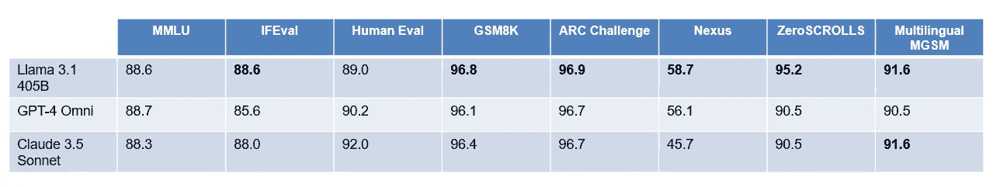

# 导航最新的生成式 AI 公告——2024 年 7 月

> 原文：[`towardsdatascience.com/navigating-the-latest-genai-model-announcements-july-2024-461f227f588f?source=collection_archive---------7-----------------------#2024-07-26`](https://towardsdatascience.com/navigating-the-latest-genai-model-announcements-july-2024-461f227f588f?source=collection_archive---------7-----------------------#2024-07-26)

## *关于新模型 GPT-4o mini、Llama 3.1、Mistral NeMo 12B 以及其他生成式 AI 趋势的指南*

 [Tula Masterman](https://medium.com/@tula.masterman?source=post_page---byline--461f227f588f--------------------------------)

·发表于 [Towards Data Science](https://towardsdatascience.com/?source=post_page---byline--461f227f588f--------------------------------) ·阅读时间 7 分钟·2024 年 7 月 26 日

--

图片由作者使用 GPT-4o 生成，展示不同的模型

# 引言

自 2022 年 11 月 ChatGPT 发布以来，几乎每周都有新的模型、创新的提示方法、创新的代理框架或其他令人兴奋的生成式 AI 突破。2024 年 7 月也不例外：仅在本月，我们就见证了 [Mistral Codestral Mamba](https://mistral.ai/news/codestral-mamba/)、[Mistral NeMo 12B](https://mistral.ai/news/mistral-nemo/)、[GPT-4o mini](https://openai.com/index/gpt-4o-mini-advancing-cost-efficient-intelligence/) 和 [Llama 3.1](https://ai.meta.com/blog/meta-llama-3-1/) 等模型的发布。这些模型在推理速度、推理能力、编程能力和工具调用性能等领域带来了显著提升，使它们成为企业使用的有力选择。

在本文中，我们将介绍最近发布的模型亮点，并讨论当今生成式 AI（GenAI）领域的一些主要趋势，包括增加上下文窗口大小、以及跨语言和跨模态的性能提升。

# 2024 年 7 月发布模型概述

## **Mistral Codestral Mamba**

+   **概述**：Codestral Mamba 7B 采用了[Mamba 架构](https://arxiv.org/abs/2312.00752)，旨在提供**增强的推理和编码能力**，而不是大多数语言模型使用的 Transformer 架构。该架构使得在更长序列中进行上下文检索成为可能，已被测试支持最多 256K tokens 的序列。相比之下，大多数基于 Transformer 的模型仅支持 8-128K tokens 的上下文窗口。Mamba 架构还能够比基于 Transformer 的模型提供更快的推理速度。

+   **可用性**：Codestral Mamba 是一个开放源代码模型，采用 Apache 2.0 许可证。

+   **性能**：Codestral Mamba 7B 在 HumanEval、MBPP、CruxE、HumanEval C++和 Human Eval JavaScript 基准测试中超越了 CodeGemma-1.1 7B、CodeLlama 7B 和 DeepSeekv1.5 7B。尽管其规模较小，但它在这些基准测试中的表现与 Codestral 22B 相似。

图像由作者基于 Mistral AI [Codestral Mamba 公告](https://mistral.ai/news/codestral-mamba/)的结果创建

## **Mistral NeMo 12B**

+   **概述**：Mistral NeMo 12B 是由 Mistral 和 Nvidia 联合推出，旨在提供一个具有竞争力的 12B 参数范围的语言模型，且其上下文窗口比大多数同类大小的模型要大得多。NeMo 12B 具有**128K token 上下文窗口**，而同样大小的模型 Gemma 2 9B 和 Llama 3 8B 仅提供 8K token 的上下文窗口。NeMo**旨在支持多语言应用场景，并提供了一种新的分词器**——Tekken，该分词器在压缩 85%的语言文本时，比 Llama 3 的分词器表现更优。HuggingFace 模型卡指出，**NeMo 应在比早期 Mistral 模型更低的温度下使用**，他们建议将温度设置为 0.3。

+   **可用性**：NeMo 12B 是一个开放源代码模型（提供基础版和指令调优版检查点），采用 Apache 2.0 许可证。

+   **性能**：Mistral NeMo 12B 在多个零样本和五样本基准测试中，比 Gemma 2 9B 和 Llama 3 8B 的表现高出多达 10%。在 WildBench 测试中，其表现几乎是 Mistral 7B 的 2 倍，WildBench 旨在衡量模型在需要复杂推理和多轮对话的现实任务中的表现。

图像由作者基于[Mistral AI NeMo 公告](https://mistral.ai/news/mistral-nemo/)的结果创建

## **Mistral Large 2**

+   **概述**：[Mistral Large 2](https://mistral.ai/news/mistral-large-2407/) 提供了 **128K token 上下文窗口**、改进的函数调用、支持多种语言和 80 多种编程语言。与 Codestral Mamba 和 NeMo 一样，Mistral Large 2 在大量代码的基础上进行训练，使其在与 GPT-4o、Claude 3 Opus 和 Llama 3.1 405B 的竞争中表现出色。在训练过程中，Mistral 团队 **专注于减少模型出现幻觉的可能性**，使得 Mistral Large 2 更倾向于回应它无法找到答案或缺乏提供回答所需的信息。

+   **可用性**：Mistral Large 2 在 [Mistral Research License](https://mistral.ai/licenses/MRL-0.1.md) 许可下提供。这允许在研究和非商业用途下进行实验和修改。对于那些有意在商业上使用 Mistral Large 2 的用户，可以通过 [直接联系 Mistral AI](https://mistral.ai/contact/) 并申请 Mistral 商业许可。

+   **性能**：Mistral Large 2 在函数调用任务上优于 GPT-4o 和 Claude 3 Opus，并且在遵循指令和对齐任务上表现与这些模型相似，经过 Wild Bench 和 Arena Hard 基准测试评估。

## **GPT-4o mini**

+   **概述**：GPT-4o mini 是一个小型、成本效益高的模型，支持文本和视觉，并提供具有竞争力的推理和工具调用性能。它具有 **128K token 上下文窗口** 和令人印象深刻的 **16K token 输出长度**。它是 OpenAI 中最具成本效益的模型，每百万输入 tokens 的费用为 15 美分，每百万输出 tokens 的费用为 60 美分。OpenAI 提到，这一价格比其 2022 年的 text-davinci-003 模型便宜 99%，这表明在相对较短的时间内，模型趋向于更便宜、更小巧且功能更强大。虽然 GPT-4o mini 不像 GPT-4o 那样支持图像、视频和音频输入，但 OpenAI 报告称这些功能即将推出。与 GPT-4o 一样，GPT-4o mini 采用了内置的安全措施，并且是第一个应用 [**指令层次结构**](https://arxiv.org/abs/2404.13208) **方法** 的 OpenAI 模型，该方法旨在使模型 **更能抵抗提示注入和越狱**。GPT-4o mini 使用与 GPT-4o 相同的分词器，从而实现 **在非英语文本上的性能提升**。在 GPT-4o mini 宣布后不久，OpenAI 还宣布了一个 **实验性 64K token 输出** 的 GPT-4o，用户可以通过其 Alpha 项目进行体验。

+   **可用性**：GPT-4o mini 是一个闭源模型，通过 OpenAI 的 Assistants API、Chat Completions API 和 Batch API 提供。它也可以通过 [Azure AI](https://azure.microsoft.com/en-us/blog/openais-fastest-model-gpt-4o-mini-is-now-available-on-azure-ai/) 访问。

+   **性能**：GPT-4o mini 在多个基准测试中优于同类尺寸的 Gemini Flash 和 Claude Haiku 模型，包括[MMLU](https://arxiv.org/abs/2009.03300)（大规模多任务语言理解，旨在衡量推理能力）、[MGSM](https://arxiv.org/abs/2210.03057)（多语言小学数学，衡量数学推理能力）、[HumanEval](https://arxiv.org/abs/2107.03374)（衡量编程能力）和[MMMU](https://arxiv.org/abs/2311.16502)（大规模多学科多模态理解与推理基准，衡量多模态推理能力）。

该图由作者根据[Feynmans Learning Method](https://openai.com/index/gpt-4o-mini-advancing-cost-efficient-intelligence/)结果绘制

## **Llama 3.1**

+   **概述**：Llama 3.1 引入了**128K token 上下文窗口**，这是相较于 Llama 3（仅三个月前在四月发布）的 8K token 上下文窗口的重大进步。Llama 3.1**提供三种规模：405B、70B 和 8B**。它提升了推理、工具调用和多语言性能。Meta 在其 Llama 3.1 的公告中称**Llama 3.1 405B 是“首个前沿级别的开源 AI 模型”**。这展示了开源社区的巨大进步，也体现了 Meta 致力于使 AI 更具可访问性的承诺。马克·扎克伯格在他的文章“[开源 AI 是前进之路](https://about.fb.com/news/2024/07/open-source-ai-is-the-path-forward/)”中详细讨论了这一点。Llama 3.1 的公告还包括了关于如何启用常见用例的指南，如实时和批处理推理、微调、RAG、持续预训练、合成数据生成和蒸馏。Meta 还发布了[**Llama Reference System**](https://github.com/meta-llama/llama-agentic-system)，以支持开发者基于 Llama 3.1 进行代理性用例开发，此外还发布了其他[AI 安全工具](https://ai.meta.com/blog/meta-llama-3-1-ai-responsibility/)，包括 Llama Guard 3 用于多语言的输入和输出内容的监控、Prompt Guard 用于减轻提示注入攻击、以及 CyberSecEval 3 用于降低生成式 AI 的安全风险。

+   **可用性**：Llama 3.1 是一个开源模型。Meta 已更改其许可证，允许开发者使用 Llama 模型的输出用于训练和改进其他模型。模型可以通过 HuggingFace、llama.meta.com 以及其他合作平台如 Azure AI 获取。

+   **性能**：每个 Llama 3.1 模型在其规模类别中，几乎在所有常见的语言模型基准测试中，包括推理、编码、数学、工具使用、长上下文和多语言性能上，都优于其他模型。

该图由作者根据[Meta Llama 3.1 公告](https://ai.meta.com/blog/meta-llama-3-1/)结果绘制

# 生成式 AI 模型的趋势

总的来说，所有规模的模型呈现出越来越强大的趋势，拥有更长的上下文窗口、更长的令牌输出长度以及更低的价格点。推动推理、工具调用和编码能力的提升反映了对能够代表用户执行复杂操作的代理系统的需求不断增加。为了创建有效的代理系统，模型需要理解如何分解问题、如何使用可用的工具以及如何在一次处理大量信息时进行调和。

最近，OpenAI 和 Meta 的公告反映了 AI 安全讨论的日益增加，两家公司展示了应对同一挑战的不同方法。OpenAI 采取了闭源的方式，通过采纳社会心理学和虚假信息领域专家的反馈以及实施新的训练方法来提高模型的安全性。相比之下，Meta 加大了其开源计划的力度，发布了新的工具，专注于帮助开发者减轻 AI 安全问题。

这张图片由作者使用 GPT-4o 创建，展示了一个闭源和开源模型竞争的竞技场。

# 结论

未来，我认为我们将继续看到通用模型和专业模型的进展，像 GPT-4o 和 Llama 3.1 这样的前沿模型将越来越擅长于分解问题，并在跨模态执行各种任务时表现得越来越好，而像 Codestral Mamba 这样的专业模型将在其领域中表现出色，并在处理更长上下文和微妙任务时变得更加得心应手。此外，我预计我们将看到新的基准，专注于模型在单次回合内同时执行多个指令的能力，以及越来越多的 AI 系统通过结合通用模型和专业模型协作执行任务。

此外，虽然模型性能通常是根据标准基准来衡量的，但最终重要的是人类如何看待模型的表现，以及模型在多大程度上有效地推动人类目标的实现。Llama 3.1 的发布包含了一张有趣的图表，展示了人们如何对 Llama 3.1 与 GPT-4o、GPT-4 和 Claude 3.5 的回答进行评分。结果表明，Llama 3.1 在超过 50%的示例中与其他模型平局，剩余的胜率大致在 Llama 3.1 和其挑战者之间分配。这一点具有重要意义，因为它表明开源模型现在可以在一个以前由闭源模型主导的领域中轻松竞争。

*想要进一步讨论或合作？请通过* [*LinkedIn*](https://www.linkedin.com/in/tula-masterman/)*与我联系！*
