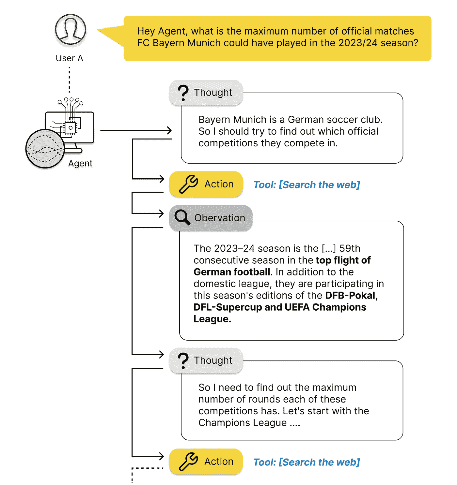

# 探索 LLM 代理的世界：初学者指南

> 原文：[`towardsdatascience.com/navigating-the-world-of-llm-agents-a-beginners-guide-3b8d499db7a9?source=collection_archive---------0-----------------------#2024-01-10`](https://towardsdatascience.com/navigating-the-world-of-llm-agents-a-beginners-guide-3b8d499db7a9?source=collection_archive---------0-----------------------#2024-01-10)

## 一步一步指南，发现并利用 LLM 代理和工具包的力量

 [Dominik Polzer](https://dmnkplzr.medium.com/?source=post_page---byline--3b8d499db7a9--------------------------------)

·发表于 [Towards Data Science](https://towardsdatascience.com/?source=post_page---byline--3b8d499db7a9--------------------------------) ·19 分钟阅读·2024 年 1 月 10 日

--

思维链提示——图片由作者提供

# 目录

**简介**

什么是代理？

我们需要什么来构建自己的智能助手？

我们如何连接所有必要的技能？—— 代理背后的理论

代理是如何工作的？—— 思维链

代理执行器——代理背后的代理

**从理论到实践**

如何使用 SQLDatabaseToolkit？

实践教程

**总结**

# 简介

这篇文章讲述的是如何让 LLM（大语言模型）独立解决复杂任务。

人类在不断吸收信息、做出决策、采取行动、观察变化，然后做出下一个决策的能力上非常出色。我们的一生就是一个永无止境的**观察、思考和行动的链条**。我们希望将这一概念应用于 LLM，使其能够持续做出新的决策，从而逐步接近复杂问题的解决方案。
