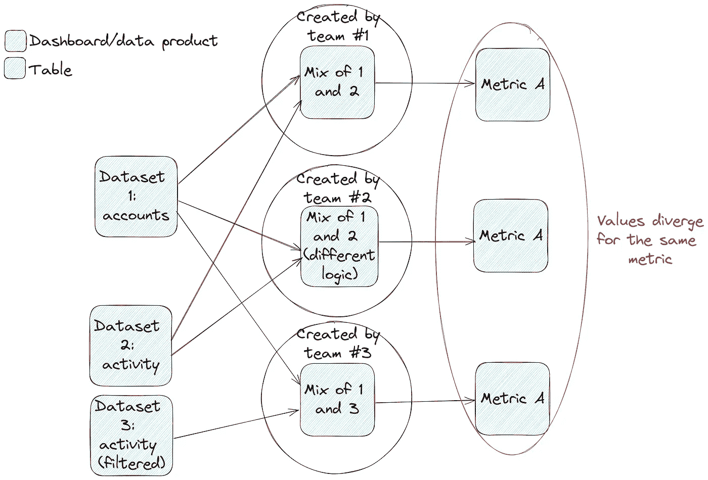
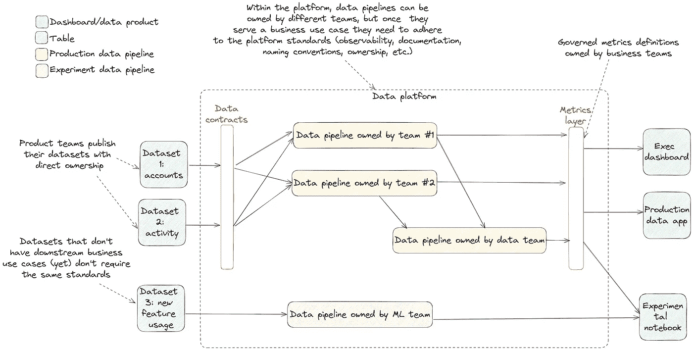

# 驾驭数据平台的成长痛点：从数据混乱到数据网格的路径

> 原文：[`towardsdatascience.com/navigating-your-data-platforms-growing-pains-a-path-from-data-mess-to-data-mesh-c16df72f5463?source=collection_archive---------3-----------------------#2024-04-03`](https://towardsdatascience.com/navigating-your-data-platforms-growing-pains-a-path-from-data-mess-to-data-mesh-c16df72f5463?source=collection_archive---------3-----------------------#2024-04-03)

## 与软件开发团队不同，数据团队缺乏应对可扩展性挑战的成熟方法。本文提供了一套指导原则，帮助你有效扩展数据平台，同时最大化其商业影响。

 [Mahdi Karabiben](https://mahdiqb.medium.com/?source=post_page---byline--c16df72f5463--------------------------------)

·发表于[Towards Data Science](https://towardsdatascience.com/?source=post_page---byline--c16df72f5463--------------------------------) ·10 分钟阅读·2024 年 4 月 3 日

--

图片由[Jack Anstey](https://unsplash.com/@jack_anstey?utm_source=medium&utm_medium=referral)提供，来自[Unsplash](https://unsplash.com/?utm_source=medium&utm_medium=referral)

在开发软件组件时，开发人员可以利用多种框架、设计模式和原则来扩展他们的产品，并无缝调整架构以支持新的用例，处理不断增加的使用量和复杂性。这使得软件工程团队能够确保随着平台（及其价值）规模的增长，优化性能和可靠性。

然而，数据团队并不那么幸运。尽管数据平台生命周期的最初几个月通常充满了解决复杂技术挑战的兴奋和交付第一批数据产品的喜悦，但接下来的往往是日益复杂的螺旋、成本的上升以及回报的递减。

与我们作为数据团队需要应对的其他问题不同，我们在可扩展性方面的挑战与软件团队所面临的挑战本质上不同。在数据领域，这些挑战表现为不可避免的技术复杂性（比如在不断扩展的系统列表中混合多种模式来移动和转换数据），以及数据平台在公司中的独特定位（因为最终每个业务部门都将直接或间接地与其连接）。

所以，在这个[后 MDS 时代](https://benn.substack.com/p/the-problem-was-the-product)，数据团队在支出方面受到严格审查，并不断被要求展示其价值，定义标准和原则以成功扩展数据平台比以往任何时候都更为重要。本文将聚焦于实现这一目标的五项关键原则，并提供应用这些原则的策略。

# 1\. 不要忽视重要的东西（即商业价值）

在大多数情况下，数据平台有潜力成为公司最有价值的资产之一。然而，在证明其价值的过程中，不幸的是，数据团队常常专注于*做什么*而不是*为什么做*。

如果你浏览网上的相关数据内容，你大多会看到复杂的数据架构，或者是对某些技术的赞扬/批评。另一方面，专注于支持下游用例或衡量数据项目影响的内容相对较少。我认为这是数据团队需要解决的一个关键问题的症状：**我们很容易过于专注于我们正在构建的东西，而忽视了我们为什么要构建它**。

这个问题最终可能导致数据团队走上“为了构建而构建”的道路。相反，更具可扩展性的方法是寻找能够创造价值的数据项目，并持续反思（并在可能时衡量）所创造的价值。为此，我推荐以下四种策略：

## **找出哪些数据是重要的（并非所有数据都同等重要）**

由于今天的技术使得生成、存储和转换海量数据变得极其容易，数据团队很快会被他们需要支持的快速增长的数据集所淹没。然而，您应该给予数据集的关注程度必须基于其重要性，这一重要性是通过将其与下游用例相连接来确定的。

## **将每个项目/计划与它将创造的价值联系起来**

在一个数据项目获得批准之前，应该评估它将为业务带来多少价值（直接或间接）。这一重要的工作确保了与利益相关者的一致性，并允许你将数据项目映射到下游的倡议。为数据管道和其他类型的数据组件编写设计文档是确保你所构建的内容与明确的业务目标和指标一致的好方法。

## **持续寻找新的高影响力使用案例**

数据团队通常依赖于从其他部门和业务单元接收请求和潜在项目。尽管依赖这些流程可能很有吸引力，但你应该始终关注那些可以利用数据的潜在价值创造领域。无论是内部数据产品还是可以嵌入公司产品中的数据应用，关键的使用案例可能会因为数据团队在自己的小角落里构建事物而被忽视。

## **经常向用户索取反馈**

数据团队很容易集中注意力于错误的指标。例如，使用量的增加可能让我们感到有所成就。然而，在数据驱动的环境中，人们需要全方位的数据——因此，使用量的增加并不一定意味着一切顺利，或者使用量正在转化为价值创造的使用案例。随着平台的扩展，问题最终会显现出来（从数据质量问题到开发速度缓慢），而与用户的脱节意味着你将不得不追赶上去，才能重新获得他们的信任。相反，尝试经常要求反馈，无论是通过你提供的工具中的嵌入式反馈机制，还是每隔几个月发送给用户的简单反馈表单。

# 2\. 自动化标准是你最好的朋友

扩展数据平台的最大挑战之一是被拉向多个方向。无论是由于需要新数据组件的项目涌入，还是无休止的临时请求，数据团队的旅程中总有一天会遇到瓶颈。那时，通常会做出一个不幸的决定：采用自助服务模式，但没有为其设定正确的基础。这意味着其他团队可以构建自己的数据集或管道来生成洞察——这一切开始时看起来不错，直到有人最终意识到没有任何数据集可以再信任。

采用没有治理的自助服务方法的陷阱（作者图片）

这里的建议不是避免自助服务。相反，你应该定义事情应该如何做的标准，并尽可能自动化其执行。这些标准可以包括像表格/列/模型命名规范和强制文档化等基本事项，或者更细致的做法，如强制测试和只在生产管道中使用受管控的数据集。

通过应用这样的标准——例如通过持续集成（CI）自动化——可以确保最小程度的一致性，并避免数据平台最终变成数据混乱或沼泽的情况。

然而，重要的是要注意，你选择应用的标准应该有明确的商业理由，并且不应在没有实际好处的情况下影响开发速度。标准化和迭代/交付速度之间的正确平衡取决于公司的背景和数据使用的具体场景，但在所有情况下，至少需要有最基本的标准化。

# 3\. 经常问自己，是否拥有适合当前规模的工具

作为一名工程师，我知道很容易对你为了做 X 而构建的整洁的包，或是你用来做 Y 的开源项目（也许你还为其做出了贡献）产生过度依赖。然而，随着数据平台规模的增长，定期重新审视你的架构，找出工具需要升级（或降级）之处，是一项重要的工作。

迁移当然有成本，而且总是很棘手——但是在合适的时机进行迁移并且[拥有一个替换平台组件的操作手册](https://lethain.com/migrations/)是每个数据团队必须掌握的关键技能。为了评估哪些工具可能不适合你当前的规模，我认为对于你的技术栈中的每个组件，必须有一个最新的、高层次的答案来回答以下问题：

+   它的成本是多少？（包括维护它所需的工程时间、它的基础设施成本、定价等）这个成本我们是否能够接受？这个成本在明年内会如何变化？

+   我们是否在它上面投入了资源（工程时间、资金等），而如果把这些资源投入到其他地方，可能会带来更多的商业价值？

+   它是否具备我们当前所需的所有主要功能，以及我们在明年需要的功能？如果没有，是否有其他能够提供我们所需功能的选项？如果有这样的选项，迁移成本是多少？

通过进行这样的练习，你一定会遇到一些可以完全淘汰的领域（例如那些没有提供任何有意义价值的管道或工具），一些需要用另一个系统替换的领域（可能你构建了一个实时摄取过程，但所有当前对业务至关重要的消费场景只需要批处理），还有一些需要升级的领域（比如将内建的数据移动过程迁移到一个功能更全的成熟工具）。

作为一个更实际的例子，尽管 dbt 测试是确保关键资产数据质量的良好起点，并让消费者信任他们所使用的数据，但当你将更多系统添加到数据平台并开始支持生产（甚至是操作）用例时，它们的效用很快就会达到极限。一旦你在数据事件和调试数据问题上花费的精力开始影响你的路线图，也许是时候从 dbt 测试升级到数据可观察性组件了。

# 4\. 不要过于雄心勃勃（优先解决你的问题）

这一原则与上面提到的原则是相辅相成的。就像在需要时执行迁移至关重要一样，避免不必要的迁移更为重要。

当前数据领域的发展速度意味着新技术、新范式和新架构是不断变化的。科技巨头们在不断重新思考他们的数据处理方式，不管你如何努力，平台的大部分部分总会落后于数据先行者几步。然而，这并不意味着坏事。

在你反思当前技术状态并尝试识别平台中的差距时，指导思想应该是你通过升级所期望生成的商业价值。没错，能力 X 在纸面上听起来不错，但它具体解决了哪些业务场景？你又可以将迁移工作投入到哪些其他项目中呢？

我相信保持与行业前沿同步，了解其他数据团队的历程非常重要，但决定采用新工具或新范式时，始终需要基于预期的商业价值。此外，始终牢记业务优先级，并随着数据团队周围环境的变化进行相应的更新，也是至关重要的。

# 5\. 将部分责任向左（或右）转移

一旦覆盖了上述领域，尤其是当数据平台开始支持高影响力的项目时，数据团队可以开始转变为*平台团队*角色。这意味着你可以自信地开始在所有权上增添更多的细节，并将数据团队从管理业务指标和源数据问题的负担中解脱出来。

这次过渡的时机至关重要，因为责任的去中心化只有在你已经建立了正确的基础设施的前提下才能成功：

+   使数据平台成为一个对业务成功至关重要的价值生成系统（这样其他团队也会被激励投入时间进行与数据相关的工作）

+   标准化不同的流程，定义清晰的接口，减少平台贡献团队（无论是生产者、消费者还是贡献者）需要做的猜测工作

+   拥有正确的工具集，能够让你轻松引入新团队，并驾驭更复杂的结构

此外，与其一次性将所有数据产品过渡到去中心化模式，不如分阶段进行过渡，这样你成功的几率更高。首先，从识别最关键的数据集和数据管道开始，你可以：

+   与数据生产者建立契约

+   将指标定义的所有权移交给相应的业务团队

一旦第一个计划成功，你可以根据业务的重要性，开始扩大符合新模式的数据管道范围。完全不需要将这个模式应用于所有数据集——如果一个数据管道还没有明确的业务用例，它就不需要进行严格的治理。

大规模运作的数据平台示意图（图片由作者提供）

上述要点，最终是本文讨论的前四个原则的总结。许多去中心化/数据网格项目失败，要么是因为缺乏正确的基础，要么是因为数据团队试图从完全集中化转向去中心化的过渡过于乐观（甚至不切实际），而不是分阶段进行转变。

在本文中，我们探讨了成功扩展数据平台并将其转变为一个具有价值生成能力的组成部分的五个原则。它们的应用不要求使用特定的工具或技术，而是可以在进行数据项目时普遍应用的指导方针（除了一些特定的边缘案例/小众行业）。

我们讨论的最终状态是一个混合设置，结合了集中式方法（数据团队拥有端到端的平台）和去中心化/数据网格方法（不同团队构建并拥有其数据产品的端到端），这种设置提升了你成功扩展平台的机会，尤其是在你从一种方法过渡到另一种方法时——但其是否适合你的团队，也取决于你所在的行业和运营的具体背景。

最后，如果只记住一个原则/规则，那就记住这一点：**定期重新评估你的方法和你所走的道路是极其重要的。从 0 到 1 的过程与从 1 到 10（以及之后的过程）是截然不同的。** 这是一个普遍适用的原则，我认为它对于数据平台尤为重要。

*如果你想获取更多数据工程方面的内容，可以订阅我的通讯《Data Espresso》，在其中我讨论与数据工程和技术相关的各种话题：*

 [## Data Espresso | Mahdi Karabiben | Substack

### 数据工程更新和评论，伴随着你下午的浓缩咖啡。点击阅读《Data Espresso》，作者：Mahdi…

[dataespresso.substack.com](https://dataespresso.substack.com/?source=post_page-----c16df72f5463--------------------------------)
