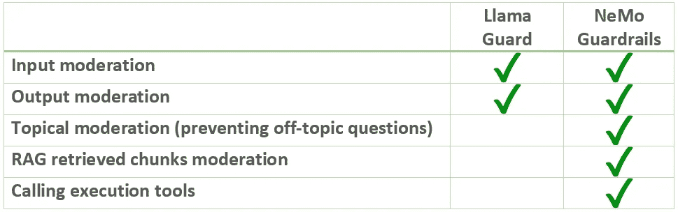

# NeMo Guardrails：终极开源 LLM 安全工具包

> 原文：[`towardsdatascience.com/nemo-guardrails-the-ultimate-open-source-llm-security-toolkit-0a34648713ef?source=collection_archive---------3-----------------------#2024-02-09`](https://towardsdatascience.com/nemo-guardrails-the-ultimate-open-source-llm-security-toolkit-0a34648713ef?source=collection_archive---------3-----------------------#2024-02-09)

## 探索 NeMo Guardrails 的实际应用案例

 [Wenqi Glantz](https://medium.com/@wenqiglantz?source=post_page---byline--0a34648713ef--------------------------------)

·发表于[Towards Data Science](https://towardsdatascience.com/?source=post_page---byline--0a34648713ef--------------------------------) ·阅读时间 13 分钟·2024 年 2 月 9 日

--

图片由 DALL-E 3 生成，由作者提供

在 LLM 安全性话题中，我们已经从不同角度探讨了[OWASP top 10 for LLM applications](https://levelup.gitconnected.com/security-driven-development-with-owasp-top-10-for-llm-applications-588406f40d4c?sk=dde699f26d74e8bcfb1ea2c4488b62e5)、Llama Guard 和 Lighthouz AI。今天，我们将探索[NVIDIA 开发的开源工具包 NeMo Guardrails](https://github.com/NVIDIA/NeMo-Guardrails)，该工具包可轻松为基于 LLM 的对话系统添加可编程防护措施。

# NeMo Guardrails vs. Llama Guard

NeMo Guardrails 与我们在[上一篇文章](https://medium.com/towards-data-science/safeguarding-your-rag-pipelines-a-step-by-step-guide-to-implementing-llama-guard-with-llamaindex-6f80a2e07756?sk=c6cc48013bac60924548dd4e1363fa9e)中深入探讨过的 Llama Guard 有何不同？让我们并排比较它们的功能。

表格由作者提供

正如我们所看到的，Llama Guard 和 NeMo Guardrails 在本质上是不同的：

+   Llama Guard 是一个大型语言模型，基于 Llama 2 进行微调，并且是一个输入输出安全防护模型。它包含六个不安全类别，开发者可以通过添加额外的不安全类别来定制这些类别，以适应他们的输入输出审查需求。

+   NeMo Guardrails 是一个更为全面的 LLM 安全工具集，提供了更广泛的可编程功能…
