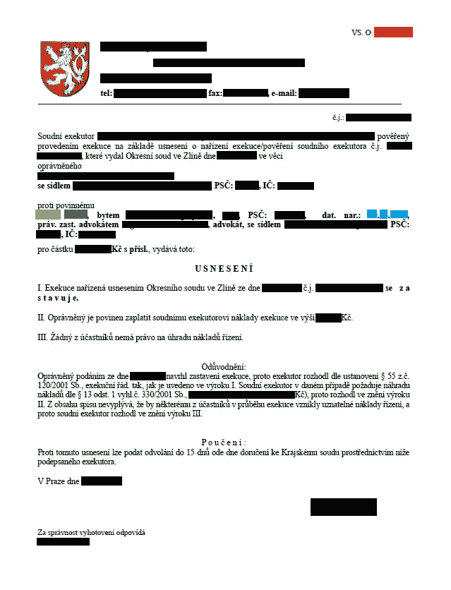

# 使用 🤗 Accelerate 进行捷克文档中的 NER 任务，基于 XLM-RoBERTa 模型

> 原文：[`towardsdatascience.com/ner-in-czech-documents-with-xlm-roberta-using-accelerate-32a6baf3e91e?source=collection_archive---------9-----------------------#2024-11-12`](https://towardsdatascience.com/ner-in-czech-documents-with-xlm-roberta-using-accelerate-32a6baf3e91e?source=collection_archive---------9-----------------------#2024-11-12)

## *在开发一个成功部署的文档处理模型过程中，我做出的决策*

[](https://medium.com/@bbuso?source=post_page---byline--32a6baf3e91e--------------------------------)[](https://towardsdatascience.com/?source=post_page---byline--32a6baf3e91e--------------------------------) [Bohumir Buso](https://medium.com/@bbuso?source=post_page---byline--32a6baf3e91e--------------------------------)

·发布于 [Towards Data Science](https://towardsdatascience.com/?source=post_page---byline--32a6baf3e91e--------------------------------) ·阅读时间：9 分钟·2024 年 11 月 12 日

--


图像由 Dall-E 生成

尽管我在机器学习项目中已有超过 8 年的经验，但这是我第一次从事 NLP 项目。我最初寻找现有的资源和代码，但发现相关材料非常有限，特别是关于捷克语文档中的 NER 任务。这激发我将开发过程中学到的所有知识整理到一个地方，希望能帮助未来的新人更高效地进步。因此，**本文提供的是一个实用的入门介绍，而非深入的理论分析**。

由于敏感性考虑，特定的数值结果已被省略。

# 数据



包含实体的文档示例：*债权人变量符号*（红色）、姓氏（浅绿色）、名字（深绿色）、出生日期（蓝色）。敏感信息已被屏蔽。

**任务** 主要目标是通过以下任一标识符来识别与每个文档相关联的客户：

+   *债权人变量符号*（约 20%的文档中出现）

+   *出生身份证明*（约 60%的文档中出现）

+   组合 *姓名* + *姓氏* + *出生日期*（约 50%的文档中出现）

大约 5%的文档没有包含任何识别实体。

**数据集** 在开发过程中，我使用了 710 个“真实”PDF 文档，将其分为三个集：600 个用于训练，55 个用于验证，55 个用于测试。

**标签** 我收到了一个包含实体提取为纯文本的 Excel 文件，需要手动标注文档文本。我使用了[BIO](https://natural-language-understanding.fandom.com/wiki/Named_entity_recognition#BIO)标注格式，按照以下步骤进行操作：

1.  打开每个文档（使用`extract_text()`函数，来自`pdfminer.high_level`模块）

1.  将文本拆分为单词（使用 SpaCy 模型“xx_sent_ud_sm”，并做一些调整，如防止在连字符上拆分，以处理出生号码格式，例如‘84–12–10/7869’）

1.  识别文本中的实体

1.  为实体分配相应的标签，使用“O”标签标注所有其他词汇

**替代方法** 类似 LayoutLM 的模型，考虑输入标记的边界框，可能会提高质量。然而，我避免了这个选项，因为和往常一样（😮‍💨），**我已经在数据准备上花费了大部分项目时间**（例如，重新格式化 Excel 文件、修正数据错误、标注）。追求基于边界框的模型会需要更多的时间。

尽管正则表达式和启发式方法理论上可以处理这些简单的实体，我认为这种方法会无效，因为它需要过于复杂的规则才能准确地在其他潜在候选实体中识别出正确的实体（如律师名字、案件编号、其他诉讼参与者等）。另一方面，模型能够学习区分相关实体，因此不需要使用启发式方法。

# 模型（训练）

**🤗 Accelerate**

由于在封装器较不常见的时期开始工作，**我习惯于编写自己的训练循环，这让我更容易调试 -** **这一方法得到了🤗 Accelerate 的有效支持**。这在这个项目中证明是有益的——我并不完全确定所需的数据和标签格式或形状，而我的数据与教程中常见的组织良好的示例不符，但在训练循环中完全访问中间计算使我能够快速迭代。

**上下文长度** 大多数教程建议将每个句子作为一个单独的训练示例。然而，在这个案例中，我决定**更长的上下文更为合适，因为文档通常包含对多个实体的引用，其中许多是无关的（例如律师、其他债权人、案件编号）**。这种更广泛的上下文帮助模型更好地识别相关客户。我使用每个文档的 512 个标记作为一个训练示例。这是大多数模型的常见最大限制，但足以容纳我文档中的所有实体。

**子标记的标注** 在🤗标记分类教程[1]中，推荐的方法是：

> 只标注给定单词的第一个标记。对同一单词的其他子标记分配`*-100*`。

然而，我发现以下方法在他们的 NLP 课程中的标记分类教程[2]中效果更好：

> 每个词元都得到与它所在单词开头词元相同的标签，因为它们是同一实体的一部分。对于单词内部但不是开头的词元，我们将`*B-*`替换为`*I-*`。

标签“-100”是一个特殊标签，它会被损失函数忽略。因此，我对他们的函数做了小的修改：

```py
def align_labels_with_tokens(labels, word_ids):
    new_labels = []
    current_word = None
    for word_id in word_ids:
        if word_id != current_word:
            # Start of a new word!
            current_word = word_id
            label = -100 if word_id is None else labels[word_id]
            new_labels.append(label)
        elif word_id is None:
            # Special token
            new_labels.append(-100)
        else:
            # Same word as previous token
            label = labels[word_id]
            # If the label is B-XXX we change it to I-XXX
            if label % 2 == 1:
                label += 1
            new_labels.append(label)

    return new_labels

def tokenize_and_align_labels(examples):
    tokenizer = AutoTokenizer.from_pretrained("../model/xlm-roberta-large")
    tokenized_inputs = tokenizer(
        examples["tokens"], truncation=True, is_split_into_words=True,
        padding="max_length", max_length=512)
    all_labels = examples["ner_tags"]
    new_labels = []
    for i, labels in enumerate(all_labels):
        word_ids = tokenized_inputs.word_ids(i)
        new_labels.append(align_labels_with_tokens(labels, word_ids))

    tokenized_inputs["labels"] = new_labels
    return tokenized_inputs
```

我还使用了他们的`postprocess()`函数：

> 为了简化其评估部分，我们定义了这个`*postprocess()*`函数，它接收预测值和标签，并将它们转换为字符串列表。

```py
def postprocess(predictions, labels):
    predictions = predictions.detach().cpu().clone().numpy()
    labels = labels.detach().cpu().clone().numpy()

    true_labels = [[id2label[l] for l in label if l != -100] for label in labels]
    true_predictions = [
        [id2label[p] for (p, l) in zip(prediction, label) if l != -100]
        for prediction, label in zip(predictions, labels)
    ]
    return true_predictions, true_labels
```

**类别权重**

将类别权重纳入损失函数显著提高了模型性能。**虽然这个调整看起来很简单——没有它，模型过于强调了“O”类别这个多数类——但令人惊讶的是，大多数教程中都没有提到这一点。我实现了一个自定义的`compute_weights()`函数来解决这个不平衡问题：**

```py
def compute_weights(trainset, num_labels):
    c = Counter()
    for t in trainset:
        c += Counter(t['labels'].tolist())
    weights = [sum(c.values())/(c[i]+1) for i in range(num_labels)]
    return weights
```

**训练循环** 我定义了两个额外的函数：PyTorch 的`DataLoader()`来管理批处理，以及一个`main()`函数来设置分布式训练对象并执行训练循环。

```py
from accelerate import Accelerator, notebook_launcher
from collections import Counter
from datasets import Dataset
from datetime import datetime
import torch
from torch.optim.lr_scheduler import ReduceLROnPlateau
from torch.nn import CrossEntropyLoss
from torch.utils.data import DataLoader
from transformers import AutoTokenizer
from transformers import AutoModelForTokenClassification
from transformers import XLMRobertaConfig, XLMRobertaForTokenClassification
from seqeval.metrics import classification_report, f1_score

def create_dataloaders(trainset, evalset, batch_size, num_workers):
    train_dataloader = DataLoader(trainset, shuffle=True, 
                          batch_size=batch_size, num_workers=num_workers)
    eval_dataloader = DataLoader(evalset, shuffle=False, 
                          batch_size=batch_size, num_workers=num_workers)
    return train_dataloader, eval_dataloader

def main(batch_size, num_workers, epochs, model_path, dataset_tr, dataset_ev, training_type, model_params, dt):
    accelerator = Accelerator(split_batches=True)
    num_labels = model_params['num_labels']

    # Prepare data #
    train_ds = Dataset.from_dict(
                {"tokens": [d[2][:512] for d in dataset_tr], 
                 "ner_tags": [d[1][:512] for d in dataset_tr]})
    eval_ds = Dataset.from_dict(
                {"tokens": [d[2][:512] for d in dataset_ev],
                 "ner_tags": [d[1][:512] for d in dataset_ev]})
    trainset = train_ds.map(tokenize_and_align_labels, batched=True,
                 remove_columns=["tokens", "ner_tags"])
    evalset = eval_ds.map(tokenize_and_align_labels, batched=True,
                 remove_columns=["tokens", "ner_tags"])
    trainset.set_format("torch")
    evalset.set_format("torch")
    train_dataloader, eval_dataloader = create_dataloaders(trainset, evalset,
                                          batch_size, num_workers)

    # Type of training #
    if training_type=='from_scratch':
        config = XLMRobertaConfig.from_pretrained(model_path, **model_params)
        model = XLMRobertaForTokenClassification(config)
    elif training_type=='transfer_learning':
        model = AutoModelForTokenClassification.from_pretrained(model_path, 
                    ignore_mismatched_sizes=True, **model_params)
        for param in model.parameters():
            param.requires_grad=False
        for param in model.classifier.parameters():
            param.requires_grad=True
    elif training_type=='fine_tuning':
        model = AutoModelForTokenClassification.from_pretrained(model_path,
                     **model_params)
        for param in model.parameters():
            param.requires_grad=True
        for param in model.classifier.parameters():
            param.requires_grad=True

    # Intantiate the optimizer #
    optimizer = torch.optim.AdamW(params=model.parameters(), lr=2e-5)

    # Instantiate the learning rate scheduler #
    lr_scheduler = ReduceLROnPlateau(optimizer, patience=5)

    # Define loss function #
    weights = compute_weights(trainset, num_labels)
    loss_fct = CrossEntropyLoss(weight=torch.tensor(weights))

    # Prepare objects for distributed training #
    loss_fct, train_dataloader, model, optimizer, eval_dataloader, lr_scheduler = accelerator.prepare(
        loss_fct, train_dataloader, model, optimizer, eval_dataloader, lr_scheduler)

    # Training loop #
    max_f1 = 0 # for early stopping
    for t in range(epochs):
        # training
        accelerator.print(f"\n\nEpoch {t+1}\n-------------------------------")
        model.train()
        tr_loss = 0
        preds = list()
        labs = list()
        for batch in train_dataloader:
            outputs = model(input_ids=batch['input_ids'],
                            attention_mask=batch['attention_mask'])
            labels = batch["labels"]
            loss = loss_fct(outputs.logits.view(-1, num_labels), labels.view(-1))
            accelerator.backward(loss)
            optimizer.step()
            optimizer.zero_grad()
            tr_loss += loss
            predictions = outputs.logits.argmax(dim=-1)
            predictions_gathered = accelerator.gather(predictions)
            labels_gathered = accelerator.gather(labels)
            true_predictions, true_labels = postprocess(predictions_gathered, labels_gathered)
            preds.extend(true_predictions)
            labs.extend(true_labels)

        lr_scheduler.step(tr_loss)

        accelerator.print(f"Train loss: {tr_loss/len(train_dataloader):>8f} \n")
        accelerator.print(classification_report(labs, preds))

        # evaluation
        model.eval()
        ev_loss = 0
        preds = list()
        labs = list()
        for batch in eval_dataloader:
            with torch.no_grad():
                outputs = model(input_ids=batch['input_ids'],
                                attention_mask=batch['attention_mask'])
                labels = batch["labels"]
                loss = loss_fct(outputs.logits.view(-1, num_labels), labels.view(-1))

            ev_loss += loss
            predictions = outputs.logits.argmax(dim=-1)
            predictions_gathered = accelerator.gather(predictions)
            labels_gathered = accelerator.gather(labels)
            true_predictions, true_labels = postprocess(predictions_gathered, labels_gathered)
            preds.extend(true_predictions)
            labs.extend(true_labels)

        accelerator.print(f"Eval loss: {ev_loss/len(eval_dataloader):>8f} \n")
        accelerator.print(classification_report(labs, preds))

        accelerator.print(f"Current Learning Rate: {optimizer.param_groups[0]['lr']}")

        # checkpoint best model
        if f1_score(labs, preds) > max_f1:
            accelerator.wait_for_everyone()
            unwrapped_model = accelerator.unwrap_model(model)
            unwrapped_model.save_pretrained(f"../model/xlml_ner/{dt}/",
                               is_main_process=accelerator.is_main_process,
                               save_function=accelerator.save)
            accelerator.print(f"Model saved during {t+1}. epoch.")
            max_f1 = f1_score(labs, preds)
            best_epoch = t

        # early stopping
        if (t - best_epoch) > 10:
            accelerator.print(f"Early stopping after {t+1}. epoch.")
            break

    accelerator.print("Done!") 
```

一切准备就绪，模型已经可以开始训练了。我只需要启动这个过程：

```py
label_list = [
    "O",
    "B-evcu", "I-evcu", # variable symbol of creditor
    "B-rc", "I-rc", # birth ID
    "B-prijmeni", "I-prijmeni", # surname
    "B-jmeno", "I-jmeno", # given name
    "B-datum", "I-datum", # birth date
]
id2label = {a: b for a,b in enumerate(label_list)}
label2id = {b: a for a,b in enumerate(label_list)}

num_workers = 6 # number of GPUs
batch_size = num_workers*2
epochs = 100
model_path = "../model/xlm-roberta-large"
training_type = "fine_tuning" # from_scratch / transfer_learning / fine_tuning
model_params = {"id2label": id2label, "label2id": label2id, "num_labels": 11}
dt = datetime.now().strftime("%Y%m%d_%H%M%S")
os.mkdir(f"../model/xlml_ner/{dt}")

notebook_launcher(main, args=(batch_size, num_workers, epochs, model_path,
                   dataset_tr, dataset_ev, training_type, model_params, dt),
                   num_processes=num_workers, mixed_precision="fp16", use_port="29502")
```

**我发现使用** `notebook_launcher()` **很方便，因为它允许我在控制台中运行训练，并且之后可以轻松处理结果。**

**XLM-RoBERTa 基础版 vs 大型版 vs Small-E-Czech** 我尝试了微调三种模型。XLM-RoBERTa 基础版模型[3]表现令人满意，但服务器容量也允许我尝试 XLM-RoBERTa 大型版模型[3]，它的参数量是前者的两倍。

> XLM-RoBERTa 是 RoBERTa 的多语言版本。它是在 2.5TB 过滤后的 CommonCrawl 数据上预训练的，包含 100 种语言。

大型模型在结果上略有提升，所以我最终部署了它。我也测试了 Small-E-Czech [4]，一个在捷克网页数据上预训练的 Electra-small 模型，但它的表现很差。

**微调 vs 迁移学习 vs 从头训练** 除了微调（更新所有模型权重）之外，我还测试了迁移学习，因为有时会建议只训练最后一层（分类层）就足够了。然而，性能差异显著，微调更为优越。我还尝试了从头训练，通过仅导入模型的架构，随机初始化权重，然后进行训练，但如预期的那样，这种方法效果不佳。

**RoBERTa vs LLM（Claude 3.5 Sonnet）** 我简要探索了零样本 LLM，尽管我几乎没有进行提示工程（所以有点🥱）。模型在处理基本请求时表现困难，比如（我在实际提示中使用了捷克语）：

> 查找债权人变量符号。这个数字由恰好 9 位连续数字（0–9）组成，不包含字母或其他特殊字符。通常前面会有以下缩写之一：‘ev.č.’、‘zn. opr’、‘VS. O’、‘evid. č. opr.’。相反，我对缩写为 ‘č.j.’ 的交易号不感兴趣。这个数字在文档中出现的频率较低，可能你找不到它，若无法找到，写上‘cannot find’。如果不确定，写上‘not sure’。

模型有时无法准确输出 9 位数字格式。后处理会过滤掉较短的数字，但也会出现很多误报的 9 位数字。

有时模型仅基于出生日期推测错误的 *出生身份证号*（即使温度设置为 0）。另一方面，模型在提取 *姓名*、*姓氏* 和 *出生日期* 方面表现优秀。

总体而言，即使在我之前的实验中，**我发现大语言模型（LLMs）**（在撰写时）**在一般任务上表现较好，但在特定或非常规任务上的准确性和可靠性较差**。在客户识别方面，两种方法的表现相差无几。由于内部原因，最终部署了 RoBERTa 模型。

# 后处理

值得注意的是，实施 **后处理可以显著减少误报**，提高整体性能。每个实体都遵循定制的过滤和验证规则：

+   *债务人变量符号* - 验证 9 位数字格式

+   *出生身份证号* - 强制使用 XXXXXX/XXX(X) 格式，并检查是否能被 11 整除

+   *姓名* 和 *姓氏* - 使用 MorphoDiTa [5] 进行词形还原

+   *出生日期* - 强制使用 DD.MM.YYYY 格式

# 结论

微调后的模型成功部署，**表现卓越**，**在仅有 710 篇文档的 modest 数据集上超出预期表现**。

尽管大语言模型在一般任务中显示出潜力，但它们在专业任务上的准确性和可靠性不足。也就是说，随着大语言模型的持续改进，未来即便是微调，除非是高度专业化的任务，否则可能变得不再必要。

**致谢** 我想感谢 [Martin](https://www.linkedin.com/in/martin-munch/)、[Tomáš](https://www.linkedin.com/in/tomas-duricek/) 和 [Petr](https://www.linkedin.com/in/petr-petras-37b2b0160/) 对本文章提出的宝贵建议。

**来源** [1] Hugging Face，[Transformers - Token classification](https://huggingface.co/docs/transformers/tasks/token_classification#preprocess)

[2] Hugging Face，[NLP Course — Token classification](https://huggingface.co/learn/nlp-course/chapter7/2)

[3] A. Conneau, K. Khandelwal, N. Goyal, V. Chaudhary, G. Wenzek, F. Guzman, E. Grave, M. Ott, L. Zettlemoyer 和 V. Stoyanov，[无监督跨语言表示学习 at Scale](https://arxiv.org/abs/1911.02116)（2019），CoRR abs/1911.02116

[4] M. Kocián, J. Náplava, D. Štancl 和 V. Kadlec，[基于 Siamese BERT 的网络搜索相关性排序模型，在新的捷克数据集上进行评估](https://arxiv.org/abs/2112.01810)（2021）

[5] J. Straková, M. Straka 和 J. Hajič. [用于形态学、词形还原、词性标注和命名实体识别的开源工具](http://www.aclweb.org/anthology/P/P14/P14-5003.pdf)（2014），发表于《第 52 届计算语言学协会年会：系统展示论文集》，第 13–18 页，美国马里兰州巴尔的摩，2014 年 6 月。计算语言学协会。
