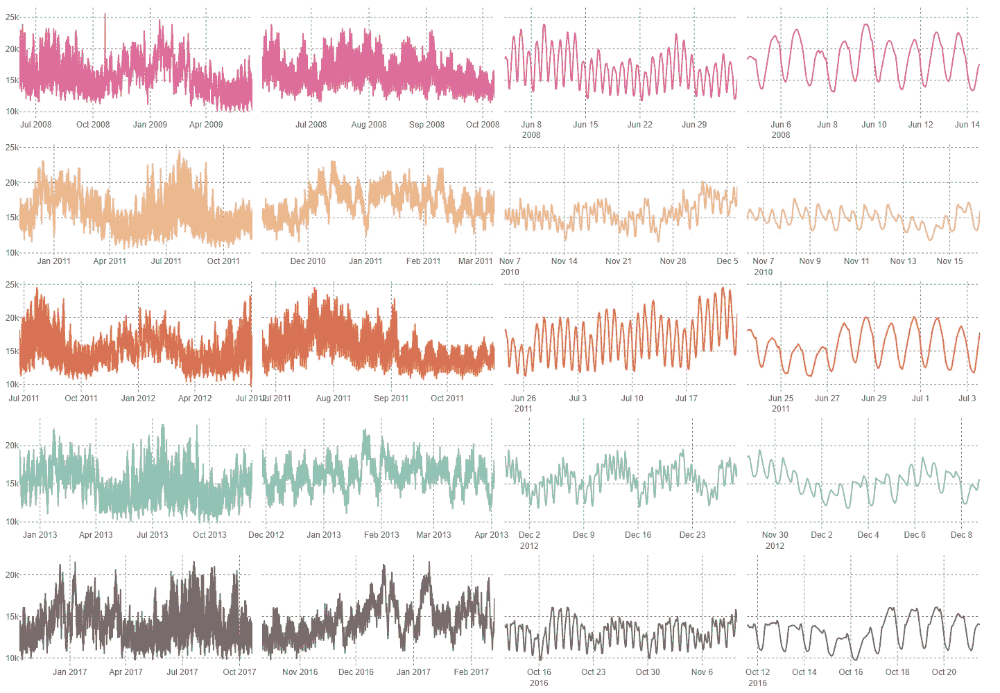
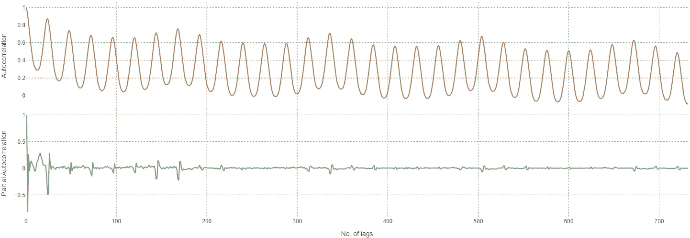
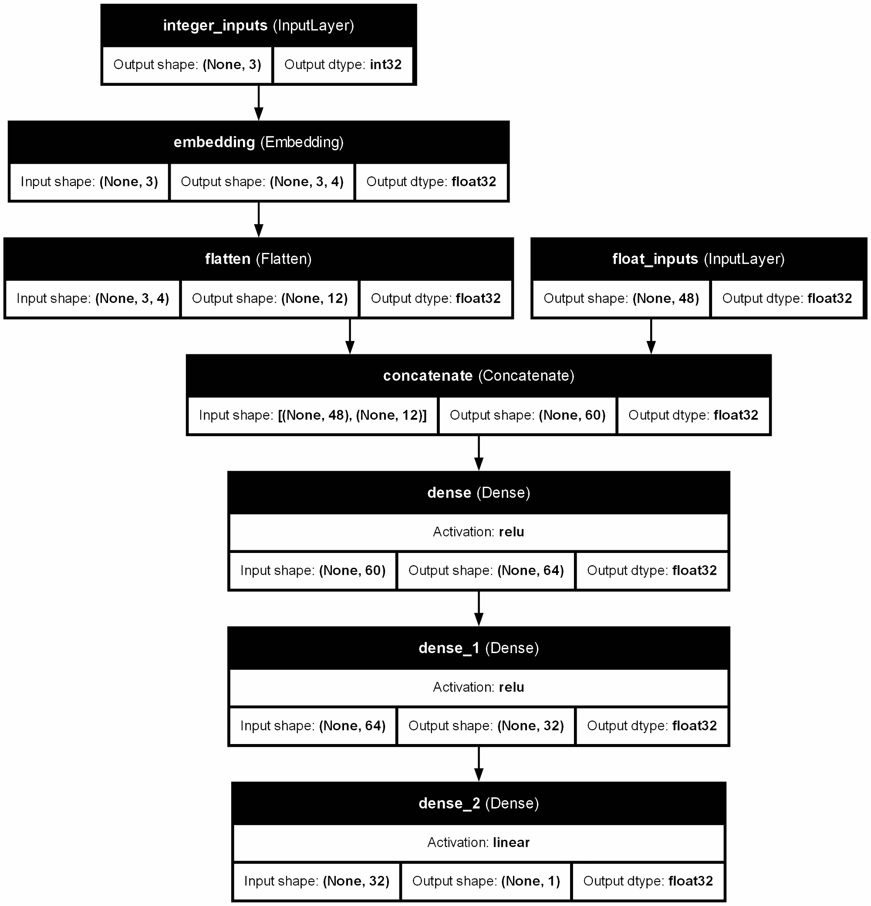
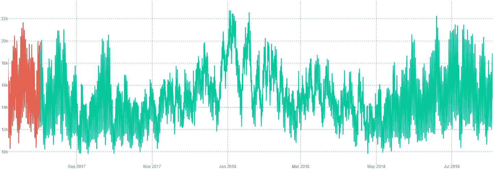
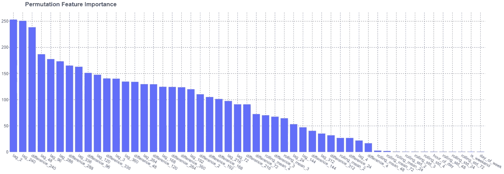
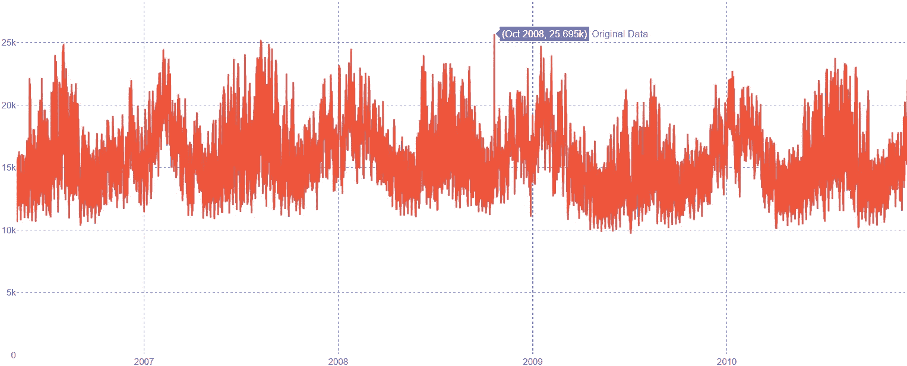
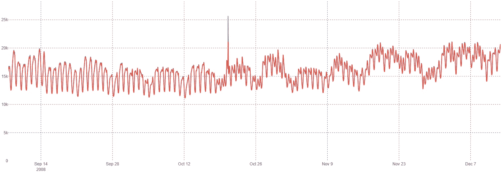
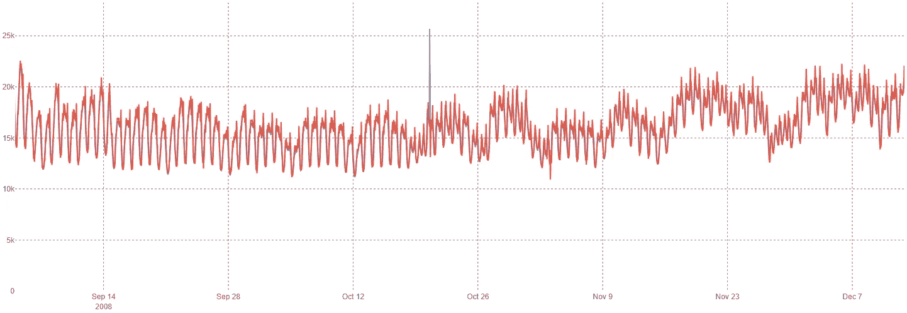
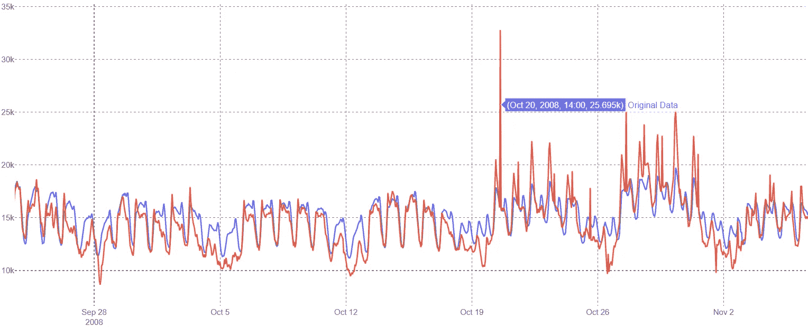
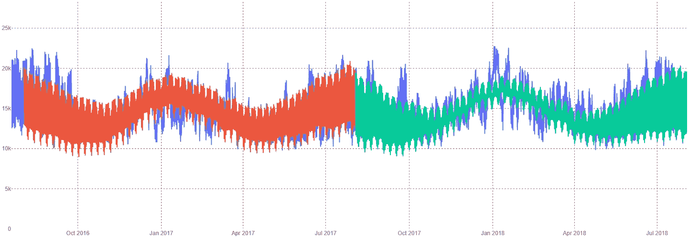

# 神经网络（MLP）在时间序列预测中的实践应用

> 原文：[`towardsdatascience.com/neural-network-mlp-for-time-series-forecasting-in-practice-04c47c1e3711?source=collection_archive---------0-----------------------#2024-07-08`](https://towardsdatascience.com/neural-network-mlp-for-time-series-forecasting-in-practice-04c47c1e3711?source=collection_archive---------0-----------------------#2024-07-08)

## 特征工程和构建 MLP 模型的实用示例

[](https://tothjd.medium.com/?source=post_page---byline--04c47c1e3711--------------------------------)[](https://towardsdatascience.com/?source=post_page---byline--04c47c1e3711--------------------------------) [Daniel J. TOTH](https://tothjd.medium.com/?source=post_page---byline--04c47c1e3711--------------------------------)

·发表于 [Towards Data Science](https://towardsdatascience.com/?source=post_page---byline--04c47c1e3711--------------------------------) ·阅读时长 16 分钟·2024 年 7 月 8 日

--

# **介绍**

时间序列，尤其是时间序列预测，是数据科学领域一个非常著名的问题，受专业人士和商业用户的广泛关注。

存在多种预测方法，可以将它们归类为统计方法或机器学习方法，便于理解和概览，但实际上，预测需求如此之高，现有的选项种类繁多。

机器学习方法被认为是时间序列预测中的最先进方法，并且因能够捕捉数据中的复杂非线性关系而越来越受欢迎，通常能提供更高的预测准确性[1]。其中，神经网络领域是一个广受关注的机器学习分支。特别是在时间序列分析中，循环神经网络已经被开发并应用于解决预测问题[2]。

数据科学爱好者可能会觉得这些模型背后的复杂性令人望而生畏，作为其中的一员，我可以告诉你，我也有同样的感觉。然而，本文旨在展示

> 尽管机器学习方法的最新进展非常显著，但在寻求特定问题的解决方案时，并不一定需要追求最复杂的应用。经过强化的成熟方法与强大的特征工程技术结合，依然能够提供令人满意的结果。

更具体地说，我应用了多层感知器模型，并分享了代码和结果，让你能够亲自体验如何有效地进行时间序列特征工程和预测。

# **本文目标**

更准确地说，我想为自学的专业人士提供的内容可以总结为以下几点：

1.  基于实际问题/数据进行预测

1.  如何为捕捉时间模式工程化时间序列特征

1.  构建一个能够利用混合变量（浮动和整数，通过嵌入处理为类别变量）的 MLP 模型

1.  使用 MLP 进行点预测

1.  使用 MLP 进行多步预测

1.  使用置换特征重要性方法评估特征重要性

1.  针对一组分组特征（多个组，分别针对每个组进行训练）重新训练模型，以细化分组特征的重要性

1.  通过与`UnobservedComponents`模型进行比较来评估模型

# **关键技术术语**

请注意，本文假定读者已经具备一些关键技术术语的基础知识，并不打算详细解释这些术语。以下列出了这些关键术语，并提供了参考，读者可查阅以便理解：

1.  **时间序列** [3]

1.  **预测** [4] — 在这种情况下，它将用于区分训练期间的模型输出

1.  **预测** [4] — 在这种情况下，它将用于区分测试期间的模型输出

1.  **特征工程** [5]

1.  **自相关** [6]

1.  **偏自相关** [6]

1.  **MLP（多层感知器）** [7]

1.  **输入层** [7]

1.  **隐藏层** [7]

1.  **输出层** [7]

1.  **嵌入** [8]

1.  **状态空间模型** [9]

1.  **未观察到的组件模型** [9]

1.  **RMSE（均方根误差）** [10]

1.  **特征重要性** [11]

1.  **置换特征重要性** [11]

# **数据探索**

在分析过程中使用的核心包包括：用于数据处理的`numpy`和`pandas`，用于交互式图表的`plotly`，用于统计和状态空间建模的`statsmodels`，以及用于 MLP 架构的`tensorflow`。

*注意：由于技术限制，我将提供交互式绘图的代码片段，但此处展示的图表将是静态的。*

```py
import opendatasets as od
import numpy as np
import pandas as pd
import plotly.graph_objects as go
from plotly.subplots import make_subplots
import tensorflow as tf

from sklearn.preprocessing import StandardScaler
from sklearn.inspection import permutation_importance
import statsmodels.api as sm
from statsmodels.tsa.stattools import acf, pacf
import datetime

import warnings
warnings.filterwarnings('ignore')
```

数据通过`opendatasets`自动加载。

```py
dataset_url = "https://www.kaggle.com/datasets/robikscube/hourly-energy-consumption/"
od.download(dataset_url)
df = pd.read_csv(".\hourly-energy-consumption" + "\AEP_hourly.csv", index_col=0)
df.sort_index(inplace = True)
```

请记住，数据清理是分析的关键第一步。如果你对细节感兴趣，特别是状态空间建模，请参考我之前的文章[这里](https://medium.com/analytics-vidhya/multi-seasonal-time-series-analysis-decomposition-and-forecasting-with-python-609409570007)。☚📰 简而言之，进行了以下步骤：

1.  识别缺失的时间戳（仅识别了单步缺失）

1.  执行插补（使用前后记录的均值）

1.  识别并删除重复项

1.  将时间戳列设置为数据框的索引

1.  将数据框的索引频率设置为每小时，因为这是进一步处理的要求

在准备好数据后，我们通过绘制 5 个随机时间戳样本来探索数据，并比较不同尺度下的时间序列。

```py
fig = make_subplots(rows=5, cols=4, shared_yaxes=True, horizontal_spacing=0.01, vertical_spacing=0.04)

#  drawing a random sample of 5 indices without repetition
sample = sorted([x for x in np.random.choice(range(0, len(df), 1), 5, replace=False)])

# zoom x scales for plotting
periods = [9000, 3000, 720, 240]

colors = ["#E56399", "#F0B67F", "#DE6E4B", "#7FD1B9", "#7A6563"]

# s for sample datetime start
for si, s in enumerate(sample):

    # p for period length
    for pi, p in enumerate(periods):
        cdf = df.iloc[s:(s+p+1),:].copy()
        fig.add_trace(go.Scatter(x=cdf.index,
                                 y=cdf.AEP_MW.values,
                                 marker=dict(color=colors[si])),
                        row=si+1, col=pi+1)

fig.update_layout(
    font=dict(family="Arial"),
    margin=dict(b=8, l=8, r=8, t=8),
    showlegend=False,
    height=1000,
    paper_bgcolor="#FFFFFF",
    plot_bgcolor="#FFFFFF")
fig.update_xaxes(griddash="dot", gridcolor="#808080")
fig.update_yaxes(griddash="dot", gridcolor="#808080")
```



数据集的随机抽样和不同时间尺度的可视化。来源：作者

# 状态空间建模

通过仔细分析这个简单但有效的图表，我可以清楚地看到，分析应该考虑几个季节性效应：

1.  能源消耗——通常——在夏季和冬季的中期达到峰值，无论选择哪个年份

1.  在周一似乎会出现每周最小值模式

1.  在夜间有一个每日最低值，白天有一个每日最高值。

进一步分析会揭示，数据集的年度模式有 2 个谐波，因为冬季和夏季的峰值水平不同。因此，考虑了以下状态空间模型，其中周期以小时为单位（见下文模型总结）：

```py
# splitting time series to train and test subsets
y_train = df.iloc[:-8766, :].copy()
y_test = df.iloc[-8766:, :].copy()

# Unobserved Components model definition
model = sm.tsa.UnobservedComponents(y_train,
                                    level='dtrend',
                                    irregular=True,
                                    stochastic_level = False,
                                    stochastic_trend = False,
                                    stochastic_freq_seasonal = [False, False, False],
                                    freq_seasonal=[{'period': 24, 'harmonics': 1},
                                                    {'period': 168, 'harmonics': 1},
                                                    {'period': 8766, 'harmonics': 2}])
# fitting model to train data
model_results = model.fit()

# printing statsmodels summary for model
print(model_results.summary())
```

```py
Value of `irregular` may be overridden when the trend component is specified using a model string.

                           Unobserved Components Results                            
====================================================================================
Dep. Variable:                       AEP_MW   No. Observations:               112530
Model:                  deterministic trend   Log Likelihood            -1002257.017
                     + freq_seasonal(24(1))   AIC                        2004516.033
                    + freq_seasonal(168(1))   BIC                        2004525.664
                   + freq_seasonal(8766(2))   HQIC                       2004518.941
Date:                      Tue, 25 Jun 2024                                         
Time:                              08:13:35                                         
Sample:                          10-01-2004                                         
                               - 08-02-2017                                         
Covariance Type:                        opg                                         
====================================================================================
                       coef    std err          z      P>|z|      [0.025      0.975]
------------------------------------------------------------------------------------
sigma2.irregular  3.168e+06    1.3e+04    244.095      0.000    3.14e+06    3.19e+06
===================================================================================
Ljung-Box (L1) (Q):              104573.71   Jarque-Bera (JB):              2731.37
Prob(Q):                              0.00   Prob(JB):                         0.00
Heteroskedasticity (H):               1.04   Skew:                             0.35
Prob(H) (two-sided):                  0.00   Kurtosis:                         3.30
===================================================================================

Warnings:
[1] Covariance matrix calculated using the outer product of gradients (complex-step).
```

在不提前过多展开的情况下，我想指出，模型近似了过去 365 天的总能源消耗，误差约为~2%，从商业角度来看，我认为这是相当准确的。下面构建的 MLP 模型将通过与上述状态空间模型的比较来评估。

# 特征工程

在构建 MLP 模型之前，我们应使模型能够学习到独特的趋势和季节性效应。这可以通过向数据集添加新特征来实现，这些特征是从原始的 1D 时间序列数据派生而来的。为捕捉已经识别或未识别的模式，派生特征包括：

1.  滞后

1.  差异

1.  滚动均值

1.  滚动标准差

1.  一天中的小时

1.  一周中的天数

1.  标记周末

这些派生的——以及数值型——特征可以在多个时间间隔中进行考虑。为了确定模型在哪些时间间隔中能够获益，强烈建议检查数据集的自相关特性。

```py
dff = df.copy()
acorr = acf(dff.AEP_MW.values, nlags=2*366)     # autocorrelation
pacorr = pacf(dff.AEP_MW.values, nlags=2*366)   # partial autocorrelation

fig = make_subplots(rows=2, cols=1, shared_xaxes=True, vertical_spacing=0)
fig.add_trace(go.Scatter(
    x=np.linspace(0, len(acorr), len(acorr)+1),
    y=acorr,
    name="Autocorrelation",
    marker=dict(color="rgb(180, 120, 80)")
), row=1, col=1)
fig.add_trace(go.Scatter(
    x=np.linspace(0, len(pacorr), len(pacorr)+1),
    y=pacorr,
    name="Partial Autocorrelation",
    marker=dict(color="rgb(80, 180, 120)")
), row=2, col=1)
fig.update_layout(
    font=dict(family="Arial"),
    margin=dict(b=4, l=4, r=4, t=4),
    showlegend=False,
    height=500,
    paper_bgcolor="#FFFFFF",
    plot_bgcolor="#FFFFFF")
fig.update_xaxes(griddash="dot", gridcolor="#808080", row=1, col=1)
fig.update_xaxes(griddash="dot", gridcolor="#808080", title_text="No. of lags", row=2, col=1)
fig.update_yaxes(griddash="dot", gridcolor="#808080", title_text="Autocorrelation", row=1, col=1)
fig.update_yaxes(griddash="dot", gridcolor="#808080", title_text="Partial Autocorrelation", row=2, col=1)
```



时间序列的自相关和部分自相关图。来源：作者

数据集具有很高的自相关性，这很合理，因为值大多在 10K MW 到 20K MW 之间波动，且从一个小时到下一个小时的过渡平滑。然而，专注于下图所示的部分自相关性，似乎在 24 小时的倍数以及最后几个小时中存在显著的相关性。因此，派生特征主要可以分类为：

1.  每日（24 小时的倍数），

1.  每小时（专注于最后几个小时）和

1.  分类特征

```py
dff = df.reset_index(drop=False)
dff["Datetime"] = pd.to_datetime(dff.Datetime.values)

# lags and difference of multiple days for capturing seasonal effects
for i in np.linspace(24, 15*24, 15, dtype=int):
    dff[f"lag_{i}"] = dff.AEP_MW.shift(i)
    dff[f"difference_{i}"] = dff.AEP_MW.diff(periods=i)

# rolling mean and standard deviation up to 3 days for capturing seasonal effects better
for i in np.linspace(24, 72, 3, dtype=int):
    dff[f"rolling_mean_{i}"] = dff.AEP_MW.rolling(window=i).mean()
    dff[f"rolling_std_{i}"] = dff.AEP_MW.rolling(window=i).std()

# lag, rolling mean, rolling standard deviation and difference up to 4 hours for capturing immediate effects
for i in range(2, 5, 1):
    dff[f"lag_{i}"] = dff.AEP_MW.shift(i)
    dff[f"rolling_mean_{i}"] = dff.AEP_MW.rolling(window=i).mean()
    dff[f"rolling_std_{i}"] = dff.AEP_MW.rolling(window=i).std()
    dff[f"difference_{i}"] = dff.AEP_MW.diff(periods=i)

# categorical features
dff["hour_of_day"] = dff.Datetime.dt.hour
dff["day_of_week"] = dff.Datetime.dt.day_of_week
dff["is_weekend"] = dff["day_of_week"].isin([5, 6]).astype(int)

# grouping derived features for later use in feature importance analysis
daily_lags = [col for col in dff.columns if all(["lag_" in col, len(col)>5])]
hourly_lags = [col for col in dff.columns if all(["lag_" in col, len(col)<=5])]
daily_differences = [col for col in dff.columns if all(["difference_" in col, len(col)>12])]
hourly_differences = [col for col in dff.columns if all(["difference_" in col, len(col)<=12])]
daily_rolling_means = [col for col in dff.columns if all(["rolling_mean_" in col, len(col)>14])]
hourly_rolling_means = [col for col in dff.columns if all(["rolling_mean_" in col, len(col)<=14])]
daily_rolling_stds = [col for col in dff.columns if all(["rolling_std_" in col, len(col)>13])]
hourly_rolling_stds = [col for col in dff.columns if all(["rolling_std_" in col, len(col)<=13])]
categoricals = ["hour_of_day", "day_of_week", "is_weekend"]
```

# **构建 MLP 模型**

生成上述详细特征后，输入形状已知，可以构建 MLP 模型。需要注意的是，我们处理的是混合数据类型：浮动型和整数型。还请注意，尽管所有特征都是数值类型，整数型输入本质上是分类特征，应当视为分类特征来处理。

有一种方法可以使用例如独热编码技术对类别进行编码，但这会显著增加特征的数量，因为每个类别列都应该扩展为与类别数相等的列数（减去一个）[12]。我故意选择了嵌入方法，以限制特征数量，虽然这样做会使得模型的输入层更加复杂，因为类别数据首先通过嵌入转换为向量，再与浮动输入结合。

请查看代码部分后的图表以获得更清晰的理解。该架构是使用经验法则构建的，因为超参数调优不在本文范围内。然而，如果你对如何进行超参数调优的通用框架感兴趣，请查看📰☛ [我之前的文章](https://medium.com/towards-data-science/binary-classification-xgboost-hyperparameter-tuning-scenarios-by-non-exhaustive-grid-search-and-c261f4ce098d)（在这篇文章中，我使用 Optuna 作为贝叶斯搜索工具调优了 XGBoost 模型的最佳超参数）。

```py
# segmenting last year as test data
inputs = dff.dropna().iloc[:, 2:].columns
xs_train = dff.dropna().iloc[:-8766, 2:]
xs_test = dff.dropna().iloc[-8766:, 2:]
ys_train = dff.dropna().iloc[:-8766, 1]
ys_test = dff.dropna().iloc[-8766:, 1]
embedding_dim = 4       # potential hyperparameter

# defining baseline NN model
float_inputs = tf.keras.layers.Input(shape=(len(inputs)-3,), name="float_inputs")           # floats can be directly used in model fitting
integer_inputs = tf.keras.layers.Input(shape=(3,), dtype="int32", name="integer_inputs")    # integers should be treated as categoricals ang get them embedded
embedding_layer = tf.keras.layers.Embedding(input_dim=3, output_dim=embedding_dim)          # embedding will be performed during model fitting
embedded_integer_inputs = embedding_layer(integer_inputs)
flattened_embeddings = tf.keras.layers.Flatten()(embedded_integer_inputs)                   
preprocessing_layers = tf.keras.layers.concatenate([float_inputs, flattened_embeddings])    # float and embedded inputs are combined
hidden_layers = tf.keras.layers.Dense(units=64, activation="relu")(preprocessing_layers)    # No. of hidden layers, No. of units, activation function are potential hyperparameters
hidden_layers = tf.keras.layers.Dense(units=32, activation="relu")(hidden_layers)
output = tf.keras.layers.Dense(units=1, activation="linear")(hidden_layers)                 # single unit for one step ahead, multiple units for multiple step prediction
model_NN_baseline = tf.keras.Model(inputs=[float_inputs, integer_inputs], outputs=output)

# compiling baseline NN model
model_NN_baseline.compile(
    optimizer=tf.keras.optimizers.Adam(),
    loss=tf.keras.losses.MeanSquaredError(),
    jit_compile=True)

# fitting baseline NN model
model_NN_baseline.fit(
    x=[xs_train.iloc[:, :-3], xs_train.iloc[:, -3:]],
    y=ys_train,
    validation_data=[[xs_test.iloc[:, :-3], xs_test.iloc[:, -3:]], ys_test],
    epochs=128,
    batch_size=64,
    verbose=1
)
```



使用 Tensorflow/Keras 创建的 MLP 架构。来源：作者

就点预测而言，结果非常准确。这是一个好兆头，说明所应用的特征工程原则正确地捕捉了数据中的潜在模式，模型能够将其泛化。



基准 MLP 模型的点预测与测试数据对比。来源：作者

点预测与测试集重叠，且两个图形轨迹几乎无法区分。更精确地说，预测（训练集）和预测值（测试集）的 RMSE 分别约为 19.3 和 18.9（相对误差约为 0.1%）。

# **特征重要性**

是什么使得模型准确？所有派生特征是否同样重要，还是有一个子集在决定结果时具有更大的权重？这两个问题有其有效性，原因有二：

1.  在实际场景中，尤其是在大数据情况下，训练模型的资源有限，所使用的数据量可能对是否能够训练模型产生重大影响。

1.  如果没有任何解释，模型就像一个黑箱，这会带来关于其性能的不确定性。神经网络尤其容易成为黑箱模型，解释它们是一个独立的领域[11]。

目前有大量的模型解释技术，每种方法都有其优缺点。我选择了排列特征重要性方法，以便为模型解释提供一些见解。然而，我分析中的一个关键结论是，

> 模型解释技术仅仅是在特定范围内解释模型，而不一定是解释其背后的过程。现实可能与特征重要性分析大相径庭，因此不应将其视为自变量与目标变量之间因果关系的最终真相。

让我用我的分析结果来解释这一点。逐一置换特征，重新计算 RMSE 得分并记录相对于使用原始数据的预测 RMSE 的相对变化，将给出特征的相对重要性[13]。

```py
# permutation feature importance
features = xs_test.columns
permutation_importance_results = {}
rmse = tf.keras.metrics.RootMeanSquaredError()
rmse_permuted = tf.keras.metrics.RootMeanSquaredError()
rmse.update_state(ys_test.values, model_NN_baseline.predict([xs_test.iloc[:, :-3], xs_test.iloc[:, -3:]], verbose=0).flatten())

for feature in features:

    xs_test_permuted = xs_test.copy()
    xs_test_permuted.loc[:, feature] = xs_test.loc[:, feature].sample(frac=1, axis=0, replace=False, random_state=42).values

    rmse_permuted.reset_state()
    rmse_permuted.update_state(ys_test.values, model_NN_baseline.predict([xs_test_permuted.iloc[:, :-3], xs_test_permuted.iloc[:, -3:]], verbose=0).flatten())

    permutation_importance_results[feature] = rmse_permuted.result().numpy() / rmse.result().numpy()

pi_results_sorted_keys = sorted(permutation_importance_results, key=permutation_importance_results.get, reverse=True)

fig3 = make_subplots()
fig3.add_trace(go.Bar(
    x=pi_results_sorted_keys,
    y=[permutation_importance_results[key] for key in pi_results_sorted_keys]))
fig3.update_layout(
    title="<b>Permutation Feature Importance</b>",
    font=dict(family="Arial"),
    margin=dict(b=4, l=4, r=4, t=36),
    showlegend=False,
    height=500,
    paper_bgcolor="#FFFFFF",
    plot_bgcolor="#FFFFFF"
)
fig3.update_xaxes(griddash="dot", gridcolor="#808080", row=1, col=1)
fig3.update_yaxes(griddash="dot", gridcolor="#808080", row=1, col=1)
```



置换特征重要性直方图。来源：作者

每小时和每日滞后以及差异似乎很重要，也许每小时的滚动均值也很重要。然而，每日和每小时滚动标准以及分类特征似乎相对较小，可以忽略不计，与上述特征相比。置换特征重要性的一项警告是，它没有考虑多重共线性，因此可能会给出不准确的结果。请记住，这些特征是从具有高自相关的数据集中推导出来的。

处理这种情况的一种可能方式是遵循`scikit learn`的指导：

> 对 Spearman 等级顺序相关性执行层次聚类，选择一个阈值，并从每个簇中保留一个特征。[13]

然而，我想专注于突出不准确之处，并通过逐一训练替代模型以分组特征来为数据集添加更多洞见。为此使用了相同的 MLP 架构，仅对输入层进行了调整，以适应数据的子集。以下组在特征工程部分创建并在此测试（训练/测试数据集的 RMSE 结果也分别报告）：

1.  每日滞后（942 和 994）

1.  每日差异（1792 和 1952）

1.  每小时滞后（686 和 611）

1.  日常滚动均值和标准差（1710 和 1663）

1.  每小时滚动均值和标准差（84.4 和 75.5）

显然，替代模型显示的结果与简单的置换特征重要性分析预期不同，且未处理多重共线性：例如，每日滚动特征的得分优于每日差异，且训练于每小时滚动特征的模型在所有替代模型中表现最佳，接近基线模型（RMSE 分别为百分比~0.5%和~0.1%）。

# 数据中的特定异常说明

我想强调 2008 年 10 月 20 日 14:00 观察到的一个非常特殊的异常情况。 这是有史以来记录的最高值，且没有明显的原因，数据集中之前和之后没有类似的数据点。

> 然而，由特征工程驱动的基线模型能够预测该数据点，并且不被认为是异常值！



基线 MLP 模型的点预测和观察到的潜在异常。来源：作者

模型是如何预测该数据点的呢？让我们使用替代模型进行推理。最佳的替代模型（每小时滚动特征）在该点附近似乎非常准确，但只能部分解释这一现象：



替代的 MLP 模型（利用每小时滚动特征）点预测和观察到的潜在异常。来源：作者

第二好的替代方案是利用每小时滞后的模型，但它完全没有解释为何会发生这种情况：



替代的 MLP 模型（利用每小时滞后特征）点预测和观察到的潜在异常。来源：作者

简而言之，每日差异可能包含有关潜在模式的重要信息。尽管单独使用每日差异组会给出更高的预测值，但基准模型似乎找到了特征权重的良好平衡。



替代的 MLP 模型（利用每日差异特征）点预测和观察到的潜在异常。来源：作者

# 多步预测模型

最后，模型架构已被修改，以生成多步预测。预测期为一年，如数据集发布者所建议的[14]。考虑到这种过程中的所有不确定性，特别是天气条件方面，考虑这么长的预测期可能没有意义。然而，这对于评估多步模型与状态空间模型的表现是一个有趣的练习，后者明确建模了跨年观察到的趋势和季节性效应（见下一节）。

实现多步模型的关键点如下：

1.  目标是一个向量序列（为每个步骤定义的接下来的 8766 小时）

1.  结果是，预测或预报是接下来 8766 小时（大约一年）的最后一行输入数据

1.  由于资源限制，我不得不限制前一训练数据集的最后一年的训练数据。

1.  输出层已相应修改，以给出所需的向量输出

```py
first_index = -8766*5
last_index = -8766*2
final_index = -8766
inputs = dff.dropna().iloc[:, 2:].columns
xs_train = dff.dropna().iloc[first_index:last_index, 2:]
xs_train.iloc[:, :-3] = xs_train.iloc[:, :-3].astype(np.float32)
xs_test = dff.dropna().iloc[last_index:final_index, 2:]
xs_test.iloc[:, :-3] = xs_test.iloc[:, :-3].astype(np.float32)
ys_train = np.vstack([dff.dropna().iloc[i:i+8765, 1].astype(int).values for i in range(first_index, last_index, 1)])
ys_test = np.vstack([dff.dropna().iloc[i:i+8765, 1].astype(int).values for i in range(last_index, final_index, 1)])
embedding_dim = 4

# defining, compiling and training NN model for MULTIPLE STEP PREDICTIONS. Model architecture is the same, except output layer
float_inputs = tf.keras.layers.Input(shape=(len(inputs)-3,), name="float_inputs")
integer_inputs = tf.keras.layers.Input(shape=(3,), dtype="int32", name="integer_inputs")
embedding_layer = tf.keras.layers.Embedding(input_dim=3, output_dim=embedding_dim)
embedded_integer_inputs = embedding_layer(integer_inputs)
flattened_embeddings = tf.keras.layers.Flatten()(embedded_integer_inputs)
preprocessing_layers = tf.keras.layers.concatenate([float_inputs, flattened_embeddings])
hidden_layers = tf.keras.layers.Dense(units=64, activation="relu")(preprocessing_layers)
hidden_layers = tf.keras.layers.Dense(units=32, activation="relu")(hidden_layers)
output = tf.keras.layers.Dense(units=np.abs(final_index)-1, activation="linear")(hidden_layers)

model_NN_multistep = tf.keras.Model(inputs=[float_inputs, integer_inputs], outputs=output)
model_NN_multistep.compile(
    optimizer=tf.keras.optimizers.Adam(),
    loss=tf.keras.losses.MeanSquaredError(),
    jit_compile=True)
model_NN_multistep.fit(
    x=[xs_train.iloc[:, :-3], xs_train.iloc[:, -3:]],
    y=ys_train,
    validation_data=[[xs_test.iloc[:, :-3], xs_test.iloc[:, -3:]], ys_test],
    epochs=128,
    batch_size=64,
    verbose=1
)
```

对于可视化评估，可以看出模型试图对模式进行泛化：



多步 MLP 模型的预测与原始数据的对比。来源：作者

# MLP 与状态空间模型

由于数据的泛化，RMSE 得分显著增加：训练集和测试集的得分分别为 1982 和 2017。然而，为了正确评估多步 MLP，我们应该使用另一个模型进行比较。正如我在前一节中提到的，状态空间模型提供了对跨年观察到的趋势和季节性效应的相当可理解的近似。这一特点使得它们相对容易解释，不像神经网络。主要原因是隐藏层有很多连接，理解它们是如何被激活的并不是一个直接的过程。[11]

在[我之前的文章](https://medium.com/analytics-vidhya/multi-seasonal-time-series-analysis-decomposition-and-forecasting-with-python-609409570007)中，☚📰我使用了一种简化但有意义的评估方法：比较过去一年内的总能耗。实际上，这是能耗时间序列下的曲线面积。可以直接比较原始数据和模型预测的值。对于`UnobservedComponents`模型：

```py
y_train = df.iloc[:-8766, 0].values
y_test = df.iloc[-8766:, 0].values
observed_integral = np.cumsum([y_test[x] + (y_test[x+1] - y_test[x]) / 2 for x in range(len(y_test)-1)])[-1]
forecast = model_results.forecast(steps=8766)
UC_integral = np.cumsum([forecast[x] + (forecast[x+1] - forecast[x]) / 2 for x in range(len(forecast)-1)])[-1]

# calculating absolute and percentage error of forecast integral compared to observed integral
fcast_integral_abserror = UC_integral - observed_integral
fcast_integral_perror4 = (UC_integral - observed_integral) * 100 / observed_integral

print(f"Observed yearly energy demand: {'%.3e' % observed_integral} MWh")
print(f"Forecast yearly energy demand: {'%.3e' % UC_integral} MWh")
print(f"Forecast error of yearly energy demand: {'%.3e' % fcast_integral_abserror} MWh or {'%.3f' % fcast_integral_perror4} %")
```

```py
Observed yearly energy demand: 1.312e+08 MWh
Forecast yearly energy demand: 1.283e+08 MWh
Forecast error of yearly energy demand: -2.832e+06 MWh or -2.159 %
```

对于 MLP 模型：

```py
y_test = dff.dropna().iloc[-8766:-1, 1].values
observed_integral = np.cumsum([y_test[x] + (y_test[x+1] - y_test[x]) / 2 for x in range(len(y_test)-1)])[-1]
forecast = model_NN_multistep.predict([xs_test.iloc[-1:, :-3], xs_test.iloc[-1:, -3:]], verbose=0).flatten()
model_NN_multistep_integral = np.cumsum([forecast[x] + (forecast[x+1] - forecast[x]) / 2 for x in range(len(forecast)-1)])[-1]

# calculating absolute and percentage error of forecast integral compared to observed integral
fcast_integral_abserror = model_NN_multistep_integral - observed_integral
fcast_integral_perror4 = (model_NN_multistep_integral - observed_integral) * 100 / observed_integral

print(f"Observed yearly energy demand: {'%.3e' % observed_integral} MWh")
print(f"Forecast yearly energy demand: {'%.3e' % model_NN_multistep_integral} MWh")
print(f"Forecast error of yearly energy demand: {'%.3e' % fcast_integral_abserror} MWh or {'%.3f' % fcast_integral_perror4} %")
```

```py
Observed yearly energy demand: 1.312e+08 MWh
Forecast yearly energy demand: 1.286e+08 MWh
Forecast error of yearly energy demand: -2.508e+06 MWh or -1.912 %
```

简而言之：它是-1.912% vs. -2.159%，偏向于 MLP 模型。请注意，这是通过使用 MLP 架构并结合一些简单的经验法则实现的，甚至没有考虑超参数调优或某些有效的模型训练特征，例如在评估指标达到平台期时减少学习率或提前停止。

结果应该是相当令人信服的，确实，通过利用相对简单的神经网络架构结合强大的特征工程技术，准确的预测工具已经在数据科学家的初级阶段触手可得。

# 资源

数据来源：

[`www.kaggle.com/datasets/robikscube/hourly-energy-consumption/`](https://www.kaggle.com/datasets/robikscube/hourly-energy-consumption/) (CC0)

笔记本（仅代码，不包含输出）：[`gist.github.com/danielandthelions/2e6f0edd30902113ad10fd9f20bda215`](https://gist.github.com/danielandthelions/2e6f0edd30902113ad10fd9f20bda215)

# 参考文献

[1] [`preset.io/blog/time-series-forecasting-a-complete-guide/`](https://preset.io/blog/time-series-forecasting-a-complete-guide/)

[2] [`www.ibm.com/topics/recurrent-neural-networks`](https://www.ibm.com/topics/recurrent-neural-networks)

[3] [`www.timescale.com/blog/time-series-analysis-what-is-it-how-to-use-it/`](https://www.timescale.com/blog/time-series-analysis-what-is-it-how-to-use-it/)

[4] [`plat.ai/blog/difference-between-prediction-and-forecast/`](https://plat.ai/blog/difference-between-prediction-and-forecast/)

[5] [`dotdata.com/blog/practical-guide-for-feature-engineering-of-time-series-data/`](https://dotdata.com/blog/practical-guide-for-feature-engineering-of-time-series-data/)

[6] [`statisticsbyjim.com/time-series/autocorrelation-partial-autocorrelation/`](https://statisticsbyjim.com/time-series/autocorrelation-partial-autocorrelation/)

[7] [`www.sciencedirect.com/topics/computer-science/multilayer-perceptron`](https://www.sciencedirect.com/topics/computer-science/multilayer-perceptron)

[8] [`jina.ai/news/embeddings-in-depth/`](https://jina.ai/news/embeddings-in-depth/)

[9] Hyndman, R.J., & Athanasopoulos, G. (2021) 《Forecasting: principles and practice》，第三版，OTexts：澳大利亚墨尔本。OTexts.com/fpp3。访问时间：2024 年 7 月 7 日

[10] [`statisticsbyjim.com/regression/root-mean-square-error-rmse/`](https://statisticsbyjim.com/regression/root-mean-square-error-rmse/)

[11] [`christophm.github.io/interpretable-ml-book/`](https://christophm.github.io/interpretable-ml-book/)

[12] [`scikit-learn.org/stable/modules/preprocessing.html`](https://scikit-learn.org/stable/modules/preprocessing.html)

[13] [`scikit-learn.org/stable/modules/permutation_importance.html#permutation-feature-importance`](https://scikit-learn.org/stable/modules/permutation_importance.html#permutation-feature-importance)

[14] [`www.kaggle.com/datasets/robikscube/hourly-energy-consumption/`](https://www.kaggle.com/datasets/robikscube/hourly-energy-consumption/)
