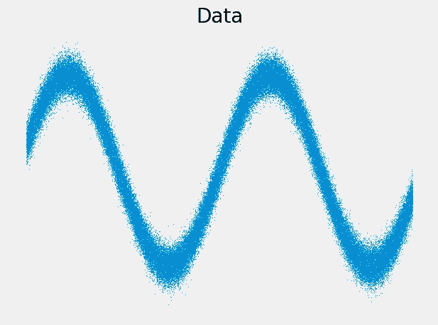
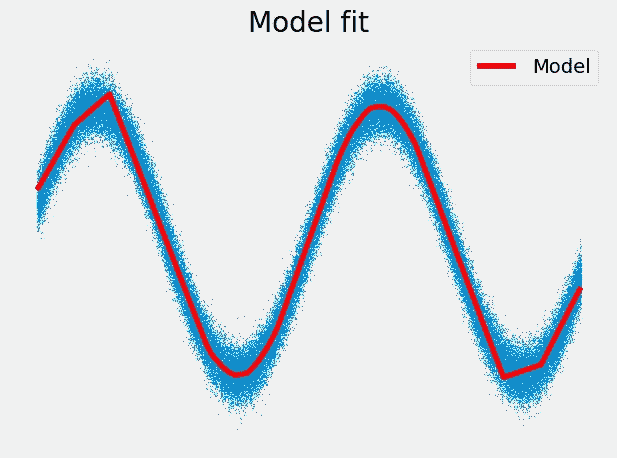
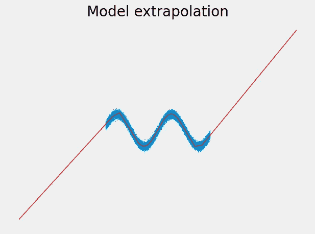

# 周期性函数的神经网络

> 原文：[`towardsdatascience.com/neural-networks-for-periodic-functions-648cfc940437?source=collection_archive---------6-----------------------#2024-01-17`](https://towardsdatascience.com/neural-networks-for-periodic-functions-648cfc940437?source=collection_archive---------6-----------------------#2024-01-17)

## 当 ReLU 的外推能力不足时

 [Dr. Robert Kübler](https://dr-robert-kuebler.medium.com/?source=post_page---byline--648cfc940437--------------------------------)

·发布于[Towards Data Science](https://towardsdatascience.com/?source=post_page---byline--648cfc940437--------------------------------) ·阅读时长 8 分钟·2024 年 1 月 17 日

--

由[Willian Justen de Vasconcellos](https://unsplash.com/@willianjusten?utm_source=medium&utm_medium=referral)拍摄，发布于[Unsplash](https://unsplash.com/?utm_source=medium&utm_medium=referral)

神经网络被认为是任何函数的优秀逼近器——至少在我们**不偏离数据集太远**时。让我们看看这是什么意思。这里是一些数据：

图片由作者提供。

它不仅仅看起来像正弦波，它实际上就是正弦波，只是加了一些噪声。我们现在可以训练一个普通的前馈神经网络，拥有 1 个隐藏层，包含 1000 个神经元并使用 ReLU 激活。我们得到以下拟合结果：

图片由作者提供。

除了边缘部分，效果看起来相当不错。我们*可以*通过根据 Cybenko 的**普适逼近定理**，向隐藏层添加更多神经元来修复这个问题。但我想给你指出一些其他的东西：

图片由作者提供。

我们*可以*现在辩称，如果假设波形模式在外部继续，这种外推行为是**不好的**……
