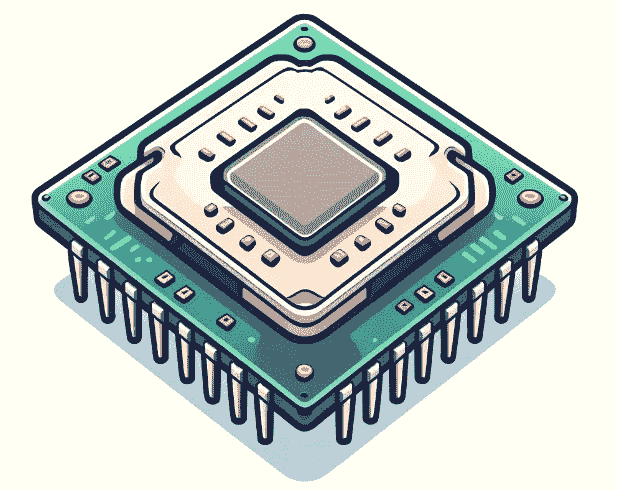

# Neural Speed：针对 4 位大型语言模型的 CPU 快速推理

> 原文：[`towardsdatascience.com/neural-speed-fast-inference-on-cpu-for-4-bit-large-language-models-0d611978f399?source=collection_archive---------2-----------------------#2024-04-18`](https://towardsdatascience.com/neural-speed-fast-inference-on-cpu-for-4-bit-large-language-models-0d611978f399?source=collection_archive---------2-----------------------#2024-04-18)

## 比 llama.cpp 快最多 40 倍？

 [Benjamin Marie](https://medium.com/@bnjmn_marie?source=post_page---byline--0d611978f399--------------------------------)

·发表于[Towards Data Science](https://towardsdatascience.com/?source=post_page---byline--0d611978f399--------------------------------) ·5 分钟阅读·2024 年 4 月 18 日

--

使用 DALL-E 生成

在消费级硬件上运行大型语言模型（LLM）可能是一个挑战。如果 LLM 无法适应 GPU 内存，通常会应用量化技术来减小其大小。然而，即使经过量化，模型仍然可能过大，无法适应 GPU。另一种方法是使用优化过的框架，将其在 CPU RAM 上运行，[例如 llama.cpp](https://medium.com/@bnjmn_marie/gguf-quantization-for-fast-and-memory-efficient-inference-on-your-cpu-d10fbe58fbca)这样的 CPU 推理框架。

Intel 也在致力于加速 CPU 上的推理。他们提出了一种框架，[Intel 为 Transformers 提供的扩展](https://github.com/intel/intel-extension-for-transformers)，该框架建立在 Hugging Face Transformers 之上，易于使用，能够充分利用 CPU。

使用[Neural Speed](https://github.com/intel/neural-speed)（Apache 2.0 许可证），该框架依赖于 Intel 为 Transformers 提供的扩展，Intel 进一步加速了在 CPU 上对 4 位 LLM 的推理。根据 Intel 的说法，使用此框架可以[使推理速度比 llama.cpp 快 40 倍](https://github.com/intel/neural-speed?tab=readme-ov-file#key-features)。

在本文中，我回顾了 Neural Speed 带来的主要优化。我展示了如何使用它并基准测试推理吞吐量。我还将其与 llama.cpp 进行了比较。

# Neural Speed 对 4 位 LLM 的推理优化

在 2023 年 NeurIPS 大会上，Intel 展示了在 CPU 上进行推理的主要优化：
