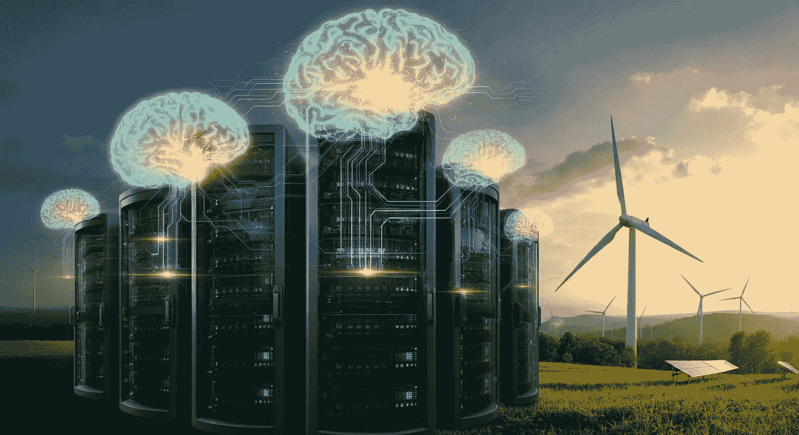
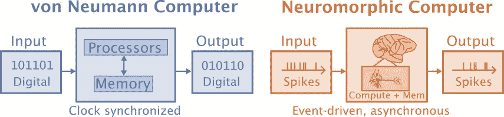
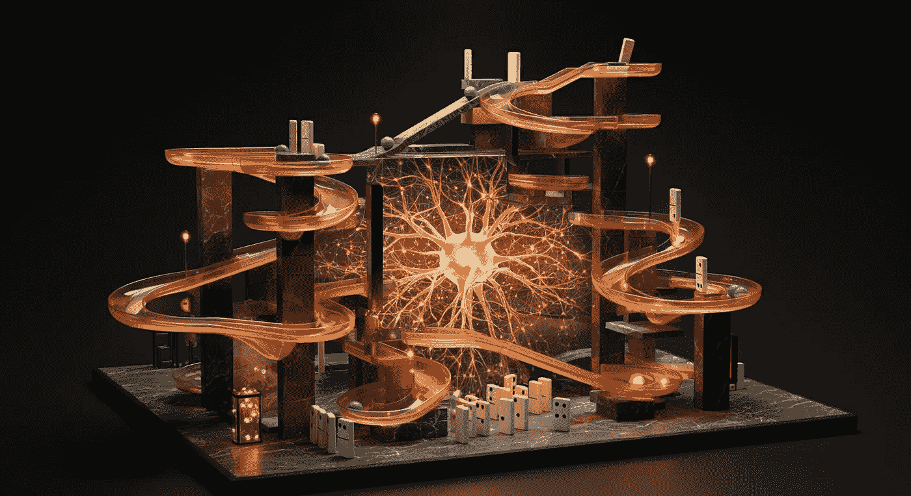
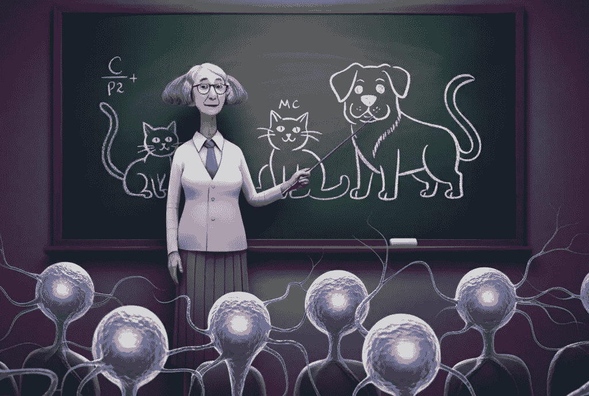
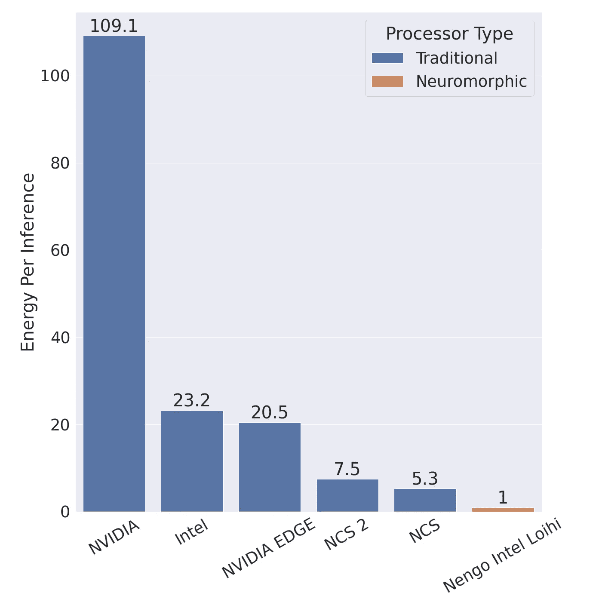

# 神经形态计算——一个更具前沿性、更环保的人工智能

> 原文：[`towardsdatascience.com/neuromorphic-computing-an-edgier-greener-ai-3911fab9fe09?source=collection_archive---------7-----------------------#2024-11-22`](https://towardsdatascience.com/neuromorphic-computing-an-edgier-greener-ai-3911fab9fe09?source=collection_archive---------7-----------------------#2024-11-22)

## 为什么计算机硬件和人工智能算法要通过借鉴大脑的灵感进行重新设计

 [Jonathan R. Williford 博士](https://medium.com/@williford?source=post_page---byline--3911fab9fe09--------------------------------)

·发表于[Towards Data Science](https://towardsdatascience.com/?source=post_page---byline--3911fab9fe09--------------------------------) ·14 分钟阅读·2024 年 11 月 22 日

--

神经形态计算不仅可能有助于将人工智能推向边缘计算，还能减少数据中心的碳排放。由作者通过 ImageGen 3 生成。

有关神经形态计算革命的定期宣告，这种革命借鉴大脑的灵感，重新思考神经网络及其运行的硬件。虽然该领域仍面临一些挑战，但在脉冲神经网络算法和神经形态硬件方面已经取得了坚实的成功，并持续稳步进展。这一进展为至少某些人工智能领域的颠覆铺平了道路，并将减少推理时每次计算的能耗，同时使人工智能能够更广泛地应用于边缘计算。在本文中，我将介绍一些神经形态计算和工程基础、训练、神经形态系统的优势以及剩余的挑战。

神经形态系统的经典应用场景是用于边缘设备，这些设备需要在本地进行计算，并且受限于能源，例如电池供电的设备。然而，最近对神经形态系统的一个新兴趣是减少数据中心的能耗，例如大型语言模型（LLM）所需的能量。例如，OpenAI 在 2023 年 12 月签署了购买价值 5100 万美元的神经形态芯片的意向书，来自 Rain AI。这是有道理的，因为 OpenAI 在推理上的开支非常大，有人估计 2024 年推理的花费大约为[$40 亿](https://www.deeplearning.ai/the-batch/openai-faces-financial-growing-pains-spending-double-its-revenue/)。同时，英特尔的 Loihi 2 和 IBM 的 NorthPole（TrueNorth 的继任者）神经形态系统似乎都被设计用于服务器。

神经形态计算的前景可以大致分为两类：1）务实的、短期内已取得成功的应用；2）更具理想化的、狂热的神经科学家幻想，关于脉冲动力学如何赋予神经网络接近真实智能的潜力。当然，第二类让我更加兴奋，但本文将专注于第一类。而没有比深入探讨术语更激动人心的开始方式了。

# 术语

**神经形态计算**通常被定义为灵感来源于大脑的计算，但这一定义留给了很多想象空间。神经网络比经典计算更具神经形态特征，但如今神经形态计算特别关注使用基于事件的脉冲神经网络（SNNs）来提高能效。尽管 SNNs 是一种人工神经网络，但“人工神经网络”（ANNs）这一术语在神经形态文献中专门指的是更标准的非脉冲人工神经网络。Schuman 及其同事（2022）将神经形态计算机定义为非冯·诺依曼计算机，其中处理和内存都集中在人工神经元和突触中，而冯·诺依曼计算机则将处理与内存分开。

冯·诺依曼计算机基于数字信息操作，拥有分离的处理器和内存，并通过时钟进行同步，而神经形态计算机基于事件驱动的脉冲工作，计算和内存结合，并且是异步的。此内容由作者基于 Schuman 等人 2022 年的研究进行创作。

**神经形态工程**指的是硬件的设计，而“神经形态计算”则关注的是模拟的内容，而非模拟的平台。这两者密切相关，因为计算依赖于硬件的特性，而硬件的实现又依赖于实验证明最有效的方案。

另一个相关术语是**神经 AI**，其目标是使用人工智能来获得大脑的机制性理解，更关注生物学的真实感。神经形态计算关注神经科学作为手段，视大脑为可以用来实现目标的思想源泉，如在神经架构中的能效和低延迟。神经 AI 的相当一部分研究依赖于脉冲平均值，而非脉冲神经网络，这使得与大多数应用于离散任务的现代人工神经网络进行更为接近的比较成为可能。

# 基于事件的系统

由作者使用 ImageGen 3 生成。

神经形态系统是基于事件的，这是与现代人工神经网络系统工作方式的范式转变。即使是实时的人工神经网络系统，通常也一次处理一个帧，活动会从一层同步地传播到下一层。这意味着，在人工神经网络中，不携带信息的神经元需要与携带关键信息的神经元进行相同的处理。基于事件的系统是一种不同的范式，通常从传感器开始，并在需要处理信息的地方进行更多的工作。人工神经网络依赖于矩阵运算，这些运算无论矩阵中的值如何，都需要相同的时间和能量。神经形态系统则使用脉冲神经网络，其中工作的量取决于脉冲的数量。

传统的部署人工神经网络通常会连接到一个摄像头，该摄像头同步地记录单帧画面。然后，人工神经网络处理该帧。该帧的结果可能会输入到追踪算法中，进行进一步处理。

基于事件的系统可能从传感器开始，使用事件摄像头。每个像素在有变化超过阈值时会异步发送更新。因此，当场景中发生移动（而场景本身静止）时，与运动对应的像素会立即发送事件或脉冲，而无需等待同步信号。这些事件信号可以在几十微秒内发送，而传统摄像头可能以 24 Hz 的频率收集数据，并可能引入几十毫秒的延迟。除了更快地接收信息外，基于事件的系统中的信息更加稀疏，并且专注于运动。传统系统则必须依次通过每个网络层处理整个场景。

# 脉冲神经网络中的学习

训练脉冲神经网络的一种方法是使用人工神经网络作为教师。由作者使用 ImageGen 3 生成。

脉冲神经网络面临的主要挑战之一是如何训练它们。反向传播算法和随机梯度下降是训练人工神经网络的常见方法，但这些方法在脉冲神经网络中遇到了困难。如何训练脉冲神经网络尚未确立，以下方法是一些常见的应用方法：

1.  人工神经网络到脉冲神经网络的转换

1.  类似反向传播

1.  突触可塑性

1.  演化性

## ANN 到 SNN 的转换

创建脉冲神经网络（SNN）的一种方法是跳过直接训练 SNN，而是训练 ANN。这种方法限制了可以使用的 SNN 类型和硬件。例如，Sengupta 等人（2019 年）使用没有泄漏或折返期的积分与脉冲（IF）神经元将 VGG 和 ResNets 转换为 ANN。他们引入了一种新颖的权重归一化技术来执行转换，该技术基于每个神经元的前突触权重设置其触发阈值。Priyadarshini Panda 博士在她的[ESWEEK 2021 SNN 演讲](https://youtu.be/7TybETlCslM?t=3077&si=gK1efoiOx6SVpYfU)中详细阐述了这一点。

**优点**：

1.  使深度 SNN 成为可能。

1.  允许重用深度人工神经网络（ANN）的知识，例如训练、架构等。

**缺点**：

1.  限制架构仅适用于 ANN 以及转换过程。

1.  网络未能学习如何利用脉冲神经网络（SNN）的特性，这可能导致较低的准确性和更长的延迟。

## 类似反向传播的方法和代理梯度下降

当前训练 SNN 的最常见方法是类似反向传播的方法。标准的反向传播方法无法训练 SNN，因为 1）脉冲阈值函数的梯度在阈值处非零，除非在阈值处它是未定义的，2）信用分配问题需要在时间维度上解决，而不仅仅是在空间维度（如颜色等）。

在人工神经网络（ANN）中，最常见的激活函数是 ReLU。而在脉冲神经网络（SNN）中，当膜电位超过某个阈值时，神经元会发放脉冲，否则不会。这被称为 Heaviside 函数。你也可以使用 sigmoid 函数，但那样就不再是脉冲神经网络。使用代理梯度的解决方案是在前向传播中使用标准的阈值函数，但在反向传播时使用“平滑”版本的 Heaviside 函数的导数，例如 sigmoid 函数（Neftci 等，2019 年；Bohte，2011 年）。

**优点**：

1.  与著名方法连接。

1.  与转换方法相比，可能导致更节能的网络（Li 等，2022 年）

**缺点**：

1.  在空间和时间上都可能需要计算密集型的求解

## 突触可塑性

脉冲时序依赖性可塑性（STDP）是最著名的突触可塑性形式。在大多数情况下，当前突触（输入）脉冲在后突触脉冲之前立即到达时，STDP 会增强突触的强度。早期的模型在简单的无监督任务中显示了 STDP 的潜力，尽管在更复杂的模型和任务中获得良好效果仍然更为困难。

其他生物学习机制包括神经元和突触的修剪与创建、自稳可塑性、神经调节剂、星形胶质细胞和进化。最近还有一些证据表明，某些原始类型的知识可以通过表观遗传学传递下来。

**优点**：

1.  无监督

1.  可以利用时间特性

1.  生物启发

**缺点**：

1.  突触可塑性尚未完全理解，特别是在不同的时间尺度下。

1.  难以与非平凡的网络一起工作。

## 进化优化

进化优化是另一种方法，具有一些很酷的应用，特别适合小型网络。Catherine Schuman 博士是这一领域的领先专家，她在 ICS 实验室做了一场关于神经形态计算的精彩演讲，视频可以在 YouTube 上观看。

**优点**：

1.  适用于许多任务、架构和设备。

1.  可以学习拓扑和参数（减少对问题的知识需求）。

1.  学习小型网络，从而导致较低的延迟。

**缺点**：

1.  对需要深度或大规模架构的问题无效。

# 神经形态系统的优点

## 能效

神经形态系统有两个主要优势：1）能效和 2）低延迟。关于能效，有很多令人兴奋的理由。例如，英特尔[声称](https://www.intel.com/content/www/us/en/newsroom/news/intel-builds-worlds-largest-neuromorphic-system.html#gs.gq485y)，他们的 Loihi 2 神经处理单元（NPU）在能耗上比传统人工神经网络（ANN）低 100 倍，同时速度比常规 ANN 快 50 倍。Chris Eliasmith 在[YouTube 上的一场演讲](https://www.youtube.com/watch?v=PeW-TN3P1hk&t=1308s)中将神经形态硬件上的脉冲神经网络（SNN）与同一架构的标准硬件上的人工神经网络（ANN）进行了能效对比。他发现，Loihi 上的 SNN 在能效上比标准 NVIDIA GPU 上的 ANN 高 100 倍，比 NVIDIA Jetson GPU 上的 ANN 高 20 倍。它比英特尔神经计算棒（NCS）和 NCS 2 高效 5-7 倍。同时，SNN 的准确率为 93.8%，而 ANN 的准确率为 92.7%。

图表由作者根据 Chris Eliasmith 在[`www.youtube.com/watch?v=PeW-TN3P1hk&t=1308s`](https://www.youtube.com/watch?v=PeW-TN3P1hk&t=1308s)的幻灯片重制，显示了神经形态处理器在效率上比传统处理器高出 5 到 100 倍，同时实现相似的准确率。

神经形态芯片更具能效，允许在低能耗的边缘设备上部署复杂的深度学习模型。2024 年 10 月，BrainChip 推出了 Akida Pico NPU，功耗低于 1 毫瓦，而英特尔的 Loihi 2 NPU 功耗为 1 瓦。这比常用于嵌入式人工神经网络的 NVIDIA Jetson 模块（功耗在 10 到 50 瓦之间）要低得多，而服务器 GPU 的功耗通常为 100 瓦左右。

比较人工神经网络（ANNs）和脉冲神经网络（SNNs）的能效是困难的，因为：1. 能效依赖于硬件，2. SNNs 和 ANNs 可以使用不同的架构，3. 它们适用于不同的问题。此外，SNNs 的能耗与脉冲的数量和时间步数成正比，因此需要尽量减少脉冲和时间步数，以实现最佳的能效。

理论分析通常用于估算 SNNs 和 ANNs 所需的能量，但这并没有考虑到用于 ANNs 的 CPU 和 GPU 与用于 SNNs 的神经形态芯片之间的所有差异。

观察自然界可以给我们提供一些未来可能实现的想法，Mike Davies 在英特尔的[Architecture All Access YouTube 视频](https://www.youtube.com/watch?v=6Dcs6fQglRA)中分享了一个很好的轶事：

> *考虑到一只微小的凤头鹦鹉大脑的能力，这个两克重的大脑在大约 50 毫瓦的功率下运行。这个大脑使得凤头鹦鹉能够以每小时 20 英里的速度飞行，在觅食时能够导航未知的环境，甚至能学会将物体当作工具操作，并发出人类的语言。*

在当前的神经网络中，存在大量的计算浪费。例如，一个图像编码器对一个空白页面的编码时间与对一本《沃尔多在哪里？》书中杂乱页面的编码时间相同。而在脉冲神经网络中，空白页面几乎没有单元激活，计算量也很小；而包含许多特征的页面则会激活更多的单元，使用更多的计算量。在现实生活中，视觉场中通常有一些区域包含更多的特征，需要比其他区域（如清晰的天空）更多的处理。在这两种情况下，SNNs 仅在需要工作时才会执行任务，而 ANNs 则依赖于矩阵乘法，这种计算方式很难稀疏使用。

这一点本身就令人兴奋。目前，很多深度学习涉及将大量音频或视频上传到云端，在那里数据被处理在庞大的数据中心，花费大量的能量用于计算和冷却计算设备，然后返回结果。通过边缘计算，你可以在本地设备上拥有更安全、更快速的语音识别或视频识别，且能耗比传统方法低几个数量级。

## 低延迟

当事件相机的像素接收器改变超过某个阈值时，它可以在微秒内发送一个事件或脉冲。它不需要等待快门或同步信号的发送。这一优势贯穿了 SNN 的事件驱动架构。单元可以立即发送事件，而不是等待同步信号。这使得类脑计算机在延迟方面比 ANN（人工神经网络）要快。因此，类脑处理对于需要低延迟的实时应用程序更有优势。如果问题允许批处理，并且您是通过吞吐量来衡量速度，这一优势会减弱，因为 ANN 可以更容易地利用批处理。然而，在实时处理（如机器人技术或用户接口）中，延迟更加重要。

# 缺点与挑战

## 无处不在的每一刻

挑战之一是类脑计算和工程正同时在多个层面上发展。模型的细节取决于硬件实现，实际化的模型的经验结果指导着硬件的发展。英特尔在其 Loihi 1 芯片上发现了这一点，并在其 Loihi 2 芯片中加入了更多的灵活性，然而，总会存在折中，且硬件和软件方面仍有许多进展需要做。

## 商业硬件的有限可得性

希望这种情况很快会改变，但商业硬件并不容易获得。BrainChip 的 Akida 是首个商业化的类脑芯片，尽管[显然，它甚至不支持](https://open-neuromorphic.org/neuromorphic-computing/hardware/akida-brainchip/#neurons-and-synapses)标准的漏积与发放（LIF）神经元。SpiNNaker 板曾经可以购买，这是一部分欧盟人类大脑计划的内容，但[现在已经不再提供](https://apt.cs.manchester.ac.uk/projects/SpiNNaker/)。英特尔通过[英特尔类脑研究社区（INRC）](https://intel-ncl.atlassian.net/wiki/spaces/INRC/pages/1784807425/Join+the+INRC)项目向一些学术研究人员提供 Loihi 2 芯片。

## 数据集

类脑数据集的数量远少于传统数据集，但可以大得多。一些常见的小型计算机视觉数据集，如 MNIST（NMNIST，Li 等，2017）和 CIFAR-10（CIFAR10-DVS，Orchard 等，2015），已通过显示图像并使用基于事件的相机记录它们，转换为事件流。这些图像是在移动（或“扫视”）的过程中收集的，以增加处理的脉冲数量。对于更大的数据集，如 ES-ImageNet（Lin 等，2021），已使用事件相机的仿真。

通过静态图像衍生的数据集可能有助于将脉冲神经网络（SNN）与传统人工神经网络（ANN）进行比较，并且可能在训练或评估流程中有所帮助。然而，SNNs 天生是时序性的，如果你希望利用 SNN 的时序特性，用它们处理静态输入就没有太大意义。以下是一些能够利用 SNN 时序特性的相关数据集：

+   DvsGesture（Amir et al. 2017）——一个包含 11 种手势和臂部动作的数据集

+   Bullying10K（Dong et al. 2024）——一个用于欺凌识别的隐私保护数据集

可以通过标准的可见光摄像头数据生成合成数据，而无需使用昂贵的事件摄像头数据收集，然而这些数据不会展现事件摄像头所捕获的高动态范围和帧率。

Tonic 是一个示例 Python 库，可以轻松访问至少部分基于事件的数据集。这些数据集本身可能比传统数据集占用更多空间。例如，MNIST 的训练图像约为 10 MB，而在 N-MNIST 中则接近 1 GB。

需要考虑的另一件事是，数据集的可视化可能会很困难。即使是从静态图像衍生的数据集，也可能难以与原始输入图像匹配。此外，使用真实数据的好处通常是为了避免训练和推理之间的差距，因此，使用这些数据集的好处似乎取决于它们与部署或测试过程中使用的摄像头的相似性。

# 结论

由作者使用 ImageGen 3 和 GIMP 创建。

我们正处于神经形态计算的激动人心的时代，不仅硬件方面有了投资，脉冲神经网络（SNN）也在不断进展。虽然应用仍面临挑战，但已经有证明的案例表明，SNN 比传统的 ANN 在能效上更优，尤其是在标准服务器 GPU 上，同时延迟更低，精度相当。许多公司，包括英特尔、IBM、高通、模拟器件、Rain AI 和 BrainChip，都在投资神经形态系统。BrainChip 是首家将其神经形态芯片商业化的公司，而英特尔和 IBM 则分别进入了其研究芯片的第二代（Loihi 2 和 NorthPole）。过去几年，特别是在 Spikformer 论文（Zhou et al. 2022）和 SEW-ResNet 论文（Fang et al. 2021）之后，脉冲变压器和其他深度脉冲神经网络似乎出现了特别的成功。

# 参考文献

+   Amir, A., Taba, B., Berg, D., Melano, T., McKinstry, J., Di Nolfo, C., Nayak, T., Andreopoulos, A., Garreau, G., Mendoza, M., Kusnitz, J., Debole, M., Esser, S., Delbruck, T., Flickner, M., & Modha, D. (2017). *一个低功耗的全事件驱动手势识别系统*. 7243–7252\. [`openaccess.thecvf.com/content_cvpr_2017/html/Amir_A_Low_Power_CVPR_2017_paper.html`](https://openaccess.thecvf.com/content_cvpr_2017/html/Amir_A_Low_Power_CVPR_2017_paper.html)

+   Bohte, S. M. (2011). 在分数预测脉冲神经元网络中进行误差反向传播。收录于 *人工神经网络与机器学习* [`doi.org/10.1007/978-3-642-21735-7_8`](https://doi.org/10.1007/978-3-642-21735-7_8)

+   Dong, Y., Li, Y., Zhao, D., Shen, G., & Zeng, Y. (2023). Bullying10K：一个大型神经形态数据集，用于隐私保护的欺凌识别。*神经信息处理系统进展*, *36*, 1923–1937.

+   Fang, W., Yu, Z., Chen, Y., Huang, T., Masquelier, T., & Tian, Y. (2021). 脉冲神经网络中的深度残差学习。*神经信息处理系统进展*, *34*, 21056–21069\. [`proceedings.neurips.cc/paper/2021/hash/afe434653a898da20044041262b3ac74-Abstract.html`](https://proceedings.neurips.cc/paper/2021/hash/afe434653a898da20044041262b3ac74-Abstract.html)

+   Li, C., Ma, L., & Furber, S. (2022). 快速脉冲神经网络的量化框架。*前沿神经科学*, *16*. [`doi.org/10.3389/fnins.2022.918793`](https://doi.org/10.3389/fnins.2022.918793)

+   Li, H., Liu, H., Ji, X., Li, G., & Shi, L. (2017). CIFAR10-DVS：一个用于物体分类的事件流数据集。*前沿神经科学*, *11*. [`doi.org/10.3389/fnins.2017.00309`](https://doi.org/10.3389/fnins.2017.00309)

+   Lin, Y., Ding, W., Qiang, S., Deng, L., & Li, G. (2021). ES-ImageNet: 一个用于脉冲神经网络的百万事件流分类数据集。*前沿神经科学*, *15*. [`doi.org/10.3389/fnins.2021.726582`](https://doi.org/10.3389/fnins.2021.726582)

+   Neftci, E. O., Mostafa, H., & Zenke, F. (2019). 脉冲神经网络中的代理梯度学习：将基于梯度的优化方法引入脉冲神经网络。*IEEE 信号处理杂志*. [`doi.org/10.1109/MSP.2019.2931595`](https://doi.org/10.1109/MSP.2019.2931595)

+   Orchard, G., Jayawant, A., Cohen, G. K., & Thakor, N. (2015). 使用扫视将静态图像数据集转换为脉冲神经形态数据集。*前沿神经科学*, *9*. [`doi.org/10.3389/fnins.2015.00437`](https://doi.org/10.3389/fnins.2015.00437)

+   Schuman, C. D., Kulkarni, S. R., Parsa, M., Mitchell, J. P., Date, P., & Kay, B. (2022). 神经形态计算算法和应用的机遇。*自然计算科学*, *2*(1), 10–19\. [`doi.org/10.1038/s43588-021-00184-y`](https://doi.org/10.1038/s43588-021-00184-y)

+   Sengupta, A., Ye, Y., Wang, R., Liu, C., & Roy, K. (2019). 《深入研究脉冲神经网络：VGG 和残差架构》. *神经科学前沿*, *13*. [`doi.org/10.3389/fnins.2019.00095`](https://doi.org/10.3389/fnins.2019.00095)

+   Zhou, Z., Zhu, Y., He, C., Wang, Y., Yan, S., Tian, Y., & Yuan, L. (2022 年 9 月 29 日). *Spikformer：当脉冲神经网络遇到 Transformer*。第十一届国际学习表征会议。 [`openreview.net/forum?id=frE4fUwz_h`](https://openreview.net/forum?id=frE4fUwz_h)

# 资源

+   [开放类脑计算（ONM）集体](https://open-neuromorphic.org)

+   基于事件的视觉资源 ([`github.com/uzh-rpg/event-based_vision_resources`](https://github.com/uzh-rpg/event-based_vision_resources)) — 即将举行的工作坊、论文、公司、类脑系统等。

## YouTube 上的讲座

+   [计算机科学视角下的类脑计算：ICAS 实验室与 Catherine Schuman 博士的讲座](https://www.youtube.com/watch?v=PWOr1_85zeg)

+   Cosyne 2022 脉冲神经网络教程 — [第一部分](https://www.youtube.com/watch?v=GTXTQ_sOxak) 和 [第二部分](https://www.google.com/url?sa=t&rct=j&opi=89978449&url=https%3A%2F%2Fwww.youtube.com%2Fwatch%3Fv%3Drfck_p0JrIc&ved=2ahUKEwjhnOSOz_CJAxUyjIkEHWIdCYoQwqsBegQIDxAF&usg=AOvVaw1sS-AEv8cMigz1WyxopO0_)

+   [ESWEEK 2021 Priyadarshini Panda 博士的 SNN 讲座](https://www.youtube.com/watch?v=7TybETlCslM)

+   英特尔架构全面访问：Mike Davies 讲解类脑计算 — [第一部分](https://www.youtube.com/watch?v=6Dcs6fQglRA) 和 [第二部分](https://www.youtube.com/watch?v=XWds3FIVm0U)

+   [水 loo 大学 Chris Eliasmith 教授关于更高效 AI 算法的脉冲神经网络讲座](https://www.youtube.com/watch?v=PeW-TN3P1hk)

*最初发布于* [*https://neural.vision*](https://neural.vision/blog/neuroai/Neuromorphic-Computing-Greener-Edgier-AI/) *于 2024 年 11 月 22 日。*
