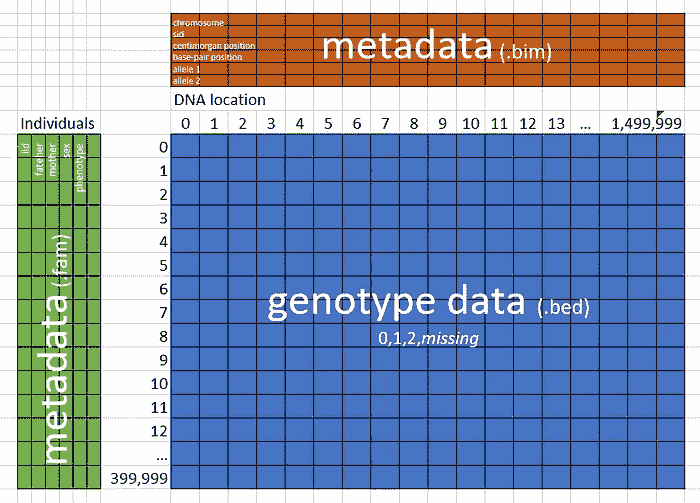
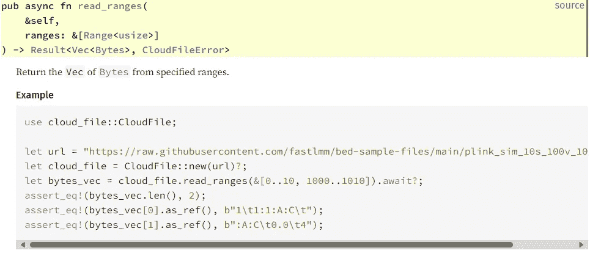
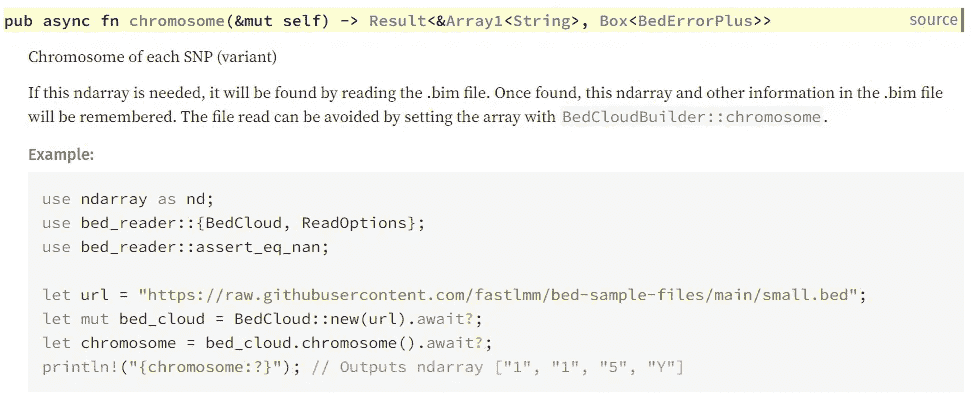

# 从你的 Rust 代码访问云文件的九个规则

> 原文：[`towardsdatascience.com/nine-rules-for-accessing-cloud-files-from-your-rust-code-d456c1e2ceb4?source=collection_archive---------7-----------------------#2024-02-07`](https://towardsdatascience.com/nine-rules-for-accessing-cloud-files-from-your-rust-code-d456c1e2ceb4?source=collection_archive---------7-----------------------#2024-02-07)

## 升级 Bed-Reader：来自生物信息学库的实践经验

[](https://medium.com/@carlmkadie?source=post_page---byline--d456c1e2ceb4--------------------------------)[](https://towardsdatascience.com/?source=post_page---byline--d456c1e2ceb4--------------------------------) [Carl M. Kadie](https://medium.com/@carlmkadie?source=post_page---byline--d456c1e2ceb4--------------------------------)

·发表于 [Towards Data Science](https://towardsdatascience.com/?source=post_page---byline--d456c1e2ceb4--------------------------------) ·阅读时长 21 分钟·2024 年 2 月 7 日

--


Rust 和 Python 直接从云端读取 DNA 数据 — 来源：[`openai.com/dall-e-2/`](https://openai.com/dall-e-2/)。所有其他图片来自作者。

你希望你的 Rust 程序能够无缝地访问云端的文件数据吗？当我提到“云端文件”时，我指的是存储在 Web 服务器或云存储解决方案（如 AWS S3、Azure Blob Storage 或 Google Cloud Storage）中的数据。这里所说的“读取”包含了对文件内容的顺序检索——无论是文本还是二进制数据，从头到尾——并且具有根据需要定位并提取文件中特定部分的能力。

将程序升级以访问云文件，可以减少烦恼和复杂性：不再需要将文件下载到本地存储，也不再需要定期检查本地副本是否为最新。

不幸的是，将你的程序升级以访问云文件也可能会*增加*烦恼和复杂性：URLs 和凭证信息带来的烦恼，以及异步编程的复杂性。

[Bed-Reader](https://github.com/fastlmm/bed-reader) 是一个用于读取 PLINK Bed 文件的 Python 包和 Rust crate，这是一种在生物信息学中用于存储基因型（DNA）数据的二进制格式。应用户的要求，我最近更新了 Bed-Reader，使其能够选择性地直接从云存储读取数据。在此过程中，我总结了九条规则，可以帮助你为程序添加云文件支持。这些规则是：

1.  使用 crate `[object_store](https://crates.io/crates/object_store)`（以及可能的 `[cloud-file](https://crates.io/crates/cloud-file)`）按顺序读取云文件的字节。

1.  通过两个嵌套的循环顺序读取云文件中的文本行。

1.  随机访问云文件，即使是非常大的文件，也可以使用“范围”方法，同时遵守服务器施加的限制。

1.  使用 URL 字符串和选项字符串访问 HTTP、本地文件、AWS S3、Azure 和 Google Cloud。

1.  通过 `[tokio](https://crates.io/crates/tokio)::test` 测试 HTTP 和本地文件。

*如果其他程序调用你的程序——换句话说，如果你的程序提供了一个 API（应用程序接口）——则有四条额外的规则适用：*

6\. 为了获得最佳性能，可以通过异步 API 将云文件支持添加到你的 Rust 库中。

7\. 或者，为了最大程度的方便，可以通过传统的（“同步”）API 将云文件支持添加到你的 Rust 库中。

8\. 通过使用文档测试中的隐藏行，遵循良好的 API 设计规则。

9\. 包括一个运行时，但可以选择性地使用。

> 顺便提一下：为了避免模糊不清，我称这些为“规则”，但它们当然只是建议。

# 规则 1：使用 crate `object_store`（以及可能的 `cloud-file`）顺序读取云文件的字节。

强大的`[object_store](https://crates.io/crates/object_store)` crate 提供对存储在 HTTP、AWS S3、Azure、Google Cloud 和本地文件中的文件的完整内容访问。它是 [Apache Arrow](https://arrow.apache.org/) 项目的一部分，已下载超过 240 万次。

对于本文，我还创建了一个名为 `[cloud-file](https://crates.io/crates/cloud-file)` 的新 crate。它简化了 `object_store` crate 的使用。它包装并专注于 `object_store` 的一个有用子集。你可以直接使用它，或者将其代码提取出来供你自己使用。

让我们来看一个例子。我们通过计算云文件中包含的换行符数量来统计文件的行数。

```py
use cloud_file::{CloudFile, CloudFileError};
use futures_util::StreamExt; // Enables `.next()` on streams.

async fn count_lines(cloud_file: &CloudFile) -> Result<usize, CloudFileError> {
    let mut chunks = cloud_file.stream_chunks().await?;
    let mut newline_count: usize = 0;
    while let Some(chunk) = chunks.next().await {
        let chunk = chunk?;
        newline_count += bytecount::count(&chunk, b'\n');
    }
    Ok(newline_count)
}

#[tokio::main]
async fn main() -> Result<(), CloudFileError> {
    let url = "https://raw.githubusercontent.com/fastlmm/bed-sample-files/main/toydata.5chrom.fam";
    let options = [("timeout", "10s")];
    let cloud_file = CloudFile::new_with_options(url, options)?;
    let line_count = count_lines(&cloud_file).await?;
    println!("line_count: {line_count}");
    Ok(())
}
```

当我们运行这段代码时，它返回：

```py
line_count: 500
```

一些要点：

+   我们使用 `async`（在这里使用的是`[tokio](https://docs.rs/tokio/latest/tokio/)`）。我们将在规则 6 和 7 中进一步讨论这一选择。

+   我们通过 `CloudFile::new_with_options(url, options)?` 将 URL 字符串和选项字符串转换为 `CloudFile` 实例。我们使用 `?` 来捕获格式错误的 URL）。

+   我们通过 `cloud_file.stream_chunks().await?` 创建一个二进制块流。这是代码首次尝试访问云文件的地方。如果文件不存在或无法打开，`?` 会返回一个错误。

+   我们使用 `chunks.next().await` 来获取文件的下一个二进制块。（请注意 `use futures_util::StreamExt;`。）`next` 方法在所有块被检索完后返回 `None`。

+   如果确实有下一个块，但在检索时出现问题呢？我们将通过 `let chunk = chunk?;` 捕获任何问题。

+   最后，我们使用快速的 `[bytecount](https://docs.rs/bytecount/latest/bytecount/)` crate 来计算换行符的数量。

与这种云解决方案相对比，想想你会如何为本地文件编写一个简单的行计数器。你可能会写成这样：

```py
use std::fs::File;
use std::io::{self, BufRead, BufReader};

fn main() -> io::Result<()> {
    let path = "examples/line_counts_local.rs";
    let reader = BufReader::new(File::open(path)?);
    let mut line_count = 0;
    for line in reader.lines() {
        let _line = line?;
        line_count += 1;
    }
    println!("line_count: {line_count}");
    Ok(())
}
```

在`cloud-file`版本和本地文件版本之间，有三个突出差异。首先，我们可以轻松地将本地文件作为文本读取。默认情况下，我们将云文件作为二进制文件读取（但请参见规则 2）。其次，默认情况下，我们同步读取本地文件，直到完成才会阻塞程序执行。另一方面，我们通常异步访问云文件，这样在等待相对较慢的网络访问完成时，程序的其他部分仍然可以继续运行。第三，像`lines()`这样的迭代器支持`for`循环。然而，像`stream_chunks()`这样的流则不支持，所以我们使用`while let`。

我之前提到过，你不需要使用`cloud-file`包装器，而可以直接使用`object_store` crate。接下来，让我们看看只使用`object_store`方法时，如何计算云文件中的换行符：

```py
use futures_util::StreamExt;  // Enables `.next()` on streams.
pub use object_store::path::Path as StorePath;
use object_store::{parse_url_opts, ObjectStore};
use std::sync::Arc;
use url::Url;

async fn count_lines(
    object_store: &Arc<Box<dyn ObjectStore>>,
    store_path: StorePath,
) -> Result<usize, anyhow::Error> {
    let mut chunks = object_store.get(&store_path).await?.into_stream();
    let mut newline_count: usize = 0;
    while let Some(chunk) = chunks.next().await {
        let chunk = chunk?;
        newline_count += bytecount::count(&chunk, b'\n');
    }
    Ok(newline_count)
}

#[tokio::main]
async fn main() -> Result<(), anyhow::Error> {
    let url = "https://raw.githubusercontent.com/fastlmm/bed-sample-files/main/toydata.5chrom.fam";
    let options = [("timeout", "10s")];

    let url = Url::parse(url)?;
    let (object_store, store_path) = parse_url_opts(&url, options)?;
    let object_store = Arc::new(object_store); // enables cloning and borrowing
    let line_count = count_lines(&object_store, store_path).await?;
    println!("line_count: {line_count}");
    Ok(())
}
```

你会发现代码与`cloud-file`代码非常相似。不同之处在于：

+   与单个`CloudFile`输入不同，大多数方法需要两个输入：`ObjectStore`和`StorePath`。因为`ObjectStore`是一个不可克隆的特性，这里`count_lines`函数专门使用了`&Arc<Box<dyn ObjectStore>>`。或者，我们可以将函数设为泛型，并使用`&Arc<impl ObjectStore>`。

+   创建`ObjectStore`实例、`StorePath`实例和流需要比创建`CloudFile`实例和流多一些步骤。

+   不再只处理一种错误类型（即`CloudFileError`），而是可能出现多种错误类型，因此我们退回使用了`[anyhow](https://crates.io/crates/anyhow)` crate。

无论你是直接使用`object_store`（目前下载量为 240 万次），还是通过`cloud-file`间接使用（目前下载量为 124 次 😀），都由你决定。

在本文的其余部分，我将重点讨论`cloud-file`。如果你想将`cloud-file`方法转换为纯`object_store`代码，可以查阅[该方法的文档](https://docs.rs/cloud-file)，并点击“source”链接。源代码通常只有一两行。

我们已经了解了如何顺序读取云文件的字节。接下来，让我们看看如何顺序读取它的行。

# 规则 2：通过两个嵌套循环顺序读取云文件的文本行。

我们经常需要顺序读取云文件的行。使用`cloud-file`（或`object_store`）来实现这一点需要两个嵌套循环。

外部循环像以前一样返回二进制块，但有一个关键的修改：我们现在确保每个块只包含完整的行，从行的第一个字符开始，到换行符结束。换句话说，块可能包含一行或多行完整的内容，但没有部分行。内部循环将块转换为文本，并迭代生成的一行或多行。

在这个例子中，给定一个云文件和一个数字*n*，我们找出索引位置*n*的那一行：

```py
use cloud_file::CloudFile;
use futures::StreamExt;  // Enables `.next()` on streams.
use std::str::from_utf8;

async fn nth_line(cloud_file: &CloudFile, n: usize) -> Result<String, anyhow::Error> {
    // Each binary line_chunk contains one or more lines, that is, each chunk ends with a newline.
    let mut line_chunks = cloud_file.stream_line_chunks().await?;
    let mut index_iter = 0usize..;
    while let Some(line_chunk) = line_chunks.next().await {
        let line_chunk = line_chunk?;
        let lines = from_utf8(&line_chunk)?.lines();
        for line in lines {
            let index = index_iter.next().unwrap(); // safe because we know the iterator is infinite
            if index == n {
                return Ok(line.to_string());
            }
        }
    }
    Err(anyhow::anyhow!("Not enough lines in the file"))
}

#[tokio::main]
async fn main() -> Result<(), anyhow::Error> {
    let url = "https://raw.githubusercontent.com/fastlmm/bed-sample-files/main/toydata.5chrom.fam";
    let n = 4;

    let cloud_file = CloudFile::new(url)?;
    let line = nth_line(&cloud_file, n).await?;
    println!("line at index {n}: {line}");
    Ok(())
}
```

这段代码打印：

```py
line at index 4: per4 per4 0 0 2 0.452591
```

一些值得注意的要点：

+   关键方法是`.stream_line_chunks()`。

+   我们还必须调用`std::str::from_utf8`来创建文本。（可能会返回一个`[Utf8Error](https://doc.rust-lang.org/std/str/struct.Utf8Error.html)`。）此外，我们调用`.lines()`方法来创建一个行迭代器。

+   如果我们想要行索引，必须自己创建。这里我们使用：

```py
let mut index_iter = 0usize..;
...
let index = index_iter.next().unwrap(); // safe because we know the iterator is infinite
```

> 旁白：为什么要用两个循环？为什么`cloud-file`不定义一个返回每次一行的流？因为我不知道怎么做。如果有人能搞明白，请发送一个包含解决方案的 pull 请求给我！

我希望这能更简单些。我很高兴它是高效的。让我们通过下一步来回归简洁，看看如何随机访问云文件。

# 规则 3：使用范围方法随机访问云文件，即使是巨大的文件，同时尊重服务器设置的限制。

我在处理一种叫做 PLINK Bed 1.9 的基因组学文件格式。文件最大可达 1 TB。是不是太大，无法通过网络访问？不一定。有时候我们只需要文件的一小部分。此外，现代云服务（包括大多数网络服务器）可以高效地从云文件中提取感兴趣的区域。

让我们看一个例子。这个测试代码使用了一个名为`read_range_and_file_size`的`CloudFile`方法。它读取一个*.bed 文件的前 3 个字节，检查文件是否以预期的字节开头，然后检查文件的预期长度。

```py
#[tokio::test]
async fn check_file_signature() -> Result<(), CloudFileError> {
    let url = "https://raw.githubusercontent.com/fastlmm/bed-sample-files/main/plink_sim_10s_100v_10pmiss.bed";
    let cloud_file = CloudFile::new(url)?;
    let (bytes, size) = cloud_file.read_range_and_file_size(0..3).await?;

    assert_eq!(bytes.len(), 3);
    assert_eq!(bytes[0], 0x6c);
    assert_eq!(bytes[1], 0x1b);
    assert_eq!(bytes[2], 0x01);
    assert_eq!(size, 303);
    Ok(())
}
```

注意，在一次网络调用中，这个方法不仅返回请求的字节，还返回了整个文件的大小。

这里是一些高层次的`CloudFile`方法及它们在一次网络调用中可以检索的内容：

+   `[read_all](https://docs.rs/cloud-file/0.1.0-beta.2/cloud_file/struct.CloudFile.html#method.read_all)` — 作为内存中的`[Bytes](https://docs.rs/bytes/latest/bytes/struct.Bytes.html)`返回的整个文件内容

+   `[read_range](https://docs.rs/cloud-file/0.1.0-beta.2/cloud_file/struct.CloudFile.html#method.read_range)` — 从指定范围读取的`[Bytes](https://docs.rs/bytes/latest/bytes/struct.Bytes.html)`

+   `[read_ranges](https://docs.rs/cloud-file/0.1.0-beta.2/cloud_file/struct.CloudFile.html#method.read_ranges)` — 从指定范围读取的`Vec`类型的`[Bytes](https://docs.rs/bytes/latest/bytes/struct.Bytes.html)`

+   `[read_range_and_file_size](https://docs.rs/cloud-file/0.1.0-beta.2/cloud_file/struct.CloudFile.html#method.read_range_and_file_size)` — 从指定范围读取的`[Bytes](https://docs.rs/bytes/latest/bytes/struct.Bytes.html)`和文件的大小

+   `[read_file_size](https://docs.rs/cloud-file/0.1.0-beta.2/cloud_file/struct.CloudFile.html#method.read_file_size)` — 文件的大小

如果我们一次请求太多数据，这些方法可能会遇到两个问题。首先，我们的云服务可能会限制每次调用能检索的字节数。其次，通过同时发出多个请求而不是一次发一个请求，我们可能会得到更快的结果。

考虑这个例子：我们想要收集一个任意大小的文件中相邻 ASCII 字符的频率统计。例如，在一个包含 10,000 个相邻字符的随机样本中，或许“th”出现了 171 次。

假设我们的 Web 服务器支持 10 个并发请求，但每个请求只允许我们获取 750 字节。（8 MB 会是一个更常见的限制）。

> 感谢 Seattle Rust Meetup 的 Ben Lichtman（B3NNY）指引我正确的方向，帮助我向异步流添加了限制。

我们的主函数可能长这样：

```py
#[tokio::main]
async fn main() -> Result<(), anyhow::Error> {
    let url = "https://www.gutenberg.org/cache/epub/100/pg100.txt";
    let options = [("timeout", "30s")];
    let cloud_file = CloudFile::new_with_options(url, options)?;

    let seed = Some(0u64);
    let sample_count = 10_000;
    let max_chunk_bytes = 750; // 8_000_000 is a good default when chunks are bigger.
    let max_concurrent_requests = 10; // 10 is a good default

    count_bigrams(
        cloud_file,
        sample_count,
        seed,
        max_concurrent_requests,
        max_chunk_bytes,
    )
    .await?;

    Ok(())
}
```

`count_bigrams`函数可以首先创建一个随机数生成器，并调用来查找云文件的大小：

```py
#[cfg(not(target_pointer_width = "64"))]
compile_error!("This code requires a 64-bit target architecture.");

use cloud_file::CloudFile;
use futures::pin_mut;
use futures_util::StreamExt; // Enables `.next()` on streams.
use rand::{rngs::StdRng, Rng, SeedableRng};
use std::{cmp::max, collections::HashMap, ops::Range};

async fn count_bigrams(
    cloud_file: CloudFile,
    sample_count: usize,
    seed: Option<u64>,
    max_concurrent_requests: usize,
    max_chunk_bytes: usize,
) -> Result<(), anyhow::Error> {
    // Create a random number generator
    let mut rng = if let Some(s) = seed {
        StdRng::seed_from_u64(s)
    } else {
        StdRng::from_entropy()
    };

    // Find the document size
    let file_size = cloud_file.read_file_size().await?;
//...
```

接下来，根据文件大小，函数可以创建一个包含 10,000 个随机两字节范围的向量。

```py
 // Randomly choose the two-byte ranges to sample
    let range_samples: Vec<Range<usize>> = (0..sample_count)
        .map(|_| rng.gen_range(0..file_size - 1))
        .map(|start| start..start + 2)
        .collect();
```

例如，它可能生成以下向量`[4122418..4122420, 4361192..4361194, 145726..145728,` … `]`。但一次性获取 20,000 字节（我们假设这样）太多了。所以，我们将向量分成 27 个块，每个块不超过 750 字节：

```py
 // Divide the ranges into chunks respecting the max_chunk_bytes limit
    const BYTES_PER_BIGRAM: usize = 2;
    let chunk_count = max(1, max_chunk_bytes / BYTES_PER_BIGRAM);
    let range_chunks = range_samples.chunks(chunk_count);
```

使用一些异步魔法，我们为每个 27 个块创建一个未来工作的迭代器，然后将该迭代器转换为流。我们告诉流最多同时调用 10 个请求。此外，我们还表示可以接受乱序的结果。

```py
 // Create an iterator of future work
    let work_chunks_iterator = range_chunks.map(|chunk| {
        let cloud_file = cloud_file.clone(); // by design, clone is cheap
        async move { cloud_file.read_ranges(chunk).await }
    });

    // Create a stream of futures to run out-of-order and with constrained concurrency.
    let work_chunks_stream =
        futures_util::stream::iter(work_chunks_iterator).buffer_unordered(max_concurrent_requests);
    pin_mut!(work_chunks_stream); // The compiler says we need this
```

在最后一段代码中，我们首先在流中进行工作，并且—随着结果的到来—进行汇总。最后，我们对结果进行排序并打印出最好的结果。

```py
 // Run the futures and, as result bytes come in, tabulate.
    let mut bigram_counts = HashMap::new();
    while let Some(result) = work_chunks_stream.next().await {
        let bytes_vec = result?;
        for bytes in bytes_vec.iter() {
            let bigram = (bytes[0], bytes[1]);
            let count = bigram_counts.entry(bigram).or_insert(0);
            *count += 1;
        }
    }

    // Sort the bigrams by count and print the top 10
    let mut bigram_count_vec: Vec<(_, usize)> = bigram_counts.into_iter().collect();
    bigram_count_vec.sort_by(|a, b| b.1.cmp(&a.1));
    for (bigram, count) in bigram_count_vec.into_iter().take(10) {
        let char0 = (bigram.0 as char).escape_default();
        let char1 = (bigram.1 as char).escape_default();
        println!("Bigram ('{}{}') occurs {} times", char0, char1, count);
    }
    Ok(())
}
```

输出是：

```py
Bigram ('\r\n') occurs 367 times
Bigram ('e ') occurs 221 times
Bigram (' t') occurs 184 times
Bigram ('th') occurs 171 times
Bigram ('he') occurs 158 times
Bigram ('s ') occurs 143 times
Bigram ('.\r') occurs 136 times
Bigram ('d ') occurs 133 times
Bigram (', ') occurs 127 times
Bigram (' a') occurs 121 times
```

Bed-Reader 基因组学 crate 的代码使用相同的技术来从分散的 DNA 区域获取信息。当 DNA 信息到达时，可能是乱序的，代码会填充输出数组的正确列。

> 顺便提一下：此方法使用了迭代器、流和循环。我希望它能更简单。如果你能找到一种更简单的方法来获取区域的向量，同时限制最大块大小和并发请求数，请发给我一个 pull request。

这涵盖了访问存储在 HTTP 服务器上的文件，但 AWS S3 和其他云服务呢？本地文件怎么办？

# 规则 4：使用 URL 字符串和选项字符串来访问 HTTP、本地文件、AWS S3、Azure 和 Google Cloud。

`object_store` crate（以及`cloud-file`包装 crate）支持通过 URL 字符串或结构体指定文件。我建议使用 URL 字符串，但选择权在你。

让我们考虑一个 AWS S3 的示例。如你所见，AWS 访问需要凭证信息。

```py
use cloud_file::CloudFile;
use rusoto_credential::{CredentialsError, ProfileProvider, ProvideAwsCredentials};

#[tokio::main]
async fn main() -> Result<(), anyhow::Error> {
    // get credentials from ~/.aws/credentials
    let credentials = if let Ok(provider) = ProfileProvider::new() {
        provider.credentials().await
    } else {
        Err(CredentialsError::new("No credentials found"))
    };

    let Ok(credentials) = credentials else {
        eprintln!("Skipping example because no AWS credentials found");
        return Ok(());
    };

    let url = "s3://bedreader/v1/toydata.5chrom.bed";
    let options = [
        ("aws_region", "us-west-2"),
        ("aws_access_key_id", credentials.aws_access_key_id()),
        ("aws_secret_access_key", credentials.aws_secret_access_key()),
    ];
    let cloud_file = CloudFile::new_with_options(url, options)?;

    assert_eq!(cloud_file.read_file_size().await?, 1_250_003);
    Ok(())
}
```

关键部分是：

```py
 let url = "s3://bedreader/v1/toydata.5chrom.bed";
    let options = [
        ("aws_region", "us-west-2"),
        ("aws_access_key_id", credentials.aws_access_key_id()),
        ("aws_secret_access_key", credentials.aws_secret_access_key()),
    ];
    let cloud_file = CloudFile::new_with_options(url, options)?;
```

如果我们希望使用结构体而不是 URL 字符串，则变为：

```py
 use object_store::{aws::AmazonS3Builder, path::Path as StorePath};

    let s3 = AmazonS3Builder::new()
        .with_region("us-west-2")
        .with_bucket_name("bedreader")
        .with_access_key_id(credentials.aws_access_key_id())
        .with_secret_access_key(credentials.aws_secret_access_key())
        .build()?;
    let store_path = StorePath::parse("v1/toydata.5chrom.bed")?;
    let cloud_file = CloudFile::from_structs(s3, store_path);
```

我更喜欢 URL 方法而不是结构体。我发现 URL 稍微简单一些，更加统一，跨云服务时也更容易互操作（例如与 Python）。

这里是我使用的三个 Web 服务的示例 URL：

+   HTTP — `[`www.gutenberg.org/cache/epub/100/pg100.txt`](https://www.gutenberg.org/cache/epub/100/pg100.txt)`

+   本地文件 — `file:///M:/data%20files/small.bed` — 使用`cloud_file::abs_path_to_url_string`函数将完整的文件路径正确编码为 URL。

+   AWS S3 — `s3://bedreader/v1/toydata.5chrom.bed`

本地文件不需要选项。对于其他服务，这里是它们支持的选项和一些示例链接：

+   HTTP — `[ClientConfigKey](https://docs.rs/object_store/latest/object_store/enum.ClientConfigKey.html#variant.Timeout)` — `[("timeout", "30s")]`

+   AWS S3 — `[AmazonS3ConfigKey](https://docs.rs/object_store/latest/object_store/aws/enum.AmazonS3ConfigKey.html)` — `[("aws_region", "us-west-2"), ("aws_access_key_id",` …`), ("aws_secret_access_key",` …`)]`

+   Azure — `[AzureConfigKey](https://docs.rs/object_store/latest/object_store/azure/enum.AzureConfigKey.html)`

+   Google — `[GoogleConfigKey](https://docs.rs/object_store/latest/object_store/gcp/enum.GoogleConfigKey.html)`

现在我们可以指定和读取云文件，接下来我们应该创建测试。

# 规则 5：通过 `tokio::test` 对 HTTP 文件和本地文件进行测试。

`object_store` crate（以及 `cloud-file`）支持任何异步运行时。为了测试，[Tokio 运行时](https://docs.rs/tokio/latest/tokio/index.html)使得在云文件上测试代码变得简单。下面是一个针对 HTTP 文件的测试：

```py
[tokio::test]
async fn cloud_file_extension() -> Result<(), CloudFileError> {
    let url = "https://raw.githubusercontent.com/fastlmm/bed-sample-files/main/plink_sim_10s_100v_10pmiss.bed";
    let mut cloud_file = CloudFile::new(url)?;
    assert_eq!(cloud_file.read_file_size().await?, 303);
    cloud_file.set_extension("fam")?;
    assert_eq!(cloud_file.read_file_size().await?, 130);
    Ok(())
}
```

运行此测试命令：

```py
cargo test
```

如果您不想通过测试访问外部 Web 服务器，您可以改为将本地文件当作云文件进行测试。

```py
#[tokio::test]
async fn local_file() -> Result<(), CloudFileError> {
    use std::env;

    let apache_url = abs_path_to_url_string(env::var("CARGO_MANIFEST_DIR").unwrap()
             + "/LICENSE-APACHE")?;
    let cloud_file = CloudFile::new(&apache_url)?;
    assert_eq!(cloud_file.read_file_size().await?, 9898);
    Ok(())
}
```

这使用标准的 Rust 环境变量 `[CARGO_MANIFEST_DIR](https://doc.rust-lang.org/cargo/reference/environment-variables.html)` 来查找文本文件的完整路径。然后，它使用 `cloud_file::abs_path_to_url_string` 将该完整路径正确编码为 URL。

无论是在 HTTP 文件还是本地文件上进行测试，`object_store` 的强大功能意味着您的代码应该能在任何云服务上运行，包括 AWS S3、Azure 和 Google Cloud。

如果您只需要访问云文件供自己使用，您可以在这里停止阅读规则并跳到结论部分。如果您是为他人添加云访问到一个库（Rust crate），请继续阅读。

# 规则 6：为了获得最佳性能，通过异步 API 将云文件支持添加到您的 Rust 库中。

如果您提供 Rust crate 给他人使用，支持云文件为您的用户提供了极大的便利，但也有一定成本。让我们来看看我为 [Bed-Reader](https://pypi.org/project/bed-reader/) 添加了云支持的基因组学 crate。

如前所述，Bed-Reader 是一个用于读取和写入 PLINK Bed 文件的库，PLINK Bed 文件是一种在生物信息学中用于存储基因型（DNA）数据的二进制格式。Bed 格式的文件可以大到一个 TB。Bed-Reader 为用户提供对大量数据子集的快速随机访问。它返回一个二维数组，用户可以选择 int8、float32 或 float64 格式。Bed-Reader 还为用户提供了 12 个元数据字段，其中六个与个体相关，六个与 SNP（大致来说，是 DNA 位置）相关。基因型数据通常比元数据大 100,000 倍。



PLINK 存储基因型数据和元数据。（图由作者提供。）

> 旁注：在此上下文中，“[API](https://en.wikipedia.org/wiki/API)”指的是应用程序编程接口。它是由诸如 Bed-Reader 之类的库代码提供的公共结构、方法等，供其他程序调用。

这里是使用 Bed-Reader 原始“本地文件”API 的示例代码。该代码列出了前五个个体 ID，前五个 SNP ID，以及每个独特的染色体编号。然后，它读取染色体 5 中的每个基因组值：

```py
#[test]
fn lib_intro() -> Result<(), Box<BedErrorPlus>> {
    let file_name = sample_bed_file("some_missing.bed")?;

    let mut bed = Bed::new(file_name)?;
    println!("{:?}", bed.iid()?.slice(s![..5])); // Outputs ndarray: ["iid_0", "iid_1", "iid_2", "iid_3", "iid_4"]
    println!("{:?}", bed.sid()?.slice(s![..5])); // Outputs ndarray: ["sid_0", "sid_1", "sid_2", "sid_3", "sid_4"]
    println!("{:?}", bed.chromosome()?.iter().collect::<HashSet<_>>());
    // Outputs: {"12", "10", "4", "8", "19", "21", "9", "15", "6", "16", "13", "7", "17", "18", "1", "22", "11", "2", "20", "3", "5", "14"}
    let _ = ReadOptions::builder()
        .sid_index(bed.chromosome()?.map(|elem| elem == "5"))
        .f64()
        .read(&mut bed)?;

    Ok(())
}
```

这是使用新云文件 API 的相同代码：

```py
#[tokio::test]
async fn cloud_lib_intro() -> Result<(), Box<BedErrorPlus>> {
    let url = "https://raw.githubusercontent.com/fastlmm/bed-sample-files/main/some_missing.bed";
    let cloud_options = [("timeout", "10s")];

    let mut bed_cloud = BedCloud::new_with_options(url, cloud_options).await?;
    println!("{:?}", bed_cloud.iid().await?.slice(s![..5])); // Outputs ndarray: ["iid_0", "iid_1", "iid_2", "iid_3", "iid_4"]
    println!("{:?}", bed_cloud.sid().await?.slice(s![..5])); // Outputs ndarray: ["sid_0", "sid_1", "sid_2", "sid_3", "sid_4"]
    println!(
        "{:?}",
        bed_cloud.chromosome().await?.iter().collect::<HashSet<_>>()
    );
    // Outputs: {"12", "10", "4", "8", "19", "21", "9", "15", "6", "16", "13", "7", "17", "18", "1", "22", "11", "2", "20", "3", "5", "14"}
    let _ = ReadOptions::builder()
        .sid_index(bed_cloud.chromosome().await?.map(|elem| elem == "5"))
        .f64()
        .read_cloud(&mut bed_cloud)
        .await?;

    Ok(())
}
```

当切换到云数据时，Bed-Reader 用户必须做出以下更改：

+   他们必须在一个异步环境中运行，这里是 `#[tokio::test]`。

+   他们必须使用一个新的结构体 `BedCloud`，而不是 `Bed`。（另外，未展示的是，使用 `BedCloudBuilder` 而不是 `BedBuilder`。）

+   它们提供了一个 URL 字符串和可选的字符串选项，而不是本地文件路径。

+   他们必须在许多地方使用 `.await`，这些地方往往是不可预测的。（幸运的是，如果他们漏掉了某个地方，编译器会给出很好的错误提示。）

+   `ReadOptionsBuilder` 增加了一个新方法 `read_cloud`，用于配合之前的 `read` 方法。

从库开发者的角度来看，添加新的 `BedCloud` 和 `BedCloudBuilder` 结构体需要增加大量的主代码和测试代码。在我的情况下，是 2200 行新的主代码和 2400 行新的测试代码。

> 旁注：此外，还可以参考 Mario Ortiz Manero 的文章 “[我生命中的痛苦：在 Rust 中支持异步和同步代码](https://nullderef.com/blog/rust-async-sync/)”。

用户从这些改动中获得的好处是可以利用异步的高效性从云文件中读取数据。

这种好处值得吗？如果不值得，接下来我们将看一下替代方案。

# 规则 7：或者，为了最大程度的便利，通过传统的（“同步”）API 向你的 Rust 库添加云文件支持。

如果为你添加一个高效的异步 API 看起来太麻烦，或者对你的用户来说太混乱，那也有替代方案。也就是说，你可以提供一个传统的（“同步”）API。我在 Bed-Reader 的 Python 版本和支持该 Python 版本的 Rust 代码中就是这么做的。

> 旁注：见：[用 Rust 编写 Python 扩展的九条规则：从升级 Python 生物信息学包 Bed-Reader 中获得的实际经验教训](https://medium.com/towards-data-science/nine-rules-for-writing-python-extensions-in-rust-d35ea3a4ec29)，《*Towards Data Science*》。

这里是 Python 调用的 Rust 函数，用于检查一个 *.bed 文件是否以正确的文件签名开始。

```py
use tokio::runtime;
// ...
    #[pyfn(m)]
    fn check_file_cloud(location: &str, options: HashMap<&str, String>) -> Result<(), PyErr> {
        runtime::Runtime::new()?.block_on(async {
            BedCloud::new_with_options(location, options).await?;
            Ok(())
        })
    }
```

请注意，这不是一个异步函数。它是一个普通的“同步”函数。在这个同步函数内部，Rust 进行了一个异步调用：

```py
BedCloud::new_with_options(location, options).await?;
```

我们通过将异步调用包装在 Tokio 运行时中来使其变为同步：

```py
use tokio::runtime;
// ...

runtime::Runtime::new()?.block_on(async {
    BedCloud::new_with_options(location, options).await?;
    Ok(())
})
```

Bed-Reader 的 Python 用户之前可以使用命令 `open_bed(file_name_string)` 打开一个本地文件进行读取。现在，他们也可以用相同的命令 `open_bed(url_string)` 打开一个云文件进行读取。唯一的区别是他们传入的字符串格式。

这是规则 6 中的示例，使用更新后的 Python API 的 Python 代码：

```py
 with open_bed(
      "https://raw.githubusercontent.com/fastlmm/bed-sample-files/main/some_missing.bed",
      cloud_options={"timeout": "30s"},
  ) as bed:
      print(bed.iid[:5])
      print(bed.sid[:5])
      print(np.unique(bed.chromosome))
      val = bed.read(index=np.s_[:, bed.chromosome == "5"])
      print(val.shape)
```

请注意，Python API 还提供了一个名为 `cloud_options` 的新可选参数。此外，幕后有一小段新代码，区分了表示本地文件和表示 URL 的字符串。

在 Rust 中，你也可以使用相同的技巧使 `object_cloud` 的调用变为同步。具体而言，你可以将异步调用包装在运行时中。好处是接口更简单，库代码更少。代价是效率比提供异步 API 要低。

如果你决定放弃“同步”替代方案，选择提供异步 API，你会发现一个新问题：如何在文档中提供异步示例。接下来我们将讨论这个问题。

# 规则 8：通过在文档测试中使用隐藏行，遵循良好的 API 设计规则。

文章中的所有规则 [优雅 Rust 库 API 的九条规则：从将 Bed-Reader（一种生物信息学库）从 Python 移植到 Rust 中得到的实践经验](https://medium.com/towards-data-science/nine-rules-for-elegant-rust-library-apis-9b986a465247) 适用，特别是以下两条：

*编写良好的文档，保持设计的诚实。

创建不会让你尴尬的示例。*

这表明我们应该在文档中给出示例，但如何在异步方法和 await 中实现这一点呢？窍门在于在我们的[文档测试](https://doc.rust-lang.org/rustdoc/write-documentation/documentation-tests.html)中使用“隐藏行”。例如，以下是 `[CloudFile::read_ranges](https://docs.rs/cloud-file/0.1.0-beta.2/cloud_file/struct.CloudFile.html#method.read_ranges)` 的文档：

```py
 /// Return the `Vec` of [`Bytes`](https://docs.rs/bytes/latest/bytes/struct.Bytes.html) from specified ranges.
    ///
    /// # Example
    /// ```

    /// 使用 cloud_file::CloudFile;

    ///

    /// # Runtime::new().unwrap().block_on(async {

    /// let url = "https://raw.githubusercontent.com/fastlmm/bed-sample-files/main/plink_sim_10s_100v_10pmiss.bim";

    /// let cloud_file = CloudFile::new(url)?;

    /// let bytes_vec = cloud_file.read_ranges(&[0..10, 1000..1010]).await?;

    /// assert_eq!(bytes_vec.len(), 2);

    /// assert_eq!(bytes_vec[0].as_ref(), b"1\t1:1:A:C\t");

    /// assert_eq!(bytes_vec[1].as_ref(), b":A:C\t0.0\t4");

    /// # Ok::<(), CloudFileError>(())}).unwrap();

    /// # 使用 {tokio::runtime::Runtime, cloud_file::CloudFileError};

    /// ```py
```

文档测试从 ```py` ``` ```py`. Within the doc test, lines starting with `/// #` disappear from the documentation:



The hidden lines, however, will still be run by `cargo test`.

In my library crates, I try to include a working example with every method. If such an example turns out overly complex or otherwise embarrassing, I try to fix the issue by improving the API.

Notice that in this rule and the previous Rule 7, we added a runtime to the code. Unfortunately, including a runtime can easily double the size of your user’s programs, even if they don’t read files from the cloud. Making this extra size optional is the topic of Rule 9.

# Rule 9: Include a runtime, but optionally.

If you follow Rule 6 and provide async methods, your users gain the freedom to choose their own runtime. Opting for a runtime like Tokio may significantly increase their compiled program’s size. However, if they use no async methods, selecting a runtime becomes unnecessary, keeping the compiled program lean. This embodies the “zero cost principle”, where one incurs costs only for the features one uses.

On the other hand, if you follow Rule 7 and wrap async calls inside traditional, “synchronous” methods, then you must provide a runtime. This will increase the size of the resultant program. To mitigate this cost, you should make the inclusion of any runtime optional.

Bed-Reader includes a runtime under two conditions. First, when used as a Python extension. Second, when testing the async methods. To handle the first condition, we create a Cargo feature called `extension-module` that pulls in optional dependencies `pyo3` and `tokio`. Here are the relevant sections of `Cargo.toml`:

``` 开始

[功能]

extension-module = ["pyo3/extension-module", "tokio/full"]

默认 = []

[依赖]

#...

pyo3 = { version = "0.20.0", features = ["extension-module"], optional = true }

tokio = { version = "1.35.0", features = ["full"], optional = true }

```py

Also, because I’m using Maturin to create a Rust extension for Python, I include this text in `pyproject.toml`:

```

[tool.maturin]

features = ["extension-module"]

```py

I put all the Rust code related to extending Python in a file called `python_modules.rs`. It starts with this [conditional compilation attribute](https://doc.rust-lang.org/reference/conditional-compilation.html#the-cfg-attribute):

```

#![cfg(feature = "extension-module")] // 如果特性未开启则忽略文件

```py

This starting line ensures that the compiler includes the extension code only when needed.

With the Python extension code taken care of, we turn next to providing an optional runtime for testing our async methods. I again choose Tokio as the runtime. I put the tests for the async code in their own file called `tests_api_cloud.rs`. To ensure that that async tests are run only when the `tokio` dependency feature is “on”, I start the file with this line:

```

#![cfg(feature = "tokio")]

```py

As per Rule 5, we should also include examples in our documentation of the async methods. These examples also serve as “doc tests”. The doc tests need conditional compilation attributes. Below is the documentation for the method that retrieves chromosome metadata. Notice that the example includes two hidden lines that start
`/// # #[cfg(feature = "tokio")]`

```

/// 每个 SNP（变异）的染色体

/// [...]

///

/// # 示例：

/// ```py
/// use ndarray as nd;
/// use bed_reader::{BedCloud, ReadOptions};
/// use bed_reader::assert_eq_nan;
///
/// # #[cfg(feature = "tokio")] Runtime::new().unwrap().block_on(async {
/// let url = "https://raw.githubusercontent.com/fastlmm/bed-sample-files/main/small.bed";
/// let mut bed_cloud = BedCloud::new(url).await?;
/// let chromosome = bed_cloud.chromosome().await?;
/// println!("{chromosome:?}"); // Outputs ndarray ["1", "1", "5", "Y"]
/// # Ok::<(), Box<BedErrorPlus>>(())}).unwrap();
/// # #[cfg(feature = "tokio")] use {tokio::runtime::Runtime, bed_reader::BedErrorPlus};
/// ```

```

在这个文档测试中，当 `tokio` 功能“开启”时，示例使用 `tokio` 并在 Tokio 运行时中运行四行代码。当 `tokio` 功能“关闭”时，`#[cfg(feature = "tokio")]` 块中的代码消失，从而有效地跳过异步操作。

在格式化文档时，Rust 默认包含所有功能的文档，因此我们看到了这四行代码：



总结规则 9：通过使用 Cargo 功能和条件编译，我们可以确保用户只为他们使用的功能付费。

# 结论

所以，就这样：九条规则帮助你在 Rust 程序中读取云文件。借助[`object_store`](https://docs.rs/object_store/latest/object_store/) crate 的强大功能，你的程序可以突破本地驱动器的限制，从 Web、AWS S3、Azure 和 Google Cloud 加载数据。为了让这一过程更简单，你还可以使用我为本文编写的全新[`cloud-file`](https://crates.io/crates/cloud-file)包装 crate。

我还应该提到，这篇文章仅探讨了`object_store`的一个子集功能。除了我们看到的，`object_store` crate 还处理写入文件和操作文件夹及子文件夹。另一方面，[`cloud-file`](https://crates.io/crates/cloud-file) crate 只处理读取文件。（但嘿，我很欢迎提交 Pull Request）。

你是否应该在程序中添加云文件支持？当然，这取决于。支持云文件为你的程序用户提供了巨大的便利。代价是使用/提供异步接口的额外复杂性。代价还包括像 Tokio 这样的运行时文件大小的增加。另一方面，我认为添加此类支持的工具已经非常好，而且尝试它们也很简单，所以不妨试试看！

感谢你与我一同踏上云端之旅。如果你选择支持云文件，我希望这些步骤能帮助你实现。

*请* [*关注 Carl 的 Medium 账号*](https://medium.com/@carlmkadie)*。我在 Rust 和 Python 的科学编程、机器学习和统计学方面写作。我通常每个月写一篇文章。*
