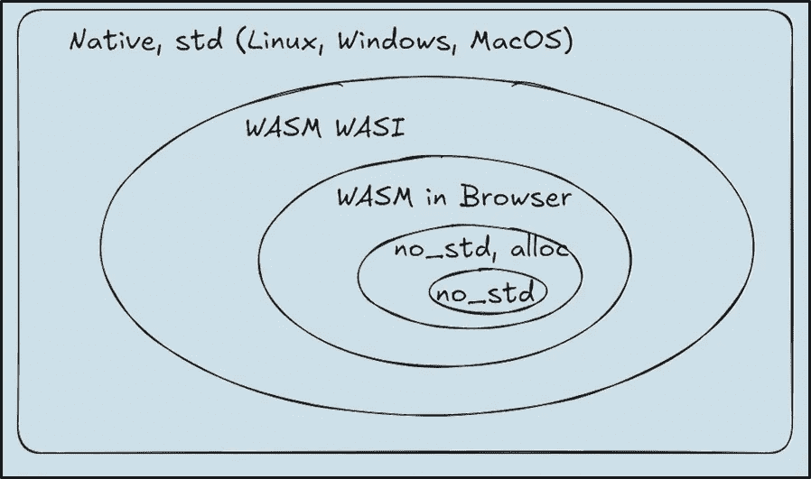
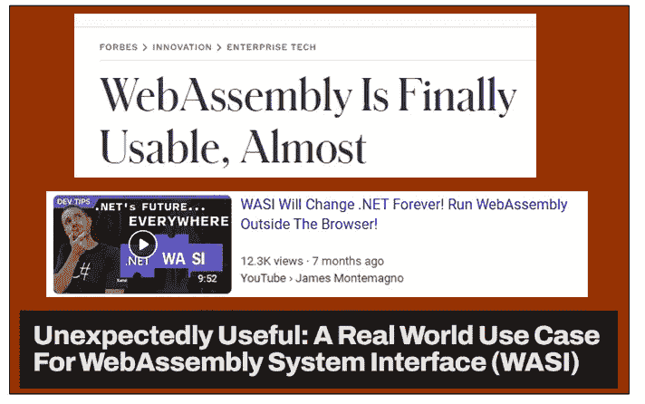

# 在 WASM WASI 上运行 Rust 的九条规则

> 原文：[`towardsdatascience.com/nine-rules-for-running-rust-on-wasm-wasi-550cd14c252a?source=collection_archive---------1-----------------------#2024-09-28`](https://towardsdatascience.com/nine-rules-for-running-rust-on-wasm-wasi-550cd14c252a?source=collection_archive---------1-----------------------#2024-09-28)

## 将`range-set-blaze`移植到这种容器化环境中的实践经验

[](https://medium.com/@carlmkadie?source=post_page---byline--550cd14c252a--------------------------------)[](https://towardsdatascience.com/?source=post_page---byline--550cd14c252a--------------------------------) [Carl M. Kadie](https://medium.com/@carlmkadie?source=post_page---byline--550cd14c252a--------------------------------)

·发表于[Towards Data Science](https://towardsdatascience.com/?source=post_page---byline--550cd14c252a--------------------------------) ·13 分钟阅读·2024 年 9 月 28 日

--


在类似容器的环境中运行 Rust —— 来源：[`openai.com/dall-e-2/`](https://openai.com/dall-e-2/)。其他所有图表来自作者。

你想让你的 Rust 代码在任何地方运行吗——从大型服务器到网页、机器人，甚至是手表？在这三篇文章中的第一篇[[1](https://medium.com/towards-data-science/nine-rules-for-running-rust-on-wasm-wasi-550cd14c252a), [2](https://medium.com/towards-data-science/nine-rules-for-running-rust-in-the-browser-8228353649d1), [3](https://medium.com/towards-data-science/nine-rules-for-running-rust-on-embedded-systems-b0c247ee877e)]，我将详细描述实现这一目标的步骤。

在受限环境中运行 Rust 会遇到许多挑战。你的代码可能无法访问完整的操作系统，如 Linux、Windows 或 macOS。你可能无法（或根本无法）访问文件、网络、时间、随机数，甚至是内存。我们将探讨一些解决方法和应对策略。

这篇文章的重点是如何在“WASM WASI”这个类似容器的环境中运行代码。我们将看到，WASM WASI 可能（也可能不）在自身上具有实际用途。然而，它作为在浏览器或嵌入式系统中运行 Rust 的第一步，仍然具有价值。

将代码移植到 WASM WASI 上需要许多步骤和选择。做出这些选择可能非常耗时。错过一个步骤可能导致失败。我们将通过提供九条规则来简化这一过程，我们将在接下来的内容中详细探讨这些规则：

1.  为失望做好准备：WASM WASI 很简单，但——目前——基本无用——除非作为一个垫脚石。

1.  理解 Rust 的目标平台。

1.  安装`wasm32-wasip1`目标和 WASMTIME，然后创建“Hello, WebAssembly！”。

1.  理解条件编译。

1.  运行常规测试，但使用 WASM WASI 目标。

1.  理解 Cargo 特性。

1.  改变你能改变的事物：通过选择 Cargo 特性解决依赖问题，64 位/32 位问题。

1.  接受你不能改变一切：网络、Tokio、Rayon 等等。

1.  将 WASM WASI 添加到你的 CI（持续集成）测试中。

> 顺便说一句：这些文章基于我在 [RustConf24](https://rustconf.com/programs/#755) 会议上提供的三小时研讨会。感谢参加该研讨会的所有人。同时，特别感谢来自西雅图 Rust Meetup 的志愿者们，他们帮助测试了这篇材料。这些文章替代了我去年写的 [一篇文章](https://medium.com/towards-data-science/nine-rules-for-running-rust-on-the-web-and-on-embedded-94462ef249a2)，并提供了更新的信息。

在我们逐条查看规则之前，先定义一下术语。

+   **Native**：你的本地操作系统（Linux、Windows、macOS）

+   **标准库 (std)**：提供 Rust 的核心功能——`Vec`、`String`、文件输入/输出、网络、时间等。

+   **WASM**：WebAssembly（WASM）是一种二进制指令格式，可以在大多数浏览器中运行（以及其他平台）。

+   **WASI**：WebAssembly 系统接口（WASI）允许非浏览器环境中的 WASM 访问文件 I/O、网络（尚未支持）和时间处理。

+   **no_std**：指示 Rust 程序不使用完整的标准库，使其适用于小型嵌入式设备或资源受限的环境。

+   **alloc**：在 `no_std` 环境中提供堆内存分配功能（`Vec`、`String` 等），对动态管理内存至关重要。

有了这些术语，我们可以将代码运行的环境想象成一个渐进收紧约束的维恩图。本文详细介绍了如何从本地环境迁移到 WASM WASI。[第二篇文章](https://medium.com/towards-data-science/nine-rules-for-running-rust-in-the-browser-8228353649d1) 讲述了如何进一步迁移到浏览器中的 WASM。[最后一篇文章](https://medium.com/towards-data-science/nine-rules-for-running-rust-on-embedded-systems-b0c247ee877e) 涵盖了在 `no_std` 环境中运行 Rust 的方法，包括带有和不带 `alloc` 的情况，非常适合嵌入式系统。



根据我在数据结构项目 [range-set-blaze](https://github.com/CarlKCarlK/range-set-blaze) 的经验，以下是我推荐的决策，逐条描述。为了避免模糊不清，我将它们表述为规则。

# 规则 1：为失望做好准备：WASM WASI 很简单，但——目前——大多数情况下没什么用——除非作为一个跳板。

2019 年，Docker 联合创始人 Solomon Hykes [在推特上发文](https://x.com/solomonstre/status/1111004913222324225)：

> 如果 2008 年就有 WASM+WASI，我们就不需要创建 Docker 了。这就是它的重要性。服务器上的 WebAssembly 是计算的未来。一个标准化的系统接口是缺失的环节。希望 WASI 能胜任这一任务。

今天，如果你关注技术新闻，你会看到像这样的乐观标题：



如果 WASM WASI 真的是已经准备好并且有用，大家早就已经在使用它了。我们不断看到这些标题，表明它还没有准备好。换句话说，如果 WASM WASI 真的是准备好的，他们就不需要一直坚持说它准备好了。

截至 WASI Preview 1，情况如下：你可以访问某些文件操作、环境变量，并能访问时间和随机数生成。然而，尚不支持网络功能。

WASM WASI *可能* 对某些类似 AWS Lambda 风格的 Web 服务有用，但即便如此也不确定。因为如果 WASM WASI 真的有用，你不想将你的 Rust 代码本地编译并以比 WASM WASI 快两倍且成本减半的方式运行吗？

也许 WASM WASI 对插件和扩展有用。在基因组学中，我有一个为 Python 编写的 Rust 扩展，我为 25 个不同的组合（5 个 Python 版本跨 5 个操作系统目标）编译它。即便如此，我也没有覆盖所有可能的操作系统和芯片系列。我能用 WASM WASI 替换这些操作系统目标吗？不行，它会太慢。我可以将 WASM WASI 作为第六个“万用”目标吗？也许可以，但如果我真的需要可移植性，我已经需要支持 Python，最好直接使用 Python。

那么，WASM WASI 到底有什么用呢？现在，它的主要价值在于它是朝着在浏览器或嵌入式系统上运行代码迈出的一步。

# 规则 2：了解 Rust 目标。

在规则 1 中，我稍微提到过“操作系统目标”。现在，让我们更深入地了解 Rust 目标——这是关于 WASM WASI 的关键信息，也适用于一般的 Rust 开发。

在我的 Windows 机器上，我可以将 Rust 项目编译为在 Linux 或 macOS 上运行。同样，从 Linux 机器上，我也可以将 Rust 项目编译为目标 Windows 或 macOS。以下是我用来在 Windows 机器上添加和检查 Linux 目标的命令：

```py
rustup target add x86_64-unknown-linux-gnu
cargo check --target x86_64-unknown-linux-gnu
```

> 旁白：虽然 `cargo check` 可以验证代码是否编译成功，但构建一个完全功能的可执行文件还需要额外的工具。要从 Windows 编译到 Linux（GNU），你还需要安装 Linux GNU 的 C/C++ 编译器和相应的工具链。这可能会有些棘手。幸运的是，对于我们关心的 WASM 目标，所需的工具链是很容易安装的。

要查看 Rust 支持的所有目标，请使用以下命令：

```py
rustc --print target-list
```

它将列出超过 200 个目标，包括 `x86_64-unknown-linux-gnu`、`wasm32-wasip1` 和 `wasm32-unknown-unknown`。

目标名称包含最多四个部分：CPU 系列、厂商、操作系统和环境（例如，GNU 与 LVMM）：


目标名称部分 — 图示来自作者

现在我们已经对目标有所了解，让我们继续安装我们需要的 WASM WASI 目标。

# 规则 3：安装 wasm32-wasip1 目标和 WASMTIME，然后创建“Hello, WebAssembly！”。

若要在浏览器外运行我们的 Rust 代码，我们需要针对 `wasm32-wasip1`（具有 WASI Preview 1 的 32 位 WebAssembly）进行编译。我们还将安装 WASMTIME，这是一个运行时，允许我们在浏览器外使用 WASI 运行 WebAssembly 模块。

```py
rustup target add wasm32-wasip1
cargo install wasmtime-cli
```

为了测试我们的设置，让我们使用 `cargo new` 创建一个新的“Hello, WebAssembly!” Rust 项目。这将初始化一个新的 Rust 包：

```py
cargo new hello_wasi
cd hello_wasi
```

编辑 `src/main.rs` 使其如下所示：

```py
fn main() {
    #[cfg(not(target_arch = "wasm32"))]
    println!("Hello, world!");
    #[cfg(target_arch = "wasm32")]
    println!("Hello, WebAssembly!");
}
```

> 附注：我们将在规则 4 中更深入地研究 `#[cfg(...)]` 属性，它支持条件编译。

现在，运行项目命令 `cargo run`，你应该看到 `Hello, world!` 被打印到控制台。

接下来，创建一个 `.cargo/config.toml` 文件，指定当目标为 WASM WASI 时，Rust 应如何运行和测试该项目。

```py
[target.wasm32-wasip1]
runner = "wasmtime run --dir ."
```

> 附注：这个 `.cargo/config.toml` 文件不同于主 `Cargo.toml` 文件，后者定义了项目的依赖项和元数据。

现在，如果你说：

```py
cargo run --target wasm32-wasip1
```

你应该看到 `Hello, WebAssembly!`。恭喜！你刚刚成功地在类似容器的 WASM WASI 环境中运行了一些 Rust 代码。

# 规则 4：理解条件编译。

现在，让我们研究 `#[cfg(...)]` —— 这是 Rust 中用于条件编译代码的一个重要工具。在规则 3 中，我们看到：

```py
fn main() {
    #[cfg(not(target_arch = "wasm32"))]
    println!("Hello, world!");
    #[cfg(target_arch = "wasm32")]
    println!("Hello, WebAssembly!");
}
```

`#[cfg(...)]` 行告诉 Rust 编译器根据特定条件包含或排除某些代码项。“代码项”指的是代码单元，如函数、语句或表达式。

使用 `#[cfg(…)]` 行，你可以条件性地编译你的代码。换句话说，你可以为不同的情况创建不同版本的代码。例如，当为 `wasm32` 目标编译时，编译器会忽略 `#[cfg(not(target_arch = "wasm32"))]` 块，只包含以下内容：

```py
fn main() {
    println!("Hello, WebAssembly!");
}
```

你通过表达式指定条件，例如 `target_arch = "wasm32"`。支持的键包括 `target_os` 和 `target_arch`。请参阅 Rust 参考文档中的[完整列表](https://doc.rust-lang.org/reference/conditional-compilation.html#set-configuration-options)的支持键。你还可以使用 Cargo 特性创建表达式，我们将在规则 6 中学习。

你可以使用逻辑运算符 `not`、`any` 和 `all` 组合表达式。Rust 的条件编译不使用传统的 `if...then...else` 语句。相反，你必须使用 `#[cfg(...)]` 及其否定来处理不同的情况：

```py
#[cfg(not(target_arch = "wasm32"))]
...
#[cfg(target_arch = "wasm32")]
...
```

若要条件性地编译整个文件，将 `#![cfg(...)]` 放置在文件的顶部。（注意“！”）。当文件仅与特定目标或配置相关时，这非常有用。

你还可以在 `Cargo.toml` 中使用 `cfg` 表达式来条件性地包含依赖项。这使你能够根据不同的目标定制依赖项。例如，这表示“当不针对 `wasm32` 时，依赖于 Criterion 和 Rayon”。

```py
[target.'cfg(not(target_arch = "wasm32"))'.dev-dependencies]
criterion = { version = "0.5.1", features = ["rayon"] }
```

> 附言：关于如何在 `Cargo.toml` 中使用 `cfg` 表达式的更多信息，请参见我的文章：[九个 Rust Cargo.toml 的注意事项与误区](https://medium.com/towards-data-science/nine-rust-cargo-toml-wats-and-wat-nots-1e5e02e41648)：掌握 Cargo.toml 格式规则，避免沮丧 | *Towards Data Science (medium.com)*。

# 规则 5：定期运行测试，但使用 WASM WASI 目标。

现在是时候尝试在 WASM WASI 上运行 *你的* 项目了。如规则 3 中所述，为你的项目创建一个 `.cargo/config.toml` 文件。它告诉 Cargo 如何在 WASM WASI 上运行和测试你的项目。

```py
[target.wasm32-wasip1]
runner = "wasmtime run --dir ."
```

接下来，[你的项目——像所有优秀的代码一样——应该已经包含了测试](https://doc.rust-lang.org/rust-by-example/testing.html)。我的 `range-set-blaze` 项目就包括了例如这样的测试：

```py
#[test]
fn insert_255u8() {
    let range_set_blaze = RangeSetBlaze::<u8>::from_iter([255]);
    assert!(range_set_blaze.to_string() == "255..=255");
}
```

现在让我们尝试在 WASM WASI 上运行你项目的测试。使用以下命令：

```py
cargo test --target wasm32-wasip1
```

如果这能正常工作，你可能就完成了——但它可能不会正常工作。当我在 `range-set-blaze` 上尝试时，我得到一个错误消息，抱怨在 WASM 上使用 Rayon。

```py
 error: Rayon cannot be used when targeting wasi32\. Try disabling default features.
  --> C:\Users\carlk\.cargo\registry\src\index.crates.io-6f17d22bba15001f\criterion-0.5.1\src\lib.rs:31:1
   |
31 | compile_error!("Rayon cannot be used when targeting wasi32\. Try disabling default features.");
```

为了解决这个错误，我们必须首先理解 Cargo 特性。

# 规则 6：了解 Cargo 特性。

为了解决规则 5 中的 Rayon 错误，理解 Cargo 特性的工作原理非常重要。

在 `Cargo.toml` 中，一个可选的 `[features]` 部分允许你根据启用或禁用的特性定义项目的不同配置或版本。例如，这是来自 [Criterion 基准测试项目](https://github.com/bheisler/criterion.rs/blob/master/Cargo.toml) 的简化版 `Cargo.toml` 文件的一部分：

```py
[features]
default = ["rayon", "plotters", "cargo_bench_support"]
rayon = ["dep:rayon"]
plotters = ["dep:plotters"]
html_reports = []
cargo_bench_support = []

[dependencies]
#...
# Optional dependencies
rayon = { version = "1.3", optional = true }
plotters = { version = "⁰.3.1", optional = true, default-features = false, features = [
    "svg_backend",
    "area_series",
    "line_series",
] }
```

这定义了四个 Cargo 特性：`rayon`、`plotters`、`html_reports` 和 `cargo_bench_support`。由于每个特性可以被包含或排除，这四个特性会创建 16 种可能的项目配置。还要注意特殊的默认 Cargo 特性。

一个 Cargo 特性可以包含其他 Cargo 特性。在这个例子中，特殊的 `default` Cargo 特性包含了三个其他 Cargo 特性——`rayon`、`plotters` 和 `cargo_bench_support`。

一个 Cargo 特性可以包含一个依赖项。上面的 `rayon` Cargo 特性包含了 `rayon` crate 作为一个依赖包。

此外，依赖包可能有自己的 Cargo 特性。例如，上述 `plotters` Cargo 特性包含了 `plotters` 依赖包，并启用了以下 Cargo 特性：`svg_backend`、`area_series` 和 `line_series`。

你可以指定在运行 `cargo check`、`cargo build`、`cargo run` 或 `cargo test` 时启用或禁用哪些 Cargo 特性。例如，如果你正在处理 Criterion 项目，并希望仅检查 `html_reports` 特性而不使用任何默认特性，你可以运行：

```py
cargo check --no-default-features --features html_reports
```

这个命令告诉 Cargo 默认不包含任何 Cargo 特性，而是特别启用 `html_reports` Cargo 特性。

在你的 Rust 代码中，你可以根据启用的 Cargo 特性来包含/排除代码项。语法使用 `#cfg(…)`，遵循规则 4：

```py
#[cfg(feature = "html_reports")]
SOME_CODE_ITEM
```

通过对 Cargo 特性的理解，我们现在可以尝试修复在 WASM WASI 上运行测试时遇到的`Rayon`错误。

# 规则 7：改变你能改变的事情：通过选择 Cargo 特性来解决依赖问题，64 位/32 位问题。

当我们尝试运行`cargo test --target wasm32-wasip1`时，错误信息的部分内容是：`Criterion ... Rayon cannot be used when targeting wasi32\. Try disabling default features.` 这表明我们应该在针对 WASM WASI 时禁用 Criterion 的`rayon` Cargo 特性。

为了实现这一点，我们需要在`Cargo.toml`中进行两个更改。首先，我们需要在`[dev-dependencies]`部分禁用 Criterion 的`rayon`特性。所以，这个初始配置：

```py
[dev-dependencies]
criterion = { version = "0.5.1", features = ["html_reports"] }
```

变成这样，我们显式地关闭了 Criterion 的默认特性，然后启用了除了`rayon`以外的所有 Cargo 特性。

```py
[dev-dependencies]
criterion = { version = "0.5.1", features = [
        "html_reports",
        "plotters",
        "cargo_bench_support"],
      default-features = false }
```

接下来，为了确保`rayon`在非 WASM 目标下仍然可用，我们通过在`Cargo.toml`中添加条件依赖来将其重新启用，如下所示：

```py
[target.'cfg(not(target_arch = "wasm32"))'.dev-dependencies]
criterion = { version = "0.5.1", features = ["rayon"] }
```

通常，当目标是 WASM WASI 时，你可能需要修改依赖项及其 Cargo 特性以确保兼容性。有时这个过程很简单，但有时也会充满挑战——甚至是无法解决的，正如我们将在第 8 条规则中讨论的那样。

> 旁注：在本系列的[第三篇文章](https://medium.com/towards-data-science/nine-rules-for-running-rust-on-embedded-systems-b0c247ee877e)中——关于`no_std`和嵌入式——我们深入探讨了修复依赖项的策略。

在再次运行测试后，我们越过了之前的错误，遇到了一个新的错误，这也算是进步！

```py
#[test]
fn test_demo_i32_len() {
    assert_eq!(demo_i32_len(i32::MIN..=i32::MAX), u32::MAX as usize + 1);
                                                  ^^^^^^^^^^^^^^^^^^^^^ attempt to compute 
`usize::MAX + 1_usize`, which would overflow
}
```

编译器抱怨`u32::MAX as usize + 1`溢出。在 64 位 Windows 上，这个表达式不会溢出，因为`usize`与`u64`相同，能够容纳`u32::MAX as usize + 1`。然而，WASM 是一个 32 位环境，所以`usize`与`u32`相同，导致表达式超出了限制。

这里的修复是将`usize`替换为`u64`，确保表达式不会溢出。更一般来说，编译器不会总是捕捉到这些问题，因此审查你使用`usize`和`isize`是很重要的。如果你在引用 Rust 数据结构的大小或索引，`usize`是正确的。然而，如果你处理的是超过 32 位限制的值，应该使用`u64`或`i64`。

> **旁注**：在 32 位环境中，Rust 数组、`Vec`、`BTreeSet`等理论上可以容纳最多 2³²−1 = 4,294,967,295 个元素。然而，这只是基于可寻址内存的理论限制。
> 
> **旁注 旁注**：实际的最大元素数量更加有限。[Rust 将我们的分配限制为](https://doc.rust-lang.org/std/primitive.pointer.html#method.offset)一个`[isize](https://doc.rust-lang.org/std/primitive.pointer.html#method.offset)`，因此是 2³¹−1（大约 20 亿）字节。如果每个元素是例如 2 字节，我们最多可以有约 10 亿个元素。

所以，我们修复了依赖项问题并解决了`usize`溢出问题。但是，我们能修复所有问题吗？不幸的是，答案是否定的。

# 规则 8：接受你不能改变所有东西：网络、Tokio、Rayon 等等。

WASM WASI Preview 1（当前版本）支持文件访问（在指定的目录内）、读取环境变量、以及处理时间和随机数。然而，与你期望的完整操作系统相比，它的功能是有限的。

如果你的项目需要访问网络、使用 Tokio 进行异步任务，或使用 Rayon 进行多线程操作，不幸的是，这些功能在 Preview 1 版本中不被支持。

幸运的是，预计 WASM WASI Preview 2 将在这些限制方面有所改进，提供更多功能，包括更好的网络支持，甚至可能支持异步任务。

# 规则 9：将 WASM WASI 添加到你的 CI（持续集成）测试中。

所以，你的测试在 WASM WASI 上通过了，项目也成功运行。就这样结束了吗？还不完全。因为，正如我喜欢说的：

> 如果它不在 CI 中，那就意味着它不存在。

持续集成（CI）是一种系统，它可以在你每次更新代码时自动运行测试，确保你的代码按预期继续工作。通过将 WASM WASI 集成到 CI 中，你可以确保未来的更改不会破坏你的项目与 WASM WASI 目标的兼容性。

在我的情况下，我的项目托管在 GitHub 上，使用 GitHub Actions 作为 CI 系统。以下是我添加到 `.github/workflows/ci.yml` 中的配置，用来在 WASM WASI 上测试我的项目：

```py
test_wasip1:
      name: Test WASI P1
      runs-on: ubuntu-latest
      steps:
        - name: Checkout
          uses: actions/checkout@v4
        - name: Set up Rust
          uses: dtolnay/rust-toolchain@master
          with:
            toolchain: stable
            targets: wasm32-wasip1
        - name: Install Wasmtime
          run: |
            curl https://wasmtime.dev/install.sh -sSf | bash
            echo "${HOME}/.wasmtime/bin" >> $GITHUB_PATH
        - name: Run WASI tests
          run: cargo test --verbose --target wasm32-wasip1
```

通过将 WASM WASI 集成到 CI 中，我可以自信地向我的项目中添加新代码。CI 会自动测试我的所有代码，确保它在未来仍然支持 WASM WASI。

所以，事情就是这样 —— 将 Rust 代码移植到 WASM WASI 的九条规则。这里是我在移植到 WASM WASI 时的惊讶之处：

**缺点：**

+   当前在 WASM WASI 上运行的实用性较低。然而，它有潜力在未来变得有用。

+   在 Rust 中，有一句常见的说法：“如果它能编译，就说明它能工作。” 不幸的是，这对于 WASM WASI 并不总是成立。如果你使用了一个不被支持的特性，比如网络功能，编译器不会捕捉到错误。相反，它会在运行时失败。例如，这段代码在 WASM WASI 上能编译并运行，但由于不支持网络功能，它总是返回错误。

```py
use std::net::TcpStream;

fn main() {
    match TcpStream::connect("crates.io:80") {
        Ok(_) => println!("Successfully connected."),
        Err(e) => println!("Failed to connect: {e}"),
    }
}
```

**优点：**

+   在 WASM WASI 上运行是朝着在 [浏览器中运行代码](https://medium.com/towards-data-science/nine-rules-for-running-rust-in-the-browser-8228353649d1) 和嵌入式系统上运行迈出的第一步。

+   你可以在 WASM WASI 上运行 Rust 代码，而不需要移植到 `no_std`。（移植到 `no_std` 是本系列的 [第三篇文章](https://medium.com/towards-data-science/nine-rules-for-running-rust-on-embedded-systems-b0c247ee877e) 讨论的话题。）

+   你可以在 WASM WASI 上运行标准的 Rust 测试，这使得验证你的代码变得容易。

+   `.cargo/config.toml` 文件和 Rust 的 `--target` 选项使得在不同的目标平台上配置和运行代码变得异常简单，包括 WASM WASI。

敬请关注！在[下一篇文章](https://medium.com/towards-data-science/nine-rules-for-running-rust-in-the-browser-8228353649d1)中，你将看到如何将 Rust 代码移植到浏览器中的 WASM 运行——这项能力我觉得非常有用。之后，[最后一篇文章](https://medium.com/towards-data-science/nine-rules-for-running-rust-on-embedded-systems-b0c247ee877e)将讲解如何将代码移植到嵌入式系统，我觉得这非常酷。

*附注：* 对未来的文章感兴趣吗？*请* [*在 Medium 上关注我*](https://medium.com/@carlmkadie)*。我写关于 Rust 和 Python、科学编程、机器学习和统计学的文章。我通常每月写一篇文章。*
