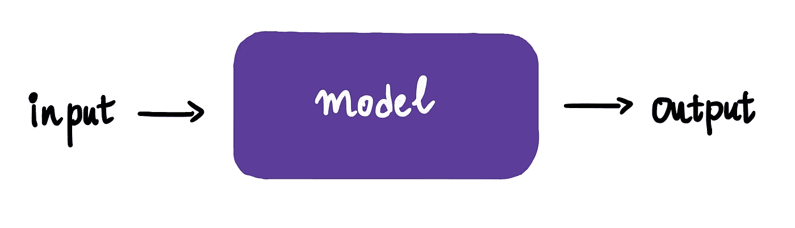
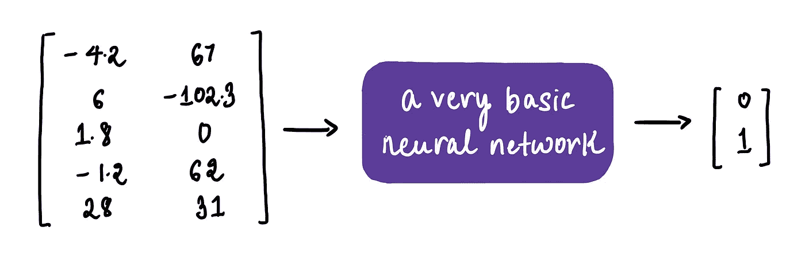

# 图解 NLP，第一部分：文本编码

> 原文：[`towardsdatascience.com/nlp-illustrated-part-1-text-encoding-41ba06c0f512?source=collection_archive---------9-----------------------#2024-11-19`](https://towardsdatascience.com/nlp-illustrated-part-1-text-encoding-41ba06c0f512?source=collection_archive---------9-----------------------#2024-11-19)

## 一份关于文本到数字翻译的图解指南，带有代码

 [Shreya Rao](https://medium.com/@shreya.rao?source=post_page---byline--41ba06c0f512--------------------------------)

·发布于[Towards Data Science](https://towardsdatascience.com/?source=post_page---byline--41ba06c0f512--------------------------------) ·阅读时长 11 分钟·2024 年 11 月 19 日

--

欢迎回到这个互联网角落，在这里我们将复杂的机器学习概念形象化——最终发现它们其实并没有那么复杂！

今天，我们将启动一个关于自然语言处理（NLP）的新系列。这令人兴奋，因为 NLP 是我们在各个地方看到的所有炫酷的[大型语言模型](https://www.cloudflare.com/learning/ai/what-is-large-language-model/)（LLMs）的基础——想想 Claude、GPT 和 Llama。

简单来说，NLP 帮助机器理解人类语言——无论是理解、分析，还是生成语言。

如果你一直在跟随我们的[**深度学习之旅**](https://medium.com/@shreya.rao/list/ae6c27de1640)，我们已经了解到，神经网络的核心原理非常简单：它们接受输入，进行数学运算，然后输出结果。

然而，为了让神经网络做到这一点，输入和输出必须以它们能够理解的格式呈现：数字。

这一规则适用于我们处理简单模型时……

