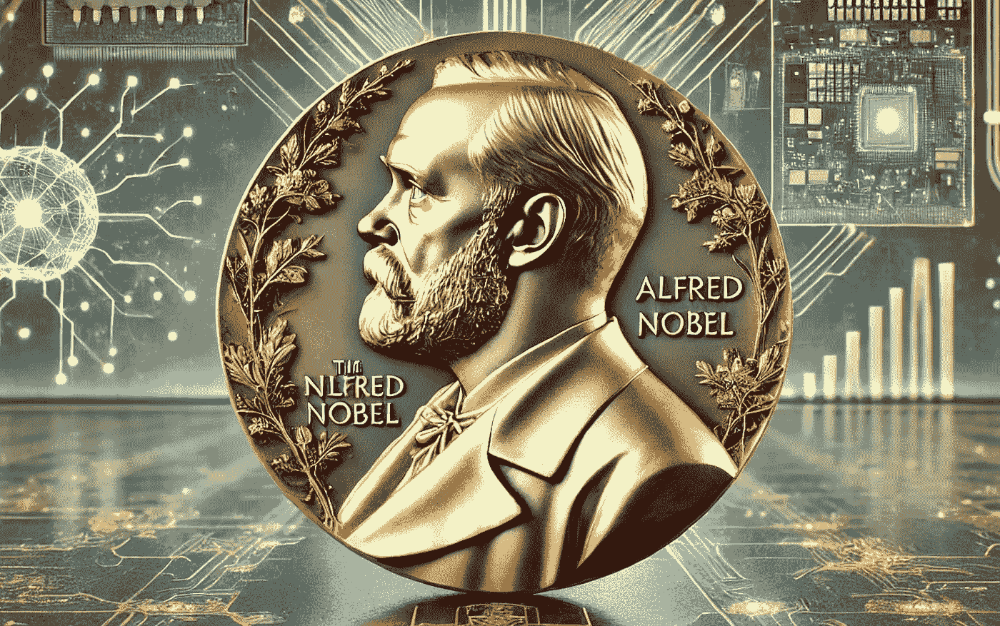
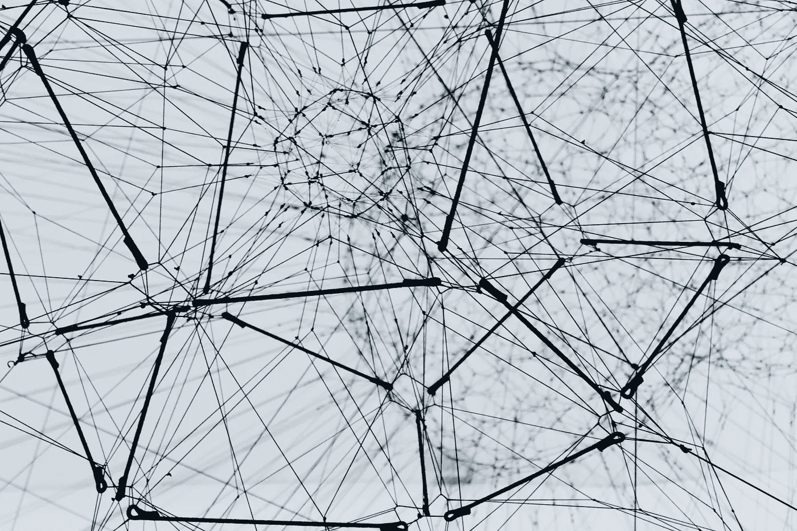

# 2024 年诺贝尔奖：人工智能突破大奖

> 原文：[`towardsdatascience.com/nobel-prizes-2024-artificial-intelligence-77a5a7027d5c?source=collection_archive---------9-----------------------#2024-12-10`](https://towardsdatascience.com/nobel-prizes-2024-artificial-intelligence-77a5a7027d5c?source=collection_archive---------9-----------------------#2024-12-10)

## 人工智能诺贝尔辩论后的教训

 [Andrea Valenzuela](https://medium.com/@andvalenzuela?source=post_page---byline--77a5a7027d5c--------------------------------)

·发表在[Towards Data Science](https://towardsdatascience.com/?source=post_page---byline--77a5a7027d5c--------------------------------)·阅读 7 分钟·2024 年 12 月 10 日

--

人工智能生成的图像。

自 1901 年颁发第一届诺贝尔奖以来，年底时期已成为了解各个领域杰出个人及其贡献的激动人心时刻。

今年的诺贝尔奖季节格外引人注目 —— 也有些争议 —— 因为在物理学和化学类别中对人工智能进展的特别认可。

今年的奖项突显了人工智能的巨大潜力，并提出了关于在计算方法重新定义传统领域的时代科学学科性质的紧迫问题。

在这篇文章中，我们旨在探讨人工智能在 2024 年诺贝尔奖中的角色，讨论事情已经平息后的争议，并邀请您分享您对此事的看法！

*人工智能是否会成为未来诺贝尔奖的一个长久存在？*

# 2024 年诺贝尔物理学奖

图片来自[Alina Grubnyak](https://unsplash.com/es/@alinnnaaaa?utm_content=creditCopyText&utm_medium=referral&utm_source=unsplash)在[Unsplash](https://unsplash.com/es/fotos/fotografia-de-angulo-bajo-de-estructura-metalica-ZiQkhI7417A?utm_content=creditCopyText&utm_medium=referral&utm_source=unsplash)

尽管计算机不能像人类那样“思考”，但计算机算法现在可以模仿类似于人类的功能，如记忆和学习。
