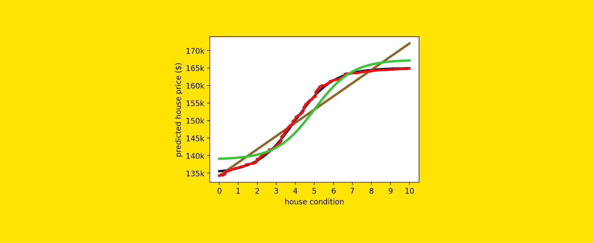
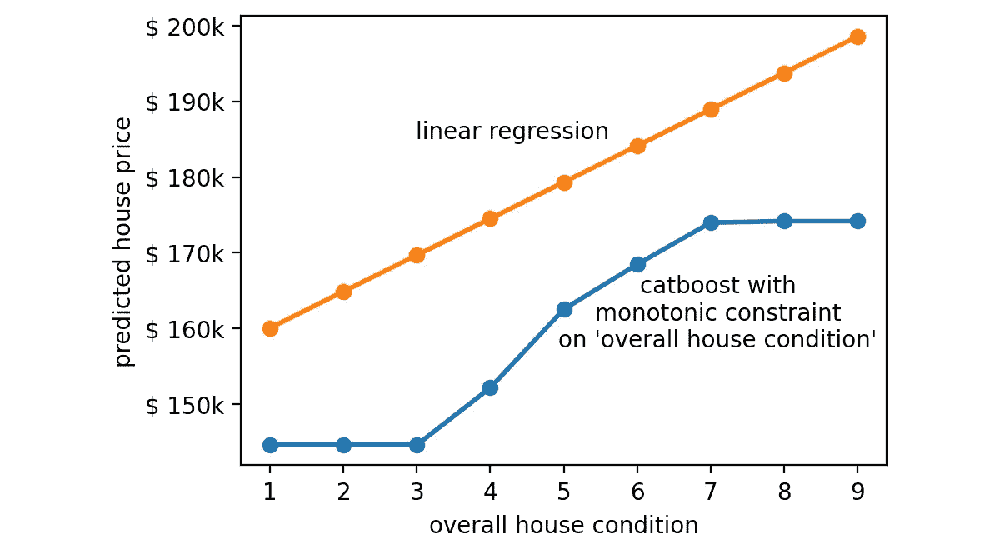
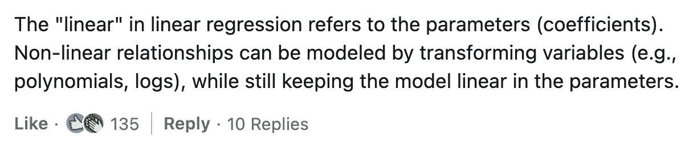

# 非线性：线性回归能与梯度提升竞争吗？

> 原文：[`towardsdatascience.com/non-linearity-can-linear-regression-compete-with-gradient-boosting-e4f88d81d105?source=collection_archive---------0-----------------------#2024-10-11`](https://towardsdatascience.com/non-linearity-can-linear-regression-compete-with-gradient-boosting-e4f88d81d105?source=collection_archive---------0-----------------------#2024-10-11)

## 线性模型可以通过数据预处理来处理非线性关系。但它们能接近更复杂的模型吗？

 [Samuele Mazzanti](https://medium.com/@mazzanti.sam?source=post_page---byline--e4f88d81d105--------------------------------)

·发表于 [Towards Data Science](https://towardsdatascience.com/?source=post_page---byline--e4f88d81d105--------------------------------) ·阅读时间 8 分钟·2024 年 10 月 11 日

--

[图片来源：作者]

几周前，我在 [LinkedIn 上发布了一篇帖子](https://www.linkedin.com/posts/samuelemazzanti_causality-datascience-machinelearning-activity-7243151980355874817-esZK?utm_source=share&utm_medium=member_desktop)。

这篇帖子是基于以下图表，比较了两种模型的预测结果：线性回归和 CatBoost。

[图片来源：作者]

这篇帖子的核心观点是，像 CatBoost 这样的梯度提升模型似乎能提供更“合理”的预测变量与目标变量之间的关系解释（即房屋状况与房价之间的关系）。

事实上，许多自然界中的关系是非线性的。

该帖子收到了若干反对意见，其中以下评论因获得大量点赞而特别引人注目：

[这篇 LinkedIn 帖子](https://www.linkedin.com/feed/update/urn:li:activity:7243151980355874817/)的评论区。

这引发了一场讨论，我发现了以下评论（由同一作者写的…）
