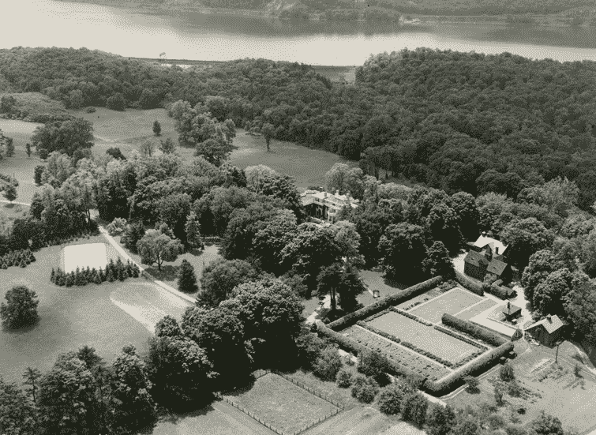
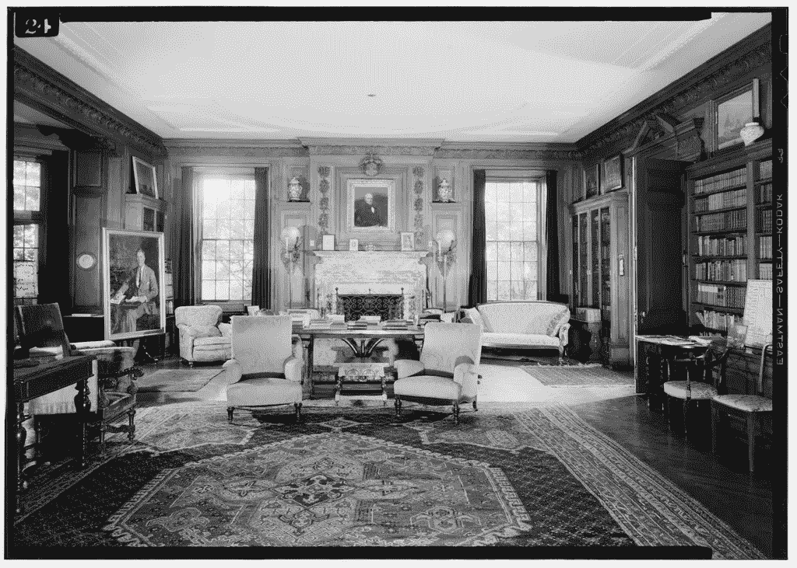

# 非响应偏差：沉默的大多数如何决定了一场选举，并让一个深受喜爱的出版商陷入困境

> 原文：[`towardsdatascience.com/nonresponse-bias-how-the-silent-majority-decided-an-election-and-sunk-a-beloved-publisher-90a40e73d3a1?source=collection_archive---------2-----------------------#2024-08-27`](https://towardsdatascience.com/nonresponse-bias-how-the-silent-majority-decided-an-election-and-sunk-a-beloved-publisher-90a40e73d3a1?source=collection_archive---------2-----------------------#2024-08-27)

## 这是一个统计偏差的介绍，它通过完全缺乏数据来显现其残酷的存在。

 [Sachin Date](https://timeseriesreasoning.medium.com/?source=post_page---byline--90a40e73d3a1--------------------------------)

·发表于 [Towards Data Science](https://towardsdatascience.com/?source=post_page---byline--90a40e73d3a1--------------------------------) ·阅读时长 26 分钟·2024 年 8 月 27 日

--

在一个阴沉的十一月傍晚，富兰克林·德拉诺·罗斯福总统在距白宫约 300 英里的*春伍德*坐定，准备收听收音机。

从空中俯瞰春伍德，位于纽约州海德公园，面朝西南（1932 年 6 月 6 日）。来源：[富兰克林·D·罗斯福总统图书馆与博物馆](http://www.fdrlibrary.marist.edu/archives/collections/franklin/?p=digitallibrary%2Fdigitalcontent&id=4223)（许可：公有领域照片）

坐落在哈德逊河东岸起伏的树林山丘之间，*春伍德*是富兰克林·罗斯福的终生家园。它是总统的世界中心。一个熟悉而舒适的地方，他在其定义时代的十二年总统任期内一次次归来。¹

1941 年 7 月，西春伍德客厅的景象。来源：[美国国会图书馆/维基共享资源](https://commons.wikimedia.org/wiki/File:Living_Room,_West,_July_1941._-_Springwood,_Hyde_Park,_Dutchess_County,_NY_HABS_NY,14-HYP,5-28.tif)。 （公有领域照片）

在那个十一月的晚上，罗斯福和他的家人因为一个特殊的原因坐在收音机前。

这是 1936 年 11 月 3 日的晚上。
