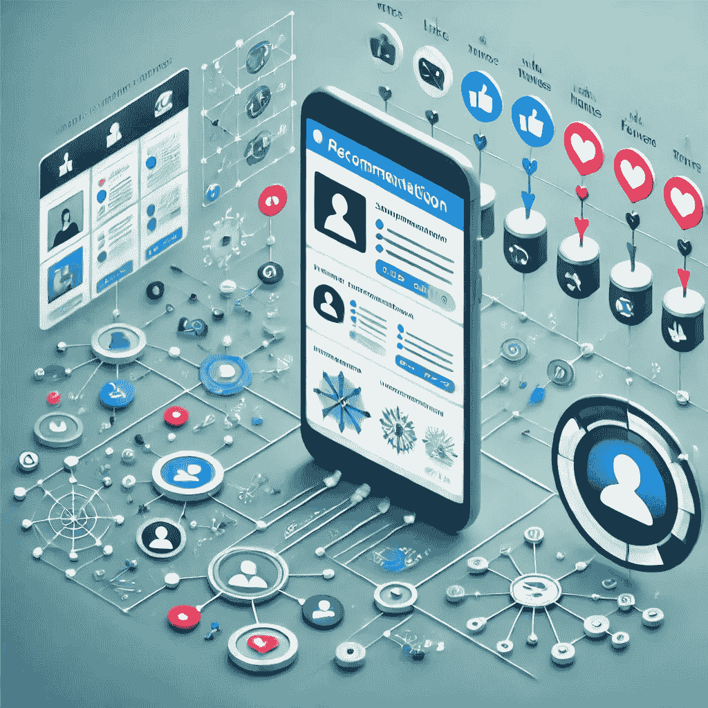

# 归一化折扣累积增益（NDCG）——终极排名度量标准

> 原文：[`towardsdatascience.com/normalized-discounted-cumulative-gain-ndcg-the-ultimate-ranking-metric-437b03529f75?source=collection_archive---------2-----------------------#2024-10-15`](https://towardsdatascience.com/normalized-discounted-cumulative-gain-ndcg-the-ultimate-ranking-metric-437b03529f75?source=collection_archive---------2-----------------------#2024-10-15)

## NDCG——用于评估推荐系统的排名感知度量标准

 [Saankhya Mondal](https://saankhya.medium.com/?source=post_page---byline--437b03529f75--------------------------------)

·发表于 [Towards Data Science](https://towardsdatascience.com/?source=post_page---byline--437b03529f75--------------------------------) ·阅读时长 10 分钟·2024 年 10 月 15 日

--

推荐系统无处不在。既然你正在阅读这篇文章，很有可能是 Medium 向你推荐的。这篇文章将探讨 NDCG——归一化折扣累积增益，作为评估任何推荐系统模型的排名感知度量标准。

图像由 Gemini 生成的 AI 生成

# 什么是推荐系统？

推荐系统帮助用户根据他们的偏好或行为发现相关的项目，如产品、个人资料、帖子、视频、广告或信息。这些平台处理数百万个项目，展示最相关的内容是提高用户参与度和商业指标的关键。亚马逊、LinkedIn、Twitter、Instagram、Reddit、Spotify、YouTube、Netflix、Medium 和 Quora 等公司在他们的应用中使用推荐系统。

这些系统通常是两阶段系统，包含一个检索模型和一个排名模型。检索模型根据相似度度量，从数百万个项目中筛选出最相关的项目，并将其传递给排名模型。排名模型对这些项目进行更精细的排序。
