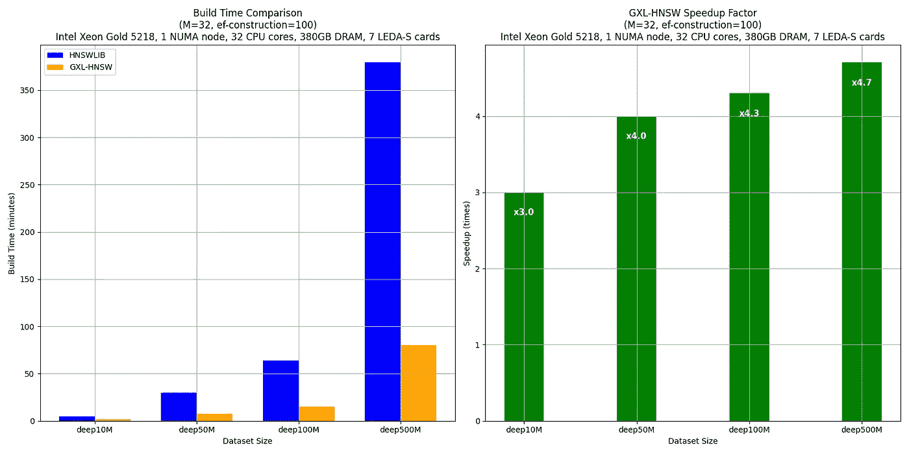

# 不是所有 HNSW 索引都一样

> 原文：[`towardsdatascience.com/not-all-hnsw-indices-are-made-equaly-6bc0d7efd8c7?source=collection_archive---------6-----------------------#2024-07-03`](https://towardsdatascience.com/not-all-hnsw-indices-are-made-equaly-6bc0d7efd8c7?source=collection_archive---------6-----------------------#2024-07-03)

## 克服主要的 HNSW 挑战，提升你的 AI 生产工作负载效率

 [Noam Schwartz](https://medium.com/@noamschwartz1?source=post_page---byline--6bc0d7efd8c7--------------------------------)

·发表于[Towards Data Science](https://towardsdatascience.com/?source=post_page---byline--6bc0d7efd8c7--------------------------------) ·7 分钟阅读·2024 年 7 月 3 日

--

图片由[Talha Riaz](https://www.pexels.com/@talhariaz/)提供，来源于[Pexels](https://www.pexels.com/photo/blue-high-rise-building-2590716/)

层次可导航小世界[(HNSW)算法](https://arxiv.org/pdf/1603.09320)因其在大规模数据搜索中的高效性和准确性而广受欢迎，是搜索任务和像 RAG 这样的 AI/LLM 应用的常见选择。然而，设置和维护 HNSW 索引也伴随着一系列挑战。让我们一起探讨这些挑战，提供一些解决方案，甚至看看如何通过解决其中一个问题来一举两得。

## 内存消耗

由于其嵌入的层次结构，HNSW 的一个主要挑战是其高内存使用量。但很少有人意识到，内存问题不仅仅局限于存储初始索引所需的内存。这是因为，当 HNSW 索引被修改时，存储节点及其连接所需的内存会进一步增加。稍后的部分将对此进行更详细的解释。内存意识至关重要，因为数据需要的内存越多，计算（搜索）的时间就越长，维护工作负载的成本也会越高。

## 构建时间

图片由[Andrea De Santis](https://unsplash.com/@santesson89?utm_source=medium&utm_medium=referral)提供，来源于[Unsplash](https://unsplash.com/?utm_source=medium&utm_medium=referral)

在创建索引的过程中，节点会根据它们与图中其他节点的接近程度被添加到图中。对于每个节点，在图的每个层级都会保持一个包含其最近邻居的动态列表。这个过程涉及对列表进行迭代，并执行相似度搜索，以确定节点的邻居是否更接近查询。这一计算密集型的迭代过程显著增加了索引的总体构建时间，负面影响用户体验，并导致云计算使用成本的增加。

## 参数调优

HNSW 在构建过程中需要预定义的配置参数。优化 HNSW 的这些参数：*M*（每个节点的连接数）和 *ef_construction*（用于索引构建过程中最近邻的动态列表大小）对平衡搜索速度、准确性和内存使用至关重要。不正确的参数设置可能导致性能下降，并增加生产成本。微调这些参数对于每个索引都是独特的，并且是一个持续的过程，通常需要频繁重建索引。

# 重建索引

图片来自 [Robin Jonathan Deutsch](https://unsplash.com/@rodeutsch?utm_source=medium&utm_medium=referral) 在 [Unsplash](https://unsplash.com/?utm_source=medium&utm_medium=referral)

重建 HNSW 索引是将 HNSW 应用于生产工作负载时最耗资源的环节之一。与传统数据库不同，传统数据库可以通过简单地删除表中的一行来处理数据删除，而在向量数据库中使用 HNSW 往往需要完全重建索引，以保持最佳的性能和准确性。

## 为什么重建是必要的？

由于其分层图结构，HNSW 本身并不适合处理频繁变化的动态数据集。添加新数据或删除现有数据对于保持数据的最新状态至关重要，尤其是在像 RAG 这样的用例中，RAG 旨在提高搜索相关性。

大多数数据库采用名为“硬删除”和“软删除”的概念。硬删除是永久删除数据，而软删除将数据标记为“待删除”，然后稍后移除。软删除的问题在于，待删除的数据在被永久移除之前仍然占用大量内存。在使用 HNSW 的向量数据库中尤其如此，因为内存消耗本身已经是一个显著的问题。

HNSW 创建了一个图，其中节点（向量）是根据它们在向量空间中的接近度连接的，遍历 HNSW 图就像跳表一样。为了支持这一点，图的层次结构被设计成某些层具有非常少的节点。当向量被删除时，特别是那些位于节点极少的层，这些层在图中作为关键连接点时，整个 HNSW 结构可能会变得碎片化。这种碎片化可能导致某些节点（或层）与主图断开连接，这就需要重建整个图，或者至少会导致搜索效率下降。

HNSW 随后使用软删除技术，这种技术将向量标记为删除，但并不立即移除它们。这种方法减少了频繁完全重建的开销，尽管仍然需要定期重建，以保持图的最优状态。

# 解决 HNSW 的挑战

那么，我们有哪些方法可以应对这些挑战呢？以下是一些对我有效的方法：

1.  **向量量化** — 向量量化（VQ）是一个过程，它将来自向量空间ℝ^k 的 k 维向量映射到一个有限的向量集合中，这些向量被称为码字（例如，使用[Linde-Buzo-Gray (LBG)算法](http://mlsp.cs.cmu.edu/courses/fall2010/class14/LBG.pdf)），这些码字组成了一个码本。每个码字*Yi*都有一个相关区域，称为[Voronoi 区域](https://en.wikipedia.org/wiki/Voronoi_diagram)，它根据与码字的接近度将整个空间ℝ^k 划分为若干区域（见下图）。当输入向量提供时，它会与码本中的每个码字进行比较，以找到最接近的匹配。这是通过识别与输入向量的欧几里得距离最小的码字来完成的。与其传输或存储整个输入向量，不如传输最接近码字的索引（编码）。在检索向量（解码）时，解码器从码本中检索相应的码字。该码字被用作原始输入向量的近似值。重建的向量是原始数据的近似，但由于 VQ 过程的特点，它通常保留了最重要的特征。VQ 是减少索引构建时间和存储 HNSW 图所需内存量的一种流行方法。然而，重要的是要理解，它也会降低搜索结果的准确性。

一个二维向量空间示例（为了简化）。图片由作者提供。

**2\. 经常重建索引** — 克服 HNSW 扩展内存挑战的一种方法是频繁重建索引，从而清除那些标记为“待删除”的节点，这些节点占用空间并降低搜索速度。考虑在这些时候制作索引的副本，这样你就不会遭受完全的停机时间（然而，这会需要大量内存——这已经是 HNSW 的一个大问题）。

**3\. 并行索引构建 —** 并行构建索引涉及将数据和分配的内存进行分区，并将索引过程分配到多个 CPU 核心上。在这个过程中，所有操作都映射到可用的内存中。例如，系统可能会将数据分割成可管理的块，将每个块分配给不同的处理器核心，并让它们同时构建各自的索引部分。这种并行化方法可以更好地利用系统资源，从而加快索引创建速度，特别是对于大规模数据集。这是一种比传统的单线程构建更快速的索引构建方式；然而，当整个索引无法装入内存，或者当 CPU 核心不足以支持在要求的时间框架内完成工作负载时，仍然会遇到挑战。

并行处理。图片来自作者。

# 使用自定义构建加速器：一种不同的方法

尽管上述策略可以提供帮助，但它们通常需要相当高的专业知识和开发能力。因此，引入了 GXL，一个新型的付费工具，旨在增强 HNSW 索引的构建。它使用 APU，[GSI Technology](https://gsitechnology.com/)的计算内存关联处理单元，通过其数百万个比特处理器在内存中进行计算。这种架构能够进行大规模的并行处理，快速计算最近邻距离，从而显著加快大规模动态数据集的索引构建时间。它采用一种自定义算法，结合了向量量化，并通过使用独特的硬件并行化来克服相似性搜索的瓶颈，从而减少整体索引构建时间。

让我们来看一些基准测试数据：

图片来自作者。图片来源：Ron Bar Hen

基准测试比较了 HNSWLIB 和 GXL-HNSW 在不同数据集大小（deep10M、deep50M、deep100M 和 deep500M——这些都是 deep1B 的子集）下的构建时间，使用的参数为 M = 32 和 ef-construction = 100。测试在一台配备 Intel(R) Xeon(R) Gold 5218 CPU @ 2.30GHz 的服务器上进行，使用一个 NUMA 节点（32 个 CPU 核心，380GB 内存，7 个 LEDA-S APU 卡）。

结果清楚地表明，GXL-HNSW 在所有数据集大小上都显著优于 HNSWLIB。例如，GXL-HNSW 在 1 分 35 秒内构建了 deep10M 数据集，而 HNSWLIB 需要 4 分 44 秒，速度提升因子为 3.0。随着数据集大小的增加，GXL-HNSW 的效率进一步提升，deep50M 的速度提升因子为 4.0，deep100M 为 4.3，deep500M 为 4.7。这一持续的改进突显了 GXL-HNSW 在处理大规模数据时的优越表现，使其成为大规模数据集相似性搜索的更高效选择。

总结来说，虽然 HNSW 在向量搜索和 AI 流程中非常有效，但它面临着一些严峻的挑战，如索引构建时间较慢和内存使用量较高，而由于 HNSW 复杂的删除管理，这些问题更加严重。解决这些挑战的策略包括通过频繁重建索引来优化内存使用、对索引实施向量量化以及并行化索引构建。GXL 提供了一种有效结合这些策略的方法。这些方法有助于在依赖 HNSW 的系统中保持准确性和效率。通过减少构建索引所需的时间，索引重建不再是一个耗时的问题，使我们能够一举两得——解决内存扩展问题和长时间索引构建问题。试试看哪种方法最适合你，希望这能帮助你提高整体生产工作负载的性能。
