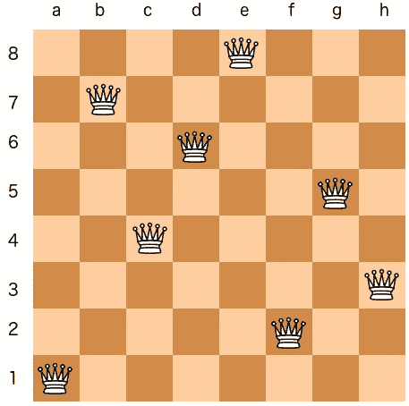

# NuCS：一个用于研究、教学和生产应用的约束求解器

> 原文：[`towardsdatascience.com/nucs-7b260afc2fe4?source=collection_archive---------11-----------------------#2024-11-22`](https://towardsdatascience.com/nucs-7b260afc2fe4?source=collection_archive---------11-----------------------#2024-11-22)


照片来自 [Eric Prouzet](https://unsplash.com/@eprouzet?utm_source=medium&utm_medium=referral) 在 [Unsplash](https://unsplash.com/?utm_source=medium&utm_medium=referral)

## 纯 Python 的极速约束求解

[](https://medium.com/@yangeorget?source=post_page---byline--7b260afc2fe4--------------------------------)[](https://towardsdatascience.com/?source=post_page---byline--7b260afc2fe4--------------------------------) [Yan Georget](https://medium.com/@yangeorget?source=post_page---byline--7b260afc2fe4--------------------------------)

·发表于 [Towards Data Science](https://towardsdatascience.com/?source=post_page---byline--7b260afc2fe4--------------------------------) ·阅读时间 6 分钟·2024 年 11 月 22 日

--

# TLDR

[NuCS](https://github.com/yangeorget/nucs)是一个**Python 库**，用于求解约束满足和优化问题（CSP 和 COP），是我作为副项目开发的。由于它完全用 Python 编写，NuCS 易于安装，并且可以用几行代码建模复杂问题。NuCS 求解器非常快速，因为它得益于[**Numpy**](https://numpy.org/)和[**Numba**](https://numba.pydata.org/)的支持。

许多问题都可以形式化为 CSP（约束满足问题）。这也是为什么像 NuCS 这样的约束库对开发者或数据科学家来说非常有帮助。

让我们考虑著名的 N 皇后问题，其要求在一个*N x N*的棋盘上放置*N*个皇后，使得它们互不威胁。



8 皇后问题的解法。来源：[Yue Guo](http://yue-guo.com/wp-content/uploads/2019/02/N_queen.png)

**14200**个**12 皇后**问题的解法在不到**2 秒**的时间内，在一台运行以下程序的 MacBook Pro M2 上被找到：

+   Python 3.11，

+   Numpy 2.0.1，

+   Numba 0.60.0 和

+   **NuCS 3.0.0.**

```py
(venv) ➜  nucs git:(main) time NUMBA_CACHE_DIR=.numba/cache python -m nucs.examples.queens -n 12 --log_level=ERROR --processors=6
{
    'ALG_BC_NB': 262006,
    'ALG_BC_WITH_SHAVING_NB': 0,
    'ALG_SHAVING_NB': 0,
    'ALG_SHAVING_CHANGE_NB': 0,
    'ALG_SHAVING_NO_CHANGE_NB': 0,
    'PROPAGATOR_ENTAILMENT_NB': 0,
    'PROPAGATOR_FILTER_NB': 2269965,
    'PROPAGATOR_FILTER_NO_CHANGE_NB': 990435,
    'PROPAGATOR_INCONSISTENCY_NB': 116806,
    'SOLVER_BACKTRACK_NB': 131000,
    'SOLVER_CHOICE_NB': 131000,
    'SOLVER_CHOICE_DEPTH': 10,
    'SOLVER_SOLUTION_NB': 14200
}
NUMBA_CACHE_DIR=.numba/cache python -m nucs.examples.queens -n 12    6.65s user 0.53s system 422% cpu 1.699 total
```

# 什么是约束编程？

**约束编程**是一种求解组合优化问题的范式。在约束编程中，用户通过声明约束条件来明确可行解的限制，这些约束指定了解决方案所需的属性。求解器结合约束传播和回溯算法来寻找解决方案。

作为示例，以下是使用 NuCS 的[魔法序列问题](https://www.csplib.org/Problems/prob019)模型（找到一个序列*x_0, … x_n-1*，使得对于每个*i*在*[0, n-1]*中，*x_i*是*i*在序列中出现的次数）：

```py
class MagicSequenceProblem(Problem):
    def __init__(self, n: int):
        super().__init__([(0, n)] * n)
        for i in range(n):
            self.add_propagator((list(range(n)) + [i], ALG_COUNT_EQ, [i]))
        # redundant constraints
        self.add_propagator((list(range(n)), ALG_AFFINE_EQ, [1] * n + [n]))
        self.add_propagator((list(range(n)), ALG_AFFINE_EQ, list(range(n)) + [n]))
```

> 在 NuCS 中，约束被称为传播器。

传播器（这里是*ALG_COUNT_EQ*）简单地表明*x_i*是序列中*i*出现的次数。以下两个*ALG_AFFINE_EQ*传播器是冗余的，这意味着它们对于 NuCS 找到解并不是必需的，但它们加速了求解过程。

查看[文档](https://nucs.readthedocs.io/en/latest/reference.html#propagators)以获取 NuCS 支持的传播器完整列表。请注意，NuCS 中的大多数传播器是**全局**（即*n*元）并实现了**最先进**的传播算法。

# Python

Python 是数据科学家首选的编程语言：它具有简单的语法，日益壮大的社区以及大量的数据科学和机器学习库。

但另一方面，Python 被认为是一种较慢的语言：根据基准测试，它的速度可能比 C 慢 50 到 100 倍。

选择 Python 来开发高性能的约束编程库并非显而易见，但我们将看到，Numpy（高性能计算包）和 Numba（Python 的即时编译）结合使用，极大地提升了性能。

已经有许多尝试在 Python 中编写约束求解器，但这些要么很慢，要么只是**封装器**，并依赖于用 Java 或 C/C++编写的**外部**求解器。

# Numpy

[NumPy](https://numpy.org/)将类似 C 和 Fortran 的语言的计算能力带到了 Python 中。

[](https://numpy.org/?source=post_page-----7b260afc2fe4--------------------------------) [## NumPy

### 强大的 N 维数组 NumPy 的向量化、索引和广播概念使其既快速又多功能…

numpy.org](https://numpy.org/?source=post_page-----7b260afc2fe4--------------------------------)

> 在 NuCS 中，一切都是 Numpy 数组。

这使得可以利用 Numpy 的索引和广播能力，并编写紧凑的传播器，例如*Max_i x_i <= y*

```py
def compute_domains_max_leq(domains: NDArray, parameters: NDArray) -> int:
  x = domains[:-1]
  y = domains[-1]
  if np.max(x[:, MAX]) <= y[MIN]:
      return PROP_ENTAILMENT
  y[MIN] = max(y[MIN], np.max(x[:, MIN]))
  if y[MIN] > y[MAX]:
      return PROP_INCONSISTENCY
  for i in range(len(x)):
      x[i, MAX] = min(x[i, MAX], y[MAX])
      if x[i, MAX] < x[i, MIN]:
          return PROP_INCONSISTENCY
  return PROP_CONSISTENCY
```

# Numba

Numba 是一个开源的**即时编译（Just-In-Time）**编译器，它将 Python 和 NumPy 代码的子集转换为快速的机器码。

[](https://numba.pydata.org/?source=post_page-----7b260afc2fe4--------------------------------) [## Numba：高性能 Python 编译器

### @njit(parallel=True) def simulator(out): # 并行迭代循环 for i in prange(out.shape[0]): out[i] = run_sim()…

numba.pydata.org](https://numba.pydata.org/?source=post_page-----7b260afc2fe4--------------------------------)

在以下示例中，我们找到了**12 皇后问题**的 14200 个解（请注意，我们在这里使用的是单处理器）。

```py
NUMBA_DISABLE_JIT=1 python -m nucs.examples.queens -n 12 --log_level=ERROR   179.89s user 0.31s system 99% cpu 3:00.57 total
```

通过启用即时编译（Just-In-Time compilation），我们实现了**x60**的加速：

```py
NUMBA_CACHE_DIR=.numba/cache python -m nucs.examples.queens -n 12    3.03s user 0.06s system 99% cpu 3.095 total
```

为了让 Numba JIT 编译你的代码，你应该：

+   避免面向对象编程（OOP），

+   使用支持的类型或 Numpy 数组，

+   使用 Python 语言的子集，

+   使用 Numpy 函数的子集。

在 NuCS 中，这些指南已经成功地为以下问题实现：

+   **传播器**（参见[`nucs.readthedocs.io/en/latest/reference.html#propagators`](https://nucs.readthedocs.io/en/latest/reference.html#propagators)了解在 NuCS 中实现的传播器列表），

+   **一致性算法**（参见[`nucs.readthedocs.io/en/latest/reference.html#consistency-algorithms`](https://nucs.readthedocs.io/en/latest/reference.html#consistency-algorithms)了解在 NuCS 中实现的一致性算法列表），

+   **启发式方法**（参见[`nucs.readthedocs.io/en/latest/reference.html#heuristics`](https://nucs.readthedocs.io/en/latest/reference.html#heuristics)了解在 NuCS 中实现的启发式方法列表）。

得益于 Numpy 和 Numba，NuCS 在性能上与用 Java 或 C/C++编写的解算器相当。

> 请注意，由于 Python 代码是编译的且结果被缓存，当你第二次运行程序时，性能将显著提高。

# 示例

NuCS 提供了许多[模型](https://nucs.readthedocs.io/en/latest/reference.html#examples)，用于经典的约束编程问题，如：

+   一些加密算术谜题：**Alpha**，**Donald**，

+   **平衡不完全区组设计**问题，

+   **Golomb 标尺**问题，

+   **背包**问题，

+   **魔术序列**问题，

+   **魔方**问题，

+   **准群**问题，

+   **n 皇后**问题，

+   **舒尔引理**问题，

+   **体育赛事调度**问题，

+   **数独**问题。

其中一些示例需要一些高级技术：

+   冗余约束，

+   自定义启发式方法，

+   自定义一致性算法

大多数这些模型也可以在[CSPLib](https://www.csplib.org/Languages/NuCS/models/)中找到，它是 CSP 相关问题的宝典。

# 统计与日志记录

在搜索解决方案时，NuCS 还会聚合一些[统计数据](https://nucs.readthedocs.io/en/latest/reference.html#statistics)：

```py
{
    'ALG_BC_NB': 262006,
    'ALG_BC_WITH_SHAVING_NB': 0,
    'ALG_SHAVING_NB': 0,
    'ALG_SHAVING_CHANGE_NB': 0,
    'ALG_SHAVING_NO_CHANGE_NB': 0,
    'PROPAGATOR_ENTAILMENT_NB': 0,
    'PROPAGATOR_FILTER_NB': 2269965,
    'PROPAGATOR_FILTER_NO_CHANGE_NB': 990435,
    'PROPAGATOR_INCONSISTENCY_NB': 116806,
    'SOLVER_BACKTRACK_NB': 131000,
    'SOLVER_CHOICE_NB': 131000,
    'SOLVER_CHOICE_DEPTH': 10,
    'SOLVER_SOLUTION_NB': 14200
}
```

在这里我们可以看到：

+   约束一致性计算了 262006 次，

+   2268895 个传播器被应用，但其中 990435 次无效，同时发现不一致 116806 次，

+   共计 131000 次选择和回溯，最大选择深度为 10，

+   最终，找到了 14200 个解。

通过与模型互动并理解它如何影响统计数据，已被证明是一种非常有用的练习，能够最大化利用 NuCS。

NuCS 还提供了一些基本的日志记录功能。

```py
NUMBA_CACHE_DIR=.numba/cache python -m nucs.examples.golomb -n 10 --symmetry_breaking --log_level=INFO
```

```py
2024-11-12 17:27:45,110 - INFO - nucs.solvers.solver - Problem has 82 propagators
2024-11-12 17:27:45,110 - INFO - nucs.solvers.solver - Problem has 45 variables
2024-11-12 17:27:45,110 - INFO - nucs.solvers.backtrack_solver - BacktrackSolver uses variable heuristic 0
2024-11-12 17:27:45,110 - INFO - nucs.solvers.backtrack_solver - BacktrackSolver uses domain heuristic 0
2024-11-12 17:27:45,110 - INFO - nucs.solvers.backtrack_solver - BacktrackSolver uses consistency algorithm 2
2024-11-12 17:27:45,110 - INFO - nucs.solvers.backtrack_solver - Choice points stack has a maximal height of 128
2024-11-12 17:27:45,172 - INFO - nucs.solvers.backtrack_solver - Minimizing variable 8
2024-11-12 17:27:45,644 - INFO - nucs.solvers.backtrack_solver - Found a (new) solution: 80
2024-11-12 17:27:45,677 - INFO - nucs.solvers.backtrack_solver - Found a (new) solution: 75
2024-11-12 17:27:45,677 - INFO - nucs.solvers.backtrack_solver - Found a (new) solution: 73
2024-11-12 17:27:45,678 - INFO - nucs.solvers.backtrack_solver - Found a (new) solution: 72
2024-11-12 17:27:45,679 - INFO - nucs.solvers.backtrack_solver - Found a (new) solution: 70
2024-11-12 17:27:45,682 - INFO - nucs.solvers.backtrack_solver - Found a (new) solution: 68
2024-11-12 17:27:45,687 - INFO - nucs.solvers.backtrack_solver - Found a (new) solution: 66
2024-11-12 17:27:45,693 - INFO - nucs.solvers.backtrack_solver - Found a (new) solution: 62
2024-11-12 17:27:45,717 - INFO - nucs.solvers.backtrack_solver - Found a (new) solution: 60
2024-11-12 17:27:45,977 - INFO - nucs.solvers.backtrack_solver - Found a (new) solution: 55
{
    'ALG_BC_NB': 22652,
    'ALG_BC_WITH_SHAVING_NB': 0,
    'ALG_SHAVING_NB': 0,
    'ALG_SHAVING_CHANGE_NB': 0,
    'ALG_SHAVING_NO_CHANGE_NB': 0,
    'PROPAGATOR_ENTAILMENT_NB': 107911,
    'PROPAGATOR_FILTER_NB': 2813035,
    'PROPAGATOR_FILTER_NO_CHANGE_NB': 1745836,
    'PROPAGATOR_INCONSISTENCY_NB': 11289,
    'SOLVER_BACKTRACK_NB': 11288,
    'SOLVER_CHOICE_NB': 11353,
    'SOLVER_CHOICE_DEPTH': 9,
    'SOLVER_SOLUTION_NB': 10
}
[ 1  6 10 23 26 34 41 53 55]
```

# 定制化

最后，NuCS 是一个非常开放的平台，几乎可以定制任何内容：

+   传播器，

+   一致性算法，

+   启发式方法，

+   解算器。

在以下**Golomb 标尺**示例中，在使用之前注册了一个自定义一致性算法：

```py
 consistency_alg_golomb = register_consistency_algorithm(golomb_consistency_algorithm)
    solver = BacktrackSolver(problem, consistency_alg_idx=consistency_alg_golomb)
```

# 结论

总结来说，NuCS 是一个功能丰富的约束解算器库。尽管它完全用 Python 编写，但性能非常快，可以应用于广泛的领域：研究、教学和生产。

如果你想参与 NuCS 的开发，欢迎随时在 Github 上联系我！

一些有用的链接，供进一步了解：

+   源代码：[`github.com/yangeorget/nucs`](https://github.com/yangeorget/nucs)

+   文档：[`nucs.readthedocs.io/en/latest/index.html`](https://nucs.readthedocs.io/en/latest/index.html)

+   Pip 包：[`pypi.org/project/NUCS/`](https://pypi.org/project/NUCS/)

如果你喜欢这篇关于 NuCS 的文章，请**拍手**50 次！
