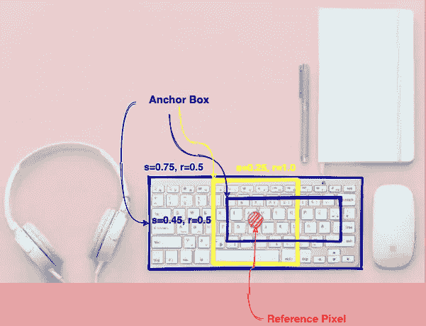
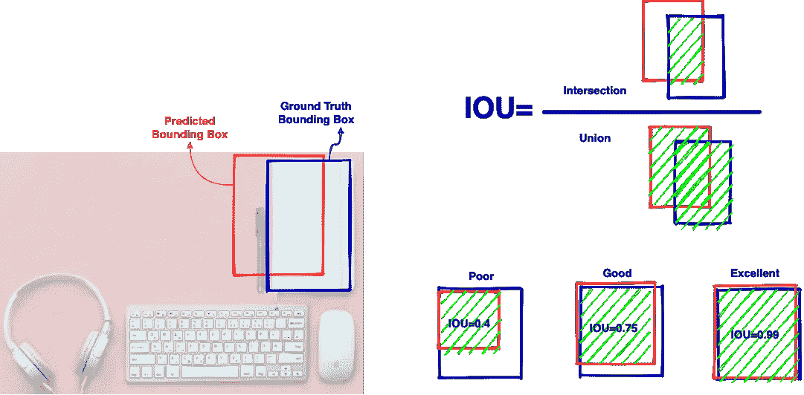
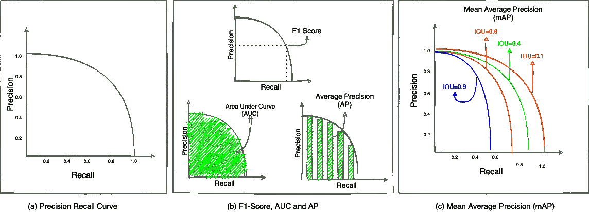
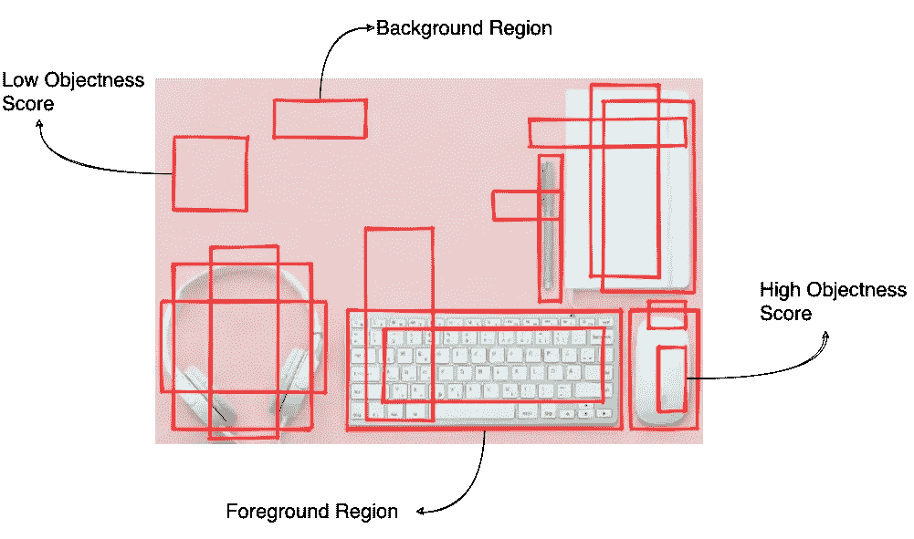
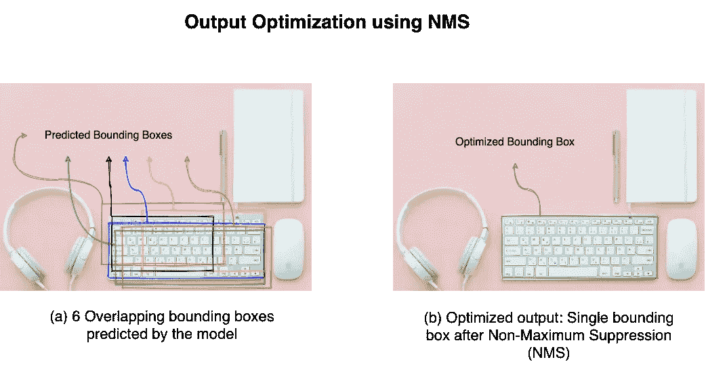

# 物体检测基础 — 综合初学者指南（第一部分）

> 原文：[`towardsdatascience.com/object-detection-basics-a-comprehensive-beginners-guide-part-1-f57380c89b78?source=collection_archive---------6-----------------------#2024-02-05`](https://towardsdatascience.com/object-detection-basics-a-comprehensive-beginners-guide-part-1-f57380c89b78?source=collection_archive---------6-----------------------#2024-02-05)

## 在这篇易于理解的多部分初学者指南中，学习这个高级计算机视觉任务——物体检测的基础知识

 [Raghav Bali](https://medium.com/@Rghv_Bali?source=post_page---byline--f57380c89b78--------------------------------)

·发表于 [Towards Data Science](https://towardsdatascience.com/?source=post_page---byline--f57380c89b78--------------------------------) ·9 分钟阅读 ·2024 年 2 月 5 日

--

图片来自 [Javier García](https://unsplash.com/@javigabbo?utm_source=medium&utm_medium=referral) 由 [Unsplash](https://unsplash.com/?utm_source=medium&utm_medium=referral) 提供

如今，配备最新驾驶辅助技术（如车道检测、盲点监测、交通信号识别等）的汽车已经相当普遍。如果我们稍微退后一步，去了解一下幕后发生了什么，作为数据科学家，我们很快会意识到，系统不仅仅是在*分类*物体，还在实时地*定位*它们。

这些功能是**物体检测**系统实际应用的典型示例。驾驶辅助技术、工业机器人和安全系统都利用物体检测模型来检测感兴趣的物体。**物体检测**是一个高级计算机视觉任务，涉及*物体的定位*和*分类*。

在本文中，我们将深入探讨物体检测任务的细节。我们将学习与之相关的各种概念，以帮助我们理解新颖的架构（将在后续文章中讨论）。我们将涵盖理解物体检测模型所需的关键方面和概念，尤其是从迁移学习的角度。

# 关键概念与构建模块

物体检测包括两个主要子任务，*定位*和*分类*。物体的分类是容易理解的。但是，我们如何定义物体的定位呢？让我们了解一些关键概念：

## 边界框

在目标检测任务中，我们通过一个矩形框来标识给定物体的位置。这个规则的矩形框被称为*边界框*，用于物体的定位。通常，输入图像的左上角被设为原点或(0,0)。一个矩形边界框通过其左上角和右下角的 x 和 y 坐标来定义。让我们通过图像来直观地理解这一点。图 1(a)展示了一个示例图像，其原点设置在左上角。

图 1：（a）包含不同物体的示例图像，（b）每个物体的边界框，标注了左上角和右下角的顶点，（c）识别边界框的另一种方法是使用左上角坐标及其宽度和高度参数。来源：作者

图 1(b)显示了每个已识别物体及其相应的边界框。需要注意的是，边界框通过其左上角和右下角的坐标进行标注，这些坐标是相对于图像原点的。通过 4 个值，我们可以唯一地识别一个边界框。另一种识别边界框的方法是使用左上角坐标以及其宽度和高度值。图 1(c)展示了这种识别边界框的替代方法。不同的解决方案可能使用不同的方法，这通常是基于个人的偏好。

目标检测模型在每个训练样本中需要每个物体的边界框坐标以及类别标签。同样，在推理阶段，目标检测模型会为每个识别出的物体生成*边界框坐标*和*类别标签*。

## 锚框

每个目标检测模型通过扫描大量可能的区域来识别/定位给定图像中的物体。在训练过程中，模型学习确定哪些扫描到的区域是感兴趣的，并调整这些区域的坐标以匹配真实的边界框。不同的模型可能会以不同的方式生成这些感兴趣区域。然而，最流行和广泛使用的方法是基于*锚框*。对于给定图像中的每个像素，都会生成多个不同尺寸和宽高比（宽度与高度的比率）的边界框。这些边界框被称为锚框。图 2 展示了给定图像中特定像素的不同锚框。

图 2：给定图像中特定像素（红色标出）对应的不同锚框。来源：作者

锚框的维度通过两个参数进行控制，*尺度*表示为 s 𝜖 (0,1]，*宽高比*表示为 r >0。正如图 2 所示，对于高度为 h 和宽度为 w 的图像，以及特定的 s 和 r 值，可以生成多个锚框。通常，我们使用以下公式来计算锚框的维度：

> **wₐ=w.s√r**
> 
> **hₐ = h.s / √r**

其中 wₐ 和 hₐ 分别是锚框的宽度和高度。锚框的数量和尺寸要么是预定义的，要么是在训练过程中由模型自行选择的。为了更好地理解，模型在每个像素位置生成多个锚框，并在训练过程中学习调整和匹配这些锚框与真实边界框。

边界框和锚框是理解整个物体检测任务的关键概念。在深入了解这些架构的具体工作方式之前，我们首先要理解评估这些模型性能的方式。以下是一些重要的评估指标：

## 交并比（IOU）

物体检测模型通常会生成一些锚框，然后根据实际边界框进行调整。但我们如何知道何时匹配发生，或者匹配的效果如何呢？

*杰卡德指数* 是一种用于确定两个集合之间相似度的度量。在物体检测中，杰卡德指数也被称为交并比（Intersection Over Union，简称 IOU）。它的计算公式为：

> **IOU = | Bₜ ∩ Bₚ | / | Bₜ ∪ Bₚ |**

其中 Bₜ 是真实边界框，Bₚ 是预测边界框。简单来说，它是一个介于 0 和 1 之间的分数，表示预测边界框和真实边界框之间重叠区域与并集区域的面积比。重叠越多，分数越高。接近 1 的分数表示几乎完美的匹配。图 3 展示了预测边界框与真实边界框在样本图像中的不同重叠情况。

图 3：交并比（IOU）是衡量预测边界框与真实边界框匹配程度的指标。重叠越多，得分越高。来源：作者

根据问题陈述和数据集的复杂性，设置不同的 IOU 阈值来确定哪些预测边界框应被认为是有效的。例如，基于 [MS-COCO](https://arxiv.org/abs/1405.0312v3) 的物体检测挑战使用 0.5 的 IOU 阈值来将预测边界框视为真正的正样本。

## 平均精度均值（MAP）

精度和召回率是常用于理解分类器在机器学习上下文中性能的指标。以下公式定义了这些指标：

> **精度 = TP / (TP + FP)**
> 
> 召回率 = TP / (TP + FN)

其中，*TP、FP 和 FN* 分别代表*真阳性、假阳性*和*假阴性*的结果。精度和召回率通常一起使用来生成精度-召回曲线，以对模型性能进行稳健的量化。这是因为精度和召回率的对立特性，即随着模型的召回率增加，精度开始下降。*PR 曲线*用于计算*F1 分数*、*曲线下面积 (AUC)* 或 *平均精度 (AP)* 指标。平均精度是通过在不同召回阈值下计算精度的平均值来得到的。图 4(a) 显示了一个典型的 PR 曲线，图 4(b) 展示了如何计算 AP。

图 4：a) 一个典型的 PR 曲线展示了模型在不同召回值下的精度。这是一条向下倾斜的图表，因为精度和召回率的度量是相对的；(b) PR 曲线用于计算聚合/综合分数，如 F1 分数、曲线下面积 (AUC) 和平均精度 (AP)；(c) 平均精度均值 (mAP) 是一个稳健的综合指标，用于理解模型在不同阈值下对所有类别的表现。每条彩色曲线表示基于每个类别的特定 IOU 阈值的不同 PR 曲线。来源：作者

图 4(c) 展示了平均精度指标如何扩展到物体检测任务。如图所示，我们在不同的 IOU 阈值下计算 PR 曲线（这是针对每个类别进行的）。然后，我们取所有类别的平均精度值的均值，得到最终的 mAP 指标。这个综合指标是对给定模型在不同类别和阈值下性能的稳健量化。通过将性能缩小到一个可量化的指标，可以轻松地在相同的测试数据集上比较不同模型的表现。

另一个用于评估物体检测模型的指标是**每秒帧数 (FPS)**。该指标表示模型每秒可以分析多少输入图像或帧以检测物体。这是实时应用场景（如安全视频监控、人脸检测等）中一个重要的指标。

通过掌握这些概念，我们现在准备好理解物体检测的一般框架了。

# 物体检测框架

物体检测是一个重要且活跃的研究领域。多年来，已经开发并在实际应用中使用了许多不同但有效的架构。物体检测的任务要求所有这些架构解决一系列子任务。在我们深入了解具体模型如何处理这些任务之前，先来理解一下应对物体检测的一般框架。该框架包括以下步骤：

+   区域建议网络

+   定位和分类预测

+   输出优化

现在让我们详细了解一下这些步骤。

## 区域建议

顾名思义，物体检测框架中的第一步是提出*感兴趣区域（ROI）*。ROI 是输入图像中，模型认为物体存在的可能性较高的区域。物体存在或不存在的可能性通过一个称为物体性得分的分数来定义。那些物体性得分大于某个阈值的区域会传递到下一阶段，而其他区域则被丢弃。

例如，查看图 5，了解模型提出的不同感兴趣区域（ROI）。需要注意的是，在这一阶段会生成大量的 ROI。基于物体性得分阈值，模型会将 ROI 分类为前景或背景，仅将前景区域传递到下一步进行进一步分析。

图 5：区域提议是物体检测框架中的第一步。感兴趣区域以红色矩形框的形式突出显示。模型将图像中可能性较高的区域（高物体性得分）标记为前景区域，其余标记为背景区域。来源：作者

生成感兴趣区域（ROI）有多种不同的方法。早期的模型通常使用选择性搜索及相关算法来生成 ROI，而新型更复杂的模型则利用深度学习模型来完成这一任务。我们将在接下来的文章中讨论具体架构时进一步探讨这些方法。

## 定位与分类预测

物体检测模型与我们通常使用的分类模型有所不同。物体检测模型会为每个前景区域生成两个输出，前景区域来自于上一阶段的结果：

+   **物体类别**：这是典型的分类目标，目的是为每个提议的前景区域分配一个类别标签。通常，会使用预训练的网络从提议区域提取特征，然后利用这些特征来预测类别。像在 ImageNet 或 MS-COCO 上训练的最先进模型，涵盖了大量类别并广泛采用迁移学习。需要注意的是，我们为每个提议区域生成类别标签，而不是像典型的分类任务那样为整个图像生成一个单一标签。

+   **边界框坐标**：边界框定义为一个包含 4 个值的元组，分别表示 x、y、宽度和高度。在这一阶段，模型会为每个提议的前景区域生成一个元组（同时包括物体类别）。

## 输出优化

如前所述，物体检测模型在第一步提出了大量的 ROI（感兴趣区域），然后在第二步进行边界框和类别预测。虽然在第一步中对 ROI 进行了某种程度的过滤（基于物体得分区分前景与背景区域），但在第二步中仍然有大量区域用于预测。为如此大量的提议区域生成预测确保了对图像中各种物体的良好覆盖。然而，也有一些区域对同一物体存在大量重叠。例如，看看图 6(a)中为同一个物体预测的 6 个边界框。这可能会导致难以准确统计输入图像中不同物体的数量。

图 6 (a) 物体检测模型为同一物体生成 6 个重叠较多的边界框。 (b) 使用 NMS 优化后的输出。来源：作者

因此，在这个框架中有第三个步骤，涉及输出的优化。这个优化步骤确保每个输入图像中的每个物体只有一个边界框和类别预测。进行这种优化的方法有多种。目前，最流行的方法被称为**非极大值抑制（NMS）**。顾名思义，NMS 会分析每个物体的所有边界框，找到具有最大概率的那个，并抑制其余的边界框（请参见图 6(b)，展示了应用 NMS 后的优化输出）。

这就结束了对一般物体检测框架的高层次理解。我们讨论了定位和分类图像中物体的三个主要步骤。在接下来的文章中，我们将基于这些理解，探讨具体的实现方法及其关键贡献。
