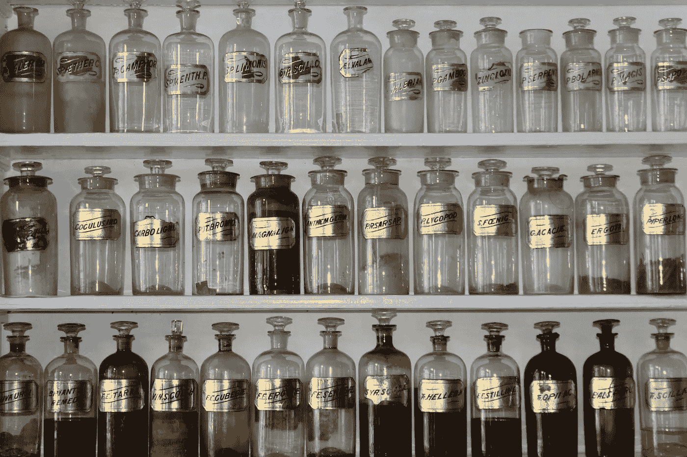

# 目标检测：COCO 和 YOLO 格式，以及它们之间的转换

> 原文：[`towardsdatascience.com/object-detection-coco-and-yolo-formats-and-conversion-between-them-0e0638f4ffc1?source=collection_archive---------4-----------------------#2024-02-11`](https://towardsdatascience.com/object-detection-coco-and-yolo-formats-and-conversion-between-them-0e0638f4ffc1?source=collection_archive---------4-----------------------#2024-02-11)

## 学习 COCO 和 YOLOv5 格式的结构，以及如何将它们相互转换。

 [Javier Martínez Ojeda](https://medium.com/@JavierMtz5?source=post_page---byline--0e0638f4ffc1--------------------------------)

·发表于[Towards Data Science](https://towardsdatascience.com/?source=post_page---byline--0e0638f4ffc1--------------------------------) ·阅读时间：7 分钟·2024 年 2 月 11 日

--

图片由[Matt Briney](https://unsplash.com/@mbriney?utm_source=medium&utm_medium=referral)提供，来源于[Unsplash](https://unsplash.com/?utm_source=medium&utm_medium=referral)

> 如果你想在没有 Premium Medium 账号的情况下阅读这篇文章，可以通过以下好友链接访问 :)
> 
> [`www.learnml.wiki/object-detection-coco-and-yolo-formats-and-conversion-between-them/`](https://www.learnml.wiki/object-detection-coco-and-yolo-formats-and-conversion-between-them/)

# 引言

用于训练目标检测模型的图像标注可以有不同的格式，即使它们包含相同的信息。在现有的不同格式中，有两个非常常用的格式是 COCO JSON 格式和 YOLOv5 PyTorch TXT 格式。前者因微软于 2015 年发布的 MS COCO 数据集**[1]**而闻名，该数据集是最广泛用于目标检测、分割和图像标注任务的之一。另一方面，YOLOv5 PyTorch TXT 格式的流行则是因为由 Ultralytics 开发的 YOLOv8 架构（目标检测的最先进模型）**[2]**将其作为输入格式。

本文首先将介绍这两种格式流行的基础，正如上文所述，它们分别是 MS COCO 数据集和 Ultralytics 的 YOLOv8 架构。
