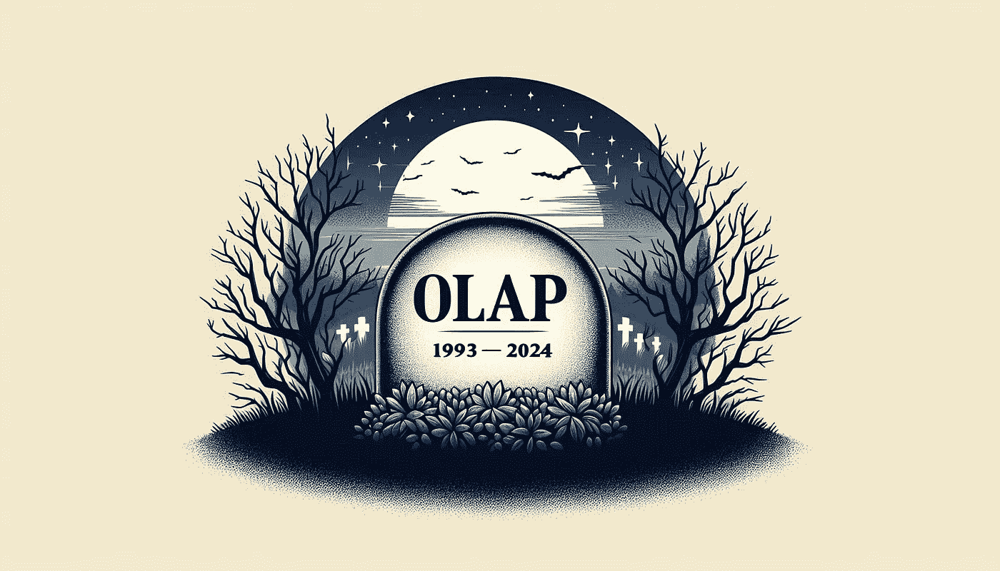

# OLAP 已死——还是它并未死？

> 原文：[`towardsdatascience.com/olap-is-dead-or-is-it-e1267d955358?source=collection_archive---------3-----------------------#2024-10-21`](https://towardsdatascience.com/olap-is-dead-or-is-it-e1267d955358?source=collection_archive---------3-----------------------#2024-10-21)

## OLAP 在现代分析时代的命运

[](https://medium.com/@marc.polizzi?source=post_page---byline--e1267d955358--------------------------------)[](https://towardsdatascience.com/?source=post_page---byline--e1267d955358--------------------------------) [Marc Polizzi](https://medium.com/@marc.polizzi?source=post_page---byline--e1267d955358--------------------------------)

·发表于 [Towards Data Science](https://towardsdatascience.com/?source=post_page---byline--e1267d955358--------------------------------) ·13 分钟阅读·2024 年 10 月 21 日

--

1993 年，E.F. Codd 及其团队提出了 OLAP（在线分析处理）这一术语，用于描述从不同角度回答多维分析查询的技术。OLAP 主要包括三个关键操作：

+   汇总：在更高层次的聚合中总结数据，

+   下钻：导航至更详细的数据层级，

+   切片与切块：从不同的视角选择和分析数据。

现在浏览网络，似乎每个数据分析问题都与流行的自助式 BI 相关，关注使用强化 AI 分析大数据的平台。像 LinkedIn 和 Reddit 这样的平台上充斥着关于过时 OLAP 的缺点的无尽讨论，相较于最新的数据分析趋势，OLAP 显得不合时宜。所以是的，我们可以自信地宣布：OLAP 已死。但等等……它真的死了吗？



RIP OLAP（作者提供的图片—AI 生成）

**我是谁，为什么写这篇文章？**

在我们深入讨论这个有争议的话题之前，先让我介绍一下自己，并解释为什么我要用这篇文章打扰你们。我在 [icCube](https://www.iccube.com/about) 工作，在那里，我解决客户的技术难题。有时，销售团队会邀请我参加潜在客户的演示，而几乎每次，关于数据可扩展性的核心问题都会被提出来——如何处理客户（即将成为的）大数据。作为一个技术性和务实的人，我的天真、非销售性的回答通常是：

> 我们是否可以先定义一下实际问题，看看我们是否真的需要讨论大数据？

哎呀 ;-) 我早就说过，我骨子里是个技术宅。所以，在这篇文章中，我想澄清一下 OLAP 在 2024 年的含义，以及它能解决的挑战。我将从我在 icCube 的经验出发，所以我可能有些偏见，但我会尽力保持客观。欢迎在评论中分享你的想法。

# OLAP != OLAP Cube

OLAP 通常（如果不是总是）与 OLAP Cube 互换使用——即一个在多维空间中预聚合值的物化结构。基于这个错误的定义，很容易理解为什么人们会说 OLAP 已过时，因为技术的进步已经减少了对预聚合的需求。

然而，OLAP 并不等同于 OLAP Cube。如果要从关于 OLAP 的各种定义和讨论中突出一件事，那就是 OLAP 包含了一套高效分析多维数据的概念和方法。

Chris Webb 在一篇文章中很好的捕捉了这一点，回顾了过去的日子：

> 我所说的“OLAP”是指一个集中的模型，不仅包含所有数据，还包括表如何连接、度量如何聚合、复杂计算和关键绩效指标（KPIs）等内容。

在他的文章“[OLAP 已死了吗](https://blog.crossjoin.co.uk/2015/11/18/webinar-recording-is-olap-dead/)”中，Chris Webb 还提到了[**FASMI 测试**](https://web.archive.org/web/20100106080548/http://www.olapreport.com/FASMI.HTM)，作为用五个关键词来评定 OLAP 系统的一种方式：“快速共享多维信息分析”（Fast Analysis of Shared Multidimensional Information）。

```py
FAST              : means that the system is targeted to deliver most
                    responses to users within about five seconds, with the
                    simplest analyses taking no more than one second and
                    very few taking more than 20 seconds.

ANALYSIS          : means that the system can cope with any business logic 
                    and statistical analysis that is relevant for the
                    application and the user, and keep it easy enough for
                    the target user.

SHARED            : means that the system implements all the security
                    requirements for confidentiality (possibly down to cell
                    level).

MULTIDIMENSIONAL  : is our key requirement. If we had to pick a one-word
                    definition of OLAP, this is it. The system must provide
                    a multidimensional conceptual view of the data,
                    including full support for hierarchies and multiple
                    hierarchies, as this is certainly the most logical way
                    to analyze businesses and organizations.

INFORMATION       : is all of the data and derived information needed,
                    wherever it is and however much is relevant for the
                    application.
```

我觉得很有趣的是意识到这个定义最早出现在 2005 年的一篇副标题为：

> 对经常被误用的 OLAP 术语的分析。

所以，很明显，这种混淆并不是新鲜事，我们的营销和销售同事也对此做出了贡献。请注意，这个定义并未指定 OLAP 系统应如何实现。OLAP Cube 只是实现 OLAP 解决方案的一种可能技术。

根据我的数据领域经验，多维（MULTIDIMENSIONAL）和共享（SHARED）是关键要求。我会把“共享”（SHARED）替换为“安全”（SECURED），并且让“下到单元格级别”（down to cell level）成为必选项——一个带有安全约束的复杂多维数据模型不可避免地意味着最终会有一个复杂的安全配置文件。请注意，FASMI 测试并没有规定分析数据的绝对大小。

在深入探讨五个关键术语并展示它们如何应用于现代工具之前，让我们首先挑战一些广泛认同的观念。

# 数据分析 != 大数据分析

不可避免地，大数据的论点被用来主张 OLAP 已死。

我完全不同意这一说法。然而，让我们看看 Jordan Tigani 在他 2023 年初发布的文章“[大数据已死](https://motherduck.com/blog/big-data-is-dead/)”中是如何开头的：

> 当然，在“大数据”工作组购买了所有新工具并完成从旧系统的迁移后，人们发现他们仍然很难理解数据的含义。如果他们真心关注的话，可能已经注意到，数据的规模其实根本不是问题所在。

这是一个非常引人入胜且富有启发性的帖子，超越了市场营销的炒作。我觉得我没有必要在这里重复我在工作中以更小的规模所经历的事情。他的结论是：

> 大数据是真实存在的，但大多数人可能不需要为此担忧。你可以通过以下一些问题来判断自己是否是“大数据中的佼佼者”：
> 
> - 你真的在生成大量的数据吗？
> 
> - 如果是这样，你真的需要一次性使用大量的数据吗？
> 
> - 如果是这样，数据真的太大，无法放入一台机器吗？
> 
> - 如果是这样，你确定你不是一个数据囤积者吗？
> 
> - 如果是这样，你确定总结数据会更好些吗？
> 
> 如果你对这些问题的回答是否定的，你可能是新一代数据工具的理想候选者，这些工具帮助你处理实际拥有的数据规模，而不是那些让你担心将来可能拥有的大规模数据。

到目前为止我没有什么可补充的。本文后续部分，我们将探讨现代 OLAP 工具如何帮助你管理你正在处理的数据规模。

# 数据分析 != 自助式 BI

不可避免地，自助式 BI 是另一个用来主张 OLAP 已死的论点。

商务用户可以自主访问和处理原始企业数据，无需依赖数据专业人员的支持。这种方法使用户能够使用易于操作的工具和界面，进行分析、生成报告并创建仪表盘。

如果我们承认所需的分析对于任何商务人士来说足够简单，或者工具足够先进，可以处理更复杂的分析和安全配置，那么潜在的前提是数据已经清理干净，准备好用于商业决策。

在 icCube 中，在客户项目的启用阶段，80% 的时间都花在清理和理解实际数据及其背后的商业模型上。令人惊讶的是，这一时间的相当大一部分也花在与少数同时了解技术和业务的人员沟通上。这并不奇怪，因为数据模型通常会在多年内演变，变得越来越复杂，而人们也会来来去去。

但假设原始数据是干净的，并且商务用户完全理解它。那么当成百上千个报告被创建出来时（很可能是访问 OLTP 数据库，因为在创建分析数据仓库时没有 IT 部门的参与），会发生什么呢？它们彼此一致吗？它们遵循相同的业务规则吗？它们的计算是正确的吗？它们会引起性能问题吗？

假设一切正常，那么你如何维护这些报告？更重要的是，如何管理底层原始数据中的任何必要更改，因为没有简单的方法知道数据是在哪里使用的？

所以，类似于大数据的论点，我不认为自助 BI 是解决每个现代分析挑战的真正方案。事实上，从长远来看，它可能会带来更多问题。

# 数据分析 != 生成式 AI 数据分析

最后是 AI 的论点。你不再需要 OLAP 引擎，顺便提一下，你也不再需要任何分析工具。AI 来了，统治一切！我有点夸张，但考虑到目前围绕 AI 的所有炒作，我并没有太远离现实 ;-)

更严肃地说，在 icCube，即使我们目前对于使用 AI 生成 MDX 代码或分析数据持怀疑态度，这并不意味着我们反对 AI。恰恰相反，事实上。我们最近推出了一个聊天机器人小工具，帮助终端用户理解他们的数据。我们正在积极研究如何利用 AI 提高客户的生产力。我们面临的实际问题主要是：

+   它的准确性不足以交给无法分辨幻觉的终端用户。

+   对于那些在领域内是专家且能够理解并修正幻觉的终端用户，提供这些功能就是过度设计了。

+   每个查询的成本（即 LLM 推理成本）。

但不要只听我说 — 我想强调一下 Marco Russo 的实践和类似的观点。你可以通过[这里](https://www.youtube.com/watch?v=i8DrFmsddgc)查看他的视频。如果时间紧迫，可以跳到 32 分钟的位置，那里 Marco 分享了他对于使用 ChatGPT 生成 DAX 代码的看法。

目前，生成式 AI 还无法取代任何 OLAP 系统，当然也不能作为 OLAP 已死的论据。

现在，让我们回到 FASMI 测试，看看定义 OLAP 系统的五个关键术语。

# FASMI 测试：快速

```py
means that the system is targeted to deliver most responses to users
within about five seconds, with the simplest analyses taking no more than
one second and very few taking more than 20 seconds.
```

提供快速响应时间的分析查询不再是 OLAP 系统的专利。然而，它仍然是 OLAP 系统的一项附加优势，因为 OLAP 系统专门为此类查询量身定制。一个显著的优势是，它有助于避免对 OLTP 数据库（或任何实际数据源）的过载，因为：

+   可能已经创建了一个专用的数据仓库。

+   它可能作为实际数据源前的缓存。

这个中间层的另一个好处是，它可以帮助降低访问底层原始数据的成本。

# FASMI 测试：分析

```py
means that the system can cope with any business logic and statistical
analysis that is relevant for the application and the user, and keep it
easy enough for the target user.
```

OLAP 系统旨在执行复杂的分析查询，因此提供了一系列通常在其他系统中无法直接获得的功能。这些功能包括：

+   切片和切块功能：允许用户从不同的视角和维度探索数据。

+   自然导航：支持通过父/子层次结构在多维模型中直观导航。

+   聚合度量：支持各种聚合，如求和、最小值、最大值、开盘值、闭盘值等。

为了支持所有这些功能，需要一种专门的查询语言。MDX（多维表达式）是多维分析的事实标准。

我们经常与客户使用的一些高级功能，可能是非标准的，包含：

+   时间周期比较：便于进行基于时间的分析，如同比分析。

+   计算度量：支持在设计或运行时创建临时计算。

+   计算成员：类似于计算度量，但可以应用于任何维度。例如，它们可以用于创建辅助维度，成员基于当前评估上下文进行统计。

+   高级数学运算：提供向量和其他结构，优雅地执行复杂的数学计算（统计、回归等）。

+   MDX 扩展：函数、Java 代码嵌入、结果后处理等。

# FASMI 测试：共享

```py
means that the system implements all the security requirements for
confidentiality (possibly down to cell level).
```

根据我的经验，我认为这是继多维模型之后的第二个最重要的需求。在每个需要安全性的客户模型中，定义适当的授权成为一个重大挑战。

我建议通过将单元格级别粒度设为强制要求来改进 FASMI 测试。

微软分析服务、icCube，以及其他平台可能允许在多维模型中直接定义安全性，使用 MDX 语言（将在下一点介绍）。这种方法非常自然，通常与公司层级安全结构自然对接。

在多维模型层级定义安全性尤为重要，尤其当模型是由多个数据源构建时。例如，在没有此功能的情况下，应用企业安全策略到来自 IoT 传感器等来源的数据可能会非常复杂。

自从 FASMI 测试推出以来，将分析功能嵌入应用程序已经成为一个关键需求。许多 OLAP 系统，包括微软分析服务和 icCube，现在支持在运行时动态创建安全配置文件 —— 一旦用户身份验证通过 —— 基于不同的用户属性。一旦定义了此安全模板，它将在每次用户登录系统时动态应用。

# FASMI 测试：多维

```py
is our key requirement. If we had to pick a one-word definition of OLAP,
this is it. The system must provide a multidimensional conceptual view of
the data, including full support for hierarchies and multiple
hierarchies, as this is certainly the most logical way to analyze
businesses and organizations.
```

我完全同意。多维模型对数据分析至关重要，因为它提供了一种结构化的方法，可以从多个角度分析复杂数据（数据并非孤立存在），并且通常与企业层级安全框架对接。

**对业务用户直观易懂**

该模型反映了企业自然思考数据的方式——无论是产品、客户还是时间段。对于非技术用户来说，这种方式更为直观，允许他们在不需要理解复杂 SQL 查询的情况下探索数据。诸如父子层级和多对多关系等关键特性也被无缝集成。

**增强的数据聚合与汇总**

该模型旨在处理跨维度的聚合（如求和、平均、计数），这对于在不同层级汇总数据至关重要。它非常适合创建仪表板，展示高层次的概览，并能够根据需要深入探讨更详细的见解。

**促进时间序列分析**

时间是许多数据分析类型中的关键维度，例如跟踪趋势、预测和衡量一段时间内的表现。多维模型可以轻松地将时间作为一个维度进行集成，从而实现时间序列分析，如同比（年对年或月对月）的比较。

**现实世界中的数据复杂性**

尽管无代码数据工具的兴起，现实世界中的数据项目很少是简单的。数据源往往杂乱无章，随着时间的推移不断演变，带有不一致性，增加了复杂性。使用传统 SQL 方法访问原始数据可能会遇到挑战。考虑到熟练人才的短缺，首先建立一个清晰的语义层是明智之举，以确保数据的正确使用，并为未来的数据驱动决策提供良好的基础。

**分析中的信任与可靠性**

一个定义良好的多维模型（或语义层）的一个主要优势是，它能够建立客户对分析结果的信任。这个强大的模型允许有效的测试，使得在当今快速变化的环境中能够灵活应对。

**感知的灵活性不足**

OLAP 中的语义层在数据访问之前是一个至关重要的步骤，尽管它最初看起来可能限制了灵活性，但它确保从一开始就正确地建模数据，从而简化了未来的报告。在许多情况下，这种“灵活性不足”更多的是一种感知，而非现实。现代 OLAP 工具，如 icCube，不依赖于过时且繁琐的流程来创建 OLAP 数据立方体，甚至支持增量更新。例如，icCube 的类别功能允许在运行时创建新的维度。

总结来说，尽管与直接访问原始数据相比，OLAP 和维度模型在灵活性上可能给人一种印象，但它们在处理复杂业务逻辑和安全性方面依然提供了至关重要的优势。

# FASMI 测试：信息

```py
is all of the data and derived information needed, wherever it is and
however much is relevant for the application.
```

从各种来源提取数据——无论是 SQL、NoSQL、物联网、文件还是 SaaS 平台——已经不再是 OLAP 系统的专属功能。然而，OLAP 系统仍然具有一个关键优势：它们专门设计用于创建一个安全的多维模型，作为您的分析需求的事实语义层。

# FASMI 测试：2024 年依然相关吗？

FASMI 测试的原始定义旨在为在线分析处理（OLAP）系统提供清晰而易于记忆的描述：共享多维信息的快速分析。我相信这个定义依然相关，而且比以往任何时候都更加必要。在 2024 年，人们不应该再将 OLAP 与其过去的某个实现——过时的 OLAP 立方体混淆。

# 你在 2024 年需要 OLAP 吗？

作为一个务实的人，在不了解你当前的数据分析挑战之前，我不会建议使用特定的工具。我建议仔细识别你的当前需求，然后寻找合适的工具。最重要的是，如果你对当前的分析平台感到满意，不要仅仅为了使用最新的流行工具而更换它。

然而，如果你是：

+   在查询复杂的多维商业模型时感到困难，

+   在应用必须与公司层级安全模型对齐的复杂安全性时遇到困难，

+   在编写复杂的计算以进行高级分析时遇到困难，

+   为了管理数百个或数千个截然不同的查询/仪表板而感到困难，

+   在不到一秒钟的时间内打开仪表板时感到困难，

+   在从不同系统中获取和合并数据时遇到困难，

+   在信任你的分析洞察时感到困难，

那么值得考虑现代的 OLAP 系统。请放心，它们并没有过时，而且还会持续一段时间。现代 OLAP 工具正在积极开发，并在 2024 年保持相关性。此外，它们受益于最新的技术进展：

+   大数据技术，

+   自助服务功能，

+   生成性 AI，

实现新功能或完善现有功能以提高最终用户的生产力。这将是未来一篇文章的主题。敬请期待！

有兴趣的读者可以在此维基百科[页面](https://en.wikipedia.org/wiki/Comparison_of_OLAP_servers)上探索可用的 OLAP 服务器。
