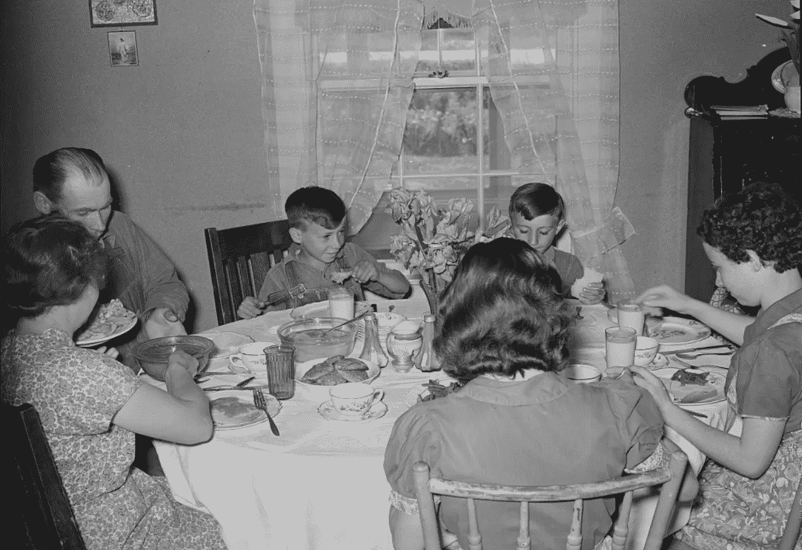

# 忽略变量偏差

> 原文：[`towardsdatascience.com/omitted-variable-bias-7a23405b6c32?source=collection_archive---------5-----------------------#2024-08-06`](https://towardsdatascience.com/omitted-variable-bias-7a23405b6c32?source=collection_archive---------5-----------------------#2024-08-06)

Rothstein, A.，摄影师。（1939）农场家庭共进晚餐。蒙大拿州费尔菲尔德农场，蒙大拿州费尔菲尔德农场美国大提顿县，1939 年 5 月。[照片] 来源于国会图书馆，[`www.loc.gov/item/2017777606/.`](https://www.loc.gov/item/2017777606/.)

## 介绍一种特别狡猾的偏差，这种偏差常常侵入许多回归模型中

 [Sachin Date](https://timeseriesreasoning.medium.com/?source=post_page---byline--7a23405b6c32--------------------------------)

·发布于[Towards Data Science](https://towardsdatascience.com/?source=post_page---byline--7a23405b6c32--------------------------------) ·20 分钟阅读·2024 年 8 月 6 日

--

从 2000 年到 2013 年，涌现出大量研究，显示青少年冒险行为的发生率与他们与家人一起用餐的频率之间有着显著的相关性。

一项又一项的研究似乎都得出了相同的结论：

青少年每周与家人一起用餐的次数越多，他们沉溺于物质滥用、暴力、犯罪、破坏公物以及许多其他问题行为的概率就越低。

家庭用餐频率更高也与减少压力、减少儿童抑郁症发生率以及减少自杀念头的频率相关。一起用餐还与自尊心的提高和青少年情感健康的普遍提升相关。

很快，媒体捕捉到了这些研究结果，并将其包装成易于理解的简短信息，像这样：

> “研究表明，家庭一起吃饭的频率越高，孩子们吸烟、饮酒、吸毒、抑郁、患上饮食障碍以及考虑自杀的可能性就越小，他们更有可能做......
