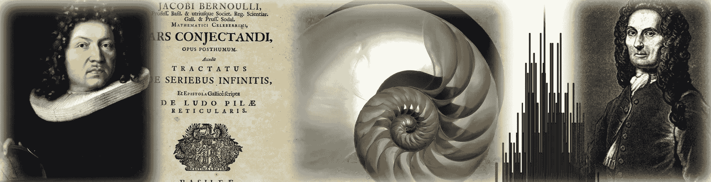

# 关于雅各布·伯努利、大数法则以及中心极限定理的起源

> 原文：[`towardsdatascience.com/on-jacob-bernoulli-the-law-of-large-numbers-and-the-origins-of-the-central-limit-theorem-8101bc6104e1?source=collection_archive---------6-----------------------#2024-01-23`](https://towardsdatascience.com/on-jacob-bernoulli-the-law-of-large-numbers-and-the-origins-of-the-central-limit-theorem-8101bc6104e1?source=collection_archive---------6-----------------------#2024-01-23)

[公有领域](https://commons.wikimedia.org/wiki/File:Jakob_Bernoulli.jpg)/[公有领域](https://picryl.com/media/bernoulli-ars-conjectandi-1713-058b-fba7d8)/[CC BY-SA 3.0](https://commons.wikimedia.org/wiki/File:NautilusCutawayLogarithmicSpiral_flip.jpg)/作者图片/[公有领域](https://commons.wikimedia.org/wiki/File:Abraham_de_moivre.jpg)

## 通过历史的长镜头探索大数法则弱法则和中心极限定理

 [Sachin Date](https://timeseriesreasoning.medium.com/?source=post_page---byline--8101bc6104e1--------------------------------)

·发表于[Towards Data Science](https://towardsdatascience.com/?source=post_page---byline--8101bc6104e1--------------------------------) ·阅读时长 16 分钟·2024 年 1 月 23 日

--

在我[之前的文章](https://medium.com/towards-data-science/a-new-look-at-the-central-limit-theorem-d80735682f90)中，我向大家介绍了中心极限定理。我们解构了它的定义，探讨了它的应用，并在模拟中看到了它的神奇效果。

我在那篇文章的结尾提到了一个哲学性问题，这个问题由 17 世纪著名数学家提出，关于**当自然界面对大量物体时，如何表现**。这个问题最终引导我们发现了**中心极限定理**，并且是在一个多世纪后才被发现的。

在本文中，我将深入探讨这个问题，以及思考过这个问题的数学家的生平，并且揭示从中展开的重大发现。

# 大数法则弱法则的发现

一切始于**雅各布·伯努利**。大约在 1687 年，来自今天瑞士巴塞尔的伯努利家族的大儿子，年仅 32 岁的他，开始致力于他的大作《*猜想的艺术*》（*Ars Conjectandi*）的第四部分，也是最后一部分。在第四部分中，伯努利专注于概率及其在…
