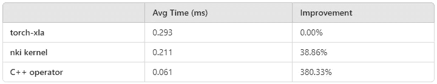
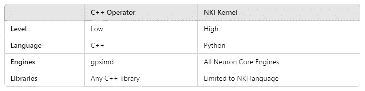

# 关于 AWS Trainium 和 Inferentia 的可编程性

> 原文：[`towardsdatascience.com/on-the-programmability-of-aws-trainium-and-inferentia-cd455826e26c?source=collection_archive---------7-----------------------#2024-11-01`](https://towardsdatascience.com/on-the-programmability-of-aws-trainium-and-inferentia-cd455826e26c?source=collection_archive---------7-----------------------#2024-11-01)

## 加速 AI/ML 模型训练与自定义运算符 — 第四部分

[](https://chaimrand.medium.com/?source=post_page---byline--cd455826e26c--------------------------------)[](https://towardsdatascience.com/?source=post_page---byline--cd455826e26c--------------------------------) [Chaim Rand](https://chaimrand.medium.com/?source=post_page---byline--cd455826e26c--------------------------------)

·发表于 [Towards Data Science](https://towardsdatascience.com/?source=post_page---byline--cd455826e26c--------------------------------) ·阅读时间：12 分钟·2024 年 11 月 1 日

--


图片由 [Agata Bres](https://unsplash.com/@bresia?utm_source=medium&utm_medium=referral) 提供，来源于 [Unsplash](https://unsplash.com/?utm_source=medium&utm_medium=referral)

在本文中，我们继续探索通过自定义运算符开发来优化机器学习（ML）工作负载运行时性能的机会。这次，我们重点介绍 [AWS Neuron SDK](https://awsdocs-neuron.readthedocs-hosted.com/en/latest/index.html) 提供的工具，用于在 [AWS Trainium](https://aws.amazon.com/machine-learning/trainium/) 和 [AWS Inferentia](https://aws.amazon.com/machine-learning/inferentia/) 上开发和运行新内核。随着推动 AI 革新的低层次模型组件（例如，[注意力层](https://en.wikipedia.org/wiki/Attention_(machine_learning)))的快速发展，用于训练和运行 ML 模型的加速器的可编程性变得至关重要。特别是专用 AI 芯片，必须提供一种有价值的替代方案，以应对广泛使用且具有深远影响的通用 GPU（GPGPU）开发框架，如 [CUDA](https://developer.nvidia.com/cuda-toolkit) 和 [Triton](https://triton-lang.org/main/index.html)。

在之前的文章中（例如，这里和这里），我们探讨了在 AWS 定制的 AI 芯片上构建和运行 ML 模型的机会，使用的是专用的[AWS Neuron SDK](https://awsdocs-neuron.readthedocs-hosted.com/en/latest/)。在 SDK 的最新版本（[2.20.0](https://awsdocs-neuron.readthedocs-hosted.com/en/latest/release-notes/index.html#id8)）中，AWS 引入了用于开发自定义内核的[Neuron 内核接口（NKI）](https://awsdocs-neuron.readthedocs-hosted.com/en/latest/general/nki/index.html)，该内核支持底层加速器[NeuronCore-v2](https://awsdocs-neuron.readthedocs-hosted.com/en/latest/general/arch/neuron-hardware/neuron-core-v2.html)，这一加速器为[Trainium](https://aws.amazon.com/machine-learning/trainium/)和[Inferentia2](https://aws.amazon.com/machine-learning/inferentia/)提供动力。NKI 接口与另一个 API 配合使用，该 API 使[NeuronCore-v2](https://awsdocs-neuron.readthedocs-hosted.com/en/latest/general/arch/neuron-hardware/neuron-core-v2.html)能够进行编程，即[Neuron 自定义 C++操作符](https://awsdocs-neuron.readthedocs-hosted.com/en/latest/neuron-customops/index.html)。在本文中，我们将探讨这两种机会并展示其应用。

## 免责声明

重要的是，本篇文章不应被视为官方[AWS Neuron SDK 文档](https://awsdocs-neuron.readthedocs-hosted.com/en/latest/index.html)的替代。在撰写本文时，Neuron SDK 的自定义内核开发 API 仍处于 Beta 阶段，在你阅读本文时可能会发生变化。我们分享的示例仅供演示用途，不能保证其最优性、鲁棒性、耐用性或准确性。请不要将我们提到的任何平台、工具、API 等视为对其使用的支持。任何项目的最佳选择取决于具体的使用案例，需进行适当的调查和分析。

# 为神经核心开发自定义内核

尽管 Neuron SDK 支持的 ML 模型列表不断增长，但一些操作仍然不受支持或实现不尽如人意。通过开放 Neuron 内核自定义 API，SDK 使开发者能够创建和/或优化他们所需的底层操作，极大地增加了在 Trainium 和 Inferentia 上运行 ML 工作负载的机会。

如我们在本系列的上一篇文章中讨论的，要充分利用这些 AI 芯片的强大性能，需要详细了解其底层架构。

## 神经核心架构

NKI 文档包含了一个[专门的章节](https://awsdocs-neuron.readthedocs-hosted.com/en/latest/general/nki/trainium_inferentia2_arch.html#)介绍 NeuronCore-v2 的架构设计及其对自定义操作符开发的影响。重要的是，Neuron 核心与其 AI 加速器对等体（例如 GPU 和 TPU）之间有许多差异。针对 Neuron 核心的优化需要一套独特的策略和技能。

与其他专用 AI 芯片类似，NeuronCore-v2 包括多个内部[加速引擎](https://awsdocs-neuron.readthedocs-hosted.com/en/latest/general/nki/trainium_inferentia2_arch.html#neuroncore-v2-compute-engines)，每个引擎专门执行某些类型的计算。各引擎可以异步并行运行。[Neuron 编译器](https://awsdocs-neuron.readthedocs-hosted.com/en/latest/compiler/index.html)负责将机器学习模型转化为低级操作，并优化每个操作所使用的计算引擎。

[**Tensor 引擎**](https://awsdocs-neuron.readthedocs-hosted.com/en/latest/general/nki/trainium_inferentia2_arch.html#tensor-engine)专门用于矩阵乘法。[**Vector 引擎**](https://awsdocs-neuron.readthedocs-hosted.com/en/latest/general/nki/trainium_inferentia2_arch.html#vector-engine)和[**Scalar 引擎**](https://awsdocs-neuron.readthedocs-hosted.com/en/latest/general/nki/trainium_inferentia2_arch.html#scalar-engine)都操作张量，其中 Vector 引擎专注于归约操作，Scalar 引擎则专注于非线性函数。[**GpSimd 引擎**](https://awsdocs-neuron.readthedocs-hosted.com/en/latest/general/nki/trainium_inferentia2_arch.html#gpsimd-engine)是一个通用引擎，能够运行任意 C/C++程序。请注意，尽管[NKI](https://awsdocs-neuron.readthedocs-hosted.com/en/latest/general/nki/index.html)接口暴露了对所有四个计算引擎的访问，[自定义 C++操作符](https://awsdocs-neuron.readthedocs-hosted.com/en/latest/neuron-customops/index.html)是专门为[GpSimd](https://awsdocs-neuron.readthedocs-hosted.com/en/latest/general/nki/trainium_inferentia2_arch.html#gpsimd-engine)引擎设计的。

每个引擎的能力的更多细节可以在架构文档中找到。此外，[NKI 指令集架构（ISA）](https://awsdocs-neuron.readthedocs-hosted.com/en/latest/general/nki/api/nki.isa.html)文档提供了不同低级操作所运行的引擎的详细信息。

Neuron 芯片的另一个重要方面是其[内存架构](https://awsdocs-neuron.readthedocs-hosted.com/en/latest/general/nki/trainium_inferentia2_arch.html#data-movement)。一个 Neuron 设备包括三种类型的内存，HBM、SBUF 和 PSUM。深入了解每种内存的容量和功能对优化内核开发至关重要。

根据架构概述，你可能会得出结论，Neuron 内核开发需要高度专业的知识。虽然这对于创建充分优化、充分利用 Neuron 核心所有功能的内核来说是正确的，但我们的目标是展示 Neuron 自定义内核 API 的可访问性、价值和潜力——即使对于非专家开发者也是如此。

# 自定义 NKI 内核

[NKI](https://awsdocs-neuron.readthedocs-hosted.com/en/latest/general/nki/index.html)接口是一个 Python 级 API，它向 ML 开发者公开了 Neuron 核心计算引擎和内存资源的使用。 [NKI 入门指南](https://awsdocs-neuron.readthedocs-hosted.com/en/latest/general/nki/getting_started.html)详细介绍了设置说明，并通过一个简单的“hello world”内核提供了一个平稳的入门体验。[NKI 编程模型](https://awsdocs-neuron.readthedocs-hosted.com/en/latest/general/nki/programming_model.html)指南详细说明了典型 NKI 内核的三个阶段（加载输入、在计算引擎上运行操作和存储输出），并介绍了 NKI Tile 和[基于 Tile 的操作](https://awsdocs-neuron.readthedocs-hosted.com/en/latest/general/nki/programming_model.html#nki-pm-tile)。[NKI 教程](https://awsdocs-neuron.readthedocs-hosted.com/en/latest/general/nki/tutorials.html)展示了多种 NKI 内核示例应用程序，每个示例都引入了新的核心 NKI API 和功能。考虑到这些示例内核的假定最优性，开发新内核的一种可能策略是：1) 确定一个与你想要实现的操作相似的示例，2) 然后将其作为基准，迭代优化并调整，以实现你所需的特定功能。

[NKI API 参考手册](https://awsdocs-neuron.readthedocs-hosted.com/en/latest/general/nki/api/index.html#nki-api-reference)详细介绍了用于内核开发的 Python API。其语法和语义与[Triton](https://triton-lang.org/main/index.html)和[NumPy](https://numpy.org/doc/stable/)类似，[NKI 语言](https://awsdocs-neuron.readthedocs-hosted.com/en/latest/general/nki/api/nki.language.html)的定义旨在最大化可访问性和易用性。然而，需要注意的是，NKI 内核开发仅限于[NKI](https://awsdocs-neuron.readthedocs-hosted.com/en/latest/general/nki/api/nki.html)库中定义的操作，这些操作（截至本文撰写时）比[Triton](https://triton-lang.org/main/index.html)和[NumPy](https://numpy.org/doc/stable/)等库中的操作要少且受限。

## 示例 — 一个 GIOU 内核

与我们的上一篇文章一样，我们通过构建[广义交集比率（GIOU）](https://giou.stanford.edu/)操作的自定义实现，来评估 NKI 的使用。由于 GIOU 涉及逐像素操作，我们参考了[NKI 编程](https://awsdocs-neuron.readthedocs-hosted.com/en/latest/general/nki/programming_model.html)指南中的[*exp*内核](https://awsdocs-neuron.readthedocs-hosted.com/en/latest/general/nki/programming_model.html#tile-size-considerations)，并将 NKI 的[高级张量索引](https://awsdocs-neuron.readthedocs-hosted.com/en/latest/general/nki/programming_model.html#advanced-tensor-indexing)技术融入到我们的实现中。为了在 CPU 环境中便于调试，我们还添加了使用[nki.simulate_kernel](https://awsdocs-neuron.readthedocs-hosted.com/en/latest/general/nki/api/generated/nki.simulate_kernel.html#nki.simulate_kernel)和[nki.language.device_print.html](https://awsdocs-neuron.readthedocs-hosted.com/en/latest/general/nki/api/generated/nki.language.device_print.html)API 运行代码的选项。

```py
import torch
import neuronxcc.nki as nki
import neuronxcc.nki.language as nl
import numpy as np

simulate = False

try:
    # if torch libraries are installed assume that we are running on Neuron
    import torch_xla.core.xla_model as xm
    import torch_neuronx
    from torch_neuronx import nki_jit

    device = xm.xla_device()

    # empty implementation 
    def debug_print(*args, **kwargs):
        pass
except:
    # if torch libraries are not installed assume that we are running on CPU
    # and program script to use nki simulation
    simulate = True
    nki_jit = nki.trace
    debug_print = nl.device_print
    device = 'cpu'

@nki_jit
def giou_kernel(preds_ptr,
                targets_ptr,
                output_ptr):
    epsilon = 1e-5
    TILE_M = nl.tile_size.pmax  # 128
    TILE_N = nl.tile_size.psum_fmax  # 512
    TILE_N_OUT = TILE_N // 4

    p_1, p_2 = preds_ptr.shape
    t_1, t_2 = targets_ptr.shape
    o_1, o_2 = output_ptr.shape

    #  verify input
    # batch size must be multiple of 128
    assert p_1 % TILE_M == 0
    assert p_1 == t_1
    assert p_1 == o_1
    # num boxes box *4 must be multiple of 512
    assert p_2 % TILE_N == 0
    assert p_2 == t_2
    assert p_2 // 4 == o_2

    num_tiles_m = p_1 // TILE_M
    num_tiles_n = p_2 // TILE_N

    # Generate tensors for advanced indexing
    i_p = nl.arange(TILE_M)[:, None]
    i_f = nl.arange(TILE_N // 4)[None, :]
    i_f_0 = (4 * i_f)
    i_f_1 = (4 * i_f + 1)
    i_f_2 = (4 * i_f + 2)
    i_f_3 = (4 * i_f + 3)

    # Use affine_range to loop over tiles
    for m in nl.affine_range(num_tiles_m):
        for n in nl.affine_range(num_tiles_n):
            # Load input data from HBM
            preds = nl.load(preds_ptr[m * TILE_M:(m + 1) * TILE_M,
                            n * TILE_N:(n + 1) * TILE_N])
            targets = nl.load(targets_ptr[m * TILE_M:(m + 1) * TILE_M,
                              n * TILE_N:(n + 1) * TILE_N])
            debug_print('preds', preds)
            preds_left = preds[i_p, i_f_0]
            preds_top = preds[i_p, i_f_1]
            preds_right = preds[i_p, i_f_2]
            preds_bottom = preds[i_p, i_f_3]

            gt_left = targets[i_p, i_f_0]
            gt_top = targets[i_p, i_f_1]
            gt_right = targets[i_p, i_f_2]
            gt_bottom = targets[i_p, i_f_3]

            # Compute the area of each box
            area1 = (preds_right - preds_left) * (preds_bottom - preds_top)
            area2 = (gt_right - gt_left) * (gt_bottom - gt_top)

            # Compute the intersection
            left = nl.maximum(preds_left, gt_left)
            top = nl.maximum(preds_top, gt_top)
            right = nl.minimum(preds_right, gt_right)
            bottom = nl.minimum(preds_bottom, gt_bottom)

            inter_w = nl.maximum(right - left, 0)
            inter_h = nl.maximum(bottom - top, 0)
            inter_area = inter_w * inter_h

            union_area = area1 + area2 - inter_area

            iou_val = inter_area / nl.maximum(union_area, epsilon)

            # Compute the smallest enclosing box
            enclose_left = nl.minimum(preds_left, gt_left)
            enclose_top = nl.minimum(preds_top, gt_top)
            enclose_right = nl.maximum(preds_right, gt_right)
            enclose_bottom = nl.maximum(preds_bottom, gt_bottom)

            enclose_w = nl.maximum(enclose_right - enclose_left, 0)
            enclose_h = nl.maximum(enclose_bottom - enclose_top, 0)
            enclose_area = enclose_w * enclose_h

            # Compute GIOU
            delta_area = (enclose_area - union_area)
            enclose_area = nl.maximum(enclose_area, epsilon)
            giou = iou_val - delta_area / enclose_area

            # Store results
            nl.store(output_ptr[m * TILE_M:(m + 1) * TILE_M,
                     n * TILE_N_OUT:(n + 1) * TILE_N_OUT],
                     giou) 
```

为了运行我们的 GIOU 内核，我们生成了两批随机框并将其输入到我们的函数中：

```py
# generate random data in np
np.random.seed(0)
batch_size = 1024
n_boxes = 256
img_size = 256
boxes = []

for i in range(2):
    # Randomly generate box sizes and positions
    box_sizes = np.random.randint(1, img_size, size=(batch_size,n_boxes,2))
    top_left = np.random.randint(0, img_size-1, size=(batch_size,n_boxes,2))
    bottom_right = np.clip(top_left + box_sizes, 0, img_size - 1)

    # Concatenate top-left and bottom-right coordinates
    rand_boxes = np.concatenate((top_left, bottom_right), axis=2)

    boxes.append(rand_boxes.astype(np.float32))

out = np.empty((batch_size, n_boxes), np.float32)

# convert tensors to PyTorch
t_boxes_0 = torch.tensor(boxes[0]).to(device)
t_boxes_1 = torch.tensor(boxes[1]).to(device)
t_out = torch.tensor(out).to(device)

if simulate:
    # the simulation API requires numpy input
    nki.simulate_kernel(giou_kernel, 
                        boxes[0].reshape((batch_size, -1)),
                        boxes[1].reshape((batch_size, -1)),
                        out)
else:
    giou_kernel(t_boxes_0.view((batch_size, -1)),
                t_boxes_1.view((batch_size, -1)),
                t_out) 
```

为了评估我们 NKI 内核的性能，我们将其与以下在 PyTorch 中实现的 GIOU 朴素实现进行比较：

```py
def torch_giou(boxes1, boxes2):
    # loosely based on torchvision generalized_box_iou_loss code
    epsilon = 1e-5

    # Compute areas of both sets of boxes
    area1 = (boxes1[...,2]-boxes1[...,0])*(boxes1[...,3]-boxes1[...,1])
    area2 = (boxes2[...,2]-boxes2[...,0])*(boxes2[...,3]-boxes2[...,1])

    # Corners of intersection
    lt = torch.max(boxes1[..., :2], boxes2[..., :2])
    rb = torch.min(boxes1[..., 2:], boxes2[..., 2:])

    # Width and height of intersection
    wh = (rb - lt).clamp(min=0)

    # Area of the intersection
    inter = wh[..., 0] * wh[..., 1]

    # Union of the two boxes
    union = area1 + area2 - inter
    iou = inter / union.clamp(epsilon)

    # Corners of enclosing box
    lti = torch.min(boxes1[..., :2], boxes2[..., :2])
    rbi = torch.max(boxes1[..., 2:], boxes2[..., 2:])

    # Width and height of the enclosing box
    whi = (rbi - lti).clamp(min=0)

    # Area of the enclosing box
    areai = (whi[..., 0] * whi[..., 1]).clamp(epsilon)

    return iou - (areai - union) / areai
```

我们使用以下基准测试工具来比较我们两个函数的运行时性能：

```py
import time
def benchmark(f, warmup_iters=20, ntrials: int = 100):
    def run(*args, **kwargs):
        # warmup
        for _ in range(warmup_iters):
            f(*args, **kwargs)
        start_time = time.time()
        for _ in range(ntrials):
            f(*args, **kwargs)
        end_time = time.time()
        # Calculate average time per iteration
        avg_time = (end_time - start_time) / ntrials
        return avg_time

    return run

avg_time = benchmark(torch_giou)(t_boxes_0, t_boxes_1)
print(f'torch_giou: {avg_time}')

avg_time = benchmark(giou_kernel)(t_boxes_0.view((batch_size, -1)),
                                  t_boxes_1.view((batch_size, -1)),
                                  t_out)
print(f'giou_kernel: {avg_time}')
```

## 运行环境

我们在一个[Amazon EC2 inf2.xlarge](https://aws.amazon.com/ec2/instance-types/inf2/)实例上运行了脚本（该实例包含两个[Neuron 核心](https://awsdocs-neuron.readthedocs-hosted.com/en/latest/general/arch/neuron-hardware/neuron-core-v2.html#neuroncores-v2-arch)和四个 vCPU）。我们使用了在撰写本文时最新版本的[Deep Learning AMI for Neuron](https://aws.amazon.com/releasenotes/aws-deep-learning-ami-neuron-ubuntu-22-04/)，即“Deep Learning AMI Neuron (Ubuntu 22.04) 20241027”，以及[AWS Neuron 2.20.1](https://awsdocs-neuron.readthedocs-hosted.com/en/latest/release-notes/index.html#neuron-2-20-1-10-25-2024)和[PyTorch 2.1](https://awsdocs-neuron.readthedocs-hosted.com/en/latest/general/appnotes/torch-neuronx/introducing-pytorch-2-1.html)。

## 结果

我们自定义的 GIOU 内核展示了平均运行时间为 0.211 毫秒，相比之下，原始实现为 0.293 毫秒，性能提升了 39%。请注意，这些结果仅适用于我们的示例。其他操作符，特别是包含矩阵乘法（并利用 Tensor 引擎）的操作，可能会展示不同的比较结果。

## 优化 NKI 内核性能

我们内核开发的下一步——超出本文范围——是使用专用的[Neuron Profiler](https://awsdocs-neuron.readthedocs-hosted.com/en/latest/general/nki/neuron_profile_for_nki.html)分析 GIOU 内核的性能，以识别瓶颈并优化实现。有关更多详情，请参阅[NKI 性能指南](https://awsdocs-neuron.readthedocs-hosted.com/en/latest/general/nki/nki_perf_guide.html#nki-perf-guide)。

# Neuron 自定义 C++ 运算符

创建自定义 Neuron 内核的第二种方法是为[GpSimd 引擎](https://awsdocs-neuron.readthedocs-hosted.com/en/latest/general/nki/trainium_inferentia2_arch.html#gpsimd-engine)构建 C++ 运算符。这种方法在[Neuron 自定义 C++ 运算符开发者指南](https://awsdocs-neuron.readthedocs-hosted.com/en/latest/neuron-customops/programming-guide/custom-c%2B%2B-operators-devguide.html#feature-custom-operators-devguide)中进行了描述，并在[Neuron 自定义 C++ 运算符在 MLP 中的应用](https://awsdocs-neuron.readthedocs-hosted.com/en/latest/neuron-customops/tutorials/customop-mlp-training.html#neuronx-customop-mlp-tutorial)和[Neuron 自定义 C++ 运算符性能优化](https://awsdocs-neuron.readthedocs-hosted.com/en/latest/neuron-customops/tutorials/customop-mlp-perf-opt.html#neuronx-customop-mlp-perf)教程中进行了演示。

Neuron 自定义 C++ 运算符为 GpSimd 引擎上的“内核融合”提供了机会，通过将多个低级操作组合成一个内核执行。这种方法可以显著减少与以下两项操作相关的开销：1）加载多个单独的内核，2）在不同的内存区域之间传输数据。

## 玩具示例——一个 GIOU C++ 内核

在下面的代码块中，我们实现了一个用于 Neuron 的 C++ GIOU 运算符，并将其保存到名为*giou.cpp*的文件中。我们的内核使用[TCM 访问器](https://awsdocs-neuron.readthedocs-hosted.com/en/latest/neuron-customops/api-reference-guide/custom-ops-ref-guide.html#tcm-accessor)来优化内存读写性能，并应用*多核*设置，以便[使用 GpSimd 的八个内部处理器](https://awsdocs-neuron.readthedocs-hosted.com/en/latest/neuron-customops/api-reference-guide/custom-ops-ref-guide.html#using-multiple-gpsimd-cores)。

```py
#include <stdint.h>
#include <stdlib.h>
#include <torch/torch.h>
#include <neuron/neuron-utils.hpp>
#include <algorithm>

// input boxes of shape 1024x256x4
// output scores of shape 1024x256
torch::Tensor giou(const torch::Tensor& t_pred, 
                   const torch::Tensor& t_target) {
  size_t num_samples = t_pred.sizes()[0];
  size_t num_boxes = t_pred.sizes()[1];
  torch::Tensor t_out = get_dst_tensor();

  // get the number of GpSimd processors (8 in NeuronCoreV2) 
  uint32_t cpu_count = get_cpu_count();
  // get index of current processor
  uint32_t cpu_id = get_cpu_id();

  // divide the batch size into 8 partitions 
  uint32_t partition = num_samples / cpu_count;

  // use tcm buffers to load and write data
  size_t tcm_in_size = num_boxes*4;
  size_t tcm_out_size = num_boxes;
  float *tcm_pred = (float*)torch::neuron::tcm_malloc(
                                             sizeof(float)*tcm_in_size);
  float *tcm_target = (float*)torch::neuron::tcm_malloc(
                                             sizeof(float)*tcm_in_size);
  float *tcm_output = (float*)torch::neuron::tcm_malloc(
                                             sizeof(float)*tcm_in_size);
  auto t_pred_tcm_acc = t_pred.tcm_accessor();
  auto t_target_tcm_acc = t_target.tcm_accessor();
  auto t_out_tcm_acc = t_out.tcm_accessor();

  // iterate over each of the entries in the partition
  for (size_t i = 0; i < partition; i++) {
    // load the pred and target boxes into local memory
    t_pred_tcm_acc.tensor_to_tcm<float>(tcm_pred,
                                        partition*cpu_id + i*tcm_in_size,
                                        tcm_in_size);
    t_target_tcm_acc.tensor_to_tcm<float>(tcm_target,
                                          partition*cpu_id + i*tcm_in_size,
                                          tcm_in_size);

    // iterate over each of the boxes in the entry
    for (size_t j = 0; j < num_boxes; j++) {
      const float epsilon = 1e-5;
      const float* box1 = &tcm_pred[j * 4];
      const float* box2 = &tcm_target[j * 4];
      // Compute area of each box
      float area1 = (box1[2] - box1[0]) * (box1[3] - box1[1]);
      float area2 = (box2[2] - box2[0]) * (box2[3] - box2[1]);

      // Compute the intersection
      float left = std::max(box1[0], box2[0]);
      float top = std::max(box1[1], box2[1]);
      float right = std::min(box1[2], box2[2]);
      float bottom = std::min(box1[3], box2[3]);

      float inter_w = std::max(right - left, 0.f);
      float inter_h = std::max(bottom - top, 0.f);
      float inter_area = inter_w * inter_h;

      // Compute the union area
      float union_area = area1 + area2 - inter_area;

      // IoU
      float iou_val = inter_area / std::max(union_area, epsilon);

      // Compute the smallest enclosing box
      float enclose_left = std::min(box1[0], box2[0]);
      float enclose_top = std::min(box1[1], box2[1]);
      float enclose_right = std::max(box1[2], box2[2]);
      float enclose_bottom = std::max(box1[3], box2[3]);

      float enclose_w = std::max(enclose_right - enclose_left, 0.f);
      float enclose_h = std::max(enclose_bottom - enclose_top, 0.f);
      float enclose_area = std::max(enclose_w * enclose_h, epsilon);

      float result = iou_val - (enclose_area-union_area)/enclose_area;
      tcm_output[j] = result;
    }

    // write the giou scores of all boxes in the current entry
    t_out_tcm_acc.tcm_to_tensor<float>(tcm_output,
                                       partition*cpu_id + i*tcm_out_size,
                                       tcm_out_size);
  }

  torch::neuron::tcm_free(tcm_pred);
  torch::neuron::tcm_free(tcm_target);
  return t_out;
}
```

我们需要一个单独的*shape.cpp*文件，用于定义 GIOU 函数的输出形状并将自定义运算符注册到 Neuron 库中：

```py
#include <stdint.h>
#include <stdlib.h>
#include <torch/torch.h>
#include "torchneuron/register.h"

torch::Tensor giou_shape(torch::Tensor boxes1, torch::Tensor boxes2) {
    torch::Tensor t_out = torch::zeros({boxes1.sizes()[0],
                                        boxes1.sizes()[1]},
                                       torch::kFloat);
    return t_out;
}

NEURON_LIBRARY(my_ops, m) {
  m.def("giou", &giou_shape, "giou");
}
```

*build.py* 脚本编译 C++ 运算符，并将其作为 Python API 暴露：

```py
import os
import torch_neuronx
from torch_neuronx.xla_impl import custom_op

custom_op.load(
    name='giou',
    compute_srcs=['giou.cpp'],
    shape_srcs=['shape.cpp'],
    build_directory=os.getcwd(),
    multicore=True,
    verbose=True
)
```

编译脚本生成一个*libgiou.so*库，其中包含我们 C++ GIOU 运算符的实现。在下面的代码块中，我们加载库并使用上面定义的基准工具来衡量自定义内核的性能：

```py
from torch_neuronx.xla_impl import custom_op
custom_op.load_library('libgiou.so')

avg_time = benchmark(torch.ops.my_ops.giou)(t_boxes_0, t_boxes_1)
print(f'C++ giou: {avg_time}')
```

## 运行时环境

我们使用与 NKI 实验相同的 Neuron 环境来编译和测试我们的 C++内核。请注意[安装步骤](https://awsdocs-neuron.readthedocs-hosted.com/en/latest/neuron-customops/programming-guide/custom-c%2B%2B-operators-devguide.html#setup-installation)，这些步骤是开发自定义 C++运算符所必需的。

## 结果

我们的 C++ GIOU 内核展示了平均运行时间为 0.061 毫秒——几乎比我们的基线实现快五倍。这大概是“内核融合”所带来的结果，如上所述。

# 结论

下表总结了我们实验的运行时结果。



不同 GIOU 实现的平均时间（越低越好）——作者

请记住，这些结果仅适用于本研究中使用的玩具示例和运行环境。其他内核的比较结果可能会大不相同——这取决于它们能够在多大程度上利用 Neuron 核心的内部计算引擎。

下表总结了我们观察到的 AWS Neuron 内核定制的两种方法之间的一些差异。



内核定制工具的比较（作者）

通过其高级 Python 接口，NKI API 以一种易于访问和用户友好的方式向机器学习开发者暴露了 Neuron 加速引擎的强大功能。低级 C++自定义运算符库则提供了更高的可编程性，但仅限于[GpSimd 引擎](https://awsdocs-neuron.readthedocs-hosted.com/en/latest/general/nki/trainium_inferentia2_arch.html#gpsimd-engine)。通过有效结合这两种工具，开发者可以充分利用 AWS Neuron 架构的能力。

# 摘要

随着人工智能革命的全面推进，许多公司正在开发先进的 AI 芯片，以满足日益增长的计算需求。尽管公开公告通常强调这些芯片的运行时性能、成本节约和能效，若要使这些芯片及其软件栈在机器学习开发中真正可行，还需要一些核心能力。这些能力包括强大的调试工具、性能分析与优化工具、**可编程性**等。

在这篇文章中，我们聚焦于用于编程 AWS 自研 AI 加速器的工具，[Trainium](https://aws.amazon.com/machine-learning/trainium/)和[Inferentia](https://aws.amazon.com/machine-learning/inferentia/)，并展示了它们在构建自定义机器学习操作中的应用。这些工具使开发者能够优化 AWS AI 芯片上机器学习模型的性能，并开辟了创新和创意的新机遇。
